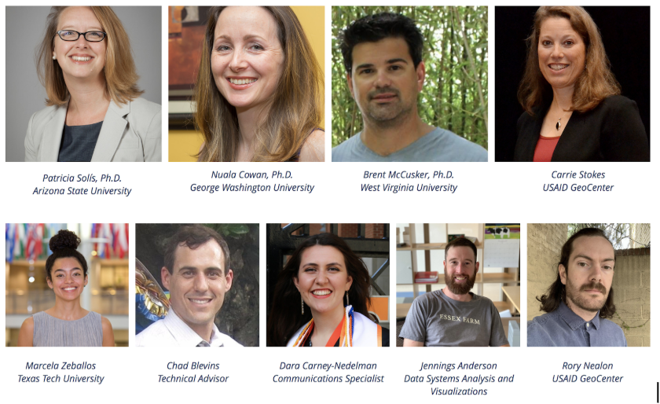

# Module 1: The OSM Ecosystem

## Overview

Welcome to Module 1 of the YouthMappers Academy. In this module, you will learn about the origins of the OpenStreetMap (OSM) project, its infrastructure, the community, and what keeps us mapping. If you don’t already have one, you will learn how to create an OpenStreetMap account.

### What you will learn:
- What drove the development of OpenStreetMap
- The composition of the OSM community
- The establishment of YouthMappers
- The Code of Conduct for community members
- Ethical considerations when mapping in OpenStreetMap


## What is OpenStreetMap?

OpenStreetMap is a free, open, editable map of the world built by a global community of collaborators. OSM can be accessed at [OpenStreetMap.org](https://www.openstreetmap.org), contributed to by over six million volunteers. Data is gathered using field-based and desktop mapping techniques, such as manual surveys, GPS devices, and tracing aerial imagery.

### History of OpenStreetMap
Steve Coast created OpenStreetMap in 2004 in response to restricted access to high-quality map data. Inspired by Wikipedia, he launched OSM as a community-based project. The first collaborative mapping event occurred in London, 2005. Today, OSM benefits from global partnerships, including Maxar, ESRI, and Mapbox.

### What is Open Source Technology?
Open source refers to designs that are publicly accessible, enabling modification and sharing. OSM operates on these principles, fostering collaboration, transparency, and community development.

## The OpenStreetMap Infrastructure

### Infrastructure
OSM allows users to capture information about features in the physical landscape using points, lines, or shapes, accompanied by descriptive tags. Data is collected via manual surveys, GPS, and aerial imagery.

### Accuracy of OSM Data
OSM employs a wiki-style creation process, where contributions can be verified and corrected by the community. This collaborative approach improves map quality and accuracy over time.

## OSM Community

### Community Roles
- **Contributors:** Volunteers adding or updating map data.
- **Data Consumers:** Using OSM for transportation, health care, and more.
- **Developers:** Creating tools for data editing and management.
- **Local Communities:** Organizing regional mapping events.
- **Humanitarian Groups:** Supporting disaster response and development projects.

### YouthMappers
[YouthMappers](www.youthmappers.org) is a global community of researchers, educators, and scholars that creates and uses open geographic data (primarily using OpenStreetMap) to address locally defined development challenges worldwide. Founded in 2014, and formally launched in 2015, The United States Agency for International Development (USAID) generously supports this program. Founding partners are Texas Tech University, The George Washington University, and West Virginia University. Arizona State University joined the administration consortium in 2019, and is now the lead fiscal and administrative partner, in collaboration with TTU, GWU and WVU.

At the heart of YouthMappers is an international network of university based, student-led chapters, who organize, collaborate, and implement mapping activities that respond to actual development needs around the globe. The spatial data that they create, and the research that they conduct is made publicly available through open platforms, such as OpenStreetMap. Chapter affiliation offers these students and their faculty advisors the chance to network with others around the world and exchange information, ideas, and results that lead to a greater understanding of resilience, and how technology can be used to address information challenges. 

Members participate in direct mapping activities on the OpenStreetMap platform, both as individual contributors, or, as part of chapter-led activities, such as “Mapathons”. They can also apply for academic opportunities through our Research and Leadership Fellows programs, and funding for field based mapping work through the Fieldwork Program. 

```{admonition} Watch This!
Get the backstory of how and why the consortium was created. Watch this video and learn from organizers about our vision for Open Mapping for Resilience in Higher Education around the world. This webinar was recorded as part of the series offered by partner organization UCGIS.

[Watch the video](https://www.youtube.com/watch?v=_Y-oIhUcL88&feature=emb_logo )
```

While many minds together created the foundation of YouthMappers, the heart of the students is what leads to the success of this global consortium. We are a movement, a movement of students wanting to leave a mark- with the courage to be change agents and resolve in our response to community needs. The collaboration of faculty, staff, and partner organizations has bolstered an experiential learning environment that leads to action. Students decide how and where they put themselves on the map.

Read about the experiences of our members throughout our courses, in their own words, through their blogs published on the YouthMappers Website:

**Your YouthMappers Team:**
- **Director, Principal Investigator:** Patricia Solis, Ph.D., Arizona State University
- **Co-Principal Investigator:** Nuala Cowan, Ph.D., The George Washington University
- **Co-Principal Investigator:** Brent McCusker, Ph.D., West Virginia University, 
- **Managing Director:** Marcela Zeballos, Texas Tech University
- **Communications Specialist:** Dara Carney-Nedelman
​- **Technical Advisors:** Chad Blevins, Jennings Anderson



**Steering Committee Members**
- Dr. Ryan Engstrom, The George Washington University
- Richard Hinton, The George Washington University
- Dr. Michael Mann, The George Washington University
- Dr. Marie Price, The George Washington University
- Dr. Jamison Conley, West Virginia University

**​USAID**
- Carrie Stokes, Director of the USAID GeoCenter
- Michael Crino, Deputy Director and Program Officer
- Rory Nealon, Senior GIS Analyst and YouthMappers Activity Manager 


## Ethics and Etiquette in an Open-Source Community

### YouthMappers Code of Ethics
YouthMappers adheres to principles of:
- **Valuing People**
- **Community Building**
- **Quality**
- **Open Data**
- **Privacy and Security**
- **Human Dignity**

### OpenStreetMap Code of Conduct
Key values include:
- Being considerate and respectful
- Collaborating inclusively
- Resolving disagreements constructively
- Respecting copyright and licenses

## Getting Set-Up with an OSM Account

To create an OSM account, visit [OpenStreetMap.org](https://www.openstreetmap.org) and click on "Sign-up." Choose a display name to identify your contributions.

## Want to Dig a Little Deeper?

Explore these resources:
- [History of OSM](https://wiki.openstreetmap.org/wiki/History_of_OpenStreetMap)
- [OpenStreetMap Foundation](https://wiki.osmfoundation.org/)
- [Map Kibera Project](https://mapkibera.org/)

## Competency

Skills and proficiencies for the YouthMappers Academy Badge align with:
- **Geospatial Technology Competency Model (GTCM)**
- **National Geographic Standards**

### Knowledge Checks
```{admonition} Knowledge Checks
To test your knowledge, complete the following [test](https://forms.office.com/Pages/ResponsePage.aspx?id=niOJ1pLExkCzkSxZUdMdFFgyN18wLBpEumnEYJ68m-ZUOUdYNTRBVjNXOVlCMFM4MkhBSllTOFc0RS4u).

If you receive a score of 80% or higher, you will receive a badge for this module.

```


<!-- 
1. The information about “what” something is in OSM is called a:
   - a. Tag
   - b. Label
   - c. Attribute

2. Data quality in OSM is:
   - a. Perfect
   - b. Average
   - c. Very poor
   - d. Of mixed quality

3. OSM was developed as a:
   - a. Research project
   - b. Commercial venture
   - c. Response to restricted access

4. OSM is used (consumed by):
   - a. The public
   - b. For-profit companies
   - c. Students
   - d. Governments

5. The Humanitarian OpenStreetMap Team formed after a collective response to what major disaster:
   - a. Earthquake in Haiti
   - b. Wildfires in California
   - c. Earthquake in Nepal
   - d. Volcanoes in Guatemala

6. Missing Maps was founded by the following organizations:
   - a. The American Red Cross
   - b. The British Red Cross
   - c. Médecins Sans Frontières (MSF)
   - d. The Humanitarian OpenStreetMap Team

7. People before Data is one of the ethical cornerstones of OpenStreetMap. In the spirit of this guideline, which of the following are true:
   - a. Map communities if YOU feel they need data in order to become better places
   - b. Speak with communities before mapping them to understand their needs and appreciate their security concerns
   - c. Assume trained mappers know what’s best
   - d. Strive for direct community involvement in the mapping process

8. YouthMappers chapters are:
   - a. Student led
   - b. Faculty led
   - c. University led
   - d. Steering committee led

9. The YouthMappers consortium strives to:
   - a. Build socially engaged citizen mappers
   - b. Foster youth leadership
   - c. Support scientific research around open data
   - d. Make commercial data enterprises obsolete

10. The OSM foundation functions as:
    - a. A legal entity for the OpenStreetMap Project
    - b. A team that maintains and edits the data
    - c. A fundraising vehicle to support the OpenStreetMap Project
    - d. A for-profit entity that provides cartographic services

11. How can changing technology affect the rights of those being mapped?
    - a. Higher resolution imagery can affect privacy and/or security of those being mapped
    - b. Accelerated mapping can improve chances of development
    - c. Consent granted under old conditions may not apply under the microscope of new technology
    - d. As it’s an open platform, we have the right to map anywhere -->
