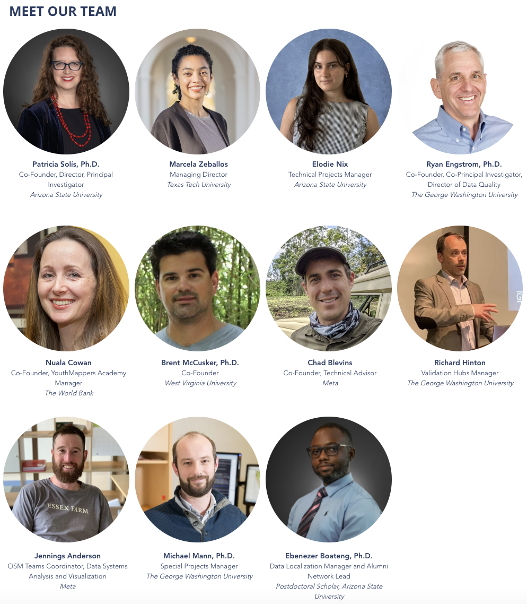
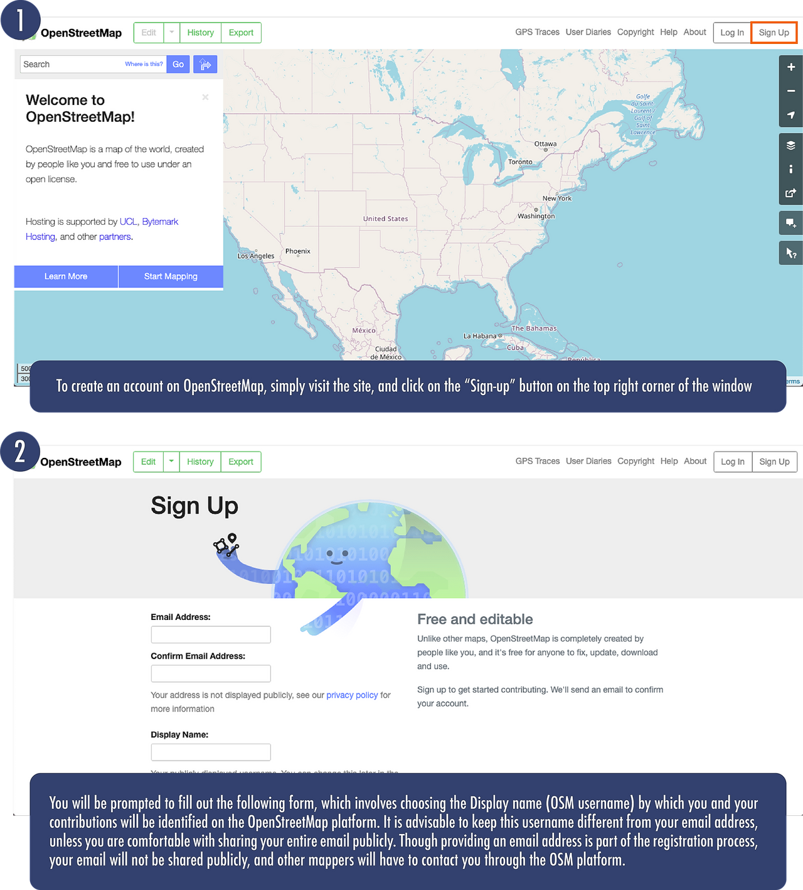

# The OSM Ecosystem

## Overview

Welcome to Module 1 of the YouthMappers Academy. In this course you will learn about the origins of the OpenStreetMap project, the infrastructure, the community, and what keeps us mapping. If you don’t already have one, you will learn how to create an OpenStreetMap account. We will look at what drove the development of OpenStreetMap, and what the OSM community membership looks like. We will also examine the ethical considerations of mapping in OpenStreetMap, and the best practices in communication for members of the community.

### What you will learn:
- What drove the development of OpenStreetMap
- The composition of the OSM community
- The establishment of YouthMappers
- The Code of Conduct for community members
- Ethical considerations when mapping in OpenStreetMap


## What is OpenStreetMap?

### Overview
OpenStreetMap is a free, open, editable map of the world built by a global community of mapping collaborators. The OpenStreetMap Project can be found at [OpenStreetMap.org], and, to date, has been contributed to by over *six million* volunteers around the world. Data for the map is gathered using a variety of field-based and desktop mapping techniques, including manual surveys, GPS devices, smartphone applications, tracing features from aerial imagery (satellite and drone imagery being the most popular), and imports from other open sources. 

What started as a community-based alternative to heavily copyrighted commercial base maps, is now the base map of choice on thousands of web sites, mobile apps, and hardware devices. To become a member, you simply [create an account](https://www.openstreetmap.org/user/new). All of the data within OSM is jointly owned by the contributors, without any usage fees whatsoever.


### How Did OSM Come About?

In many parts of the world, access to high-quality map data is restricted or cost-prohibitive. In response to this, [Steve Coast created OpenStreetMap in 2004](https://wiki.openstreetmap.org/wiki/History_of_OpenStreetMap). He was inspired by the Wikipedia model and wanted to launch a similar initiative for the world of geospatial data.

In less than a week, the website was launched and the first edits had been contributed. Within the first year, the [first documented collaborative mapping event](https://wiki.openstreetmap.org/wiki/Map_Limehouse_Event_2005) (an event we now call a “mapping party” or “mapathon”) occurred in London. It wasn’t until late 2006 that an agreement with Yahoo allowed members to trace directly from satellite imagery, enabling remote mappers to contribute to locations beyond their immediate neighborhood. Though imagery coverage was initially quite limited, we now have close to global coverage with relatively high-resolution products through partners like Maxar, ESRI, and Mapbox. OpenStreetMap has come a long way!

### What is Open Source Technology?
The term **open source** refers to something people can modify and share because its design is publicly accessible.

The term open source was originally used to refer to **Open Source Software (OSS)** exclusively, but, the success of this developmental approach has led to the adoption of an open source ethos by many different industries and communities of practice. Open source projects, products, or initiatives embrace and celebrate principles of open exchange, collaborative participation, rapid prototyping, transparency, meritocracy, and community-oriented development.

Open source platforms such as OpenStreetMap are developed and maintained in a collaborative manner. This approach allows for flexibility, transparency, and sustainability, as the initiative does not rely on a single company or developer. 

Click [here](https://opensource.com/resources/what-open-source) to learn more about open source. 


*Image Source: "Adapting Open Source Software" [https://engineering.fb.com/2009/04/10/web]*

## The OpenStreetMap Infrastructure

### Overview
OpenStreetMap allows us to capture information about features in the physical landscape, such as roads, rivers, buildings, forests, and water bodies (to name but a few). OSM allows us to record both the “where” and the “what” of mapped features: 

- The **“where”** being the physical location. 
- The **“what”** being the additional information that describes or measures those particular features. 

As you’ve already learned, data for the map is collected using a variety of field-based and desktop mapping techniques, including manual surveys, GPS devices, smartphone applications, and tracing features from aerial imagery. This data is stored in the digital map using a rather simple representation system consisting of either point locations, lines, or shapes. This is complemented by a system of labels (called “tags”) that help describe and distinguish one feature from another. We will look at the structure of OSM data in more depth in a later module.

OSM started with the individual contributions of dedicated but dispersed mappers all over the world, therefore, original global coverage was somewhat patchy. Due to the improvement of mapping tools (especially the online editors and project management platforms⏤known to the community as “tasking managers”), OSM coverage (and quality) has improved dramatically. In recent years, OSM has also benefited from large scale data imports, especially from national mapping agencies with an open-data policy. This has allowed a head start in many global locations.

#### How can a project like this create accurate maps?
By virtue of the wiki-style creation process, there is no guarantee of the accuracy of any of the data in OSM. The essence of a wiki-style process is that all users have a stake in having accurate data. If one person puts in inaccurate data, maliciously or accidentally, then other members can check it, fix it, or get rid of it. The vast majority of good-intentioned participants will automatically correct for the few malicious or inexperienced contributors. A full editing history is stored for each user, and users can attach Wikipedia-like edit summaries to their edits. There is also a history tab on the main page that shows recent edits to the selected area. As the OSM community continues to grow, and more organizations choose OSM as their default base map, our capacity and incentives to improve the base map grow too. 

One of the best ways to evaluate OSM is to judge for yourself⏤pick an area that you know well and use the OpenStreetMap viewer to see how well the map data corresponds to your personal knowledge of that location. Maybe you will see something wrong or inaccurate, or maybe, you will be the first to contribute to the map in that location. Whether the map is empty or just missing context, you are in a unique position to help shape the future of our world map in OSM.

## The OSM Community

### Overview
The OpenStreetMap community is a dynamic, diverse group of people, ranging from individual mappers to corporate groups. Members can be broadly categorized as follows (though many members fall into two or more of these groups):

- **Contributors:** These are the people who add or update the map data on OpenStreetMap. The majority of these community members are volunteers; but some are humanitarian workers, or teachers, or are employed by companies who support the growth of OSM. 
- **Data Consumers:** Many different companies, organizations, governments, researchers, and individuals use OpenStreetMap data for any number of uses: transportation and routing, GPS and navigation, healthcare, disaster risk management, city planning, cartography, municipal services, academic research, GIS, and more.
- **Developers:** Coders, developers, and designers who use OpenStreetMap to make tools like routing, data editing, quality assurance, project management, and more. 
- **Local and Regional Communities:** Regional, country, state or city level groups that organize OpenStreetMap editing and events in their areas; some of which are officially organized, others gather informally. Many of these groups organize their own conferences. These groups create data for representation and/or for the management of their jurisdictions in a more open, participatory fashion (see Data Consumers for a list of use-cases).
- **Humanitarian Groups:** Many humanitarian organizations create new map data and use existing OSM data to uspport their projects, either for planning and preparation, logistics, or response. Often there are volunteer mappers (more often than not remote) who help digitize imagery as well as on-the-ground data collectors and mapping staff. 


### YouthMappers: Who Are We?
[YouthMappers](www.youthmappers.org) is a global community of students, researchers, educators, and scholars that use open geospatial technologies to highlight and directly address development challenges worldwide. YouthMappers was envisioned to fulfill the demand for open geospatial data access in all parts of our world. A generation of empowered young people has emerged, who have become leaders in creating resilient communities and have defined their world by mapping it. We are now a worldwide network of over 350+ student-led chapters and growing! The students are at the epicenter of all we do.

The founding partners of the YouthMappers consortium are Texas Tech University, The George Washington University, and West Virginia University. Arizona State University is the lead fiscal and administrative partner, in collaboration with Texas Tech University, The George Washington University, and West Virginia University. The Steering Committee, which is comprised of faculty and scholars from these institutions, supports chapter efforts to build a socially engaged citizenry, enhance long-term scientific capacity, foster youth leadership, and offer meaningful global learning experiences.

At the heart of YouthMappers is an international network of university-based, student-led chapters, who organize, collaborate, and implement mapping activities that respond to actual development needs around the globe. The spatial data that they create, and the research that they conduct is made publicly available through open platforms, such as OpenStreetMap. Chapter affiliation offers these students and their faculty advisors the chance to network with others around the world and exchange information, ideas, and results that lead to a greater understanding of resilience and how technology can be used to address information challenges. 

Members participate in direct mapping activities on the OpenStreetMap platform, both as individual contributors, or, as part of chapter-led activities, such as “Mapathons”. They can also apply for academic opportunities through our Research and Leadership Fellows programs, and funding for field based mapping work through the Fieldwork Program. 

```{admonition} Watch This!
Get the backstory of how and why the consortium was created. Watch this video and learn from organizers about our vision for Open Mapping for Resilience in Higher Education around the world. This webinar was recorded as part of the series offered by partner organization UCGIS.

[Watch the video](https://www.youtube.com/watch?v=_Y-oIhUcL88&feature=emb_logo)
```

While many minds together created the foundation of YouthMappers, the heart of the students is what leads to the success of this global consortium. We are a movement, a movement of students wanting to leave a mark- with the courage to be change agents and resolve in our response to community needs. The collaboration of faculty, staff, and partner organizations has bolstered an experiential learning environment that leads to action. Students decide how and where they put themselves on the map.

Read about the experiences of our members throughout our courses, in their own words, through their blogs published on the YouthMappers Website: [YouthMappers Blog](https://www.youthmappers.org/blog). 

**Your YouthMappers Team:**
- **Co-Founder, Director, Principal Investigator:** Patricia Solis, Ph.D., Arizona State University
- **Managing Director:** Marcela Zeballos, Texas Tech University 
- **Technical Projects Manager:** Elodie Nix, Arizona State University 
- **Co-Founder, Co-Principal Investigator, Director of Data Quality:** Ryan Engstrom, Ph.D., The George Washington University
- **Co-Founder, YouthMappers Academy Manager:** Nuala Cowan, The World Bank
- **Co-Founder:** Brent McCusker, Ph.D., West Virginia University
- **Co-Founder:** Chad Blevins, Co-Founder, Technical Advisor
- **Validation Hubs Manager:** Richard Hinton, The George Washington University
- **OSM Teams Coordinator, Data Systems Analysis and Visualization:** Jennings Anderson, Meta
- **Special Projects Manager:** Michael Mann, Ph.D., The George Washington University
- **Data Localization Manager and Alumni Network Lead:** Ebenezer Boateng, Ph.D., Postdoctoral Scholar, Arizona State University

Nuala Cowan, Ph.D., The George Washington University
- **Co-Principal Investigator:** Brent McCusker, Ph.D., West Virginia University, 
- **Managing Director:** Marcela Zeballos, Texas Tech University
- **Communications Specialist:** Dara Carney-Nedelman
​- **Technical Advisors:** Chad Blevins, Jennings Anderson



[Meet Our Student Leaders!](https://www.youthmappers.org/regional-ambassadors)

### OpenStreetMap and the Humanitarian Community

#### Overview
The **humanitarian community** was one of the earliest adopters of (and ardent contributors to) OpenStreetMap. Maps play an important role in situational awareness when it comes to both long-term development and emergency response missions; unfortunately, in areas hardest hit by humanitarian crisis, access to data (of any kind) can be either limited or restricted. 

OpenStreetMap allows response and development workers to contribute first-hand knowledge to the map, often with the direct participation of the local community. In times of extreme crisis, humanitarian organizations can recruit remote contributors. Remote mappers will often have more reliable internet connectivity and can use this advantage to lay down the base map from the most recent satellite imagery. Those with local knowledge can add detail like street names and other critical infrastructure. 

There are many instances of organized mapping efforts to support local development and disaster responses even in the early days of OSM, but one particular event heralded a new level of mapping collaboration, and that was the 2010 earthquake in Haiti.


To read more about how the remote mapping effort evolved, please read the following blog post featured on NPR: [When Disaster Strikes, He Creates A 'Crisis Map' That Helps Save Lives](https://www.npr.org/sections/parallels/2016/10/02/495795717/when-disaster-strikes-he-creates-a-crisis-map-that-helps-save-lives).

In the aftermath of this event, a new organization called the Humanitarian OpenStreetMap Team (HOT) was born.

#### Humanitarian Organization Examples 

##### Humanitarian OpenStreetMap Team
The [Humanitarian OpenStreetMap Team](https://www.hotosm.org/) (HOT) is a U.S. registered non-profit that consists of an international network of professionals and volunteer mappers that support international development programs and crisis response efforts through the creation of open map data. HOT works directly with communities, NGOs, international organizations, and government partners to use and contribute to OpenStreetMap for locally-relevant challenges (many in support of the UN Sustainable Development Goals) through the provision of training, equipment, knowledge exchange, and field projects. HOT also develops and maintains several open source applications to streamline both data collection and collaborative mapping efforts. The most popular of these is the HOT Tasking Manager, a platform that allows the coordinated contributions of scores of remote mappers. The Tasking Manager is so pivotal to the work we do as YouthMappers, it has its own dedicated module later in the series.

- To take a look at the platform, see [The HOT Tasking Manager](https://tasks.hotosm.org/).
- Learn more about [UN Sustainable Development Goals](https://www.un.org/sustainabledevelopment/sustainable-development-goals/) and [YouthMapper contributions](https://www.youthmappers.org/post/2020/08/06/How-YouthMappers-Are-Contributing-to-2030-Agenda-for-Sustainable-Development) to the 2030 Agenda for Sustainable Development.

##### Missing Maps
[Missing Maps](https://www.missingmaps.org/) is a humanitarian project that preemptively maps parts of the world that are vulnerable to natural disasters, conflicts, and disease epidemics. It was started in 2014, as a collaboration between the American Red Cross, the British Red Cross, Médecins Sans Frontières (MSF), and the Humanitarian OpenStreetMap Team, and membership is open to any NGO, educational establishment, or civil society group that is willing to contribute to their goals and abide by their ethics statement (YouthMappers is an official member of the Missing Maps community). Missing Maps members host global mapping events (registered on their site) and provide instructional materials and tools for new potential mappers and mapping event hosts, such as their [Project Leaderboard](https://www.missingmaps.org/blog/2018/03/23/leaderboard-updates/) and their mobile app [Mapswipe](https://mapswipe.org/en/). To date, over 50 million edits have been made in OpenStreetMap under the Missing Maps banner.

##### Empowering Female Mappers: Geochicas
YouthMappers is committed to increasing the number of female mappers in our ranks and the opportunities available to them, especially with regard to the kind of data that reflects women’s needs and services in the community. We have supported outreach to engage female mappers through [Let Girls Map](https://www.youthmappers.org/letgirlsmap), as well as dedicated leadership programs and data campaigns to address women’s issues through [Everywhere She Maps](http://www.everywhereshemaps.org/). We are proud to work closely with other organizations that are working to close the gender gap in the mapping community. One such organization is Geochicas.

Geochicas was founded in 2016 by a group of female OpenStreetMap contributors who felt strongly about the lack of female participation and project leadership in the open data community. By promoting work that analyzes how women are represented in geospatial and technological spaces, they are helping to improve the overall diversity and quality of the data that goes into OpenStreetMap.

Please read the following article written by Geochicas co-founders Selene Yang, Céline Jacquin, and Miriam González: 
- [Geochicas: Helping Women Find their Place on the Map](https://blog.mapillary.com/update/2019/05/28/putting-women-on-the-map-with-geochicas.html)

```{tip} 
YouthMappers Blogspot: The Beauty of Girls Empowerment

[The Beauty of Girls Empowerment](https://www.youthmappers.org/post/2018/07/20/the-beauty-of-girls-empowerment) By Chidinma Anne Johnson, University of Nigeria Enugu

In the following blog post, hear from Chidinma on how mapping as a platform can empower young women, arming them with the tools to support decision making in their communities.
```
### The UN Sustainable Development Goals 
The [Sustainable Development Goals](https://sdgs.un.org/goals) are the blueprint to achieve a better and more sustainable future for all. They address the global challenges we face, including poverty, inequality, climate change, environmental degradation, peace and justice.

Though mapping as an activity is not specifically outlined in the UN Sustainable Development Goals, the data, research, and leadership opportunities created through YouthMapper activities supports the attainment of many of these goals. 

In the previous section we introduced [Everywhere She Maps](http://www.everywhereshemaps.org/), a targeted training program designed to increase female participation within the YouthMappers network and the rapidly expanding industries that utilize geospatial technologies.

Everywhere She Maps is defined by five core pillars that have been framed by the Sustainable Development Goals. Click on the individual pillar links for an example of YouthMappers’ previous progress in these areas.

- **Security Improves:** Marking places as unsafe for women makes visible solutions to improve community welfare
- **Lives are Saved:** Accurate and complete location of health and wellness assets increases women’s health
- **Power is Generated:** Charting transmission lines reveals sites where electric access should be extended to ease women's labor burden
- **Prosperity Rises:** Capacity to use spatial data gives women better access to economic opportunities
- **Innovation Happens:** Ensuring space for women's vision and leadership yields novel geographic knowledge

#### Open Mapping towards Sustainable Development Goals: Voices of YouthMappers on Community Engaged Scholarship

This 2022 publication, co-edited by YouthMappers own Dr. Patricia Solis, and Marcela Zeballos, invites authors from every region of the world who have emerged as leaders in the YouthMappers movement share their perspectives and knowledge in an accessible and peer-friendly format. These young leaders are working to address SDGs using geospatial technologies and multi-national collaboration. 

The book conveys a sense of robust knowledge emerging from formal studies or informal academic experiences - in the first-person voices of students and recent graduates who are at the forefront of creating a new map of the world. 

Our authors impart the way they are learning about themselves, about each other, about the world. They are developing technology skills, and simultaneously teaching the rest of the world about the potential contributions of a highly connected generation of emerging world leaders for the SDGs. 

The book is timely, in that it captures a pivotal moment in the trajectory of the YouthMappers movement’s ability to share emerging expertise, and one that coincides with a pivotal moment in the geopolitical history of planet earth whose inhabitants need to hear from them.

This book puts forward the diverse voices of students and recent graduates in countries where YouthMappers works, all over the world. Authors cover topics that range from water, agriculture, food, to waste, education, gender, climate action and disasters from their own eyes in working with data, mapping, and humanitarian action, often working across national boundaries and across continents. To inspire readers with their insights, the chapters are mapped to the United Nations 17 Sustainable Development Goals (SDGs) in ways that connect a youth agenda to a global agenda.

With a preface written by Carrie Stokes, Chief Geographer and GeoCenter Director, United States Agency for International Development (USAID).

[Follow this link](https://link.springer.com/book/10.1007/978-3-031-05182-1) to download an OPEN ACCESS copy of our new book: Open Mapping towards Sustainable Development Goals: Voices of YouthMappers on Community Engaged Scholarship, Solís & Zeballos (Eds)., 2023, Springer Nature, pp. 382, https://doi.org/10.1007/978-3-031-05182-1.

```{tip} 
YouthMappers Blogspot: How YouthMappers Are Contributing to the 2030 Agenda for Sustainable Development

[How YouthMappers Are Contributing to the 2030 Agenda for Sustainable Development](https://www.youthmappers.org/post/2020/08/06/how-youthmappers-are-contributing-to-2030-agenda-for-sustainable-development) By Chomba Chishala and Yusef Suleiman

To find out more about how YouthMappers are contributing toward the Sustainable Development Goals, please read the following blog by YouthMapper Regional Ambassadors Chomba Chishala and Yusef Suleiman.
```

## Ethics and Etiquette in an Open-Source Community 

### YouthMappers: Ethics and Code of Conduct 
**Ethics** are a set of moral principles adhered to by a particular group in fulfillment of their mission. To many people, the idea that mappers, especially mappers that sit behind a computer screen, should need to discuss, or indeed draft a set of ethical guidelines is perhaps a little bizarre, but, the fact that we permanently record, on an open platform location that could affect the privacy or security of other individuals, means that there should be safeguards in place to “do no harm”. 
Please see here for the [YouthMappers Code of Ethics](https://docs.google.com/document/d/1yWz7RZxVjtfuKOrxOhrRRrh3COu5IecBLqF5jjDKL68/edit?pli=1&tab=t.0). 

A **Code of Conduct** outlines the day-to-day actions that we resolve to adhere to, as a group, that embody our ethical principles.

YouthMappers is committed to providing free and open data for all in a principled and inclusive way. This is true of data that we generate through remote workflows, such as tracing from drone or satellite imagery, and the data that we collect “on the ground” while embedded in the community. 


[Click here to download](https://d2jbbv3z6z1uwh.cloudfront.net/youthmappers.course.tc/cohort-1/content/uploads/2021/03/02070524/YM-Code-of-Conduct.pdf) a PDF of the above image.

This code of conduct applies to all YouthMappers’ spaces, both online and off. YouthMappers’ participants are responsible for adhering to this code at all times; anyone who is found violating this code may be sanctioned or expelled from our communication groups and listserv at the discretion of the YouthMappers’ Steering Committee. 


### OpenStreetMap Code of Conduct
OpenStreetMap also has a Code of Conduct that focuses primarily on how members should behave in their communications with others in the community. Participation in the OpenStreetMap community extends beyond our contributions to the map itself, and also extends to how we engage with other mappers, and map users in the community. As mentioned in the previous section, an ethical code speaks to the guiding principles that govern our decision making, while a code of conduct deals with the actions or day-to-day behaviors that exemplify those principles:


[Click here to download](https://d2jbbv3z6z1uwh.cloudfront.net/youthmappers.course.tc/onboarding/content/uploads/2020/10/22093829/YM_1.4.1_PDF_v2.pdf) a PDF of the above image.

The Code of Conduct, and further information on violations and how these are adjudicated and enforced can be found on the [OSM Code of Conduct](https://wiki.openstreetmap.org/wiki/Community_Code_of_Conduct_(Draft)) page. These [OSM specific Netiquette Guidelines](https://wiki.openstreetmap.org/wiki/Etiquette) are also useful when reaching out to others in the community. 

### The OSM Foundation 
The [OpenStreetMap Foundation](https://osmfoundation.org/wiki/Main_Page) is a not-for-profit organization that supports the OpenStreetMap Project. The foundation consists of members from around the world who elect a board of directors. Much of the foundation’s work is done in the background, yet it is critical to the ongoing functioning and growth of the OpenStreetMap Project.

The foundation supports the project with several key functions:

- Acts as a legal entity for the OpenStreetMap Project (the foundation is a UK-registered limited company).
- Functions as the custodian for the computer servers and services necessary to host the OpenStreetMap Project.
- Provides a vehicle for fundraising to support the project. The foundation can accept donations for the OpenStreetMap Project and allocate those donations to OpenStreetMap Project activities.
- Organizes the annual conference, State-of-the-Map.
- Supports and communicates with the working groups


## Getting Set-Up with an OSM Account
### Instructions for Getting Set-Up With an OSM Account

Click [here](https://www.openstreetmap.org/#map=4/38.01/-95.84&layers=N) to access OpenStreetMap.

You can use the site to simply browse and explore, like other mapping websites, or, if you’re a member of an active mapping organization like YouthMappers, you’ll want to [create an account](https://www.openstreetmap.org/user/new) and start to contribute.



### Contribute to the Youthmappers Activity Map!

Once you have registered your OSM account, share your OSM username with us so that your mapping contributions are acknowledged as those of a YouthMapper

Use this link: [YouthMappers OSM Username Roster](https://docs.google.com/forms/d/e/1FAIpQLSceJC9ky3AmHG-0AGRpfVY-4d15PPJhqh-UYScIi9Mb6JWQZw/viewform). 

## Want to Dig a Little Deeper?
Refer to the information below to learn more about the OSM Ecosystem. 

- **The History of OSM:** If you’d like to see some of the major milestones in OSM over the years⏤such as the release of new editing software and the launch of imagery partnerships that allowed for massive remote tracing contributions⏤take a look at The [History of OSM](https://wiki.openstreetmap.org/wiki/History_of_OpenStreetMap).
- O**penStreetMap Foundation:** To find out more about the OpenStreetMap Foundation, its Working Groups, and the functions it supports for the community, please visit the [OpenStreetMap Foundation](https://wiki.osmfoundation.org/) website.
- **Map Kibera:** Kibera in Nairobi, Kenya, was a blank spot on the map until November 2009, when young Kiberans created the first free and open digital map of their own community. [Map Kibera](https://mapkibera.org/) has now grown into a complete interactive community information project. Find out more about the initiative by watching [this video](https://www.youtube.com/watch?v=ChWj4yBmE0E). 
- **EthicalGeo:** The American Geographical Society (AGS) [EthicalGEO](https://ethicalgeo.org/) initiative seeks to activate thinkers, innovators, entrepreneurs, policymakers, practitioners, students, and everyday citizens and bring them into a global dialog that shines a light on their best ideas about the ethical challenges and opportunities posed by the many geospatial technologies and data sources that are reshaping our society. Hear our own Dr. Solis talk about how YouthMappers incorporate ethical work practices into our contributions in [this video](https://ethicalgeo.org/youthmappers-ethicalgeo/). 

## Conclusion 
### YouthMappers Academy: Skills, Proficiencies, and Standards

The following competencies derived from both the Geospatial Technology Competency Model and the National Geographic Standards are central to the successful completion of YouthMappers Academy Course: Mapping iD Editor. 

### The Geospatial Technology Competency Model:
1. Interpersonal Skills: Demonstrating the ability to work effectively with others, through interaction with peers and course moderators
2. Professionalism: Demonstrating commitment to the values, standards of conduct, and well being of one's profession  
3. Initiative: Demonstrating gumption at work/school  
4. Dependability and Reliability: Displaying responsible behaviors at work/school
5. Lifelong Learning: Displaying a willingness to learn and apply new knowledge and skills
6. Geography: Understanding the science of place and space; geographic perspectives
7. Basic Computer Skills: Using a computer and related applications to input and retrieve information; navigation and file management, and internet and e-mail
8. Planning and Organizing: Planning and prioritizing work to manage time effectively and accomplish assigned tasks; planning and organizing; adaptability and flexibility; time management
9. Professionalism: Know codes of ethics and rules of conduct; legal, ethical, and business aspects of data sharing

### National Geographic Standards
1. The World in Spatial Terms: How to use maps and other geographic representations, geospatial technologies, and spatial thinking to understand and communicate information.


<div style="background-color:#91ccca;padding: 15px 30px;border-radius: 8px;">
<h3>Knowledge Checks</h3>
<p>To test your knowledge, complete the following test:</p>
<p><a href="https://forms.gle/KK84FrnuvgsCFd217" style="background-color: #e74c3c; color: white; padding: 10px 10px; text-decoration: none; border-radius: 8px; font-weight: bold; display: inline-block; box-shadow: 0 4px 8px rgba(0,0,0,0.1);">🎯 Start OSM Ecosystem Quiz </a></p>
<p>If you receive a score of 80% or higher, you will receive an email with a certificate for this module.</p>
</div>
 
 

<!-- 
1. The information about “what” something is in OSM is called a:
   - a. Tag
   - b. Label
   - c. Attribute

2. Data quality in OSM is:
   - a. Perfect
   - b. Average
   - c. Very poor
   - d. Of mixed quality

3. OSM was developed as a:
   - a. Research project
   - b. Commercial venture
   - c. Response to restricted access

4. OSM is used (consumed by):
   - a. The public
   - b. For-profit companies
   - c. Students
   - d. Governments

5. The Humanitarian OpenStreetMap Team formed after a collective response to what major disaster:
   - a. Earthquake in Haiti
   - b. Wildfires in California
   - c. Earthquake in Nepal
   - d. Volcanoes in Guatemala

6. Missing Maps was founded by the following organizations:
   - a. The American Red Cross
   - b. The British Red Cross
   - c. Médecins Sans Frontières (MSF)
   - d. The Humanitarian OpenStreetMap Team

7. People before Data is one of the ethical cornerstones of OpenStreetMap. In the spirit of this guideline, which of the following are true:
   - a. Map communities if YOU feel they need data in order to become better places
   - b. Speak with communities before mapping them to understand their needs and appreciate their security concerns
   - c. Assume trained mappers know what’s best
   - d. Strive for direct community involvement in the mapping process

8. YouthMappers chapters are:
   - a. Student led
   - b. Faculty led
   - c. University led
   - d. Steering committee led

9. The YouthMappers consortium strives to:
   - a. Build socially engaged citizen mappers
   - b. Foster youth leadership
   - c. Support scientific research around open data
   - d. Make commercial data enterprises obsolete

10. The OSM foundation functions as:
    - a. A legal entity for the OpenStreetMap Project
    - b. A team that maintains and edits the data
    - c. A fundraising vehicle to support the OpenStreetMap Project
    - d. A for-profit entity that provides cartographic services

11. How can changing technology affect the rights of those being mapped?
    - a. Higher resolution imagery can affect privacy and/or security of those being mapped
    - b. Accelerated mapping can improve chances of development
    - c. Consent granted under old conditions may not apply under the microscope of new technology
    - d. As it’s an open platform, we have the right to map anywhere -->

### Congratulations!

Congratulations on completing **Course 1: The OSM Ecosystem**  of the YouthMappers Academy series! 


 -->