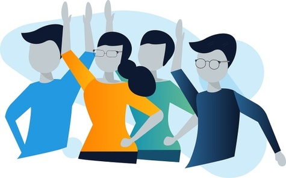
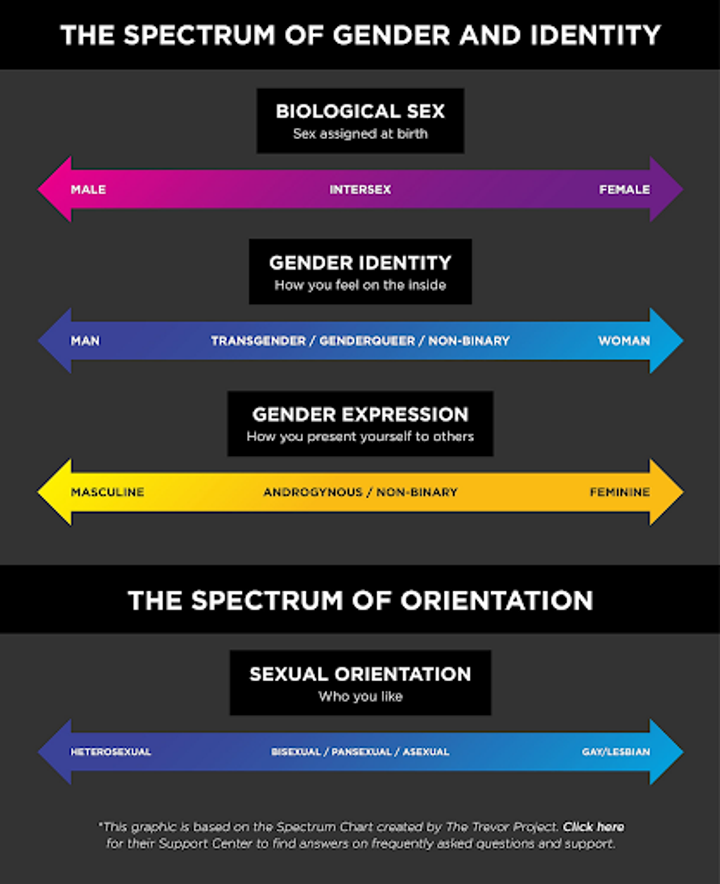
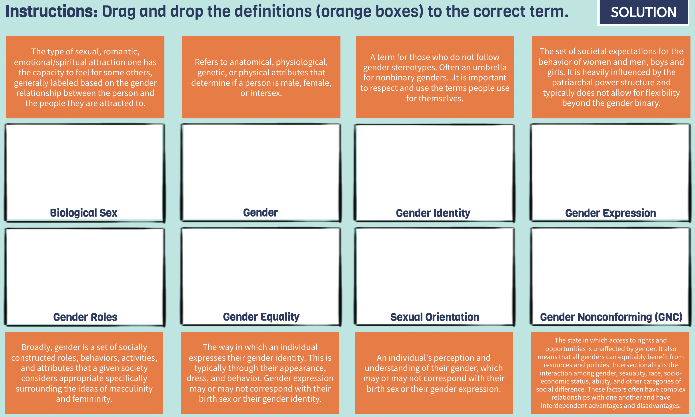
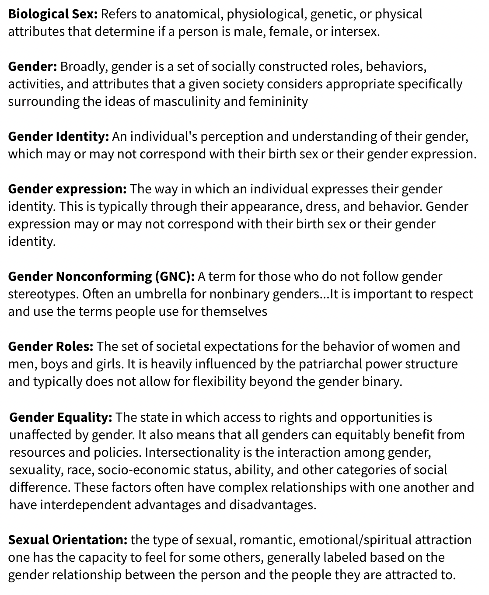
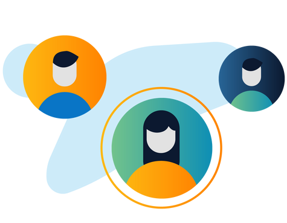
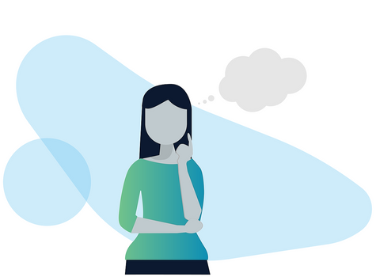
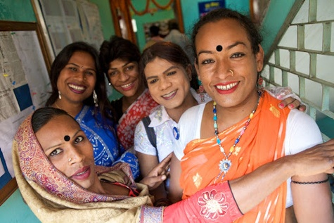
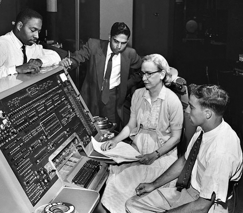

# Module 10: Gender Perspectives

Welcome to Course 10 of the YouthMappers Academy. In this course, you will learn about the fundamentals of gender-related concepts, inclusive language, gender discrimination, and how to make your YouthMappers chapter a welcoming and safe space where all members can be their best selves.

## Overview 
As members of the YouthMappers network, we all need to acknowledge the importance of gender awareness, and how this relates to peer leadership and peer interactions in our global community. The course will help you understand how gender bias and discrimination negatively impact women and other gender minorities, and how these biases also limit and hurt men. The course also discusses the challenges women and other gender minorities face as members of the YouthMappers network and OpenStreetMap communities and as new professionals in geospatial and technology.  You will also learn about the fundamentals of gender-related concepts, inclusive language, gender discrimination, and how to make your YouthMappers chapter a welcoming and safe space where all members can be their best selves. 

**In this course, you will learn:**
- To appreciate why gender awareness is important to your role as a member of the YouthMappers network, and as a leader among your peers and in your community
- To understand and appropriately apply inclusive language related to gender⏤why it matters, the definitions of key terms, and what do when someone uses non-inclusive language
- To identify the challenges women and other gender minorities face as members of the YouthMappers network and OpenStreetMap communities, and as new professionals in geospatial and technology
- The role of gender stereotypes and norms, and how these are determined by our societies⏤not our biology
- To understand how gender bias and discrimination negatively impact women and other gender minorities, and how they also limit and hurt men
- To identify ways for your chapter to become involved with Everywhere She Maps and to increase women’s participation in the leadership of your chapter

## Gender Basics 
### The Importance of Gender to the YouthMappers Network
Fewer than 10% of OSM contributors are women, and critical features and attributes that are most relevant to women are missing from maps as a result of their underrepresentation in the geospatial field. Map features and attributes most relevant to women are not well depicted through commonly available mapping platforms. Better representation of healthcare and education services, safety shelters, transportation options, female access to power infrastructure, and economic opportunities are among the many features that strengthen conditions for women when adequately depicted through apps, websites, and other mapping platforms.

In addition, women are typically underrepresented in the technology workforce, including those comprising the geospatial industry. This results in fewer opportunities for women’s participation in many facets of the rapidly growing geospatial industry including location-based intelligence, location-based digital services, mapping, and geographic information systems. YouthMappers have much better gender-balanced participation in many chapters and as a global network.

In 2020, YouthMappers launched the [Everywhere She Maps](https://www.youthmappers.org/everywhereshemaps) program to increase women’s participation and support women mappers within the YouthMappers network. Our aim is to strengthen the inclusiveness of the geospatial community to ensure women’s perspectives are represented in datasets, including OSM, apps, mapping platforms, and more. We founded Everywhere She Maps based on the pillars listed here because we know from experience that everywhere women map, security improves, lives are saved, power is generated, prosperity rises, and innovation happens. 


Everywhere She Maps enables programs that benefit all YouthMappers, including women but also gender non-conforming students and men. 

```{tip} 
YouthMappers Blogspot: If You Can’t See It, You Can’t Be It

[ If You Can’t See It, You Can’t Be It](https://www.youthmappers.org/post/if-you-can-t-see-it-you-can-t-be-it) By Ndapile Mkuwu, Everywhere She Maps Regional Ambassador, 2021-2022

```

### Start with Inclusive Language


As members and leaders of the YouthMappers network, it’s important that we understand gender-related terms and concepts so we can ensure our chapters feel welcoming and safe to any students who want to join us. We are going to start this course by introducing and defining key gender terms to help ensure we are all on the same page and can discuss gender using inclusive and appropriate language. We also recognize that gender terms and concepts may have different meanings or nuances across geographies and cultures. 

Language is an important way for us to understand concepts. YouthMappers is a global network. We each bring our own unique experiences and perspectives into this community, including our understanding of language and the languages we speak. Language shapes how we view femininity and masculinity. It can also be a key way to break down our own understanding of gender biases, including the concept of the gender binary. The term “binary” is used to describe something made of two things or parts or a division into two classes or groups that are considered opposite ([Merriam Webster](https://www.merriam-webster.com/dictionary/binary)). Therefore, the *gender* binary is a system of gender classification in which all people are categorized as being either male or female.

Learning and using inclusive gender terms is not about policing language or making others feel bad if they accidentally use language that is not inclusive. Rather, this is about ensuring everyone in the YouthMappers network, as well as members of our communities and partner organizations, can feel comfortable bringing their best, most authentic selves to YouthMappers spaces, teams, and projects. We want to avoid making assumptions about how people relate to gender and prioritize respect for others. 

### Recognize and Avoid Offensive Language
Offensive, dismissive language can, and often does, take the form of jokes. Sometimes people express their biased and discriminatory attitudes in the form of a joke so that their words or actions can be dismissed as “good-natured fun”. Regardless of tone or intent, threatening or offensive language can, and does, cause harm to those it targets. Unfortunately, jokes about sexual assault and other violence against women, or members of the LGBTQI+ community are all too common in some social circles or cultures. These jokes are not about being funny or your sense of humor⏤they are about normalizing sexual assault, asserting power, and contributing to the existence of cultures where people are not held accountable for committing rape or other acts of sexual violence or discrimination. YouthMappers would like to make clear that all discriminatory language, including language presented as a joke, is unacceptable and violates the [YouthMappers Code of Ethics](https://docs.google.com/document/d/1yWz7RZxVjtfuKOrxOhrRRrh3COu5IecBLqF5jjDKL68/edit?tab=t.0) introduced in Course 1. In addition to violating the Code of Ethics, it can make your chapter members or partners feel unwelcome or even unsafe. We encourage you and your chapter to review the Code of Ethics regularly. All sections of the Code of Ethics are important, but please review in particular this section of the code which is highly relevant to this course:

**WE BELIEVE IN HUMAN DIGNITY:** We strive to create a culture of honor in both online and in-person communications. In exchanges between chapters around the world, respect for different cultural practices, norms, and values is paramount. We strictly forbid harassment of any kind.  

*This code of conduct applies to all YouthMappers’ spaces, both online and off. YouthMappers’ participants are responsible for adhering to this code at all times; anyone who is found violating this code may be sanctioned or expelled from our communication groups and listserv at the discretion of the YouthMappers’ Steering Committee.*

Watch [this video](https://www.youtube.com/watch?v=4T6KqSHTzpA) below to learn more about offensive language and behavior and its impacts. 

Some organizations, like the Humanitarian OpenStreetMap Team, choose to create a Code of Ethics Committee that receives complaints about code of conduct violations and acts accordingly. You may want to ask your Faculty Advisor to serve on the committee, along with a small group of trusted students. It’s important to do all you can to protect the confidentiality of someone who reports a violation if they wish their name to be kept confidential. 

If certain people don’t feel welcome or safe in YouthMappers chapters, we will miss out on their invaluable contributions, talents, and perspectives. We can accomplish more when all members of our chapters trust that their voices and contributions will be respected and heard and when we reduce barriers to all members’ full participation in chapter activities. More perspectives lead to more complete and more accurate data in OpenStreetMap and other geographic datasets. When you use inclusive language and understand issues related to gender discrimination and inequity, you are signaling to others that you are an ally and can be trusted. We’ll dive deeper into what it means to be an ally later in the course.

This is an [episode](https://one.npr.org/?sharedMediaId=581657754:581674712) of Hidden Brain, a podcast by NPR, on language. We recommend listening to it if you’re interested in learning more about this topic! 

### Gender and Language

#### Introduction to Gender
The term 'gender' is not synonymous with the word 'women'. Gender goes beyond exclusively women and women's issues. **Gender** is “a set of socially constructed roles, behaviors, activities, and attributes that a given society considers appropriate” ([PFLAG.org](https://pflag.org/)). These constructions specifically relate to and shape our ideas of masculinity and femininity. When looking at gender, we have to remember it is not simply equivalent to a person's biological sex. **Biological sex** refers to anatomical, physiological, genetic, or physical attributes that determine if a person is male, female, or intersex. Gender goes beyond biological sex and examines the individual's societal role, responsibilities, and expectations.

We live in a complex world! No one factor is isolated from other factors. Other identifying factors (religion, race, sexual orientation) interact with gender. The interaction between gender, sexuality, race, socio-economic status, ability, and other categories of social difference is known as **intersectionality.**

**Key Terms:**
1. **Intersectionality:** Coined by Kimberle Crenshaw, intersectionality is the interaction among gender, sexuality, race, socio-economic status, ability, and other categories of social difference. These factors often have complex relationships with one another and have interdependent advantages and disadvantages.
2. **Biological Sex:** Refers to anatomical, physiological, genetic, or physical attributes that determine if a person is male, female, or intersex. These include both primary and secondary sex characteristics, including genitalia, gonads, hormone levels, hormone receptors, chromosomes, and genes. Often also referred to as “sex,” “physical sex,” “anatomical sex,” or specifically as “sex assigned at birth.” Biological sex is often conflated or interchanged with gender, which is more societal than biological, and involves personal identity factors. - PFLAG.org
3. **Gender:** "Broadly, gender is a set of socially constructed roles, behaviors, activities, and attributes that a given society considers appropriate" specifically surrounding the ideas of masculinity and femininity - PFLAG.org
4. **Gender Identity:**  is an individual's perception and understanding of their gender, which may or may not correspond with their birth sex or their gender expression.
5. **Gender Expression:** is the way in which an individual expresses their gender identity. This is typically through their appearance, dress, and behavior. Gender expression may or may not correspond with their birth sex or their gender identity.
6. **Gender Nonconforming:** "A term for those who do not follow gender stereotypes. Often an umbrella for nonbinary genders...It is important to respect and use the terms people use for themselves" - PFLAG.org
7. **Gender Roles:**  are the set of societal expectations for the behavior of women and men, boys and girls. It is heavily influenced by the patriarchal power structure and typically does not allow for flexibility beyond the gender binary.
8. **Gender Equality:** the state in which access to rights and opportunities is unaffected by gender. It also means that all genders can equitably benefit from resources and policies.

#### Understanding Spectrums 
It is important to understand that many of the terms introduced previously exist on a spectrum⏤not a binary.

For example, we're socialized to think of biological sex as either male (XY chromosomes) or female (XX chromosomes), when in fact [biological sex exists on a spectrum](https://www.youtube.com/watch?v=kT0HJkr1jj4). It's possible for a human to have anywhere from one to three X chromosomes! Intersex is the umbrella term to describe these variations (see the diagram to the right). 

Gender identity, gender expression, and sexual orientation also exist on spectrums. The interaction of all four of these spectrums makes up parts of our identity. Gender identity and gender expression are defined in the “Key Gender Terminology” above. Sexual orientation is defined as “the type of sexual, romantic, emotional/spiritual attraction one has the capacity to feel for some others, generally labeled based on the gender relationship between the person and the people they are attracted to.” [(A Guide to Gender (2nd Edition): The Social Justice Advocate’s Handbook)](https://www.aspeco.net/fougeres-plantes-rustiques/). 

You may know of the acronym “LGBTQI+” (or something similar). You might be very familiar with this acronym, but we still want to cover it in case you aren’t familiar with the English acronym or some of the concepts contained within. LGBTQI+ is “an acronym that stands for lesbian, gay, bisexual, transgender, queer, intersex, and other people of diverse genders and sexualities. Variations of this acronym (that add or drop letters, like A for asexual) exist as well.” (USAID). Here are definitions of each of the terms in the LGBTQI+ acronym, from [USAID](https://www.usaid.gov/sites/default/files/documents/_External_Draft_Integrating_LGBTQI_Considerations_In_Education_Programming_210601-508.pdf): 

**“Lesbian”** refers to women who are emotionally and romantically attracted to other women. 

**"Gay"**refers to men who are emotionally and romantically attracted to men and is often used as an umbrella term for all people who experience same-sex attraction.

**“Bisexual”** refers to individuals who are emotionally and romantically attracted to both men and women.

**“Transgender”** is an umbrella term that refers to all people whose gender identity (a person’s deeply felt internal and individual experience of gender-based on societal expectations) differs from their biological sex (chromosomal, hormonal, and anatomical characteristics used to classify an individual as female, male, or intersex). The best way to explain this is through an example. Let’s say a baby is born and the doctor looks at the baby’s body and says, “It’s a girl.” In this case, we say the individual was “assigned female at birth”. However, as that baby grows into an infant, child, adolescent, and adult, they realize that even though they might have female-typical body parts on the outside, on the inside they identify as a man⏤and that their thoughts, emotions, and feelings are those of a man. This is an example of a transgender man. Sometimes transgender people take steps to align their external appearance with their gender identity. Note that “cisgender” refers to a person whose gender identity is the same as their sex assigned at birth (i.e., not a transgender person).   



**“Queer”** is an umbrella term used by some people to refer to identities within the broad spectrum of sexual orientations and gender identities and expressions that are considered outside of the mainstream, typically meaning non-heterosexual and/or not cisgender. Historically the term was used as a slur against LGBT people, but it has been reclaimed by the LGBTQI+ community. However, some people may still find the term offensive. “Queer” now has particular relevance for individuals who reject binary definitions of male/female, gay/straight, masculine/feminine, and any other type of identity label (usually related to sexual and gender identity).

**“Intersex”** refers to people whose biological sex does not fit the typical definitions of male or female. For example, some people are born with external organs that are typical of males but internal organs that are typical of females - or vice versa; anatomy that appears to be in-between typical male and female anatomy; or chromosomes that aren’t typical of either male or female.

#### Visualizing Sex as a Spectrum
In 2017, the Scientific American put together a diagram of how sex determination can be visualized as a spectrum, rather than a simple XX female and XY male. Please check out this complex diagram [here](https://www.scientificamerican.com/blog/sa-visual/visualizing-sex-as-a-spectrum/).

In the following activity, you will learn the definitions of several key inclusive language terms.

**Instructions:** Read the definition within each of the orange boxes, then drag and drop each definition into the box with the matching term. Once you have assigned all of the definitions to their correct terms, see below for the correct answers. 



**Correct Answers:**


### Addressing Non-Inclusive or Offensive Language 
#### Overview 
When you hear someone else use language that is not inclusive or offensive, it’s normal to feel angry, upset, or confused.  However, it’s possible the person does not even know they said something offensive, so being angry with them will not help the situation. Instead of scolding or accusing them, treat the situation as an opportunity to help them understand why their language was not inclusive and how it impacts others. 

This can be difficult and uncomfortable to do, especially if the other person is an authority figure, like a professor, or someone who you don’t want to upset, like a friend or family member.  It’s important to consider the other person’s authority over you and if they will potentially punish or penalize you for addressing their language (Harvard Business Review). You are not obligated to speak up, especially if your job or academic security, or personal safety could be at risk as a result. 


If you don’t feel comfortable using any of the options above, you can also redirect the conversation by changing the subject or finding a reason to excuse yourself from the conversation. 

In addition to challenging offensive language, be sure to compliment and congratulate people when they use inclusive language. As Sam Killermann, author of A Guide to Gender: The Social Justice Advocate’s Handbook, writes, “encouraging positive behavior can be just as (and more) effective at moving us toward progress as discouraging negative behavior.” (A Guide to Gender (2nd Edition): The Social Justice Advocate’s Handbook) 

For a deep dive on gender identity, discrimination, and ways to improve gender equity, check out the book: A Guide to Gender: The Social Justice Advocate’s Handbook

To learn more about responding to offensive comments, read [“How to Respond to an Offensive Comment at Work”](https://hbr.org/2017/02/how-to-respond-to-an-offensive-comment-at-work) from *Harvard Business Review.*

#### Language is Dynamic 
All languages⏤not just words related to gender⏤constantly evolve and change. Words like “emoji” and “blog” were probably not commonly used when you were born, but they have become a normal part of our everyday lives. Similarly, gender-related words change over time when there are shifts in what language is considered inclusive. Therefore, it’s important to keep an open mind and always be willing to learn and adapt. And most importantly, remember we are all learning to be more inclusive together!



In a couple of words, brainstorm your answer to the following question below: *What does inclusivity mean to you?*

#### Personal Pronouns
People have the right to decide for themselves what they would like their personal pronouns to be. In English, pronouns are used to refer to one’s self or another person or an object without having to use a name. Pronouns include words like:
- She, her, and hers
- He, him, and his
- They, them, and theirs
- It and its
- Me, my, and mine
- You and yours

This concept may not apply to all languages the way it does in English. Historically, the “she/her/hers” and “he/him/his” were almost exclusively used to describe one person. In the past, “they/them/theirs” was typically only used to describe a group of people, but some people whose gender identity is gender-nonconforming want to be referred to as “they/them/theirs” instead of “she/her/hers” or “he/him/his” because they feel it more accurately aligns with their gender identity.

People use other pronouns too, such as:
- Ey, em, and eirs
- Ze, hir, and hirs
- Co, co, and co’s, or any other set of pronouns that they like.

It’s important to respect people’s preferences for their pronouns, because it shows respect for them as a person and that you understand that people can have many gender identities outside of man and woman. You may want to include your personal pronouns in your email signature or other communications to ensure people use your correct pronouns and to signify that you understand.

**How Can I Know Someone Else’s Gender Identity or Preferred Pronouns?**
A lot of gender terms have to do with people’s personal identities. Pause for a moment and think about all the identities you apply to yourself. These might include your nationality, your place in your family, your role as a student, and even your membership in YouthMappers. It would be impossible for a stranger to accurately guess all of your identities just from looking at you, right? Well, the same goes for gender identity. 



We’ve covered a lot of terms related to gender identity, and you may wonder how you can be sure you’re using the correct language when speaking to or about another person. If you are unsure of someone’s preferred personal pronouns, the best way is to ask in a polite and empathetic way. Some people might not wish to share this information with you, which is okay too.

While it is okay to ask someone which personal pronouns they prefer, we don’t recommend asking other people what their gender identity, biological sex, or sexual orientation is. If someone wants to share this information with you, they will!

## Stereotypes and Social Norms and Roles 
### Stereotypes
#### Overview
A stereotype is a “specific belief or assumption (thoughts) about individuals based solely on their membership in a group, regardless of their individual characteristics” ([Maricopa Community Colleges](https://open.maricopa.edu/culturepsychology/chapter/stereotypes-prejudice-and-discrimination/)). 

Stereotypes oversimplify the characteristics and attributes of a group of people, and they lead us to make assumptions about someone based on which groups we think they belong to. Stereotypes are restrictive, limiting, and usually inaccurate, even when they are so-called “positive” stereotypes. 

For example, a common stereotype in the United States is that Asian-Americans are highly intelligent and good at mathematics. While this stereotype could be considered positive since intelligence and mathematical skill are desirable qualities, it still negatively affects Asian-Americans and the U.S. society as a whole. An Asian-American student may discover she is naturally more skilled at history than she is at mathematics, but because of the stereotypes, she might feel as though she is a “bad” or “strange” Asian-American because she prefers history over math. She may feel pressure from her teachers or parents to study a field related to mathematics in college, when she knows inside she would have much preferred to pursue a career related to history and the social sciences. 

Stereotypes can be applied to many different types of groups, but they are most commonly used in relation to identities and attributes such as ethnicity, nationality, gender, religion, sexuality, physical appearance, education, profession, language, and income/wealth.

**YouthMappers Reflection**
Take a few minutes to reflect on the questions below before continuing. 

1. What are some common stereotypes in your country or culture? Do you agree or disagree with these stereotypes, and why?
2. Do you belong to any groups that are stereotyped by others? 
3. How do these stereotypes affect you?

#### Gender Stereotypes
A *gender* stereotype is a stereotype applied to individuals because of their perceived or expressed gender identity. Most people are exposed to gender stereotypes from a very early age. As a result, we tend to internalize gender stereotypes and even apply them to ourselves, often without realizing we’re doing so. 

For example, many societies perpetuate stereotypes about how girls and boys should play. A common stereotype about girls is that their play is quiet and related to domestic life, such as pretending to be a mother to a doll or playing “house”. A common stereotype about boys is that their play is loud and related to physical activity, such as playing with balls or wrestling. In reality, there is nothing biologically inherent in either girls or boys that dictates how they should play or behave⏤but children pick up on messages they receive from their families and friends about what is proper according to their gender. Families reinforce these stereotypes when they buy dolls for girls and footballs for boys. 

Watch [this video](https://www.youtube.com/watch?v=nWu44AqF0iI) from the BBC highlighting gender stereotypes about which toys are appropriate for young girls versus young boys.

Like other stereotypes, gender stereotypes can be positive or negative. Women are often positively stereotyped as being nurturing and caring. Though these are positive traits, these stereotypes are still harmful and restrictive. A woman who doesn’t want to or can’t engage in certain “nurturing” and “caring” behaviors⏤such as raising children⏤might find she is less accepted in social and professional settings and that others question or criticize her decision. 

Men are often stereotyped too. A man who wants to be highly engaged in caring for and raising his children might be criticized or questioned. A boy who prefers reading or drawing over playing physical sports might be teased by his classmates and friends. 

**YouthMappers Reflection:**
Take a few minutes to reflect on the question below before continuing. 

1. How might you respond to/address gender stereotyping in your chapter or community?

### Social Norms and Roles 
#### Overview 
Social norms are “informal rules that a society reinforces and that members of the society live by”. (A Guide to Gender (2nd Edition): The Social Justice Advocate’s Handbook) While stereotypes are often based on⏤and reinforce⏤social norms, they are not the same thing. Some social norms have nothing to do with stereotypes. 

Think, for example, about what you do⏤and just as importantly, what you don’t do⏤when you ride a lift (elevator). When people ride a lift, they: 
- Stand up
- Face the front
- Refrain from talking (outside of normal greetings), unless they are riding the elevator with someone they know. Even then, most people refrain from talking loudly or discussing highly-sensitive topics. 

People ride lifts in this way because of strongly held social norms. No one explicitly teaches us how to ride lifts, but we observe how others behave and very quickly conform (or else we risk social rejection and embarrassment). Another social norm that applies to nearly all cultures is when and where to wear certain types of clothing. You technically could wear pajamas to an in-person business meeting, but you almost certainly wouldn’t if you want to keep your job and be taken seriously. Similarly, you probably wouldn’t wear a formal business suit to exercise⏤not only because it would be impractical, but also because you would receive a lot of strange looks. 

It’s not usually illegal to break social norms, but we face very high pressure to conform to them. 

In a couple of words, brainstorm your answer to the following question below: What are some examples of social norms?

#### Gender Norms 
Gender norms are social norms specifically related to gender. Our families often teach us and model gender norms from a very early age, since the consequences for breaking them can be severe. Gender norms can dictate nearly every aspect of our lives, from what we should wear to what (and how much) we should eat to what we should want to be when we “grow up” (just to name a few examples). 

It’s important to keep in mind that gender norms are byproducts of our specific society, not our biology. Let’s look at a few examples of how gender norms differ across cultures and societies.

**Patrilocal and Matrilocal Societies**
India has many patrilocal communities, where married couples traditionally reside with or near the husband’s parents. Families place a greater emphasis on boys’ education because the boys will usually remain with their families when they grow up and get married. Indonesia, on the other hand, has many matrilocal communities, and as a result, parents tend to invest more in their daughter’s education than in non-matrilocal communities. ([UCLA Anderson Review](https://anderson-review.ucla.edu/gender-and-culture/))

**Gender Categories**

While many cultures rely on binary gender categories (man and woman), quite a few also historically have had a third gender category. Examples include the “two-spirit” in many Native American cultures, the hijra in South Asia, and the Oman xanith. Some societies have even more genders. For example, the Bugis of Indonesia recognizes five different genders. ([Yale Human Relations Area Files](https://hraf.yale.edu/ehc/summaries/gender))

Now let’s take a look at how gender norms can evolve over time. 

**Gendered Colors**
Today in the U.S., pink is strongly associated with girls, and blue is strongly associated with boys. A century ago, the opposite was true⏤pink was considered a “strong color” and was thus associated with boys, whereas blue was considered “delicate” and was thus associated with girls. (The Atlantic) Before that, most Americans considered pink a gender-neutral color. Clearly, this gender norm is arbitrary and has nothing to do with actual biological differences.

**Women in Computer Science**

Would it surprise you to know many of the first computer scientists were women? You wouldn’t be alone, since this field is now dominated by men. Two men designed the first computer during the Second World War, and they hired a team of skilled women mathematicians to compute weapons trajectories using the machine. These six women successfully designed a way to program the computer and laid the groundwork for modern coding, and yet, unlike the men, they received no credit or recognition for their work until recently. Because computer programming was initially considered a low-skill, low-level profession on par with typing or filing, organizations hired women to do the work. Rear Admiral Dr. Grace Hopper, a woman, invented the first computer language compiler, which allows programmers to write software in human-like language. ([History](https://www.history.com/articles/coding-used-to-be-a-womans-job-so-it-was-paid-less-and-undervalued))

The number of women studying computer science in the U.S. peaked in the 1980s for a number of reasons. But now that many more men than women are computer scientists, computer programming and coding is considered a high-skill profession that is well-paid and prestigious. ([NPR](https://www.npr.org/sections/money/2014/10/21/357629765/when-women-stopped-coding))

[Click here](https://www.npr.org/sections/money/2014/10/21/357629765/when-women-stopped-coding) to listen to a short radio program about when women stopped coding. 

#### Gender Roles
In addition to gender norms, our societies typically prescribe us gender roles that we are expected to fulfill to be considered typical for our gender. Gender roles can be defined as “the role or behaviors learned by a person as appropriate to their gender and determined by cultural norms”. ([Maricopa Community Colleges](https://open.maricopa.edu/culturepsychology/chapter/stereotypes-and-gender-roles/)) Some of our societies’ most strongly-held gender roles pertain to family and domestic life. For example, in most societies throughout history, women have been expected to play the role of mother, caregiver, and unpaid domestic worker. Men have been expected to play the role of father, protector, and paid worker. Expectations related to these roles are changing in some places and for some people, but not everyone has the resources or privilege to choose non-traditional roles. 

Gender roles also often apply in the labor and professional spheres. Many societies have long considered careers in law enforcement, politics, science, and the military to be “masculine”. Historically “feminine” professional roles include teaching, child-care, health care, and social work. 

Watch this [video from Upworthy](https://www.youtube.com/watch?v=G3Aweo-74kY) showing how early kids internalize cultural messages about gender roles, and what happened when one group of kids had their assumptions challenged.

## Gender Bias and Discrimination 

## Engage Your Chapter in Everywhere She Maps 

## Dig Deeper 

## Conclusion 