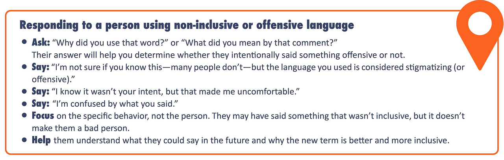

# Gender Dimensions

Welcome to Course 10 of the YouthMappers Academy. In this course, you will learn about the fundamentals of gender-related concepts, inclusive language, gender discrimination, and how to make your YouthMappers chapter a welcoming and safe space where all members can be their best selves.

## Overview 
As members of the YouthMappers network, we all need to acknowledge the importance of gender awareness, and how this relates to peer leadership and peer interactions in our global community. The course will help you understand how gender bias and discrimination negatively impact women and other gender minorities, and how these biases also limit and hurt men. The course also discusses the challenges women and other gender minorities face as members of the YouthMappers network and OpenStreetMap communities and as new professionals in geospatial and technology.  You will also learn about the fundamentals of gender-related concepts, inclusive language, gender discrimination, and how to make your YouthMappers chapter a welcoming and safe space where all members can be their best selves. 

**In this course, you will learn:**
- To appreciate why gender awareness is important to your role as a member of the YouthMappers network, and as a leader among your peers and in your community
- To understand and appropriately apply inclusive language related to gender⏤why it matters, the definitions of key terms, and what do when someone uses non-inclusive language
- To identify the challenges women and other gender minorities face as members of the YouthMappers network and OpenStreetMap communities, and as new professionals in geospatial and technology
- The role of gender stereotypes and norms, and how these are determined by our societies⏤not our biology
- To understand how gender bias and discrimination negatively impact women and other gender minorities, and how they also limit and hurt men
- To identify ways for your chapter to become involved with Everywhere She Maps and to increase women’s participation in the leadership of your chapter

## Gender Basics 
### The Importance of Gender to the YouthMappers Network
Fewer than 10% of OSM contributors are women, and critical features and attributes that are most relevant to women are missing from maps as a result of their underrepresentation in the geospatial field. Map features and attributes most relevant to women are not well depicted through commonly available mapping platforms. Better representation of healthcare and education services, safety shelters, transportation options, female access to power infrastructure, and economic opportunities are among the many features that strengthen conditions for women when adequately depicted through apps, websites, and other mapping platforms.

In addition, women are typically underrepresented in the technology workforce, including those comprising the geospatial industry. This results in fewer opportunities for women’s participation in many facets of the rapidly growing geospatial industry including location-based intelligence, location-based digital services, mapping, and geographic information systems. YouthMappers have much better gender-balanced participation in many chapters and as a global network.

In 2020, YouthMappers launched the [Everywhere She Maps](https://www.youthmappers.org/everywhereshemaps) program to increase women’s participation and support women mappers within the YouthMappers network. Our aim is to strengthen the inclusiveness of the geospatial community to ensure women’s perspectives are represented in datasets, including OSM, apps, mapping platforms, and more. We founded Everywhere She Maps based on the pillars listed here because we know from experience that everywhere women map, security improves, lives are saved, power is generated, prosperity rises, and innovation happens. 


Everywhere She Maps enables programs that benefit all YouthMappers, including women but also gender non-conforming students and men. 

```{tip} 
YouthMappers Blogspot: If You Can’t See It, You Can’t Be It

[ If You Can’t See It, You Can’t Be It](https://www.youthmappers.org/post/if-you-can-t-see-it-you-can-t-be-it) By Ndapile Mkuwu, Everywhere She Maps Regional Ambassador, 2021-2022

```

### Start with Inclusive Language

```{image} Module10_Static/10.01.png
:alt: alt text
:width: 100px

As members and leaders of the YouthMappers network, it’s important that we understand gender-related terms and concepts so we can ensure our chapters feel welcoming and safe to any students who want to join us. We are going to start this course by introducing and defining key gender terms to help ensure we are all on the same page and can discuss gender using inclusive and appropriate language. We also recognize that gender terms and concepts may have different meanings or nuances across geographies and cultures. 

Language is an important way for us to understand concepts. YouthMappers is a global network. We each bring our own unique experiences and perspectives into this community, including our understanding of language and the languages we speak. Language shapes how we view femininity and masculinity. It can also be a key way to break down our own understanding of gender biases, including the concept of the gender binary. The term “binary” is used to describe something made of two things or parts or a division into two classes or groups that are considered opposite ([Merriam Webster](https://www.merriam-webster.com/dictionary/binary)). Therefore, the *gender* binary is a system of gender classification in which all people are categorized as being either male or female.

Learning and using inclusive gender terms is not about policing language or making others feel bad if they accidentally use language that is not inclusive. Rather, this is about ensuring everyone in the YouthMappers network, as well as members of our communities and partner organizations, can feel comfortable bringing their best, most authentic selves to YouthMappers spaces, teams, and projects. We want to avoid making assumptions about how people relate to gender and prioritize respect for others. 

### Recognize and Avoid Offensive Language
Offensive, dismissive language can, and often does, take the form of jokes. Sometimes people express their biased and discriminatory attitudes in the form of a joke so that their words or actions can be dismissed as “good-natured fun”. Regardless of tone or intent, threatening or offensive language can, and does, cause harm to those it targets. Unfortunately, jokes about sexual assault and other violence against women, or members of the LGBTQI+ community are all too common in some social circles or cultures. These jokes are not about being funny or your sense of humor⏤they are about normalizing sexual assault, asserting power, and contributing to the existence of cultures where people are not held accountable for committing rape or other acts of sexual violence or discrimination. YouthMappers would like to make clear that all discriminatory language, including language presented as a joke, is unacceptable and violates the [YouthMappers Code of Ethics](https://docs.google.com/document/d/1yWz7RZxVjtfuKOrxOhrRRrh3COu5IecBLqF5jjDKL68/edit?tab=t.0) introduced in Course 1. In addition to violating the Code of Ethics, it can make your chapter members or partners feel unwelcome or even unsafe. We encourage you and your chapter to review the Code of Ethics regularly. All sections of the Code of Ethics are important, but please review in particular this section of the code which is highly relevant to this course:

**WE BELIEVE IN HUMAN DIGNITY:** We strive to create a culture of honor in both online and in-person communications. In exchanges between chapters around the world, respect for different cultural practices, norms, and values is paramount. We strictly forbid harassment of any kind.  

*This code of conduct applies to all YouthMappers’ spaces, both online and off. YouthMappers’ participants are responsible for adhering to this code at all times; anyone who is found violating this code may be sanctioned or expelled from our communication groups and listserv at the discretion of the YouthMappers’ Steering Committee.*

Watch [this video](https://www.youtube.com/watch?v=4T6KqSHTzpA) below to learn more about offensive language and behavior and its impacts. 

Some organizations, like the Humanitarian OpenStreetMap Team, choose to create a Code of Ethics Committee that receives complaints about code of conduct violations and acts accordingly. You may want to ask your Faculty Advisor to serve on the committee, along with a small group of trusted students. It’s important to do all you can to protect the confidentiality of someone who reports a violation if they wish their name to be kept confidential. 

If certain people don’t feel welcome or safe in YouthMappers chapters, we will miss out on their invaluable contributions, talents, and perspectives. We can accomplish more when all members of our chapters trust that their voices and contributions will be respected and heard and when we reduce barriers to all members’ full participation in chapter activities. More perspectives lead to more complete and more accurate data in OpenStreetMap and other geographic datasets. When you use inclusive language and understand issues related to gender discrimination and inequity, you are signaling to others that you are an ally and can be trusted. We’ll dive deeper into what it means to be an ally later in the course.

This is an [episode](https://one.npr.org/?sharedMediaId=581657754:581674712) of Hidden Brain, a podcast by NPR, on language. We recommend listening to it if you’re interested in learning more about this topic! 

### Gender and Language

#### Introduction to Gender
The term 'gender' is not synonymous with the word 'women'. Gender goes beyond exclusively women and women's issues. **Gender** is “a set of socially constructed roles, behaviors, activities, and attributes that a given society considers appropriate” ([PFLAG.org](https://pflag.org/)). These constructions specifically relate to and shape our ideas of masculinity and femininity. When looking at gender, we have to remember it is not simply equivalent to a person's biological sex. **Biological sex** refers to anatomical, physiological, genetic, or physical attributes that determine if a person is male, female, or intersex. Gender goes beyond biological sex and examines the individual's societal role, responsibilities, and expectations.

We live in a complex world! No one factor is isolated from other factors. Other identifying factors (religion, race, sexual orientation) interact with gender. The interaction between gender, sexuality, race, socio-economic status, ability, and other categories of social difference is known as **intersectionality.**

**Key Terms:**
1. **Intersectionality:** Coined by Kimberle Crenshaw, intersectionality is the interaction among gender, sexuality, race, socio-economic status, ability, and other categories of social difference. These factors often have complex relationships with one another and have interdependent advantages and disadvantages.
2. **Biological Sex:** Refers to anatomical, physiological, genetic, or physical attributes that determine if a person is male, female, or intersex. These include both primary and secondary sex characteristics, including genitalia, gonads, hormone levels, hormone receptors, chromosomes, and genes. Often also referred to as “sex,” “physical sex,” “anatomical sex,” or specifically as “sex assigned at birth.” Biological sex is often conflated or interchanged with gender, which is more societal than biological, and involves personal identity factors. - PFLAG.org
3. **Gender:** "Broadly, gender is a set of socially constructed roles, behaviors, activities, and attributes that a given society considers appropriate" specifically surrounding the ideas of masculinity and femininity - PFLAG.org
4. **Gender Identity:**  is an individual's perception and understanding of their gender, which may or may not correspond with their birth sex or their gender expression.
5. **Gender Expression:** is the way in which an individual expresses their gender identity. This is typically through their appearance, dress, and behavior. Gender expression may or may not correspond with their birth sex or their gender identity.
6. **Gender Nonconforming:** "A term for those who do not follow gender stereotypes. Often an umbrella for nonbinary genders...It is important to respect and use the terms people use for themselves" - PFLAG.org
7. **Gender Roles:**  are the set of societal expectations for the behavior of women and men, boys and girls. It is heavily influenced by the patriarchal power structure and typically does not allow for flexibility beyond the gender binary.
8. **Gender Equality:** the state in which access to rights and opportunities is unaffected by gender. It also means that all genders can equitably benefit from resources and policies.

#### Understanding Spectrums 
It is important to understand that many of the terms introduced previously exist on a spectrum⏤not a binary.

For example, we're socialized to think of biological sex as either male (XY chromosomes) or female (XX chromosomes), when in fact [biological sex exists on a spectrum](https://www.youtube.com/watch?v=kT0HJkr1jj4). It's possible for a human to have anywhere from one to three X chromosomes! Intersex is the umbrella term to describe these variations (see the diagram to the right). 

Gender identity, gender expression, and sexual orientation also exist on spectrums. The interaction of all four of these spectrums makes up parts of our identity. Gender identity and gender expression are defined in the “Key Gender Terminology” above. Sexual orientation is defined as “the type of sexual, romantic, emotional/spiritual attraction one has the capacity to feel for some others, generally labeled based on the gender relationship between the person and the people they are attracted to.” [(A Guide to Gender (2nd Edition): The Social Justice Advocate’s Handbook)](https://www.aspeco.net/fougeres-plantes-rustiques/). 

You may know of the acronym “LGBTQI+” (or something similar). You might be very familiar with this acronym, but we still want to cover it in case you aren’t familiar with the English acronym or some of the concepts contained within. LGBTQI+ is “an acronym that stands for lesbian, gay, bisexual, transgender, queer, intersex, and other people of diverse genders and sexualities. Variations of this acronym (that add or drop letters, like A for asexual) exist as well.” (USAID). Here are definitions of each of the terms in the LGBTQI+ acronym, from [USAID](https://www.usaid.gov/sites/default/files/documents/_External_Draft_Integrating_LGBTQI_Considerations_In_Education_Programming_210601-508.pdf): 

**“Lesbian”** refers to women who are emotionally and romantically attracted to other women. 

**"Gay"** refers to men who are emotionally and romantically attracted to men and is often used as an umbrella term for all people who experience same-sex attraction.

**“Bisexual”** refers to individuals who are emotionally and romantically attracted to both men and women.

**“Transgender”** is an umbrella term that refers to all people whose gender identity (a person’s deeply felt internal and individual experience of gender-based on societal expectations) differs from their biological sex (chromosomal, hormonal, and anatomical characteristics used to classify an individual as female, male, or intersex). The best way to explain this is through an example. Let’s say a baby is born and the doctor looks at the baby’s body and says, “It’s a girl.” In this case, we say the individual was “assigned female at birth”. However, as that baby grows into an infant, child, adolescent, and adult, they realize that even though they might have female-typical body parts on the outside, on the inside they identify as a man⏤and that their thoughts, emotions, and feelings are those of a man. This is an example of a transgender man. Sometimes transgender people take steps to align their external appearance with their gender identity. Note that “cisgender” refers to a person whose gender identity is the same as their sex assigned at birth (i.e., not a transgender person).   


**“Queer”** is an umbrella term used by some people to refer to identities within the broad spectrum of sexual orientations and gender identities and expressions that are considered outside of the mainstream, typically meaning non-heterosexual and/or not cisgender. Historically the term was used as a slur against LGBT people, but it has been reclaimed by the LGBTQI+ community. However, some people may still find the term offensive. “Queer” now has particular relevance for individuals who reject binary definitions of male/female, gay/straight, masculine/feminine, and any other type of identity label (usually related to sexual and gender identity).

**“Intersex”** refers to people whose biological sex does not fit the typical definitions of male or female. For example, some people are born with external organs that are typical of males but internal organs that are typical of females - or vice versa; anatomy that appears to be in-between typical male and female anatomy; or chromosomes that aren’t typical of either male or female.

#### Visualizing Sex as a Spectrum
In 2017, the Scientific American put together a diagram of how sex determination can be visualized as a spectrum, rather than a simple XX female and XY male. Please check out this complex diagram [here](https://www.scientificamerican.com/blog/sa-visual/visualizing-sex-as-a-spectrum/).

In the following activity, you will learn the definitions of several key inclusive language terms.

**Instructions:** Read the definition within each of the orange boxes, then drag and drop each definition into the box with the matching term. Once you have assigned all of the definitions to their correct terms, see below for the correct answers. 


**Correct Answers:**


### Addressing Non-Inclusive or Offensive Language 
#### Overview 
When you hear someone else use language that is not inclusive or offensive, it’s normal to feel angry, upset, or confused.  However, it’s possible the person does not even know they said something offensive, so being angry with them will not help the situation. Instead of scolding or accusing them, treat the situation as an opportunity to help them understand why their language was not inclusive and how it impacts others. 

This can be difficult and uncomfortable to do, especially if the other person is an authority figure, like a professor, or someone who you don’t want to upset, like a friend or family member.  It’s important to consider the other person’s authority over you and if they will potentially punish or penalize you for addressing their language (Harvard Business Review). You are not obligated to speak up, especially if your job or academic security, or personal safety could be at risk as a result. 



If you don’t feel comfortable using any of the options above, you can also redirect the conversation by changing the subject or finding a reason to excuse yourself from the conversation. 

In addition to challenging offensive language, be sure to compliment and congratulate people when they use inclusive language. As Sam Killermann, author of A Guide to Gender: The Social Justice Advocate’s Handbook, writes, “encouraging positive behavior can be just as (and more) effective at moving us toward progress as discouraging negative behavior.” (A Guide to Gender (2nd Edition): The Social Justice Advocate’s Handbook) 

For a deep dive on gender identity, discrimination, and ways to improve gender equity, check out the book: A Guide to Gender: The Social Justice Advocate’s Handbook

To learn more about responding to offensive comments, read [“How to Respond to an Offensive Comment at Work”](https://hbr.org/2017/02/how-to-respond-to-an-offensive-comment-at-work) from *Harvard Business Review.*

#### Language is Dynamic 
All languages⏤not just words related to gender⏤constantly evolve and change. Words like “emoji” and “blog” were probably not commonly used when you were born, but they have become a normal part of our everyday lives. Similarly, gender-related words change over time when there are shifts in what language is considered inclusive. Therefore, it’s important to keep an open mind and always be willing to learn and adapt. And most importantly, remember we are all learning to be more inclusive together!

```{image} Module10_Static/10.06.png
:alt: alt text
:width: 100px

In a couple of words, brainstorm your answer to the following question below: *What does inclusivity mean to you?*

#### Personal Pronouns
People have the right to decide for themselves what they would like their personal pronouns to be. In English, pronouns are used to refer to one’s self or another person or an object without having to use a name. Pronouns include words like:
- She, her, and hers
- He, him, and his
- They, them, and theirs
- It and its
- Me, my, and mine
- You and yours

This concept may not apply to all languages the way it does in English. Historically, the “she/her/hers” and “he/him/his” were almost exclusively used to describe one person. In the past, “they/them/theirs” was typically only used to describe a group of people, but some people whose gender identity is gender-nonconforming want to be referred to as “they/them/theirs” instead of “she/her/hers” or “he/him/his” because they feel it more accurately aligns with their gender identity.

People use other pronouns too, such as:
- Ey, em, and eirs
- Ze, hir, and hirs
- Co, co, and co’s, or any other set of pronouns that they like.

It’s important to respect people’s preferences for their pronouns, because it shows respect for them as a person and that you understand that people can have many gender identities outside of man and woman. You may want to include your personal pronouns in your email signature or other communications to ensure people use your correct pronouns and to signify that you understand.

**How Can I Know Someone Else’s Gender Identity or Preferred Pronouns?**
A lot of gender terms have to do with people’s personal identities. Pause for a moment and think about all the identities you apply to yourself. These might include your nationality, your place in your family, your role as a student, and even your membership in YouthMappers. It would be impossible for a stranger to accurately guess all of your identities just from looking at you, right? Well, the same goes for gender identity. 

```{image} Module10_Static/10.07.png
:alt: alt text
:width: 100px

We’ve covered a lot of terms related to gender identity, and you may wonder how you can be sure you’re using the correct language when speaking to or about another person. If you are unsure of someone’s preferred personal pronouns, the best way is to ask in a polite and empathetic way. Some people might not wish to share this information with you, which is okay too.

While it is okay to ask someone which personal pronouns they prefer, we don’t recommend asking other people what their gender identity, biological sex, or sexual orientation is. If someone wants to share this information with you, they will!

## Stereotypes and Social Norms and Roles 
### Stereotypes
#### Overview
A stereotype is a “specific belief or assumption (thoughts) about individuals based solely on their membership in a group, regardless of their individual characteristics” ([Maricopa Community Colleges](https://open.maricopa.edu/culturepsychology/chapter/stereotypes-prejudice-and-discrimination/)). 

Stereotypes oversimplify the characteristics and attributes of a group of people, and they lead us to make assumptions about someone based on which groups we think they belong to. Stereotypes are restrictive, limiting, and usually inaccurate, even when they are so-called “positive” stereotypes. 

For example, a common stereotype in the United States is that Asian-Americans are highly intelligent and good at mathematics. While this stereotype could be considered positive since intelligence and mathematical skill are desirable qualities, it still negatively affects Asian-Americans and the U.S. society as a whole. An Asian-American student may discover she is naturally more skilled at history than she is at mathematics, but because of the stereotypes, she might feel as though she is a “bad” or “strange” Asian-American because she prefers history over math. She may feel pressure from her teachers or parents to study a field related to mathematics in college, when she knows inside she would have much preferred to pursue a career related to history and the social sciences. 

Stereotypes can be applied to many different types of groups, but they are most commonly used in relation to identities and attributes such as ethnicity, nationality, gender, religion, sexuality, physical appearance, education, profession, language, and income/wealth.

**YouthMappers Reflection**
Take a few minutes to reflect on the questions below before continuing. 

1. What are some common stereotypes in your country or culture? Do you agree or disagree with these stereotypes, and why?
2. Do you belong to any groups that are stereotyped by others? 
3. How do these stereotypes affect you?

#### Gender Stereotypes
A *gender* stereotype is a stereotype applied to individuals because of their perceived or expressed gender identity. Most people are exposed to gender stereotypes from a very early age. As a result, we tend to internalize gender stereotypes and even apply them to ourselves, often without realizing we’re doing so. 

For example, many societies perpetuate stereotypes about how girls and boys should play. A common stereotype about girls is that their play is quiet and related to domestic life, such as pretending to be a mother to a doll or playing “house”. A common stereotype about boys is that their play is loud and related to physical activity, such as playing with balls or wrestling. In reality, there is nothing biologically inherent in either girls or boys that dictates how they should play or behave⏤but children pick up on messages they receive from their families and friends about what is proper according to their gender. Families reinforce these stereotypes when they buy dolls for girls and footballs for boys. 

Watch [this video](https://www.youtube.com/watch?v=nWu44AqF0iI) from the BBC highlighting gender stereotypes about which toys are appropriate for young girls versus young boys.

Like other stereotypes, gender stereotypes can be positive or negative. Women are often positively stereotyped as being nurturing and caring. Though these are positive traits, these stereotypes are still harmful and restrictive. A woman who doesn’t want to or can’t engage in certain “nurturing” and “caring” behaviors⏤such as raising children⏤might find she is less accepted in social and professional settings and that others question or criticize her decision. 

Men are often stereotyped too. A man who wants to be highly engaged in caring for and raising his children might be criticized or questioned. A boy who prefers reading or drawing over playing physical sports might be teased by his classmates and friends. 

**YouthMappers Reflection:**
Take a few minutes to reflect on the question below before continuing. 

1. How might you respond to/address gender stereotyping in your chapter or community?

### Social Norms and Roles 
#### Overview 
Social norms are “informal rules that a society reinforces and that members of the society live by”. (A Guide to Gender (2nd Edition): The Social Justice Advocate’s Handbook) While stereotypes are often based on⏤and reinforce⏤social norms, they are not the same thing. Some social norms have nothing to do with stereotypes. 

Think, for example, about what you do⏤and just as importantly, what you don’t do⏤when you ride a lift (elevator). When people ride a lift, they: 
- Stand up
- Face the front
- Refrain from talking (outside of normal greetings), unless they are riding the elevator with someone they know. Even then, most people refrain from talking loudly or discussing highly-sensitive topics. 

People ride lifts in this way because of strongly held social norms. No one explicitly teaches us how to ride lifts, but we observe how others behave and very quickly conform (or else we risk social rejection and embarrassment). Another social norm that applies to nearly all cultures is when and where to wear certain types of clothing. You technically could wear pajamas to an in-person business meeting, but you almost certainly wouldn’t if you want to keep your job and be taken seriously. Similarly, you probably wouldn’t wear a formal business suit to exercise⏤not only because it would be impractical, but also because you would receive a lot of strange looks. 

It’s not usually illegal to break social norms, but we face very high pressure to conform to them. 

In a couple of words, brainstorm your answer to the following question below: What are some examples of social norms?

#### Gender Norms 
Gender norms are social norms specifically related to gender. Our families often teach us and model gender norms from a very early age, since the consequences for breaking them can be severe. Gender norms can dictate nearly every aspect of our lives, from what we should wear to what (and how much) we should eat to what we should want to be when we “grow up” (just to name a few examples). 

It’s important to keep in mind that gender norms are byproducts of our specific society, not our biology. Let’s look at a few examples of how gender norms differ across cultures and societies.

**Patrilocal and Matrilocal Societies**
India has many patrilocal communities, where married couples traditionally reside with or near the husband’s parents. Families place a greater emphasis on boys’ education because the boys will usually remain with their families when they grow up and get married. Indonesia, on the other hand, has many matrilocal communities, and as a result, parents tend to invest more in their daughter’s education than in non-matrilocal communities. ([UCLA Anderson Review](https://anderson-review.ucla.edu/gender-and-culture/))

**Gender Categories**

While many cultures rely on binary gender categories (man and woman), quite a few also historically have had a third gender category. Examples include the “two-spirit” in many Native American cultures, the hijra in South Asia, and the Oman xanith. Some societies have even more genders. For example, the Bugis of Indonesia recognizes five different genders. ([Yale Human Relations Area Files](https://hraf.yale.edu/ehc/summaries/gender))

Now let’s take a look at how gender norms can evolve over time. 

**Gendered Colors**
Today in the U.S., pink is strongly associated with girls, and blue is strongly associated with boys. A century ago, the opposite was true⏤pink was considered a “strong color” and was thus associated with boys, whereas blue was considered “delicate” and was thus associated with girls. (The Atlantic) Before that, most Americans considered pink a gender-neutral color. Clearly, this gender norm is arbitrary and has nothing to do with actual biological differences.

**Women in Computer Science**


Would it surprise you to know many of the first computer scientists were women? You wouldn’t be alone, since this field is now dominated by men. Two men designed the first computer during the Second World War, and they hired a team of skilled women mathematicians to compute weapons trajectories using the machine. These six women successfully designed a way to program the computer and laid the groundwork for modern coding, and yet, unlike the men, they received no credit or recognition for their work until recently. Because computer programming was initially considered a low-skill, low-level profession on par with typing or filing, organizations hired women to do the work. Rear Admiral Dr. Grace Hopper, a woman, invented the first computer language compiler, which allows programmers to write software in human-like language. ([History](https://www.history.com/articles/coding-used-to-be-a-womans-job-so-it-was-paid-less-and-undervalued))

The number of women studying computer science in the U.S. peaked in the 1980s for a number of reasons. But now that many more men than women are computer scientists, computer programming and coding is considered a high-skill profession that is well-paid and prestigious. ([NPR](https://www.npr.org/sections/money/2014/10/21/357629765/when-women-stopped-coding))

[Click here](https://www.npr.org/sections/money/2014/10/21/357629765/when-women-stopped-coding) to listen to a short radio program about when women stopped coding. 

#### Gender Roles
In addition to gender norms, our societies typically prescribe us gender roles that we are expected to fulfill to be considered typical for our gender. Gender roles can be defined as “the role or behaviors learned by a person as appropriate to their gender and determined by cultural norms”. ([Maricopa Community Colleges](https://open.maricopa.edu/culturepsychology/chapter/stereotypes-and-gender-roles/)) Some of our societies’ most strongly-held gender roles pertain to family and domestic life. For example, in most societies throughout history, women have been expected to play the role of mother, caregiver, and unpaid domestic worker. Men have been expected to play the role of father, protector, and paid worker. Expectations related to these roles are changing in some places and for some people, but not everyone has the resources or privilege to choose non-traditional roles. 

Gender roles also often apply in the labor and professional spheres. Many societies have long considered careers in law enforcement, politics, science, and the military to be “masculine”. Historically “feminine” professional roles include teaching, child-care, health care, and social work. 

Watch this [video from Upworthy](https://www.youtube.com/watch?v=G3Aweo-74kY) showing how early kids internalize cultural messages about gender roles, and what happened when one group of kids had their assumptions challenged.

## Gender Bias and Discrimination 
### Overview 
Social and gender norms, roles, and stereotypes all contribute to the biases we have toward certain groups or types of people⏤and we all have biases, whether we realize it or not. A bias is a “tendency, inclination, or prejudice toward or against something or someone”. ([Psychology Today](https://www.psychologytoday.com/us/basics/bias)) Some biases are completely harmless⏤for example, you might be biased toward watching comedy films because your parents played them all the time while you were growing up.

However, when biases lead us to discriminate against certain groups of people or individuals, they become incredibly harmful. Gender bias is a particularly common form of bias that can be defined as “preferring one gender over another or assuming one gender is better for a job than another”. ([Catalyst](https://www.catalyst.org/)) In this section, we’ll explore how gender bias and discrimination limit opportunities for all genders, but especially women and other gender minorities.

```{tip} 
YouthMappers Blogspot: An Interview with #EverywhereSheMaps Regional Ambassadors

[An Interview with #EverywhereSheMaps Regional Ambassadors](https://www.youthmappers.org/post/an-interview-with-everywhereshemaps-regional-ambassadors) By Geoffrey Kateregga, Humanitarian OpenStreetMapTeam

```

### Gender Bias and Discrimination in the Workplace 
In the online course “Understanding Gender Equity”, Catalyst, a leading non-profit working to accelerate and advance women in leadership, discusses the many ways in which gender bias appears in professional spaces. According to Catalyst, “gender bias can manifest by making women feel unwelcome or out of place. It can also be seen in a lack of advancement for women and even in termination of women from employment.” Gender bias can show up in the workplace in a lot of ways, including: 
- Cultures and attitudes that make women and gender-nonconforming people feel unwelcome or out of place
- The gender pay gap, which is caused both by women having less access to high-paying jobs and situations where women are paid less than men even though they are doing the same job
- A lack of advancement and leadership opportunities for women and gender-nonconforming people
- Formal or informal penalization of women who choose to have children
- Lay-offs or firing of women and gender-nonconforming people for reasons related to their gender (it’s often illegal to fire someone because of her gender, but it still happens⏤the employers just give other reasons as the “official” reasons for the firing)

**Take a look at some key data points that illustrate the effects of gender discrimination in the workplace:**


“As of 2020, around 47% of women globally participated in the labor force, compared to 74% of men.” ([UNESCO](https://www.unesco.org/reports/science/2021/en)) 


“Women also only make up less than a third (31%) of senior roles⏤and this is the highest proportion of women in leadership ever recorded.” ([UNESCO](https://www.unesco.org/reports/science/2021/en)) In other words, for every 100 senior leaders in the workplace, only 31 are women.


Globally, for every $100 USD men earn, women earn only $68.60. ([World Economic Forum](https://www.weforum.org/publications/gender-gap-2020-report-100-years-pay-equality/digest/))


**Field Work**
Fieldwork can be an important or even mandatory part of careers related to scientific research and geography. Historically, the field has been a space of particular discrimination against women and favoritism toward men.

Which of the following are highly biased “reasons” given for why women should not be given jobs or opportunities that require field work? Check all that apply.

1. They might become pregnant or have difficulties completing field work while they are menstruating. On a similar note, women won’t want to be away from home for very long because they prefer to or have to care for their children and partner.

2. It isn’t safe for women to travel alone or to be in the field without protection⏤they might be attacked and can’t defend themselves.

3. Women aren’t physically fit for or will be slower at conducting field work that could demand long hours outside, walking through challenging terrain, and dealing with bad weather or other physically difficult conditions.

4. Men on the field work team won’t feel comfortable spending so much time in proximity to women. Field work is a great bonding experience among members of the team, and men will feel like they have to be on guard and can’t relax if women are around.

**Feedback:** Unfortunately, ALL of the above are typically quoted as “reasons” or “justifications” for why a woman should not receive a job opportunity that involves field work.

Of course, none of these are valid reasons for excluding women from field work opportunities. While some of the risks listed above might be somewhat real (e.g., in some places, it is dangerous for women to travel alone), they can all be mitigated through proper planning and support from the employer sponsoring the field work. Field work offers so many career benefits, learning experiences, and even moments of joy and discovery that no one should be dissuaded from pursuing it because of their gender.

### Gender Bias and Discrimination at School 
Gender inequality at school begins at the primary level and continues throughout a student’s academic career. However, there is some good news⏤over the last 25 years, both girls’ and boys’ access to education around the world has risen. Despite these gains, “by 2030, some 880 million children will not be on track to develop the skills they need to succeed in the workforce”. ([UNICEF](https://www.unicef.org/media/84046/file/Reimagining-girls-education-through-stem-2020.pdf)) In particular, girls and women are significantly underrepresented in studying STEM (Science, Technology, Engineering, and Math) subjects in large part due to “unequal gender norms that tell us that girls are not cut out for subjects that require problem-solving and an inquisitive mind”. ([UNICEF](https://www.unicef.org/media/84046/file/Reimagining-girls-education-through-stem-2020.pdf)) Due to these biased gender norms, girls often have a significantly lower sense of self-confidence related to STEM subjects than boys do. 


Teachers have significant influence over whether girls believe they can perform as well as boys in subjects such as mathematics and science. Numerous studies and programs have shown that teachers often believe their boy students are more capable in STEM subjects than their girl students. This bias is usually unintentional, and often teachers aren’t even aware of the subtle messages they send about girls’ capacity to succeed in STEM. More and more organizations and countries are offering gender-responsive teacher trainings to help teachers recognize their own biases and create STEM classrooms that are more welcoming and supportive of girls. ([UNICEF](https://www.unicef.org/media/84046/file/Reimagining-girls-education-through-stem-2020.pdf))  

Challenges for girls and women tend to increase the further they progress in their careers. Globally, across all academic fields, women have achieved parity with men at the bachelor’s and master’s levels and are close to parity at the PhD/doctoral level. However, women are highly underrepresented compared to men when it comes to pursuing STEM-related degrees⏤only 35% of STEM university students globally are women. ([UNESCO](https://www.unesco.org/en/gender-equality/education))

Take a look at these visualizations from a recent [UNESCO report](https://unesdoc.unesco.org/ark:/48223/pf0000253479) titled *Cracking the Code: Girls’ and Women’s Education in STEM*.

This gender disparity is due in part to women who begin their time at university studying a STEM-related subject but then change their academic major away from STEM due to their university experiences. It can be particularly challenging for women to remain in STEM programs when they are frequently the only woman or one of just a few women in their classes and when nearly all their professors are men, leaving them with few opportunities to engage with women STEM professionals who can serve as role models and mentors. The lack of women studying and teaching STEM at the university level makes it difficult for some YouthMappers chapters to recruit women members and leaders. Although **we fully encourage all university students to participate in YouthMappers, no matter what they are studying**, we also recognize that sometimes STEM students may have more interest in joining YouthMappers than students in other academic disciplines.

Women currently earn 44% of doctoral degrees worldwide, but once they graduate, those who pursue careers in academia face significant challenges compared to their male peers. According to research from [UNESCO](https://www.unesco.org/reports/science/2021/en), “in academia, female researchers tend to have shorter, less well-paid careers. Their work is underrepresented in high-profile journals. An analysis of nearly 3 million computer science papers published in the USA between 1970 and 2018 concluded that gender parity would not be reached in this field until the year 2100.”

```{tip} 
YouthMappers Blogspot: Why is a Day Important to Celebrate the Space of Women in Science?

[Why is a Day Important to Celebrate the Space of Women in Science?](https://www.youthmappers.org/post/why-is-a-day-important-to-celebrate-the-space-of-women-in-science)By Natália da Silveira Arruda, 2021 Everywhere She Maps Regional Ambassador

```

### The Leaky Pipeline for Women Professionals 
A leaky pipeline is commonly used as a visual image to demonstrate the many reasons women are extremely underrepresented in senior and leadership roles, despite often starting in the same undergraduate programs as men. Picture a leaky pipe that is supposed to carry water from a dam or a well to a tap inside your home. If the pipeline develops a small leak in one place, you probably wouldn’t even notice it. However, if the pipeline develops a lot of leaks, some of them large, your water supply would certainly decrease and you would take notice and try to find a solution. 

For women and gender-nonconforming people, the path from undergraduate student to a PhD and/or leadership role has many more challenges and potential pitfalls than the path for men does. In other words, there are a lot more leaks in the pipeline that women have to move through to achieve as much as their men peers. Watch [this short](https://www.youtube.com/watch?v=liCIvVbMG2I) video or study the image below to further understand this concept. 

*Note: the video and image specifically reference the leaky pipeline for women who work in STEM (science, technology, engineering, and mathematics), but the concept can apply to nearly all academic fields and professions.*

Some criticize the leaky pipeline metaphor because they think it puts too much blame on individual women who leave their careers and doesn’t acknowledge that these women still often have incredible careers in other fields or are highly fulfilled by their choice to be a full-time caregiver. ([Frontiers in Psychology](https://www.frontiersin.org/journals/psychology/articles/10.3389/fpsyg.2015.00037/full)) Many of these critiques are valid, and no metaphor can be perfect, but we think the leaky pipeline is still a useful concept to demonstrate the barriers women face to advancing in their careers.

### Case Study 
```{image} Module10_Static/10.16.png
:alt: alt text
:width: 100px

We’re going to introduce a case study to bring these issues to life through the stories of three YouthMappers students. The students in the case study are fictional, but their experiences are based on real lived experiences of YouthMappers students and women and gender-nonconforming people in STEM. 

#### Meet Lucia
Lucia is a second-year undergraduate student pursuing a Bachelor of Science degree in Geomatics Engineering. Lucia identifies as a woman, uses she/her pronouns, and lives in Central America. 

**Her current goals related to her profession and family are:**
- Graduate from her undergraduate program with honors
- Complete an internship with a large, global technology company
- Start a full-time job with a large, global technology company and work her way up to a senior leadership position
- Become involved with the Women’s Resource Group at her employer
- Get married to her current partner and give birth to two children

#### Meet Asma
Asma is a fourth-year undergraduate student preparing to graduate with a Bachelor of Science degree in Software Engineering and a certificate in GIS (geographic information systems). Asma identifies as gender nonconforming, uses they/them pronouns, and lives in Southeast Asia. 

Their current goals related to their profession and family are:
- Graduate from their undergraduate program
- Start a full-time job with a technology start-up and gain experience for 2-3 years
- Become an entrepreneur and found their own technology start-up
- Be able to provide care and financial resources for their parents as they age

#### Meet Zuri
Zuri is a second-year graduate student conducting research to write her thesis for a Master’s degree in Environmental Science and Management. Zuri identifies as a woman, uses she/her pronouns, and lives in East Africa. 

Her current goals related to her profession and family are:
- Complete her thesis and receive approval from her committee
- Graduate from her master’s program
- Receive acceptance to a PhD program and graduate
- Become a university professor and research scientist studying climate change in her country
- Join her country’s National Academy of Science
- Potentially get married⏤she isn’t sure yet if she wants to

**Scenario #1:**
After completing her undergraduate program with honors, Lucia secured a full-time position at a large, global technology company. After five years of gainful employment, Lucia and her partner decided they would like to have a child. Unfortunately, the parental leave policy at her company would not allow Lucia adequate time with her newborn baby. If she took an extended leave from the organization, Lucia knew she risked being overlooked for promotion.

**The above scenario is an example of which of the following discriminatory practices?**
- Cultures and attitudes that make women and gender nonconforming people feel unwelcome or out of place
- The gender pay gap
- A lack of advancement and leadership opportunities for women and gender nonconforming people
- Formal or informal penalization of women who choose to have children
- Lay-offs or firing of women and gender nonconforming people for reasons related to their gender (it’s often illegal to fire someone because of her gender, but it still happens⏤the employers just give other reasons as the “official” reasons for the firing)

**Solution:** Formal or informal penalization of women who choose to have children

**Scenario #2**
Asma gained valuable experience working for a technology start-up. They are confident in their ability to launch their own successful start-up and have already developed a working prototype and a pitch presentation. When Asma contacts potential investors about funding the start-up, the investors are initially excited about the idea. After Asma pitches the start-up to the investors, one of them pulls Asma aside and says “you should really act more feminine. Your idea is great, but I was distracted during your presentation because I was trying to figure out your gender. It will be easier for people and you’ll attract more male investors if you wear dresses and makeup.”

**This scenario is an example of which of the following discriminatory practices? Check all that apply.**
- Lay-offs or firing of women and gender nonconforming people for reasons related to their gender
- Cultures and attitudes that make women and gender nonconforming people feel unwelcome or out of place
- A lack of advancement and leadership opportunities for women and gender nonconforming people
- Formal or informal penalization of women who choose to have children
- The gender pay gap

**Solution:** 
- Cultures and attitudes that make women and gender nonconforming people feel unwelcome or out of place
- A lack of advancement and leadership opportunities for women and gender nonconforming people

**Scenario #3**
As she wrapped up her master’s, Zuri began to apply for PhD programs. While looking at different programs, Zuri became overwhelmed by the extensive nature of the application process. Zuri reached out for support from those in her department, but soon realized that her predominantly male professors were preoccupied with supporting some of her other classmates.

The above scenario may be a result of which of the following? Check all that apply.

- The gender pay gap
- Formal or informal penalization of women who choose to have children
- Few opportunities to engage with women and gender nonconforming STEM professionals
- A lack of women and gender nonconforming people studying and teaching STEM at the university level
- Cultures and attitudes that make women and gender nonconforming people feel unwelcome or out of place

**Solution:**
Few opportunities to engage with women and gender nonconforming STEM professionals
- A lack of women and gender nonconforming people studying and teaching STEM at the university level
- Cultures and attitudes that make women and gender nonconforming people feel unwelcome or out of place

## Engage Your Chapter in Everywhere She Maps 
### Equality and Gender Equity
As you begin to think of ways to address gender bias and discrimination through your YouthMappers chapter’s activities, it’s important to understand the meaning and difference between two important concepts: equality and equity. Here are definitions from Catalyst: 

Equality is “treating everyone the same way, often while assuming that everyone also starts out on equal footing or with the same opportunities. Gender equality means that all genders would have equal rights and opportunities."

Equity is “working toward fair outcomes for people or groups by treating them in ways that address their unique advantages or barriers. Gender equity takes into account the real-world differences in ensuring fair access to those opportunities.”


*Illustration by Angus Maguire.*

The image to the left is commonly used to demonstrate the key difference between equality and equity. In the equality situation, everyone is given the same box to stand on, no matter their height (e.g., their starting point). It seems fair until you realize all three individuals were given the same number of boxes, even though those in red and purple are shorter, and the person in blue doesn’t need a box at all. In the equity situation, the person in red receives one box and the person in purple receives two boxes, which allows them to achieve the same height as the person in blue and watch the sporting event. 

Source: [INGENAES](https://www.slideshare.net/slideshow/agricultural-extension-pathway-to-empowerment-and-food-security/62320393) (Improving Gender and Nutrition within Agricultural Extension Services) 
### Gender, YouthMappers, and OpenStreetMap
At YouthMappers, we prefer to work toward **gender equity**, because we understand that women and gender non-conforming people don’t start with the same opportunities as men do. As Catalyst puts it: “Equity and equality are very closely related, but working towards equity acknowledges the very real-world exceptions, differences, or realities in a given situation.” We acknowledge the real differences between the lived experiences and resources available to people of different genders and want to do as much as possible to reduce barriers to all students’ full participation in the YouthMappers network and in OpenStreetMap. 

Each type of gender-based bias and discrimination we described throughout this course has a significant impact on both women and gender nonconforming people’s ability to participate fully in both the YouthMappers network and in other OpenStreetMap-related communities and projects. Experts estimate only 2% to 8% of OpenStreetMap editors are women. Challenges to inclusion and representation in our community include: 
- Recruiting women to join and lead YouthMappers chapters if recruiting efforts are limited to students studying geography and/or STEM subjects because fewer women are STEM students than men.
- Retaining women and gender-nonconforming students as members of YouthMappers chapters, if they don’t feel the chapter space is welcoming, inclusive, and respectful of their perspectives and ideas, or if chapter meetings and activities present logistical or safety challenges (e.g., chapter meetings held late in the evening when women chapter members might not feel comfortable walking home in the dark alone).
- Increasing women’s participation in editing and contributing to OpenStreetMap, when women have less free time to volunteer because they perform the bulk of unpaid domestic and care work and are less likely to have access to the internet and internet-enabled devices than men. 

These are just a few key examples, and in no way reflect every challenge to inclusion and representation experienced by our members⏤you or a friend may have experienced challenges firsthand that made it difficult for you or them to participate in YouthMappers and OpenStreetMap because of your/their gender.

### How Can We Do Better Moving Forward?
#### Overview
So, what can we do? Here are suggestions for how to begin understanding and addressing barriers to participation in your YouthMappers chapter or mapping community. 

Please note: We understand that these challenges⏤and therefore the appropriate solutions⏤will be different everywhere and can look very different between YouthMappers chapters, so here we focus on how to identify challenges and generate solutions, rather than prescribing specific solutions chapters should implement. 

If you do find something that works well for your chapter, please share it with us in a blog post or chapter resource, as your experience and lessons learned could go a long way to helping your peers address similar issues in their chapter or community.

#### Phase 1: Identify and Understand Challenges 
**Within Your Chapter**
The most important first step your chapter can take to be more inclusive of women and gender-nonconforming people is to understand the current situation and any barriers that currently exist. Create space and time for chapter members to speak about any barriers they face to participating in your chapter’s activities. You may want or need to create space for women and gender-nonconforming people in your chapter to meet without men present if they don’t feel comfortable speaking openly about the challenges they face. If that is the case, be sure that one of the participants in the discussion takes notes and summarizes the challenges that women and gender-nonconforming people in your chapter face while keeping specific quotes and thoughts anonymous. If you want to enable complete anonymity, consider creating a survey that chapter members can complete without sharing their identities. 

```{image} Module10_Static/10.18.png
:alt: alt text
:width: 100px

There are many ways you can collect information and feedback from your fellow chapter members, but it’s critical you protect peoples’ privacy and respect what they say, even if you have had a different experience. Otherwise, it’s unlikely that you will receive candid feedback.

Also, don’t limit your research to only current chapter members. Remember, you want to increase your understanding of barriers to participating in your chapter, so seek out other students at your university who may have expressed interest in joining your chapter but ultimately didn’t become involved or stick around.

For more information and resources about creating safe spaces for women and girls, check out YouthLead’s starter kit:
  - [Women and Girls Safe Spaces: A Toolkit for Advancing Women’s and Girl’s Empowerment in Humanitarian Settings](https://gbvresponders.org/empowerment/womens-and-girls-safe-spaces/)

For more information on planning and facilitating inclusive group discussions on challenging topics, check out these resources: 
  - [Ten Tips for Facilitating Discussions on Sensitive Topics]](https://ianr.unl.edu/ten-tips-facilitating-discussions-sensitive-topics/)
  - [How to Facilitate Discussions](https://blink.ucsd.edu/HR/training/instructor/tools/discussions.html#6.-Summarize-the-results.)

**Within Your Community**
You can also seek to identify and understand challenges that women, gender-nonconforming people, and girls in your broader community face. 

```{image} Module10_Static/10.19.png
:alt: alt text
:width: 100px

- Is it particularly challenging for women to access jobs and economic opportunities? 
- Are women and girls primarily responsible for tasks like gathering water, tending to agricultural plots, cooking, and/or keeping the household running? 
- Do women and girls avoid certain spaces and forms of transportation because they feel unsafe? 
- Are women able to access women’s health services that are affordable and within a reasonable distance of their homes?

We could ask so many more questions like this, but the point is that women and girls often face more challenges in accessing opportunities and resources than men and boys do. Some of these challenges can be illuminated⏤and partially solved⏤by collecting and analyzing open geographic data. 

#### Phase 2: Generate Iedas for Change 
Once you’ve listened, discussed, and listened some more, it’s time to use what you learned in Phase 1 to develop ideas for potential solutions. Remember, you may want to focus on generating ideas to:

- Remove barriers to women’s and other gender minorities’ full participation in and leadership of your chapter, and/or
- Create and use OpenStreetMap data and other open mapping tools to help your community understand challenges faced by women, gender-nonconforming people, and girls through a geographic lens, and to advocate for solutions. 

The specific ideas your chapter generates should be the direct result of your learnings from Phase 1; therefore, these ideas and potential solutions will look different among YouthMappers chapters. However, here are some recommendations for increasing women’s participation in and leadership of your chapter that you might want to consider:

1. **Accessibility**

```{image} Module10_Static/10.20.png
:alt: alt text
:width: 100px

Ensure the days, times, and locations of your YouthMappers chapter meetings and activities are accessible to everyone. Ask yourselves: 
- If you meet in the evenings, do participants feel safe traveling to and from the meeting location? 
- Is there sufficient lighting and access to transportation or safe walking routes? 
- Are there adequate, private sanitation facilities for people of all genders?

2. **Recruitment Strategies**

```{image} Module10_Static/10.21.png
:alt: alt text
:width: 100px

Examine your recruitment strategies. Ask yourselves:
- Do you only recruit new members from certain academic departments within your university? 
- Could you expand your recruitment efforts to other departments or the entire university, which could help increase women’s participation in your chapter? 

3. **Topics**

```{image} Module10_Static/10.23.png
:alt: alt text
:width: 100px

Consider the topics your chapter focuses on when designing mapping activities, mapathons, research projects, and/or field work projects. Ask yourselves: 
- What topics or issues do we tend to map for? 
- For whom do we map? Do our mapping activities benefit a particular group of people? Do women, girls, and gender-nonconforming people benefit from our mapping activities? If not, what challenges do women and girls in our community face, and how can we learn about and address these challenges through mapping?

4. **Safety and Respect**
Establish a chapter code of conduct, terms of participation, or another framework to help ensure that all of your chapter’s members feel safe and respected in sharing their ideas and perspectives and participating in chapter activities. Ask yourselves: 

- Do a few chapter members tend to dominate meetings and activities? 
- Are the same chapter members given leadership roles over and over again?
- Are women explicitly encouraged to take on chapter or activity leadership roles? 
- What shared expectations and tactics can our chapter create and put into place to ensure women and gender-nonconforming people feel comfortable speaking up and are given opportunities to take on leadership roles? 

Your chapter can generate exciting ideas and solutions using a variety of methods, but one of our favorite methods is brainstorming. To access a variety of world-class resources related to brainstorming and generating ideas, visit IDEO U’s “[Brainstorming](https://www.ideou.com/pages/brainstorming)” webpage. 

#### Phase 3: Test Your Ideas and Learn 

```{image} Module10_Static/10.25.png
:alt: alt text
:width: 100px

Once your chapter chooses an idea to implement, it’s important to define your goals. Ask yourselves: 
- What will successful implementation of this idea look like? 
- What impact will it have on our chapter and/or our community? 
- How will we measure our success or impact? 

Now it’s time to implement your idea! Most new ideas aren’t 100% successful the first time they are tried⏤and that is okay. Approach this process with flexibility and the understanding that the idea might not lead to the results you want, or it might require more resources than are available to you. The most important thing you can do is to seek feedback, learn, and adapt. This might include changing your idea or plan entirely, or you may learn that you just need to make a few adjustments to your original idea.

#### Phase 4: Implement and Monitor Your Best Ideas
Now that you have piloted your ideas and gathered feedback and data about their success, your chapter should fully implement any ideas which were successful in the “test” phase. It’s not enough to make a change once and think it will automatically continue without active monitoring. For example, your chapter might choose to introduce a modified chapter code of conduct that emphasizes allowing more leadership opportunities for women and gender-nonconforming people. It probably won’t succeed if you simply announce the change once. You’ll need to actively work to ensure women and gender-nonconforming members of your chapter are actually given meaningful opportunities to lead the chapter as well as be willing to adjust or try a new idea if you don’t achieve the impact you want.

```{image} Module10_Static/10.26.png
:alt: alt text
:width: 100px

It can be difficult and time-consuming to change well-established habits and behaviors both within individuals and within organizations. (Have you ever started exercising again after taking a few months off? You probably had to work harder at the beginning to re-establish exercise as a habit in your routine.) Just as we assess and adjust our individual habits to keep ourselves healthy and flourishing, we need to do the same with our groups and organizations. This requires more planning and work on the front end, but it’s well worth it to have a YouthMappers chapter that meets its goals, has an impact on its community and members, and empowers all members to participate and lead. 

Please don’t limit yourself to only these ideas⏤we would love for YouthMappers students and faculty advisors to use your creativity in this area. When you do, please tell us and your fellow YouthMappers chapters about it by [submitting a blog post](https://docs.google.com/forms/d/e/1FAIpQLSf5ksAVlYMlwvQXDmWQX3lMUcbLH0j7W4C_MYTxIrfpRQpVLQ/viewform), [creating a resource](https://docs.google.com/forms/d/e/1FAIpQLSdLO88TmjKSgC_q5R1LF39Gk7NV_GqA81RzzbKaPviXqWCr9w/viewform?vc=0&c=0&w=1&flr=0) for the [YouthMappers Resource Library](https://sites.google.com/view/youthmapperswiki/home?authuser=0), or reaching out to info@youthmappers.org. 

**Want to learn more about designing for change and improving organizational outcomes?**
The processes listed above are inspired by Human-Centered Design. If you are interested in learning more about this highly effective framework for creating positive change, head to [IDEO.org](https://www.ideo.org/tools) and download the free “Field Guide to Human-Centered Design”.

## Want to Dig a Little Deeper?
Refer to the information below to learn more about gender perspectives.

- **Global Gender Gap Report 2021:** Another generation of women will have to wait for gender parity, according to the World Economic Forum’s [Global Gender Gap Report 2021](https://www.weforum.org/publications/global-gender-gap-report-2021/). As the impact of the COVID-19 pandemic continues to be felt, closing the global gender gap has increased by a generation from 99.5 years to 135.6 years. Explore the report to learn more about the gender gap and strategies to close it. 

- **3 Women Mapmakers Who Changed The Way We View The World:** [Learn about three women cartographers](https://www.here.com/learn/blog/three-women-who-mapped-the-unseen) who made groundbreaking contributions to the field of geography and mapmaking. 

- **Data2X - Advancing Gender Data:** [Data2X’s mission](https://data2x.org/) is to improve the availability, quality, and use of gender data in order to make a practical difference in the lives of women and girls worldwide.  

- **Women in Business 2021:** For 17 years, Grant Thorton has been tracking the global progress of women in senior management. [Click here](https://www.grantthornton.global/en/insights/women-in-business-2021/) to view their report, “Women in business 2021”. 

- **Catalyst - Workplaces that Work for Women:** [Catalyst](https://www.catalyst.org/) is a global nonprofit supported by many of the world’s most powerful CEOs and leading companies to help build workplaces that work for women. They work with a global community to learn and share leading practices and build positive change through virtual events, workshops, resources, and webinars. 

- **Kapor Center - Leaky Tech Pipeline:** [The Leaky Tech Pipeline framework and website](https://leakytechpipeline.com/) are meant to increase understanding of the causes of disparities in the technology ecosystem, raise awareness about effective strategies and stages for intervention, and drive the development and implementation of comprehensive solutions.

- **5 Ways to Engage Men in Gender Diversity Initiatives:** Gender equality is still an issue at work, but it is not a women’s issue. Gender initiatives have traditionally focused on improving women’s participation in the workplace, but recently (in sociological terms, anyway) there has been a shift toward making ‘gender’ a gender-neutral problem. We need men to be part of the conversation on diversity. Read more about [how to engage men in gender diversity initiatives](https://theglasshammer.com/2010/09/5-ways-to-engage-men-in-gender-diversity-initiatives/). 

- How to Disagree with Someone More Powerful than You: How exactly do you voice dissent with your superior? And is it always worth it to do so? Communication experts say that while just agreeing feels easier, it’s not always the best decision to make. Read this [article from Harvard Business Review](https://hbr.org/2016/03/how-to-disagree-with-someone-more-powerful-than-you?utm_medium=email&utm_source=tgr_newregistrants&utm_campaign=subscribetohbr_gbb&utm_content=engagment5_suboffer_t3&utm_term=touch3&deliveryName=DM155783) on how to disagree with someone more powerful than you. 

### Explore Your Gender

```{image} Module10_Static/10.27.png
:alt: alt text
:width: 100px

Gender is also a personal topic. In this course, we would like to provide you with the opportunity to explore your own personal understanding of gender. Below are some exercises you may consider completing.

In a couple of words, think about your answer to the following question: 
**What does gender mean to you?**

**The Genderbread Person**
The Genderbread Person is a teaching tool for breaking the big concept of gender down into bite-sized, digestible pieces. This resource has evolved from version 1 to version 4. You are welcome to download the Genderbread Person and fill out the worksheet for yourself.


More information can be found on the [Genderbread website](https://www.itspronouncedmetrosexual.com/2018/10/the-genderbread-person-v4/).

- [Click here](https://cdn.filestackcontent.com/WgyPKLbFTp6nQZgeihqx?policy=eyJleHBpcnkiOjc5NDUxNTc2OTAsImNhbGwiOlsicmVhZCIsImNvbnZlcnQiXSwiaGFuZGxlIjoiV2d5UEtMYkZUcDZuUVpnZWlocXgifQ==&signature=2349fd1b8939d5c24bb4610737262196cf87b27d1a32788773acdefacd1d6620) to access a completed copy of the Genderbread Person worksheet.
- [Click here](https://cdn.filestackcontent.com/fTgZ02bcRSWpJEhFoYbO?policy=eyJleHBpcnkiOjc5NDUxNjAyNTYsImNhbGwiOlsicmVhZCIsImNvbnZlcnQiXSwiaGFuZGxlIjoiZlRnWjAyYmNSU1dwSkVoRm9ZYk8ifQ==&signature=065a7a5361e27c7ba2e2005dbd8c0b8b5ea09e15c3a7de20df506d1debee8476) to access a blank copy of the Genderbread Person worksheet.

## Conclusion 
### Skills, Proficiencies, and Standards 
Each badge awarded as part of the YouthMappers Academy has been aligned to the skills and proficiencies outlined in the U.S. Department of Labor’s Geospatial Technology Competency Model (GTCM), as well as National Geographic’s National Geography Standards.

The Geospatial Technology Competency Model identifies the foundational, industry-wide, and industry sector–specific expertise that distinguishes, and binds together, successful geospatial professionals. It identifies core personal, academic, and workplace competencies, as well as sector specific geospatial knowledge and abilities, including specialized competencies related to data acquisition, data analysis and modeling, imagery interpretation, and software and application development. 

The National Geography Standards are benchmarks of geographic literacy to determine a comprehensive understanding of the interaction of space and place, and the skills to analyze and critique these dynamics. These standards are measured through knowledge and mastery of three things: (1) factual knowledge; (2) mental maps and tools; (3) and ways of thinking.

The following competencies derived from both the Geospatial Technology Competency Model and the National Geography Standards are central to the successful completion of YouthMappers Academy Course 10: Gender Perspectives

**The Geospatial Technology Competency Model**
1. Interpersonal Skills: Demonstrating the ability to work effectively with others, through interaction with peers and course moderators
2. Professionalism: 
  - Demonstrating commitment to the values, standards of conduct, and well-being of one's profession  
  - Know codes of ethics and rules of conduct; legal, ethical, and business aspects of data sharing
3. Initiative: Demonstrating gumption at work/school
4. Dependability and Reliability: Displaying responsible behaviors at work/school
5. Lifelong Learning: Displaying a willingness to learn and apply new knowledge and skills
6. Reading: Understanding written sentences and paragraphs in work-related documents  
7. Geography: Understanding the science of place and space; geographic skills
8. Teamwork: Working cooperatively with others to complete projects
9. Communication [Listening and Speaking]: Giving full attention to what others are saying and speaking in English well enough to be understood by others
10. Critical and Analytical Thinking: Using logic, reasoning, and analysis to address problems
11. Creative Thinking: Recognizing, exploring, and using a broad range of ideas and practices
12. Problem Solving and Decision Making: Applying critical-thinking skills to solve problems by generating, evaluating, and implementing solutions

**The National Geography Standards:**

1. The World in Spatial Terms: 
  - How to use maps and other geographic representations, geospatial technologies, and spatial thinking to understand and communicate information
  - How to analyze the spatial organization of people, places, and environments on Earth's surface
2. Places and Regions: The physical and human characteristics of places
3. Human Systems: 
  - The characteristics, distribution, and migration of human populations on Earth's surface
  - The characteristics, distribution, and complexity of Earth's cultural mosaics
4. Environment and Society: 
  - How human actions modify the physical environment
  - How physical systems affect human systems
5. The Uses of Geography: 
  - How to apply geography to interpret the past
  - How to apply geography to interpret the present and plan for the future

### Congratulations!
Congratulations on completing Course 10: Gender Perspectives of the YouthMappers Academy series!

