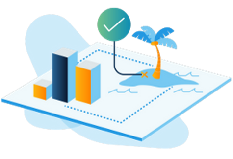
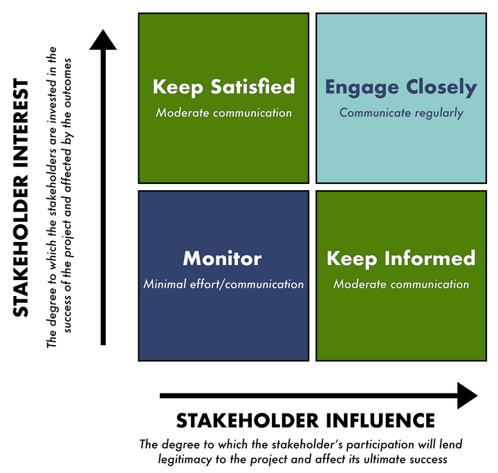
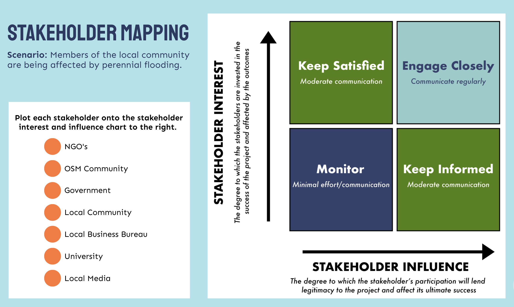
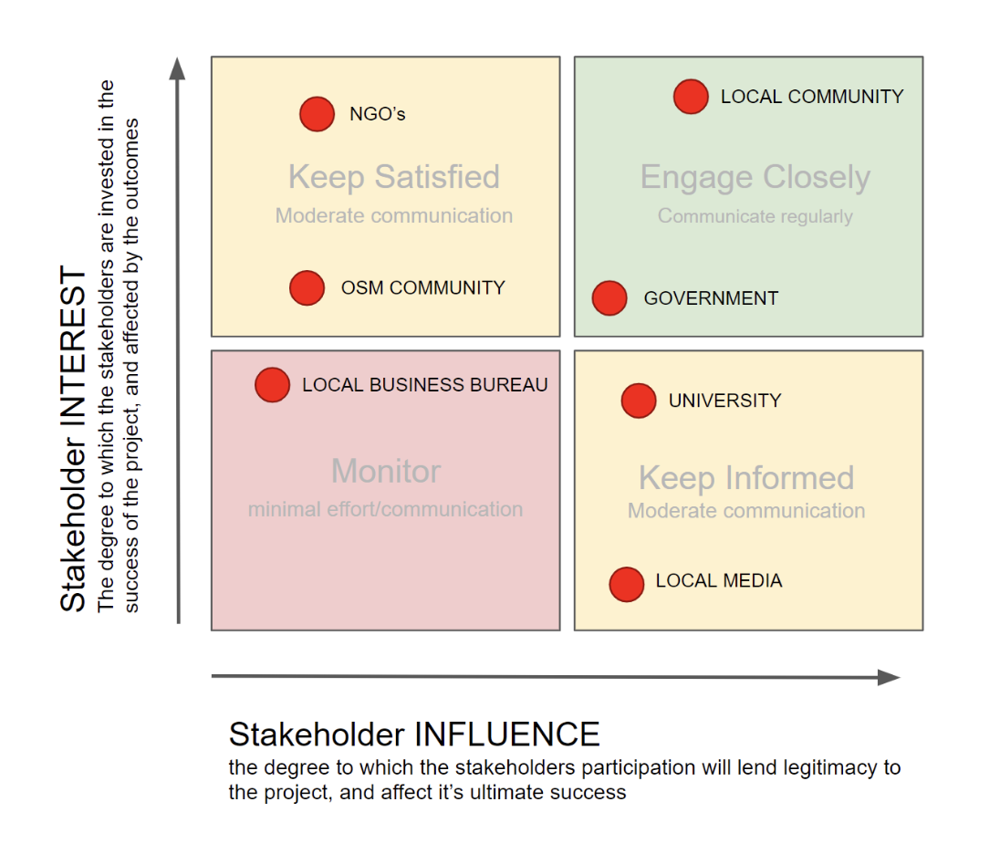
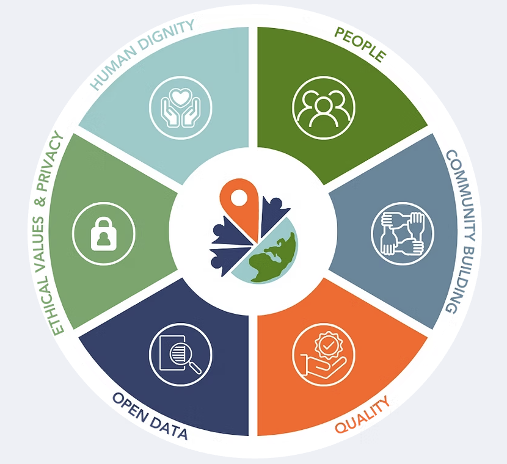
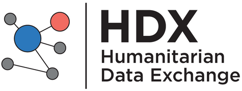
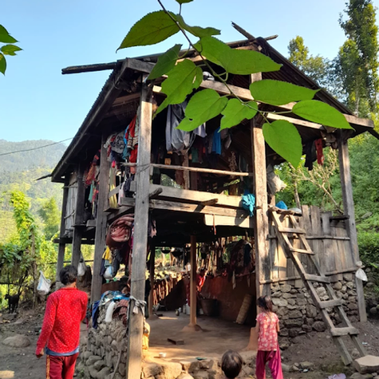
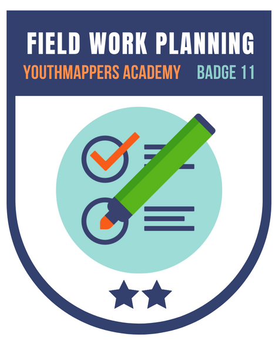

# Planning a Field Project

Welcome to Course 11 of the YouthMappers Academy. In this course, you will learn how to craft a problem statement to help you articulate the specific goals of your research and the data necessary to achieve them. 

## Overview 
The key to successful field work is a meticulously planned tactical approach to your data collection exercise. This begins with a clear definition of the problem you are about to address. In this course, you will learn how to formulate a problem statement, which will help you to formally articulate and communicate your overall research agenda and to prioritize the data necessary to achieve it. You will learn how to develop a simple field work strategy, which involves dissecting your work into tasks while acknowledging the timeline sensitivities and resources required. You will also learn how to illustrate your field work strategy on a detailed timeline, denoting tasks, dependencies, and resources required. 

**In this course, you will learn:**
-How to formulate a problem statement to articulate and communicate your research agenda
- How to identify and prioritize stakeholder relationships, leading to better project design and implementation
- How to assess existing datasets, identify data gaps and needs, and prioritize individual datasets for upgrading/replacement
- How to develop a simple field work strategy, which is a meticulously planned approach to your data collection. This will involve dissecting your work into tasks while acknowledging the timeline sensitivities and resources required. 
- How to illustrate your field work strategy on a detailed timeline, denoting tasks, dependencies, and resources required

## Defining Your Problem and the Scope of Your Project 

### Overview 
 
Research starts with a desire to better understand and potentially address a problem. In the context of YouthMappers, this is usually a problem relating to development⏤very often in a community or location that is already well known to us. Being close to a problem (either through research familiarity or geographic proximity) doesn’t always make it easier when it comes to designing research and planning field work. This is why we should always adopt a systematic approach to the design and planning process. 

All good research begins with a problem statement.

In a couple of words, brainstorm your answer to the following question: *How would you define a problem statement?*

### What is a Problem Statement?
A problem statement is a short description of issues you intend to address through the course of your research. It should contain a clear and concise articulation of the issues themselves, the end goal of any intervention you propose, and the methods used to get there. A good problem statement should outline any data to be collected and include a preliminary acknowledgment of the primary stakeholders involved and a specific geographic scope for the assignment.


This sounds like a lot to consider, but if you think clearly and logically about each of these individual elements, the problem statement will almost write itself! While problem statements or research questions are often a formal requirement of the dissertation process, the formulation process itself can be quite enlightening. Planning and forethought are keys to success, and should be just as important to formal and extracurricular research efforts.


### Dissecting a Problem Statement 
One popular approach to dissecting a research problem is to identify the “Five W’s”. These are: What, Who, When, Where, and Why. This is really just a step-by-step approach to tackling the problem statement components above, and the checklists can be a little easier to work through:

1. **What:**
This is where you consider the issues that you are attempting to address. It is okay to start with multiple potential problems: you can prioritize and refine them to arrive at the ones that make the most sense for your specific project. The identification of issues kicks off a chain of other “What” questions for you to consider, and you can already see how the scope of one project can burgeon at an early stage. 

For you to think about: 
- What are the issues at play?
- What are the primary challenges my community faces (or the impacts of the issues outlined above)?
- What will be the benefits/outcome of fixing these issues? 
- What are the consequences of leaving the problem unaddressed?
- What kind of data will I need to collect to help understand and address these issues? 
- Can this problem be meaningfully addressed with data collection and sharing via OSM?

2. **Who:**
Here is where you do a preliminary identification of your stakeholders. A stakeholder is anyone who may affect or be affected by the process and/or outcomes of a given project. We will look at different types of stakeholders in more detail in the next section.

For you to think about:
- Who does the problem affect? 
- Who stands to benefit or enjoy a better quality of life based on the success of your implementations? 

3. **When:**
Not all problem statements consider a specific time period or duration of the issues at hand, but the concept of time could be critical to defining the scope of your research, and the ultimate timing of your field work. Things like flood seasons and election cycles are important considerations. Do you need to collect your data by a certain window, to inform an intervention in a timely manner? Or, could social unrest associated with elections or major events interrupt fieldwork plans? 

For you to think about: 
- When does the issue occur? 
- Is it persistent or cyclical? 
- Is it something we can predict with any degree of confidence? 
- When does the issue need to be fixed?

4. **Where:**
Though the issue you have identified may affect a larger community, you may have to restrict the scope of your field work to a more refined study area. Time and resources will determine how much area you can cover, and the level of detail possible for your survey. 

In order to determine the geographical scope of your field work, consider the following:
- Where is the issue occurring?
- Can you clearly demarcate this area on a map? 
- How large is this area?
- If the affected area is quite large, is there a smaller area, like a neighborhood, where you could focus your efforts?
- Can you be confident that any smaller area that you choose as a potential pilot field study area is representative of the issues and stakeholders articulated in your problem statement?

***Remember***:  It is better to do something well in a smaller, more focused pilot area, rather than it is to overextend yourself and your field team with an overly ambitious geographic scope. A successful pilot methodology can be replicated and scaled in an incremental fashion when time and resources are available. This is another element that may not make it into the problem statement directly (or if it does, it will be in rather general terms).

5. **Why:**
The question of “Why” a particular issue requires attention may seem entirely obvious to you, but you need to be able to articulate this clearly and defensibly when presenting your argument to potential supporters and stakeholders. 

You need to identify addressable issues with clear and useful impacts in order to focus your project:
- Why is it important that you fix the problem? 
- What impact does it have on the stakeholders you have identified? 

### Key Points to Remember When Writing Your Statement 
The following recommendations refer to the tone of the written statement itself. These tips won’t help you to construct your statement, but they will ensure that in its written format it is accessible to the widest possible audience.


**Keep it short and focused:** The purpose of a problem statement is to lay out the primary issues at hand (one or two key issues at most), the key players, and the potential solution. The problem statement does not provide a complete overview of the project process. The statement should be a short paragraph, consisting of a few sentences at most. Keep your sentences short, and your language simple.

**Know your audience:** It is important that the style and tone of language that you use is appropriate for your intended audience. Remember to use short, direct sentences, and simple language, as this will serve best for most audiences. You can, if required, redraft a more formal version of your statement for an academic audience.Minimize the technical language: Try to minimize the use of difficult technical terms. Never use acronyms, unless you are prepared (and have the space) to explain them. You will never know when your statement may be used out of context. It should make sense as a stand-alone statement, without deeper explanation (or an accompanying lexicon). This tip is closely tied to knowing your audience.

**Minimize the technical language:** Try to minimize the use of difficult technical terms. Never use acronyms, unless you are prepared (and have the space) to explain them. You will never know when your statement may be used out of context. It should make sense as a stand-alone statement, without deeper explanation (or an accompanying lexicon). This tip is closely tied to knowing your audience.


## Identifying and Engaging Your Stakeholders 
### Overview 


In the YouthMappers community (and indeed the wider OpenStreetMap community) we advocate for collaborative, transparent data collection efforts. Our mission is to help create open data to address development challenges, therefore any data collection campaign will require community engagement on a number of different levels. As we have already learned, a stakeholder is someone who may affect or be affected by the process and/or outcomes of a given project. Local communities and local governments are usually the most obvious stakeholders in any mapping project, but we shouldn’t restrict ourselves to those two groups.

Ask yourself the following questions to help identify additional stakeholder groups that you may not have considered earlier. Are there any...

- Other groups working on this issue in the area? 
  - Local or international NGOs or civil society groups?
- Groups who could potentially benefit from the data you plan to collect? 
  - Is there perhaps a group working on a separate but complementary issue?
- Groups who might already hold data that could be of use to your planning, or that you could potentially build upon?
- Groups with physical resources, like meeting space or computer lab space, who could assist with fieldwork preparation and logistics?

In most community mapping projects, typical stakeholder groups to consider are:
- **Local communities:** The affected community should always be considered a primary stakeholder in any mapping effort. The data needs YOU anticipate based on preliminary research may not align with local needs. It is important to discuss needs and expectations with local communities, as there may be underlying issues that aren’t captured in previous research or formal documentation. We always strive to map with communities, not for them.
- ***Government:** The engagement would often start with local government, but it could extend to regional or national governments if the issue in question goes beyond the expertise or purview of local authorities.
- **The OSM community:** This includes any active OSM chapter in the area as well as active remote mappers who have engaged regularly with the area in which you plan to work. 
- **Academic/scientific community:** Enlist the cooperation and support of research and technical experts, especially those who have worked in this area (both geographically and thematically), as they can help refine your data model and inform your data collection process. 
- **Local NGO’s and civil society groups:** Aligning with other groups working in the same area can help with context and introductions to the local community. Cooperation on the data collection exercise itself could allow for a broader scope both geographically and thematically.

```{tip} 
YouthMappers Blogspot: Power Mapping Brings Rapid Reliable Energy to Rural Communities

[Power Mapping Brings Rapid Reliable Energy to Rural Communities](https://www.youthmappers.org/post/power-mapping-brings-rapid-reliable-energy-to-rural-communities) By Patricia Solís (YouthMappers), Tommy Charles (OSM Sierra Leone), Elena van Hove (Arizona State University), Christopher Beddow (Mapillary)

Mapillary is teaming up with YouthMappers, researchers at Arizona State University, the OSM chapter in Sierra Leone, and other partners to map fundamental spatial features that speed up efforts to design and install mini-grids in rural areas.


```

### Stakeholder Mapping 
Different stakeholder groups will be engaged to greater and lesser degrees, with some playing a very passive role in activities. It is still important to extend an open invitation, as equitable engagement is what lends transparency to the process. 

Many disciplines engage in a formal process of stakeholder mapping. This isn’t the type of mapping that we’re used to⏤it’s more like a brainstorming exercise to identify all interested parties, and the degree to which we anticipate their level of interest and engagement in the planned activity. There are many different takes on what constitutes “stakeholder mapping”, but the simplified grid below gives you an idea of some basic sliding categories that can help you categorize and prioritize your stakeholders. 


**Stakeholder interest** speaks to the degree to which the stakeholders are invested in the success of the project and affected by the outcomes. Typically, communities have a high level of interest and the most to gain from a successful outcome, but we should not overlook groups such as civil society organizations or NGO’s who may stand to benefit from a collaborative data collection effort. Governments may also have a high degree of interest here. Comprehensive datasets can help inform decisions, and direct participation can help build institutional capacity.  

**Stakeholder influence** speaks to the degree to which the stakeholder's participation will lend legitimacy to the project, and affect its ultimate success. When we look at mapping projects specifically, communities will once again be at the top of this list, especially if they have an active participatory role in the data collection process. Direct community involvement leads to co-ownership of the process, and an extra layer of trust in the data itself. Influence is often  construed as “power” in this context. Therefore, you need to consider any groups or individuals who may obstruct or interfere with your proposed work, if not properly involved and informed. On the flip side, taking time to build relationships with stakeholders in a position of authority can help build trust, secure permissions, and enhance the overall success and security of the project.

Plotting each identified stakeholder along a simple chart will help you to manage your stakeholder relationships more effectively. You won’t be able to satisfy the needs of every stakeholder, therefore, prioritization and open communication will be important factors to keep things running smoothly to and manage expectations accordingly.



Stakeholder engagement will also help you to develop and refine your data model. In many cases, the needs that you anticipated, based on YOUR understanding of the problem, may not be the same needs as those experiencing the problem firsthand. 

For instance:
- Will the data you collect help the community to advocate for intervention at the government level or help support self-organization to address the issue locally?
- Will the data you collect help the decision-makers in local government support planning to address the issues that have been identified?

The stakeholder engagement process also allows us to identify any potentially marginalized groups and to make arrangements (linguistically or culturally) for their inclusion in the design process.

In the activity below, you will practice prioritizing stakeholders by plotting them on the interest and influence chart. 

**Instructions:** Read through the following scenario and list of stakeholders. Then, based on the scenario, plot each stakeholder onto the stakeholder interest and influence chart. Once you have assigned all of the orange dots, look below to check your answers. 



**Answers:**


### Let's Revisit Ethics 
In Course 1 we learned about the importance of ethics and etiquette in the open-source community. Ethics are a set of moral principles adhered to by a particular group in fulfillment of their mission. YouthMappers is committed to providing free and open data for all, in a principled and inclusive way. This is true of data that we generate through remote workflows, such as tracing from drone or satellite imagery, and the data that we collect “on-the-ground” while embedded in the community.



**WE VALUE PEOPLE:** We are mindful that our intent is to create a global map that is of the people, for the people, and by the people. We advocate for collaborative mapping that is grassroots and democratically based so communities can thrive.

**WE SUPPORT COMMUNITY BUILDING:** We intend to foster an international, interdisciplinary network so that students learn to contribute to an inclusive, global community, through virtual collaboration and peer-to-peer support, where a diversity of participants, perspectives, and abilities are celebrated.

**WE STRIVE FOR QUALITY:**  We strive to be diligent in our mapping and learning efforts. We equip ourselves with the technical and personal skills necessary to be precise in our mapping and observe personal values, while coordinating with field validators to authenticate our work and remain supportive of the local community.

**WE ADHERE TO OPEN DATA:** YouthMappers works to ensure that the data, information, and results we create are freely available for the greater public good⏤particularly local populations planning for the welfare, resilience, and vitality of their communities. In this context, we demand adherence to practices of transparency that preserve academic integrity, including proper acknowledgement and citation of work.

**WE UPHOLD ETHICAL VALUES, PRIVACY, AND SECURITY STANDARDS:** We take privacy and security standards seriously and commit to protecting the identities of the people in the communities we map. Our campaigns are focused entirely on humanitarian and development needs; accordingly, we respect the privacy of individuals and information (including spatial) that may violate confidentiality. We also respect the social, cultural, and religious values of the communities we map. We will, therefore, refrain from creating data and information that is controversial and not in line with the widely shared values and principles of the community.

**WE BELIEVE IN HUMAN DIGNITY:** We strive to create a culture of honor in both online and in-person communications. In exchanges between chapters around the world, respect for different cultural practices, norms, and values is paramount. We strictly forbid harassment of any kind.

## Data Assessment 
### Overview 
Before diving headlong into data collection, you should first take a look at all current and available datasets for your study area. Perhaps some of the data that you require to address your problem statement already exists, and your new data collection campaign would be better suited to updating or supplementing this, or expanding on the area of interest. Even if existing datasets do not amply address your research needs, supplemental data for analysis, overlay (how the data overlaps), and general context is also important, and a preliminary assessment will help you identify what’s out there.

### What Are We Assessing?
For the purposes of tracking and evaluating existing datasets, nothing works as well as a trusty old spreadsheet. This allows you to expand and refine your evaluation criteria with ease, in a format that is familiar and manageable.

There is no ultimate template for the assessment of geospatial data, but there are certain key elements that you will need to include, such as the data:

- Name
- Description
- Source (this would acknowledge the issuing entity, including a link to access or download the data)
- Type (e.g., is the data vector, raster, database?)
- Geographic Scope (this could be as simple as local/regional/national, or if you wish to be specific, the coordinate extent of the dataset in question)
- Geographic Scale/Resolution (for vector datasets, this would indicate the scale at which the data was developed; for raster, it should indicate the resolution (or pixel size) of the image or dataset)
- Date Acquired (this indicates how current the data is and when it was last collected/compiled)
- Access/Conditions of Use (this is to indicate if the data is open, for use by permission only, or closed)

Depending on the problem that you are trying to address, you may want to categorize your data thematically, depending on the role it will play in your analysis. Some data layers or sources may be relegated to the base data category (such as roads, rivers, and administrative boundaries), whereas other layers might be identified as hazards (such as flooding, flood plains, landslide-prone areas), or exposure layers (such as buildings, critical infrastructure, schools, hospitals). This is more an exercise in housekeeping than a key requirement, but it may help you identify data gaps in your proposed analysis going forward.

### Where to Start? 
The easiest way to begin your assessment is a simple web search. Some of the base data layers you need may be openly available from trusted sources, such as the Humanitarian Data Exchange (HDX). 



You should focus on local, national, and regional government departments or agencies that serve as guardians of geospatial data for your country of study. You should also search thematically, looking to research and academic institutions that maintain global databases on everything from meteorological data to seismic events.

As you progress in your stakeholder engagement, you may have access to unpublished/proprietary datasets from government, commercial, or academic partners. It is important to determine any permissions or conditions of use for these datasets. Do not assume that derived products (such as data traced and loaded to OSM, or, indeed, any analytical outputs) are exempt from the original terms of use. To protect yourself and the outputs of your research, make sure to get an explicit outline of what is/isn’t allowable with regard to any data shared by a third party. 

## Field Work Strategy
### Overview 


Planning is key to a successful field work campaign. Therefore, one of the most important things you can invest time and energy on is the development of a field work plan or strategy.

### What is a Field Work Strategy?
A field work strategy is a meticulously planned tactical approach to your data collection process. A strategy is composed of a series of interrelated tasks, each with its own to-do list, logistical requirements, and timeline; it also acknowledges any important dependencies that might affect the overall progress and ultimate success of the data collection exercise.


**Study Area**
As you develop your strategy, you will make some key decisions, such as deciding on the exact area to be mapped (the dimensions and boundaries of your “study area”), choosing which objects will be mapped within that area, and the attributes or “tags” you plan to collect for each object. 

**Field Logistics**
This process also includes outlining field logistics and the various data collection and mapping tools and techniques you plan to employ. These decisions will guide your staffing, training, and equipment needs, while also helping you refine the project timetable. 

**Project Workflow**
The tasks in a typical data collection project are somewhat linear, therefore, as part of your data capture strategy, you will have to determine the dependencies between these tasks so that the overall project workflow encounters minimal interruption should one aspect of the plan encounter issues.

#### What is Dependency in the Context of Project Management?
Dependency in project management refers to the management of a series of interrelated tasks, whose timing must be carefully sequenced to ensure the project runs smoothly.


Some tasks need to be fully completed before a second task can begin. For example, if you plan to collect data at the building or household level for your field work, then you need to make sure that your remote digitization and validation tasks are fully complete before you prepare the materials and deploy your field campaign.

Tasks like data assessment and stakeholder engagement can occur simultaneously and will potentially inform one another as they progress.

```{tip} 
YouthMappers Reflection

What are some of the key tasks you consider when developing a field work strategy?

```

```{tip} 
YouthMappers Blogspot: My Experience in Chepang Community Mapping

[My Experience in Chepang Community Mapping](https://www.youthmappers.org/post/my-experience-in-chepang-community-mapping) By Sunil Bhattarai, Tribhuvan University (Nepal)

Read Sunil’s experience participating in fieldwork as part of “Trails and Community Infrastructure Mapping and Field Survey of Raksirang and Kailash Rural Municipality”, prioritizing the Chepang community. The Chepang community, also known as Praja, is one of the highly marginalized indigenous nationalities and resource-poor tribes of Nepal.



```
#### Key Tasks Activity 
Read through each of the key tasks outlined below, then answer the questions (in which you will order the tasks chronologically from 1 to 5 to develop a comprehensive field strategy).

1. **Develop your Data Model**
The data model outlines the geographical features to be collected for the study site, as well as the attributes (or tags) to be collected for those features. At a very basic level, this acknowledges whether the team will collect (for example) points of interest, road infrastructure, and drainage features, and what attributes, or tags, will be collected about those features. We talk in more detail about data models in the next course.

The data model needs to not only reflect the basic tagging system of OSM, but also the data needs identified in the problem statement. The development of the data model should be a collaborative process which includes stakeholders and is not solely dictated by the research lead. Remember, the structure of the data model will also guide the creation of your training materials.

2. **Field Data Collection**

For this task, you will deploy a team to the field for the purposes of field data collection activities. Using the data created during the remote mapping exercise to orient your field activities, you will collect tags or attributes using a survey. The survey will be based on the data model you designed in conjunction with your stakeholders. A mobile data collection platform is advisable for this stage but can be used in conjunction with paper maps.  We will focus on this particular task, and the various tools and approaches you can deploy, in the next course.

3. **Define Your Study Area**
Your task is to determine the specific geographical extent of the study area for your project. This should be discussed with all priority stakeholders to make sure the area depicted meets the needs and expectations of all involved. The study area extent should be represented both digitally and on paper to facilitate sharing and discussion. The boundary file should be exported as a (.json) file so that it can be used in desktop GIS to help estimate the amount of desktop mapping and validation required within the study area, and, to subsequently create a mapping task in the HOT tasking manager. This estimate will also help you determine the number of staff and/or volunteers required for both the desktop mapping and field data collection phases.


4. **Remote Mapping**
During the remote mapping phase, you will trace map features within the study area from imagery in the OpenStreetMap platform. You should use the OSM Tasking Manager to coordinate mapping activities for the study area, and decide whether the remote mapping activities can be completed by you and a support team, or whether a Mapathon training activity is required to supplement tracing. All traced data should be subject to secondary remote validation before the field data collection process. 

You will need to plan for training activities which will include the development of training materials and plans for hosting (which could include booking a space and providing machines). Even if the team you assemble to assist with remote mapping activities is experienced, it is still advisable to hold a training session.


5. **Field Data Validation**
This task involves the validation and integration of the data collected in the field with the remotely traced data in OSM. Whether you choose to work with paper maps or a mobile app, you will need to organize a logical and systematic workflow for how you plan to address this task. Depending on your research objectives, some of the data collected in the field is suitable to host on OSM, while some may be beyond the scope of the OSM data model (and may also have privacy concerns). Most practiced field mappers used JOSM as the anchor for that stage of the workflow, therefore it is key that your support team is well trained in its use.

**Develop a Comprehensive Field Strategy**
Develop a Comprehensive Field Strategy
Read through each of the key tasks outlined above, then come back and order the tasks chronologically (from 1 to 5) to develop a comprehensive field strategy.

**Which of the following is task #1?**
- Field Data Collection
- Define Your Study Area
- Field Data Validation
- Develop Your Data Model
- Remote Mapping

**Which of the following is task #2?**
- Field Data Collection
- Define Your Study Area
- Field Data Validation
- Develop Your Data Model
- Remote Mapping

**Which of the following is task #3?**
- Field Data Collection
- Define Your Study Area
- Field Data Validation
- Develop Your Data Model
- Remote Mapping

**Which of the following is task #4?**
- Field Data Collection
- Define Your Study Area
- Field Data Validation
- Develop Your Data Model
- Remote Mapping

**Which of the following is task #5?**
- Field Data Collection
- Define Your Study Area
- Field Data Validation
- Develop Your Data Model
- Remote Mapping

**Correct Answers"**
1. Define Your Study Area 
2. Develop Your Data Model 
3. Remote Mapping 
4. Field Data Collection 
5. Field Data Validation 

## Time Management 
### Overview 
As previously mentioned, the tasks in a field data collection project are somewhat linear, therefore, as part of your strategy development, you will have to determine dependencies between these tasks so that the project can continue to progress should one element encounter issues.  


In order to manage task dependencies, and to plan for any unexpected interruptions, you should create a detailed timeline for your project. Use something simple like spreadsheet software to facilitate this. The timeline should incorporate all the tasks outlined above and any significant sub-activities. The timeline should also allow for data recapture, should issues arise in the field and the reconciliation of the newly acquired field data with the existing data on the OSM platform. 

## Want to Dig a Little Deeper?
Refer to the information below to learn more about field survey development.

- [Planning an Open Cities Mapping Project](https://opendri.org/resource/planning-an-open-cities-mapping-project/) offers a comprehensive understanding of the design and implementation of an Open Cities mapping project for both practitioners in the field and those interested in a higher-level understanding of the process. The guide's content is based on experience in implementing the initial Open Cities projects in Bangladesh, Nepal, and Sri Lanka as well as on previous mapping project experience.

- [The HOT Toolbox](https://toolbox.hotosm.org/pages/introduction/how_to_use_toolbox/) is a comprehensive guide that takes a project manager through the entire mapping workflow, from project design through to the more technical aspects of technology options for field deployment. The front section [Introduction to Designing a Mapping Project](https://toolbox.hotosm.org/pages/1-running-a-mapping-project/0100_introduction_to_designing_a_mapping_project/) is particularly relevant to this course. 

- **The International Federation of the Red Cross and Red Crescent Societies** have extensive experience in planning and deploying field work campaigns, most typically for post-disaster needs assessments, but also in the pre-assessment of risk for vulnerable communities. The [IFRC Vulnerability and Capacity Assessment (VCA)](https://www.ifrcvca.org/) is a participatory community risk assessment process. It enables communities, with the support of Red Cross and Red Crescent National Societies when needed, to assess and analyze the risks they face and explore where these risks come from, which members of the community are most exposed, what coping capacities are available, and what initiatives can be undertaken to strengthen coping capacities and reduce the risks. While much of this incredibly detailed approach may be beyond the scope of your research, there are many valuable lessons and tools in the [Vulnerability and Capacity Assessment (VCA) Toolbox](https://www.ifrcvca.org/toolbox). 

## Conlusion 
### Skills, Proficiencies, and Standards 
Each badge awarded as part of the YouthMappers Academy has been aligned to the skills and proficiencies outlined in the U.S. Department of Labor's Geospatial Technology Competency Model (GTCM), as well as National Geographic’s National Geography Standards.

The Geospatial Technology Competency Model identifies the foundational, industry-wide, and industry sector-specific expertise that distinguishes, and binds together, successful geospatial professionals. It identifies core personal, academic, and workplace competencies, as well as sector-specific geospatial knowledge and abilities, including specialized competencies related to data acquisition, data analysis and modeling, imagery interpretation, and software and application development. 

The National Geography Standards are benchmarks of geographic literacy to determine a comprehensive understanding of the interaction of space and place, and the skills to analyze and critique these dynamics. These standards are measured through knowledge and mastery of three things: (1) factual knowledge; (2) mental maps and tools; (3) and ways of thinking.

The following competencies derived from both the Geospatial Technology Competency Model, and the National Geography Standards are central to the successful completion of **YouthMappers Academy Badge 11: Planning a Field Project.**

**The Geospatial Technology Competency Model**
1. Interpersonal Skills: Demonstrating the ability to work effectively with others, through interaction with peers and course moderators
2. Professionalism: 
  - Demonstrating commitment to the values, standards of conduct, and well-being of one's profession  
  - Know codes of ethics and rules of conduct; legal, ethical, and business aspects of data sharing
3. Initiative: Demonstrating gumption at work/school
4. Dependability and Reliability: Displaying responsible behaviors at work/school
5. Lifelong Learning: Displaying a willingness to learn and apply new knowledge and skills
6. Reading: Understanding written sentences and paragraphs in work-related documents  
7. Geography: Understanding the science of place and space; geographic skills
8. Teamwork: Working cooperatively with others to complete projects
9. Communication [Listening and Speaking]: Giving full attention to what others are saying and speaking in English well enough to be understood by others
10. Critical and Analytical Thinking: Using logic, reasoning, and analysis to address problems
11. Creative Thinking: Recognizing, exploring, and using a broad range of ideas and practices
12. Planning and Organizing: Planning and prioritizing work to manage time effectively and accomplish assigned tasks
13. Problem Solving and Decision Making: Applying critical-thinking skills to solve problems by generating, evaluating, and implementing solutions
14. Working with Tools and Technology: Selecting, using, and maintaining tools and technology to facilitate work activity
15. Checking, Examining, and Recording: Entering, transcribing, recording, storing, or maintaining information in written or electronic/magnetic format
16. Software and Application Development: Evaluate open source software
17. Core Geospatial Competencies: 
  - Compare spatial data models, such as vector, raster, and object
  - Data analysis involving spatial relationships, such as distance, direction, and topology
  - Perform GIS analysis, including measurement, query and retrieval, vector overlay, map algebra
  - GIS hardware and software capabilities, including real-time GPS/GIS mapping systems
  - Recognize opportunities to create mobile end-user applications

  **The National Geography Standards**

1. The World in Spatial Terms: 
  - How to use maps and other geographic representations, geospatial technologies, and spatial thinking to understand and communicate information
  - How to analyze the spatial organization of people, places, and environments on Earth's surface

2. Places and Regions: 
  - The physical and human characteristics of places
  - How culture and experience influence people's perceptions of places and regions

3. Environment and Society: 
  - How human actions modify the physical environment
  - How physical systems affect human systems

4. The Uses of Geography: 
  - How to apply geography to interpret the past
  - How to apply geography to interpret the present and plan for the future

  ### Congratulations! 
  Congratulations on completing Course 11: Planning a Field Project of the YouthMappers Academy series!




