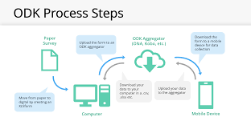
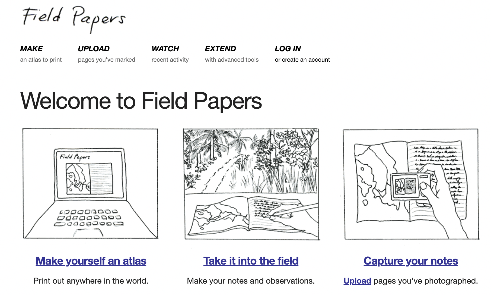

# Field Survey Development 

## Overview
Welcome to Course 12 of the Youthmappers Academy. In this course, we will look at the best practices around field survey development, and how we can turn a problem statement, and data model into a concise, clear survey (or questionnaire). We will also explore the various tools (both analog and digital) that are at our disposal to facilitate data collection.

### What you will learn in this course:
- You will learn best practices for questionnaire development, including tips on language, and response style 
- You will explore some of the most popular and reliable tools for geospatial data collection in the field 
- You will compare and evaluate different field data collection workflows, exploring the pros and cons of each approach 
- You will learn about field work etiquette, and some of the key logistical considerations prior to deployment 

## What is a Survey?

Depending on subject matter and context, the definition of a “survey” can be quite different. From the perspective of a cartographer, a survey is a field activity to capture the measurements and details of one’s physical surroundings. This is often necessary to create a detailed and accurate map, especially in instances where detail and context cannot be determined from existing maps or aerial imagery. 

The term survey can also be applied to the research method for gathering information about the characteristics, behaviors and/or attitudes of a population by administering a standard set of questions to a sample set of individuals. In this example, the term
survey describes the process itself, while the set of questions, or questionnaire, is considered the survey “instrument”. 

This language can all get a little confusing, especially when it’s used interchangeably (which it very often is). To keep things simple, in this course we’ll opt for the following language: 
- **The survey:** the physical act of going out into the field to collect data ● The instrument: we will use this to describe the questionnaire that will yield the tags or variables that we plan to collect. 
- **The tool:** we will consider this to be the mode or technology used to deploy the survey instrument (e.g. paper + clipboard or mobile app) 

## Designing a Survey Instrument (or Questionnaire) 

Whether you plan to use paper based, or digital data capture, you will require a survey instrument (or questionnaire) that aligns with the data model you have already designed.  

```{exercise} My Sample Question
Do you remember what a data model is?

```{solution}
In Course 4 we learned that a model is an abstract, simplified representation of reality. From a geographer's perspective, a map is a model of the physical world around us. It represents the map makers’ interpretation of their surroundings, boiled down to simple symbols and pictorial representations of real-world features.
```

For the purposes of this course, we will assume that the data being collected is aligned directly with the attribution or tagging of mapped features, and will not extend our lesson to socio-economic or household surveys. That’s not to say that face-to-face surveys, or focus group discussions will not be an integral part of your research, and overall data collection plan - we’re just going to focus primarily on geographic features for the purposes of this course.

### Best Practices for Questionnaire Development

There are a few simple rules when it comes to crafting survey questions. These rules are especially important when crafting questions for face-to-face surveys. Although we aren’t dealing with a typical “household survey” type survey instrument here, you may still need to engage with local populations for clarity on some of the features you are planning to map. These rules are also relevant in cases where the expected responses, or data ranges may seem simple, or obvious. 

1.  **Keep it simple:** A question shouldn’t raise more questions. Questions should be clearly worded, short, simple, and specific. Avoid using complex words, technical terms, jargon, and phrases that are difficult to understand. Instead, use language that is commonly used by both surveyors and respondents.This is true in cases 
where the surveyor is simply observing and reporting on a specific feature in the field, or, where a surveyor is directing a question to a respondent. 

| Use | Instead Of
|----------|----------|
| Work  | Employment  |
| Tired | Exhausted  
| About  | Regarding
| Peopel who live here  | Occupants of this household 
| Your answers  | Your responses to this questionnaire  
| Job concerns | Work-related employment issues 
| Providing health care | Health care provision

2. **No double barreled questions:** Do not ask double-barreled questions. In other words, don’t ask questions that touch on more than one issue, but only give one opportunity for response. Follow up questions are the simplest way to get more detailed information about a topic or feature, while keeping confusion to a minimum (remember; in OSM, features can have many tags) 

  a.  If follow-on questions are required for the same map feature, many data collection apps have a feature called skip-logic. Skip-logic creates a
  custom path through a set of survey questions that varies based on a respondent's previous answers. 

3. **Do not use institutional or academic jargon:** Do not assume the participants (or data collectors) are familiar with your industry jargon. Just because a term is frequently used in academic literature, it may hold little or no meaning for the general population. Remember that our survey teams may be drawn from the local population. It is a good idea to “test” your survey, and any introductory material with a select group of potential surveyors, or locals, to check for any language issues. 

a. For instance, let’s look at the following introduction -”We’re here today to conduct a survey to support a RAP to investigate DRM issues in the community……” 

  i. RAP: Rapid Assessment Program
  
  ii. DRM: Disaster Risk Management 

Not exactly obvious, is it? 

4. **All terms should be clearly defined (and illustrated if possible):** If it is important to use specific terms as part of the survey, make sure your training involves a proper definition and description of the term and it’s usage. This should also be reiterated in either field notes, or as a note that appears with the question. In cases where your survey will involve the categorization of a geographic feature in the field, it is a good idea to include example photos of the different options as part of the training materials (and perhaps also, as part of the field packet that surveyors will take to the field). Reinforcement is the best way to communicate a new or important concept. 

5. **No leading questions:** Leading questions are questions that subtly prompt the respondent to answer in a particular way. Or, questions that are overly assumptive in their wording; as in: “what level of education do you have?”, or, “what job do you have?” You don't know if the respondent has a job, or, if they were exposed to formal education. This is more of an issue when speaking directly to respondents, rather than a situation where a surveyor is making a direct observation about a piece of infrastructure. 

6. **Do not use biased, or emotionally charged terms in your questions:** It is very important to double check the phrasing and any subsequent translation of your survey, to make sure that the intended message is being conveyed simply, clearly, and without bias. It is good to check your terms and wording choice with a
community representative before going into the field. What may appear to be an innocuous choice of wording on your part, could cause offense, or 
misinterpretation on behalf of the surveyor, or respondent. 

7. **Avoid the use of negative words:** Using negative words in questions confuses people. For example: “Did you not?” “Do you not?”. It’s also leading and already assumptive of the answer. Ask something in a clear fashion that allows for an unbiased yes/no answer. 

8. **Lost in translation:** In certain cases, you may need to translate your survey/questionnaire into one or more alternate languages. This may be required if you recruit local participants in the data collection, or, if your survey is being used in more than one location. It is very important that the survey instrument is easy to use, for both the surveyor, and the participant. You do not want the surveyor to have to translate on-the-fly (especially in instances where the surveyor might need to communicate directly with survey participants). This can lead to confusion, and miscommunication. It is important to have someone fluent in both the language of design, and the language of delivery, to cross-check all questions and replies. Ideally, you should run a simple pilot, to make sure that both surveyors and potential participants understand the instructions, questions, and replies. 

### Question Response Style
Most survey instruments will be composed of a series of questions or prompts. There are two main styles of response to survey questions. 

- **Closed responses style questions** provide a list of acceptable responses. Checklists, multiple choice questions, true/false questions, and sliding scales are all types of closed responses. Respondents, or surveyors may find it easier to answer the question when response alternatives are provided, and it is easier and less time-consuming to interpret and analyze these types of responses. While answers generated using this style of question can be useful to generate statistics, and are easier to interpret and analyze, they lack detail, richness and personal viewpoints. **Closed response questions are critical for adhering to Data Models for GIS database construction.** Using multiple choice options keeps tagging consistent, and one can always use the “other” option, to allow for flexibility. If you put time and effort into the development of your data model, survey construction for the purpose of collecting feature tags should be a much easier lift.

- **Open-ended questions/responses** allow respondents to answer in their own words. There are several advantages to this; respondents may give increased amounts of reflection to their answers, and critical unanticipated perspectives may emerge. Sometimes, answers to open questions may be difficult to interpret and answers may be spread over many categories, making them hard to analyze. For the purposes of feature identification, open-ended questions make proper categorization almost impossible, and the inclusion of an “other” option at the end of a closed range of choice is a good middle ground. We rarely use open ended responses when collecting geospatial data attributes, as consistency is key. Open-ended questions are more suited to a focus group discussion setting, where you can also feature a participatory mapping component. Participants can talk about the features that have been mapped (or will be mapped) and provide insight on changes over time, or the factors that contribute to these changes. Focus groups can provide an additional layer of contextual detail to a traditional field mapping exercise, and can potentially help refine the approach and data model if held before the actual survey itself.

```{dropdown} What is a Focus Group Discussion?

A Focus Group Discussion is a gathering of people from similar backgrounds or interests to discuss a specific topic.

Participants may be asked to share their **perceptions**, **opinions**, **beliefs**, or **ideas** on the topic at hand.

These discussions are typically led by a **trained moderator**, who uses **semi-structured questions** to guide the conversation and spark meaningful discussion.
```
```{dropdown} What is Participatory Mapping?
Participatory Mapping is a mapping approach where individuals gather and talk about features in their community that have been mapped (or should be mapped), while providing insight on changes over time, or the factors that contribute to these changes.

Large format printed maps of the community are usually a central feature of initial participatory mapping sessions, and participants are typically invited to add features and informational content to these maps. This information can be digitized at a later date.

Participatory Mapping is essentially a Focus Group Discussion where responses and ideas are translated into map format.

The Participatory Mapping approach has been around for quite some time, predating OpenStreetMap (OSM) and the many digital apps and tools we now use for data collection.

In fact, starting with a focus group discussion or traditional participatory mapping session is a great way to initiate focused conversations with community stakeholders and to refine your data model for any subsequent field mapping efforts.

Community participation in the mapping workflow can progress from these meeting style, paper map sessions, to fully fledged, co-designed field work campaigns. 


```

### Training your Data Collectors 
A clear set of instructions, and adequate training is always REQUIRED in advance of any field data collection effort. Even if your support team has worked closely with you throughout the preparation process, training allows for consistency of approach, and an opportunity for any last-minute questions. Training is particularly important if your surveyors are filling out the questionnaire alone, and will not have the opportunity to check-in “on the fly” (though this can be facilitated through a group chat function, using something like WhatsApp). 

It is also important to pilot test the product, and ***cross check your survey with a member of the local community.*** You have to remember that there are potentially two levels of interpretation here; your surveyor, and the person being surveyed (if that is relevant for the data being collected). That creates at least one, if not two chances for misinterpretation.

```{admonition} [YouthMappers Blogspot: SETCO YouthMappers train for Women's Connect Challenge Tanzania] (https://www.youthmappers.org/post/2019/03/05/setco-youthmappers-train-for-womens-connect-challenge-tanzania)
:class: info

**By: Geoffrey Kateregga, Humanitarian OpenStreetMap Team**

Through the Women Connect Challenge project in Serengeti, Tanzania, HOT conducted a one-day OpenStreetMap introductory training at Serengeti Tourism College, located in Mugumu, Mara Region, Tanzania.

The tourism school is the only institution of higher learning in Mugumu town, the administrative seat of Serengeti District.

The purpose of the training was to develop the capacity of the students in the use of OpenStreetMap and also initiate the creation of a YouthMappers chapter, whose members could contribute to the Women Connect Challenge project through Crowd2Map Tanzania.
```

```{quiz} Knowledge Check Quiz
:shuffle: false
:correct: Congratulations — that's correct!
:incorrect: Some of your selections are incorrect. Please try again.

- id: q1
  question: Which of the following is an example of a leading question? *(Check all that apply)*
  type: checkbox
  answers:
    - a. How long have you been in your current job? ✓
    - b. Are you currently employed?
    - c. At what age did you complete your education? ✓
    - d. Do you have any kind of formal education?

  explanation: |
    Answer (a) assumes that the respondent is already employed, which may not be the case, and does not allow for a response where this can be acknowledged.  
    Answer (c) assumes that the participant has had the opportunity to participate in formal education.  
    Answers (b) and (d) can elicit a simple yes/no response, and the interviewer can have additional follow-up questions if necessary.

- id: q2
  question: According to this best practice, which of the following questions is poorly constructed? *(Pick one)*
  type: multiple-choice
  answers:
    - a. Is the building accessible by motor vehicle, and if so, what type of road? ✓
    - b. Is the building accessible by motor vehicle? Yes or No?
    - c. If yes, then what is the road type? Concrete, asphalt, dirt, or other?

  explanation: |
    The first question is a double-barreled question that requires multiple answers and touches on more than one issue.  
    The proper way to ask is to separate the accessibility (b) and road type (c).  
    Combining them disrupts data collection and the underlying data model.

- id: q3
  question: Participatory Mapping is a good approach to data collection because *(Check all that apply)*
  type: checkbox
  answers:
    - a. It helps us gather community perceptions, opinions, and ideas about the topic at hand ✓
    - b. It guarantees everyone will be happy to participate
    - c. It allows us to refine our data model based on community feedback ✓
    - d. It has the potential for meaningful data collection in advance of any fieldwork ✓
    - e. It ensures a free workforce for data collection

  explanation: |
    Participatory Mapping supports the idea of mapping *with* communities and helps gather meaningful insights.  
    It can also refine your data model and reduce the need for extended fieldwork.  
    However, not everyone will automatically participate — engagement takes effort and trust-building.
```


## Let's look at Survey Tools
Survey instruments can be deployed using a variety of analog and digital tools, allowing mappers to collect geospatial data in the field. There are a variety of tools to use for field mapping, ranging from paper based options (paper maps and paper questionnaires, often backed up with simple GPS), to GPS enabled smartphones and tablets. Mobile data collection applications such OpenDataKit, OpenMapKit, and KoBoCollect improve upon traditional GPS and paper-based methods. In many cases, these tools allow us to collect both geographic and attribute data simultaneously. 

Most of the application (app) based tools featured in this course capture the geospatial aspect of the data through either: 
- Locally recording the GPS coordinates of the feature in question, and allowing the user to add attribution at the time of recording, or, 
- by allowing the user to add detailed attribution to existing features (e.g. buildings, roads, waterways, features of interest) on a digital map, by interacting with that map on a hand-held device while in the field. 

### Popular Data Collection Tools
1. **[Open Data Kit (ODK)](https://getodk.org/)** is a free and open-source set of tools which help organizations author, field, and manage mobile data collection solutions. ODK Collect is the Android app that replaces paper forms used in survey-based data gathering. It supports a wide range of question and answer types, and is designed to work well without network connectivity. Forms can be created using spreadsheet software (such as Excel, Google Forms or LibreCalc) or using the [ODK Form Builder](https://docs.getodk.org/form-design-intro/). If you are new to using mobile data collection apps, it’s recommended that you make full use of the form builders developed to work directly with the tool in question. 


*Image Source: OpenDataKit Facebook*

2. **[OpenMapKit (OMK)](https://www.iadb.org/en/who-we-are/topics/urban-development-and-housing/openmapkit)** is an extension of ODK Collect that launches directly from within ODK Collect when an **OSM question type** is enabled in a standard survey. It is what allows you to browse OSM features, and to create and edit OSM tags. The main difference between ODK and OMK is that OpenMapKit allows users to tag polygons, such as buildings, that already exist in OSM instead of only being able to add data to GPS points. Forms for OMK are slightly altered from ODK forms to incorporate the OSM tagging scheme and need to be
built using spreadsheet software (such as Excel or LibreCalc). This is a much more advanced set-up and deployment that for standard ODK. You will need generate extremely high quality data during your remote mapping stage, and be comfortable with simple server set-up and management (web based is fine) to facilitate data transfer with your surveyors mobile devices. 

3. **[KoBoCollect and the Kobo Toolbox](https://www.kobotoolbox.org/)** suite was developed by the Harvard Humanitarian institute through funding from USAID, the International Red Cross, and UNOCHA. The Kobo suite is incredibly similar to the ODK toolset, and is in fact built on top of the ODK platform. It was seen as a more streamlined, and complete solution to the entire survey workflow; covering design, deployment, data management, and analysis. Kobo includes a form builder, an app, a web server, and a dashboard for analyzing and managing data to create maps and reports. If you are new to field data collection, KoBo Toolbox is a complete package in terms of survey administration, and an excellent place to start. It is free to use (without limitations) for register humanitarian organizations, and free (with some restrictions) for everyone else.

[insert image]

4. **[QField](https://qfield.org/)** is the mobile accompaniment to QGIS, which allows you to take your QGIS projects from the desktop environment to the field. It is GPS centric, and QGIS desktop compatible. Project preparation can begin on the desktop version. It is fully operational offline, but with synchronization capabilities. Users can add new points to an existing database, or edit the attribution of existing features (points, lines or polygons). QField is an Open Source project and the source code is available on github 

INSERT IMAGE 
Image Source: Lutra Consulting (QField Developer) 

5. **[Maps.Me](https://maps.me/)** is a mobile application that allows users to use and navigate OpenStreetMap offline. In addition to navigation, users can use Maps.Me to collect data and upload to OSM when connection allows. Maps.Me limits OSM additions to point data and has a limited selection of tags that can be entered. It is a quick and lightweight alternative to some of the other applications mentioned above.

INSERT IMAGE

6. **[Field Papers](https://fieldpapers.org/)** is the only analog contender in the mix here. Developed by Stamen Design, Field Papers is a web-based tool that allows you to create a printable map atlas using OpenStreetMap as your basemap. It is an easy, low-tech way to support data collection in the field, without the need for handheld devices, and potentially complicated server set-up. 

The field-papers workflow is quite simple: 
1. You start by delineating your study area on the map at fieldpapers.org, where you decide on the scale, and number of pages for your atlas 2. Print the map 
3. Go out in the field and sketch what you see, directly on the maps itself 
4. Come back, and either: 
- take a photo/make a scan of your map and upload it to your 
machine to use as a georeferences basemap for editing in 
OpenStreetMap (this works in both iD and JOSM editors) 
- Examine your sheet of paper and use it as aid while you edit directly into OSM


*Image Source: FieldPapers*

The tools featured above are by no means exhaustive. They are however some of the most popular tools used by the extended OSM community in the field.


