# Field Survey Development

This is the 12th course that make up the Advanced Mapping with YouthMappers learning track.

## Overview 
Welcome to Course 12 of the YouthMappers Academy. In this course, we will look at the best practices around field survey development, and how we can turn a problem statement and data model into a concise, clear survey (or questionnaire). We will also explore the various tools (both analog and digital) that are at our disposal to facilitate data collection.

**In this course, you will:**
- Learn best practices for questionnaire development, including tips on language and response style
- Explore some of the most popular and reliable tools for geospatial data collection in the field
- Compare and evaluate different field data collection workflows, exploring the pros and cons of each approach
- Learn about fieldwork etiquette and some of the key logistical considerations prior to deployment

## What is a Survey?

### Overview 


Depending on the subject matter and context, the definition of a “survey” can be quite different. From the perspective of a cartographer, a survey is a field activity to capture the measurements and details of one’s physical surroundings. This is often necessary to create a detailed and accurate map, especially in instances where detail and context cannot be determined from existing maps or aerial imagery. 

The term *survey* can also be applied to the research method for gathering information about the characteristics, behaviors, and/or attitudes of a population by administering a standard set of questions to a sample set of individuals. In this example, the term survey describes the process itself, while the set of questions, or questionnaire, is considered the survey “instrument”. 

This language can all get a little confusing, especially when it’s used interchangeably (which it very often is). To keep things simple, we’ll opt for the following language in this course:
- **The survey:** The physical act of going out into the field to collect data
- **The instrument:** The questionnaire that will yield the tags or variables we plan to collect
- **The tool:** The mode or technology used to deploy the survey instrument (e.g., paper plus clipboard or mobile app)

## Designing a Survey Instrument (or Questionnaire)
### Overview 
Whether you plan to use paper-based or digital data capture, you will need a survey instrument (or questionnaire) that aligns with the data model you have already designed.

For the purposes of this course, we will assume that the data being collected is aligned directly with the attribution or tagging of mapped features, and will not extend our lesson to socio-economic or household surveys. That’s not to say that face-to-face surveys or focus group discussions will not be an integral part of your research and overall data collection plan⏤we’re just going to focus primarily on geographic features for this course.

### Best Practices for Questionnaire Development 

There are a few simple rules when it comes to crafting survey questions. These rules are especially important when crafting questions for face-to-face surveys. Although we aren’t dealing with a typical “household survey” instrument here, you may still need to engage with local populations for clarity on some of the features you are planning to map. These rules are also relevant in cases where the expected responses or data ranges may seem simple, or obvious.

#### 1. Keep it simple
A question shouldn’t raise more questions. Questions should be clearly worded, short, simple, and specific. Avoid using complex words, technical terms, jargon, and phrases that are difficult to understand. Instead, use language that is commonly used by both surveyors and respondents. This is true in cases where the surveyor is simply observing and reporting on a specific feature in the field, or, where a surveyor is directing a question to a respondent.

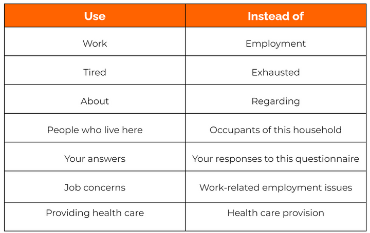

#### 2. No double-barreled questions
Do not ask double-barreled questions. In other words, don’t ask questions that touch on more than one issue, but only give one opportunity for response. Follow-up questions are the simplest way to get more detailed information about a topic or feature while keeping the confusion to a minimum (remember, in OSM, features can have many tags).
  - If follow-up questions are required for the same map feature, many data collection apps have a feature called skip-logic. Skip-logic creates a custom path through a set of survey questions that varies based on a respondent's previous answers.


#### 3. Do not use institutional or academic jargon
Do not assume the participants (or data collectors) are familiar with your industry jargon. Just because a term is frequently used in academic literature, it may hold little or no meaning for the general population. Remember that your survey teams may be drawn from the local population. It is a good idea to “test” your survey and any introductory material with a select group of potential surveyors, or locals, to check for any language issues. 

  - For instance, let’s look at the following introduction: "We’re here today to conduct a survey to support a RAP to investigate DRM issues in the community...
    - RAP: Rapid Assessment Program
    - DRM: Disaster Risk Management .....*not exactly obvious, is it?*

#### 4. All terms should be clearly defined (and illustrated if possible)
If it is important to use specific terms as part of the survey, make sure your training involves a proper definition and description of the term and its usage. This should also be reiterated in either field notes, or as a note that appears with the question. In cases where your survey will involve the categorization of a geographic feature in the field, it is a good idea to include example photos of the different options as part of the training materials (and perhaps also as part of the field packet that surveyors will take to the field). Reinforcement is the best way to communicate a new or important concept. 


#### 5. No leading questions
Leading questions are questions that subtly prompt the respondent to answer in a particular way. This can also mean questions that are overly assumptive in their wording, such as, “what level of education do you have?” or, “what job do you have?” You don't know if the respondent has a job, or if they were exposed to formal education. This is more of an issue when speaking directly to respondents, rather than in a situation where a surveyor is making a direct observation about a piece of infrastructure. 

#### 6. Do not use biased or emotionally charged terms in your questions
It is very important to double-check the phrasing and any subsequent translation of your survey to make sure that the intended message is being conveyed simply, clearly, and without bias. It is also good to check your terms and wording choice with a community representative before going into the field. What may appear to be an innocuous choice of wording on your part could cause offense or misinterpretation on behalf of the surveyor or respondent. 

#### 7. Avoid the use of negative words
Using negative words in questions confuses people. For example: “Did you not?” or “Do you not?” It’s also leading and assumptive of the answer. Ask something in a clear fashion that allows for an unbiased yes/no answer.


#### 8. Lost in translation
In certain cases, you may need to translate your survey/questionnaire into one or more alternate languages. This may be required if you recruit local participants in the data collection, or if your survey is being used in more than one location. It is very important that the survey instrument is easy to use for both the surveyor and the participant. You do not want the surveyor to have to translate on-the-fly (especially in instances where the surveyor might need to communicate directly with survey participants). This can lead to confusion and miscommunication. It is important to have someone fluent in both the language of design and the language of delivery to cross-check all questions and replies. Ideally, you should run a simple pilot to make sure that both surveyors and potential participants understand the instructions, questions, and replies. 

### Question Response Style 
Most survey instruments will be composed of a series of questions or prompts. There are two main styles of response to survey questions.


- **Closed response questions** provide a list of acceptable responses. Checklists, multiple-choice questions, true/false questions, and sliding scales are all types of closed responses. Respondents or surveyors may find it easier to answer the question when response alternatives are provided, and it is easier and less time-consuming to interpret and analyze these types of responses. While answers generated using this style of question can be useful to generate statistics, and are easier to interpret and analyze, they lack detail, richness, and personal viewpoints. **Closed response questions are critical for adhering to Data Models for GIS database construction.** Using multiple-choice options keeps tagging consistent, and one can always use the “other” option to allow for flexibility. If you put time and effort into the development of your data model, survey construction for the purpose of collecting feature tags should be a much easier lift.

- **Open-ended response questions** allow respondents to answer in their own words. There are several advantages to this. Respondents may apply increased amounts of reflection to their answers and critical unanticipated perspectives may emerge. Sometimes, answers to open questions may be difficult to interpret and answers may be spread over many categories, making them hard to analyze. For the purposes of feature identification, open-ended questions make proper categorization almost impossible, and the inclusion of an “other” option at the end of a closed range of choice is a good middle ground. We rarely use open-ended responses when collecting geospatial data attributes, as consistency is key. Open-ended questions are more suited to a focus group discussion setting, where you can also feature a participatory mapping component. Participants can talk about the features that have been mapped (or will be mapped) and provide insight on changes over time, or the factors that contribute to these changes. Focus groups can provide an additional layer of contextual detail to a traditional field mapping exercise, and can potentially help refine the approach and data model if held before the actual survey itself. 

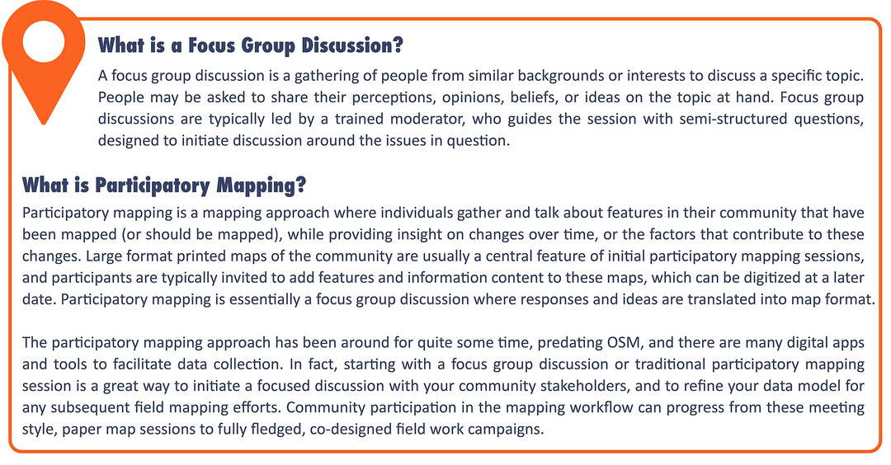

### Training Your Data Collectors
A clear set of instructions and adequate training are always REQUIRED in advance of any field data collection effort. Even if your support team has worked closely with you throughout the preparation process, training allows for consistency of approach and an opportunity for any last-minute questions. Training is particularly important if your surveyors are filling out the questionnaire alone, and will not have the opportunity to check-in “on the fly” (though this can be facilitated through a group chat function, using something like WhatsApp). 

It is also important to pilot or test the product and **cross-check your survey with a member of the local community.** Remember that there are potentially two levels of interpretation here: your surveyor and the person being surveyed (if that is relevant to the data being collected). This creates at least one if not two chances for misinterpretation.

```{tip} 
YouthMappers Blogspot: SETCO YouthMappers train for Women's Connect Challenge Tanzania

[SETCO YouthMappers train for Women's Connect Challenge Tanzania](https://www.youthmappers.org/post/2019/03/05/setco-youthmappers-train-for-womens-connect-challenge-tanzaniat) By Geoffrey Kateregga, Humanitarian OpenStreetMapTeam

Through the Women Connect Challenge project in Serengeti, Tanzania, HOT conducted a one-day OpenStreetMap introductory training at Serengeti Tourism College, located in Mugumu, Mara Region Tanzania. The tourism school is the only institution of higher learning in Mugumu town, the administrative seat of the Serengeti District. The purpose of the training was to develop the capacity of the students in the use of OpenStreetMap and also initiate the creation of a YouthMappers chapter whose members could also contribute to the Women Connect Challenge project through Crowd2map Tanzania.

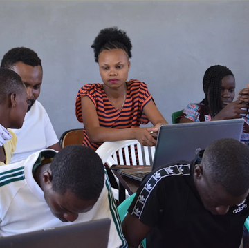

```

## Let's Look at Survey Tools 
### Overview 
Survey instruments can be deployed using a variety of analog and digital tools, allowing mappers to collect geospatial data in the field. There are a variety of tools to use for field mapping, ranging from paper-based options (paper maps and paper questionnaires, often backed up with simple GPS) to GPS-enabled smartphones and tablets. Mobile data collection applications such OpenDataKit, OpenMapKit, and KoBoCollect improve upon traditional GPS and paper-based methods. In many cases, these tools allow us to collect both geographic and attribute data simultaneously. 

Most of the application (app) based tools featured in this course capture the geospatial aspect of the data through either:

1. Locally recording the GPS coordinates of the feature in question, and allowing the user to add attribution at the time of recording, or, 
2. By allowing the user to add detailed attribution to existing features (e.g., buildings, roads, waterways, features of interest) on a digital map by interacting with that map on a hand-held device while in the field. 

### Popular Data Collection Tools 
#### Open Data Kit

[Open Data Kit (ODK)](https://opendatakit.org/) is a free and open-source set of tools that help organizations author, field, and manage mobile data collection solutions. 

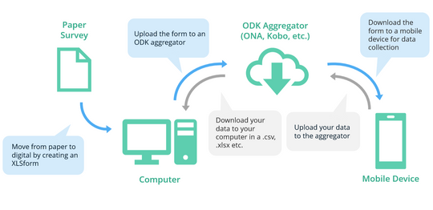

ODK Collect is an Android app that replaces paper forms used in survey-based data gathering. It supports a wide range of question and answer types, and is designed to work well without network connectivity. Forms can be created using spreadsheet software (such as Excel, Google Forms, or LibreCalc) or using the [ODK Form Builder](https://forum.getodk.org/t/build-permanently-shut-down-on-feb-1st-2024/43570). If you are new to using mobile data collection apps, it’s recommended that you make full use of the form builders developed to work directly with the tool in question.

#### OpenMapKit

[OpenMapKit (OMK)](https://hotosm.github.io/pdc-documentation/pdfs/en/03_menggunakan_aplikasi_omk.pdf) is an extension of ODK Collect that launches directly from within ODK Collect when an OSM question type is enabled in a standard survey. It is what allows you to browse OSM features and create and edit OSM tags.  

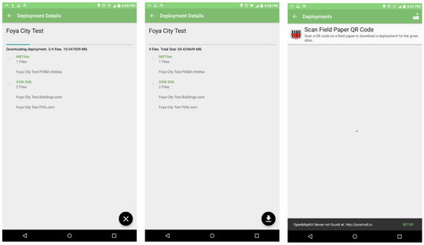

The main difference between ODK and OMK is that OpenMapKit allows users to tag polygons, such as buildings, that already exist in OSM instead of only being able to add data to GPS points. Forms for OMK are slightly altered from ODK forms to incorporate the OSM tagging scheme and need to be built using spreadsheet software (such as Excel or LibreCalc). This is a much more advanced setup and deployment than standard ODK. You will need to generate extremely high-quality data during your remote mapping stage and be comfortable with simple server setup and management (web-based is fine) to facilitate data transfer with your surveyor's mobile devices.

#### KoBoCollect and the Kobo Toolbox
[KoBoCollect and the Kobo Toolbox](https://www.kobotoolbox.org/) suite were developed by the Harvard Humanitarian Initiative through funding from USAID, the International Red Cross, and UNOCHA. The Kobo suite is incredibly similar to the ODK toolset and is in fact built on top of the ODK platform.

KoBo is seen as a more streamlined and complete solution to the entire survey workflow, covering design, deployment, data management, and analysis. Kobo includes a form builder, an app, a web server, and a dashboard for analyzing and managing data to create maps and reports. If you are new to field data collection, KoBo Toolbox is a complete package in terms of survey administration, and an excellent place to start. It is free to use (without limitations) for registered humanitarian organizations, and free (with some restrictions) for everyone else.

#### QField and QGIS 
[QField] (https://qfield.org/) is the mobile accompaniment to [QGIS](https://www.qgis.org/), which allows you to take your QGIS projects from the desktop environment to the field. It is GPS-centric, and QGIS desktop compatible. Project preparation can begin on the desktop version. It is fully operational offline, but with synchronization capabilities. Users can add new points to an existing database, or edit the attribution of existing features (points, lines, or polygons). QField is an open source project and the source code is available on GitHub.

#### Maps.Me

[Maps.Me](https://maps.me/) is a mobile application that allows users to use and navigate OpenStreetMap offline. In addition to navigation, users can use Maps.Me to collect data and upload it to OSM when connection allows. Maps.Me limits OSM additions to point data and has a limited selection of tags that can be entered. It is a quick and lightweight alternative to some of the other applications mentioned above.

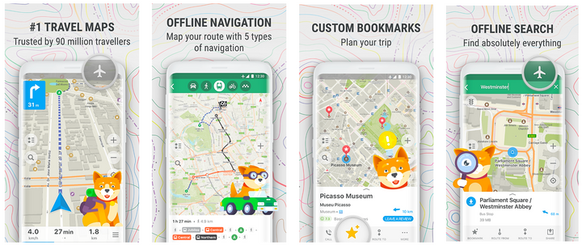

#### Field Papers
[Field Papers](https://fieldpapers.org/) is the only analog contender in the mix here. Developed by Stamen Design, Field Papers is a web-based tool that allows you to create a printable map atlas using OpenStreetMap as your base map. It is an easy, low-tech way to support data collection in the field, without the need for handheld devices and potentially complicated server setup.

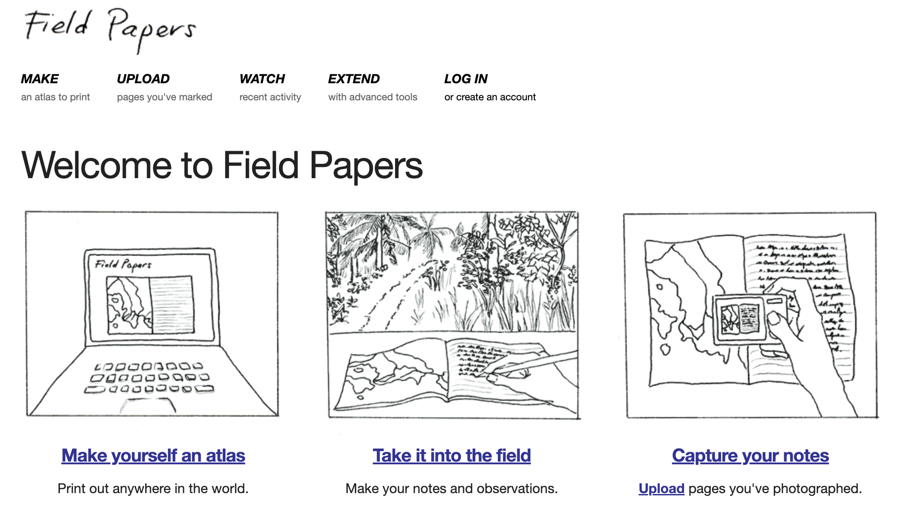

The Field Papers workflow is quite simple:

1. Start by delineating your study area on the map at fieldpapers.org, where you decide on the scale and number of pages for your atlas.

2. Print the map.

3. Go out in the field and sketch what you see, directly on the maps themselves.

4. Come back, and either: 
  a. Take a photo/make a scan of your map and upload it to your machine to use as a georeferences base map for editing in OpenStreetMap (this works in both iD and JOSM editors).
  b. Examine your sheet of paper and use it as an aid while you edit directly into OSM.

```{tip} 
Training Video: A Step-by-Step Guide to Using FieldPapers

[Mapping in 3D: A Step-by-Step Guide to Using FieldPapers for 3D Mapping in OSM](https://www.youtube.com/watch?v=s5aSkqZD5-4&t=2s)

In this tutorial, we’ll walk you through how to use Field Papers to collect 3D building data in the field and contribute it to OpenStreetMap. Whether you’re a beginner or experienced mapper, this tool makes offline data collection easy and effective. We’ll cover everything from creating printable map atlases to uploading your annotated field notes and using them to edit OSM. Thank you to Cesium for making this video possible.

```


  **The tools featured above are by no means exhaustive. They are however some of the most popular tools used by the extended OSM community in the field.**

```{tip} 
YouthMappers Blogspot: Mapping of Food Outlets on University of Ghana Campus

[Mapping of Food Outlets on University of Ghana Campus, Phase One and Two: A Field Paper and Open Data](https://www.youthmappers.org/post/2019/03/05/setco-youthmappers-train-for-womens-connect-challenge-tanzaniat) By Michael Batame, University of Ghana

Read about the YouthMappers of the University of Ghana and their use of ODK and OpenMapKit to map food outlets on the university campus.

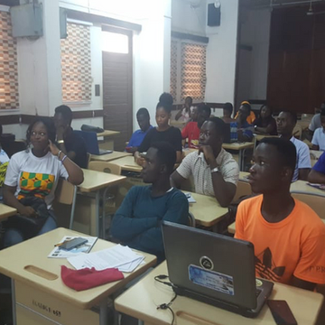

```

## Data Collection Workflow 
### Overview
The data collection process starts by translating data models into forms that can be read by data collection software such as OpenDataKit or KoboCollect. For each software type, this process can look different⏤either building xlsforms in spreadsheet software or using online builders (which is probably the recommended path for new users). Once completed, these forms are uploaded onto mobile data collection devices.


In the field, mappers open the applications and when they reach the object they wish to map, they initiate a fresh survey (usually by collecting a GPS point), and progress through the series of survey questions to collect the attribute/tag data. Both geospatial and attribute data are saved directly to the device (unless you have good connectivity and an option to push data directly to your server). After data collection, teams review data in JOSM before uploading it to OSM. Kobo provides an additional environment where teams can aggregate and analyze the raw data on the Kobo Toolbox. 


Your choice of workflow and the tools associated with it must meet your resources. If a heavily digital workflow exceeds your hardware budget or the technical capacity of your volunteers, then you need to plan accordingly. Mapping workflows can be exclusively paper-based (e.g., Field Papers and paper questionnaires), a combination of paper and digital (e.g., Field Papers and a data collection app or GPS), or an exclusively digital workflow (e.g., OpenDataKit/OpenMapKit). There are pros and cons to each combination ranging from cost to ease of setup and training to error reduction and quality control. 

### Data Collection Workflow Activity
In the following activity, you will learn the pros and cons of the following data collection workflows:

- Paper Workflow
- Paper/Digital Hybrid Workflow
- Digital Workflow

**Instructions:** Read the description beneath the title of each data collection workflow, then read through the green boxes and assign them them to the relevant column (either 'Pros' or 'Cons'). Note that you might not need to use all of the green boxes provided. Once you have sorted the green boxes, look below to see the answers. 

1. **Activity : Paper Workflow**

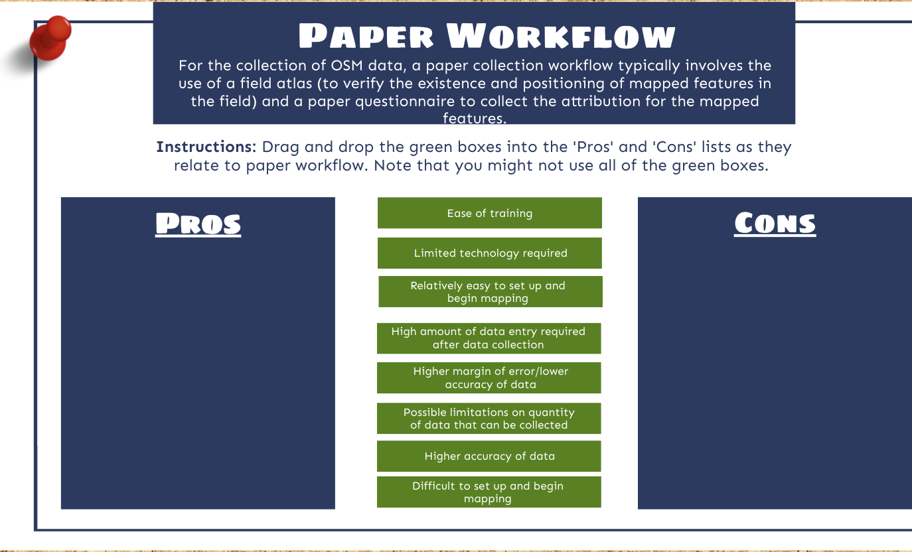

**Solution: Paper Workflow**

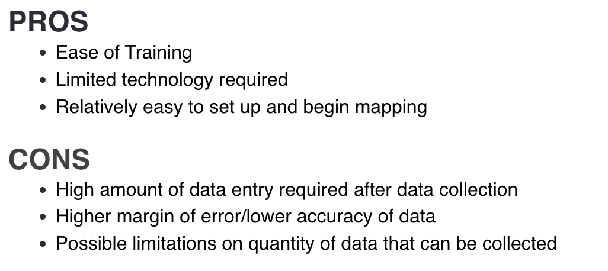


2. **Activity: Paper/Digital Hybrid Worflow**
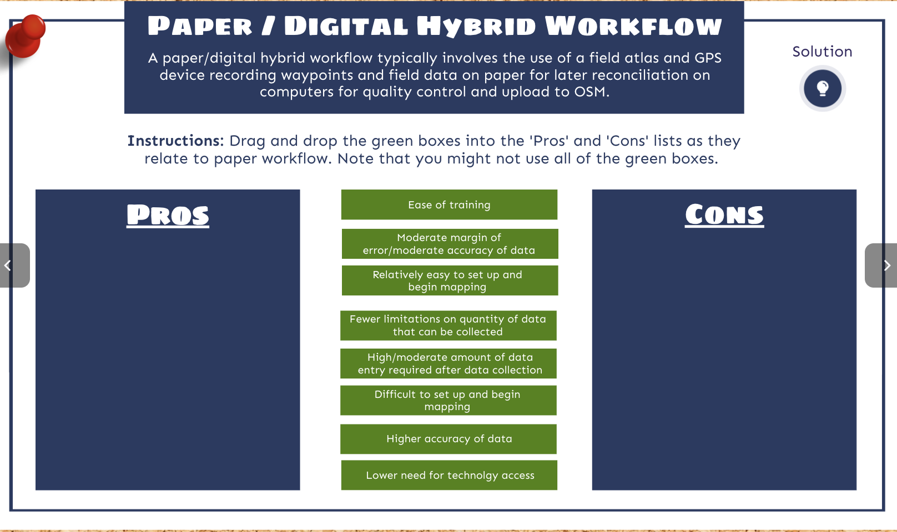

**Solution: Paper Workflow**
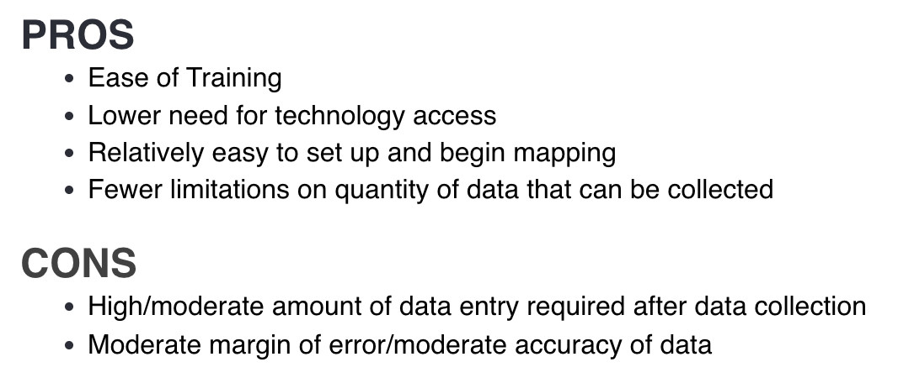

3. **Activity: Digital Workflow**
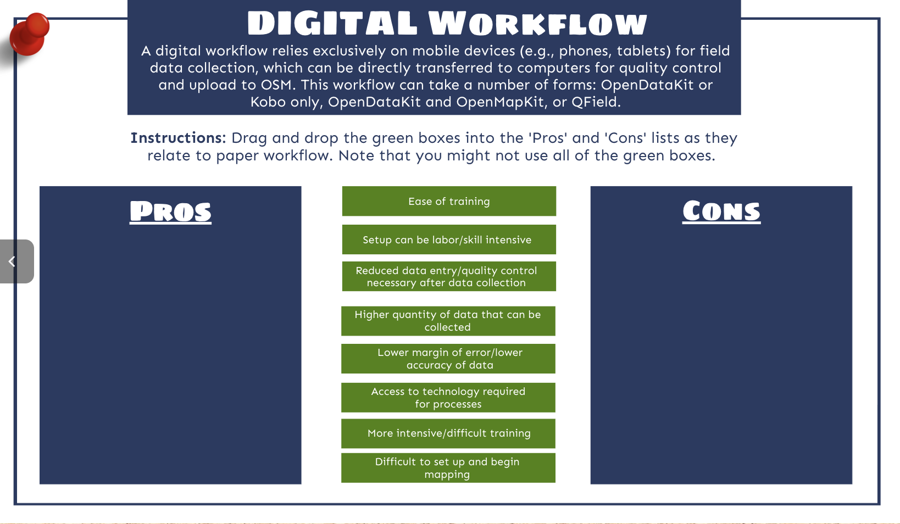

**Solution: Digital Workflow**
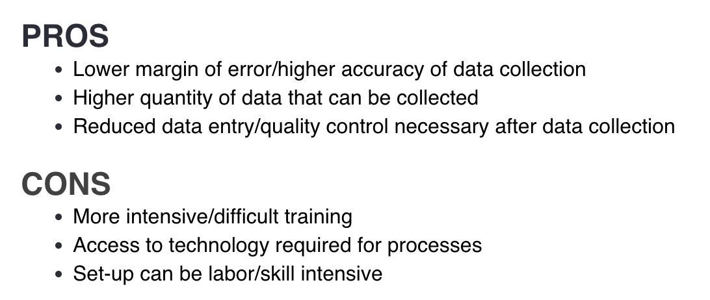

### Additional Field Logistics
Designing your survey and deciding which tools and workflow to follow are critical aspects of field work preparation. In addition to these tasks, there are several other practical considerations:

- **Survey allocation:** You should divide your study area into survey areas that can be covered by a team of two in a half day. Test the size of these areas as part of pilot preparation, as sometimes it can take more time to cover an area than anticipated. 

- **Training:** You will need to provide field training on mobile devices and map reading for the survey team. This includes training on the details of the data model (for feature recognition and classification). This will require the development of training materials and supporting documentation to explain and potentially illustrate different features in the field.

- **Conduct a test pilot:** Conduct small pilot data collection over the course of one to two days. Use team feedback to refine the instrument and, potentially, the field procedure (including the size of the assigned area). 

- **Health and safety:** Depending on the climate in your city, it is probably advisable to restrict field mapping to a half-day activity, during a cooler/warmer period of the day (but during daylight hours). The remainder of the day can be used for data consolidation purposes. Ideally, you should assess the security of the proposed study area. Conferring with local contacts or someone in a position of the local authority is usually the best way to determine any potential issues. You should develop a security protocol outlining potential risks and agreed-upon steps to address and/or react safely. Mappers should work in teams of at least two people. Each mapper should have a working mobile device with sufficient mobile credit to allow them to make contact with the team lead, should trouble arise.

## Field Etiquette 
### Overview 
When working in the field, be polite and engage with residents and other people you may encounter. It's important to consider how you would feel if a stranger approached your home or neighborhood to collect information.

## Want to Dig a Little Deeper?
Refer to the information below to learn more about field survey development.


- Once again, the [HOT Toolbox](https://toolbox.hotosm.org/pages/introduction/how_to_use_toolbox/) is a wonderfully comprehensive guide to take a project manager through the entire mapping workflow, from project design to the more technical aspects of technology options for field deployment. There is an entire section dedicated to [Data Collection Applications](https://toolbox.hotosm.org/pages/2_field_mapping_prep/2_2_data_collection_applications/).  

- Development Statistics for Sustainable Development (Stats4SD) has produced a series of short videos outlining the ODK workflow, from outlining the overall process to form authoring to skip logic. See the collection here [Stats4SD ODK Playlist](https://www.youtube.com/channel/UCs7EU95YMjhvNozJKCD92xQ/search?query=ODK).

Watch the following HOT Community Webinar Recording: [Mobile Data Collection Best Practices and Tools](http://youtube.com/watch?v=36PXZPyUoLc).

## Conclusion 
### YouthMappers Academy: Skills, Proficiencies, and Standards

Each badge awarded as part of the YouthMappers Academy has been aligned to the skills and proficiencies outlined in the U.S. Department of Labor’s [Geospatial Technology Competency Model (GTCM)](https://www.careeronestop.org/competencymodel/competency-models/geospatial-technology.aspx), as well as [National Geographic’s National Geography Standards](https://education.nationalgeographic.org/resource/national-geography-standards-index/).

The **Geospatial Technology Competency Model** identifies the foundational, industry-wide, and industry sector–specific expertise that distinguishes, and binds together, successful geospatial professionals. It identifies core personal, academic, and workplace competencies, as well as sector specific geospatial knowledge and abilities, including specialized competencies related to data acquisition, data analysis and modeling, imagery interpretation, and software and application development. 

The **National Geography Standards** are benchmarks of geographic literacy to determine a comprehensive understanding of the interaction of space and place, and the skills to analyze and critique these dynamics. These standards are measured through knowledge and mastery of three things: (1) factual knowledge; (2) mental maps and tools; (3) and ways of thinking.


The following competencies derived from both the Geospatial Technology Competency Model and the National Geography Standards are central to the successful completion of YouthMappers Academy Course 12: Survey Instruments and Tools. 

**<u>The Geospatial Technology Competency Model</u>**

1. Interpersonal Skills: Demonstrating the ability to work effectively with others, through interaction with peers and course moderators

2. Professionalism: 
  - Demonstrating commitment to the values, standards of conduct, and well-being of one's profession 
  - Know codes of ethics and rules of conduct; legal, ethical, and business aspects of data sharing

3. Initiative: Demonstrating gumption at work/school

4. Dependability and Reliability: Displaying responsible behaviors at work/school

5. Lifelong Learning: Displaying a willingness to learn and apply new knowledge and skills

6. Reading: Understanding written sentences and paragraphs in work-related documents  

7. Geography: Understanding the science of place and space; geographic skills

8. Teamwork: Working cooperatively with others to complete projects

9. Communication [Listening and Speaking]: Giving full attention to what others are saying and speaking in English well enough to be understood by others

10. Critical and Analytical Thinking: Using logic, reasoning, and analysis to address problems

11. Creative Thinking: Recognizing, exploring, and using a broad range of ideas and practices

12. Planning and Organizing: Planning and prioritizing work to manage time effectively and accomplish assigned tasks

13. Problem Solving and Decision Making: Applying critical-thinking skills to solve problems by generating, evaluating, and implementing solutions

14. Working with Tools and Technology: Selecting, using, and maintaining tools and technology to facilitate work activity

15. Checking, Examining, and Recording: Entering, transcribing, recording, storing, or maintaining information in written or electronic/magnetic format

16. Software and Application Development: Evaluate open source software

17. Core Geospatial Competencies: 
  - Compare spatial data models, such as vector, raster, and object
  - Data analysis involving spatial relationships, such as distance, direction, and topology
  - Perform GIS analysis, including measurement, query and retrieval, vector overlay, map algebra
  - GIS hardware and software capabilities, including real time GPS/GIS mapping systems
  - Recognize opportunities to create mobile end-user applications

  **<u>The National Geography Standards</u>**

1. The World in Spatial Terms: 
  - How to use maps and other geographic representations, geospatial technologies, and spatial thinking to understand and communicate information
  - How to analyze the spatial organization of people, places, and environments on Earth's surface

2. Places and Regions: 
  - The physical and human characteristics of places
  - How culture and experience influence people's perceptions of places and regions

3. Environment and Society: 
  - How human actions modify the physical environment
  - How physical systems affect human systems

4. The Uses of Geography: 
  - How to apply geography to interpret the past
  - How to apply geography to interpret the present and plan for the future

### Congratulations!
Congratulations on completing Course 12: Field Survey Development of the YouthMappers Academy series! 

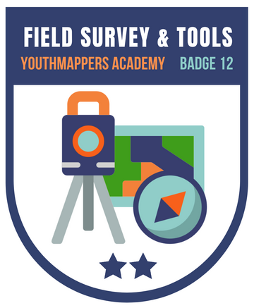