# Introduction to 3D Data

## Overview

Welcome to Module 13 of the YouthMappers Academy. This module explores three-dimensional (3D) geospatial data, covering data formats, standards, and a wide range of applications in development.

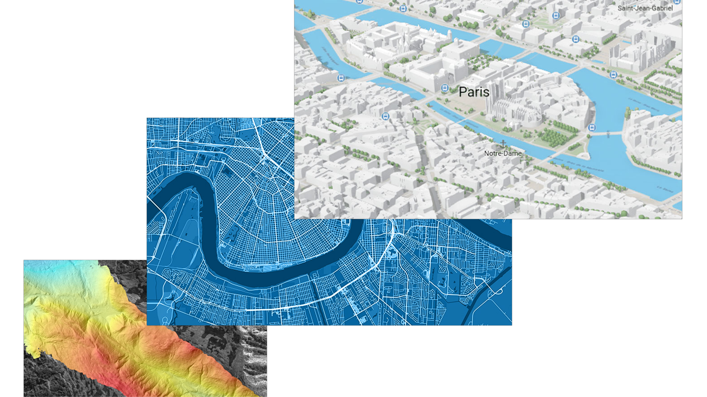 
 Image source: Esri UK. (n.d.). 3D GIS overview [Image]. Esri UK. Retrieved February 5, 2025, from https://www.esriuk.com/en-gb/arcgis/3d-gis/overview


You will learn how 3D data is collected through technologies like LiDAR, photogrammetry, and ground surveying, and how it can be integrated into OpenStreetMap (OSM) for mapping urban and natural environments. We will also discuss best practices for visualizing 3D data using tools such as Cesium, QGIS, and ArcGIS.

3D geospatial data enhances decision-making, planning, and communication among development stakeholders, with critical applications in urban planning, disaster response, infrastructure management, and sustainability efforts aligned with the UN Sustainable Development Goals (SDGs).

 

Image source: Cesium. (2020, June 1). Cesium OSM Buildings [Image]. Cesium. Retrieved February 5, 2025, from https://cesium.com/blog/2020/06/01/cesium-osm-buildings/

### What you will learn

- You will learn about three dimensional data formats, models and standards.
- You will explore the primary methods of collecting 3D geospatial data, including LiDAR, photogrammetry, InSAR, and ground surveying.
- You will compare and evaluate different three-dimensional data sources and tools
- You will explore key applications of 3D geospatial data, including urban planning, disaster response, environmental sustainability, and humanitarian mapping.
- You will learn about best practices and tools for three dimensional data visualization.
- You will develop hands-on skills in collecting and integrating simple 3D data in the field using mobile tools like FieldPapers and Vespucci.
- You will learn how three dimensional data can be incorporated into the OSM data model and the best tools and workflows to facilitate this.

## Introduction to 3D Data

### What is 3D data?

In Geographic Information Systems (GIS), 3D data refers to spatial data that includes a third dimension—the Z-coordinate—which represents height, depth, or elevation. Unlike traditional 2D GIS, which maps features on a flat plane, 3D GIS enables more detailed, realistic, and interactive visualizations of geographic space.

### **Why is 3D Data Important?**

3D GIS is widely used across various industries, including:

- Urban Planning – Visualizing city skylines, zoning impacts, and infrastructure projects.
- Disaster Response – Modeling floods, landslides, and evacuation routes.
- Architecture & Construction – Creating accurate 3D models of buildings and infrastructure.
- Environmental Studies – Analyzing terrain, climate change, and natural resource distribution.

### **How is 3D GIS Data Represented?**

3D GIS data is classified based on how it stores and represents the third dimension. The two primary formats are:

- **Vector-based representation**s – Use points, lines, and polygons to define 3D objects.
- **Raster-based representations** – Use grid cells to model elevation (e.g., Digital Elevation Models).

### **Vector-Based 3D Data**

Vector data represents specific locations and objects in 3D space. It includes:

- **Points (Discrete Locations)**

Points represent discrete locations in 3D space, defined by X (longitude), Y (latitude), and Z (height or elevation) coordinates. For example, points can indicate the location of a tree, a communication mast, or a sensor. In addition to spatial coordinates, they may include attributes such as the species of a tree, the model type of a sensor, or the ID number of a radio mast or antenna.

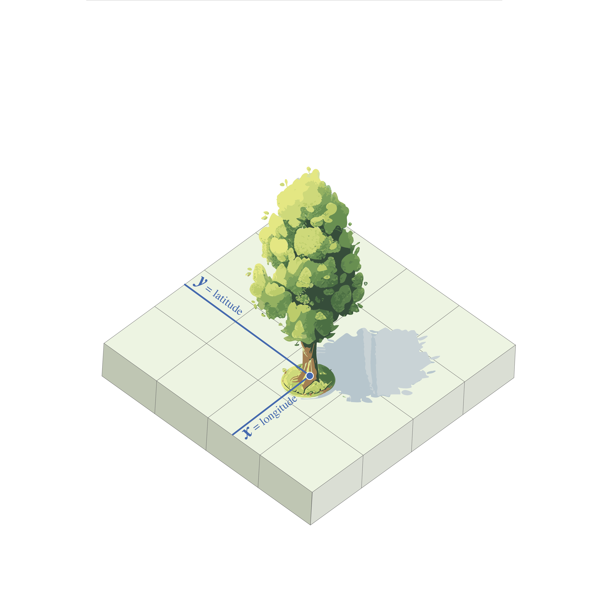 
***2D Image:** A 2D point represents a location on a flat surface, defined by its X and Y coordinates. It does not have depth, height, or any physical dimensions—only its position on the 2D plane is described. In this example, the location of the tree is specified in terms of where it stands on the ground, but no information is given about the tree’s height or other attributes.*

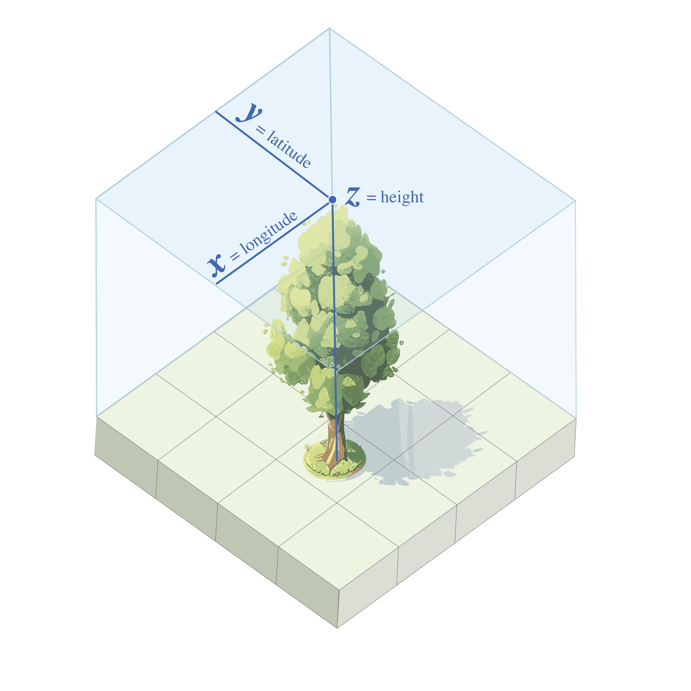 
***3D Image:** A 3D point represents a location in three-dimensional space, defined by its X, Y, and Z coordinates. In this example, the tree's exact location on the ground is combined with the added dimension of height, allowing us to understand both where the tree is and how tall it is, introducing depth to the spatial representation.*

- **Polylines (Linear Features)**

 Polylines represent continuous objects such as roads, rivers, or utility lines in 3D space. Unlike simple 2D lines, each vertex in a polyline can have a unique Z-value, allowing it to capture elevation changes along its path.

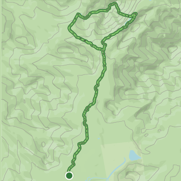 
***2D Caption:** A 2D polyline represents a hiking trail viewed from above, where only the X and Y coordinates (longitude and latitude) are displayed. The line shows the trail’s path on the horizontal plane but does not convey any information about elevation changes encountered during the hike.*

 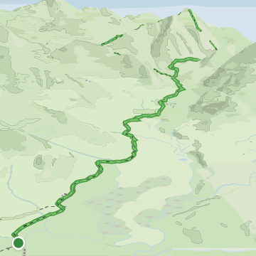 
 ***3D caption:** A 3D polyline displays the hiking trail with elevation data included, represented by the Z-coordinate. In this visualization, the trail not only shows its path on the horizontal plane (X and Y coordinates) but also illustrates how elevation changes throughout the hike. Each vertex of the polyline can hold a different elevation, providing a more accurate representation of the trail’s vertical profile as it ascends and descends over the terrain.*

- **Polygons (Surfaces)**

 Polygons represent bounded areas, such as building footprints or land parcels, with added height attributes to extend them into 3D space.

Polygons with height data are often referred to as "Extruded 2D Data" or "2.5D Data" because they are essentially 2D polygons with an associated height value, rather than fully detailed 3D models. This type of representation is commonly used for simple 3D features, such as buildings in a city model.

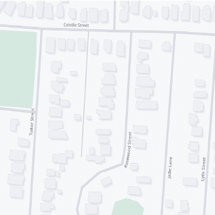 
***2D Caption:** A 2D building footprint represents the outline of a building on a flat surface, using only X and Y coordinates. These footprints show building locations and shapes but do not provide any information about their height or vertical dimensions.*

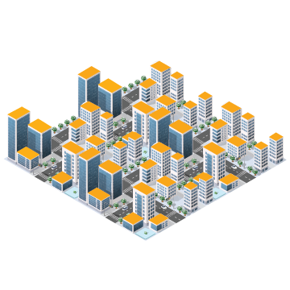 
***3D Caption:** A 3D extruded building extends the footprints vertically by incorporating a Z-coordinate to represent building height. This provides a more realistic view, showing not only the location of the buildings but also their height and volume, offering a better sense of scale and structure in the urban landscape.*

### **Sub 13.1.4: Raster-Based 3D Data**

Using a raster grid to represent elevation is commonly referred to as a Digital Elevation Model (DEM). A DEM consists of a grid of cells, where each cell stores the elevation value at that specific location on the Earth's surface.

While DEMs are often classified as 2.5D—since they do not fully capture complex structures like overhangs—they serve as a foundation for 3D GIS applications.

DEMs are categorized into two main types:

- **Digital Terrain Models (DTMs)**: Represent the bare Earth’s surface, excluding buildings, trees, or other structures. They are used for topographic analysis and hydrological modeling.

- **Digital Surface Models (DSMs):** Capture both natural and man-made features, including buildings, vegetation, and infrastructure, providing a more detailed representation of the Earth’s surface.

By subtracting a DTM from a DSM, we can determine building heights, tree canopy cover, and other structural details—a crucial process for exposure mapping and urban analysis. Additionally, other topographical products can be derived from DTMs, such as slope and aspect, which help analyze terrain characteristics.

### **Advanced 3D Models**

Some applications require more detailed or flexible 3D representations to accurately capture complex surfaces and terrain features.

**1. Triangulated Irregular Networks (TINs):**

A TIN represents surfaces using non-uniformly spaced points connected by triangles. Each triangle vertex is assigned an elevation value, and together, these triangles form a continuous surface that represents terrain variations.

TINs are particularly useful for modeling terrain with varying resolutions, as they allow greater detail in areas with complex elevation changes while using fewer data points in flatter areas. This makes them an effective tool for topographic analysis, hydrological modeling, and 3D surface visualization.

 

*Attribution: By AlpSInnsbruck - Own work, CC BY-SA 4.0, https://commons.wikimedia.org/w/index.php?curid=35634426*

***Image caption:** Triangulated Irregular Network (TIN) visualizing terrain elevation with interconnected triangular facets for geographic modeling.*


**2. 3D Mesh Models**

3D mesh models consist of vertices, edges, and faces that together define the shape and structure of a 3D object. These models are widely used for visualizing buildings, terrain, and other complex structures with a high level of detail.

Mesh models can be highly detailed, making them useful for applications such as urban planning, simulations, and geospatial visualization. They are commonly used in 3D mapping software, game engines, and virtual reality environments to create realistic and interactive representations of geographic spaces.

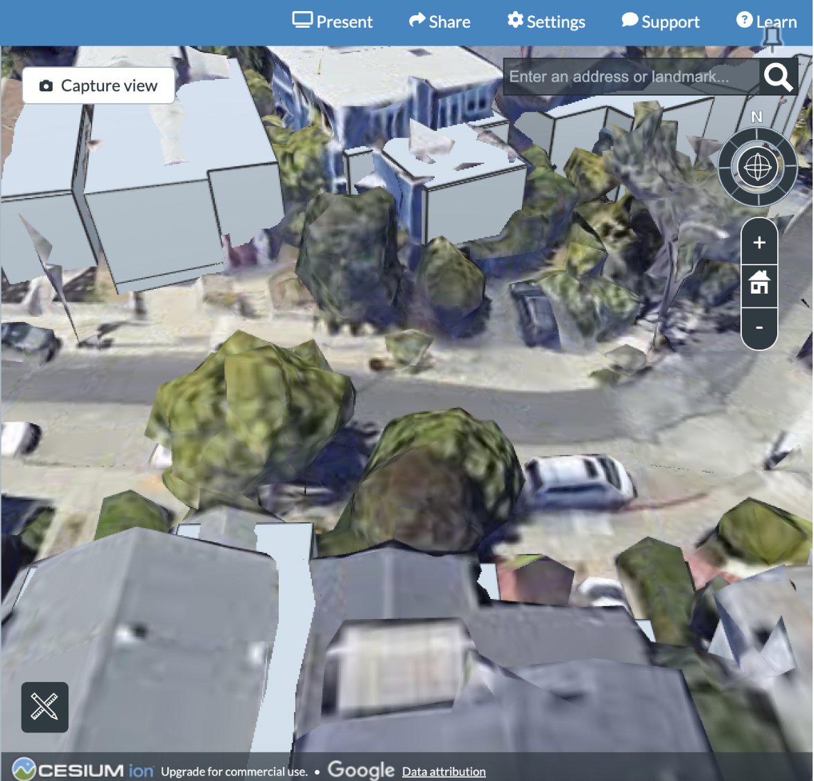 

***Image caption:** Screenshot of the Cesium Ion Story interface displaying a 3D mesh model layer of a city section, showcasing detailed urban terrain visualization and geospatial analysis.*

**3. 3D Point Clouds:**

3D point clouds are collections of data points (XYZ coordinates) in three-dimensional space, typically generated by LiDAR or photogrammetry. These data points represent the shape and structure of objects or surfaces, making point clouds an essential tool for creating detailed 3D models of the Earth's surface, buildings, vegetation, and other physical features.

Point clouds are widely used in geospatial analysis, construction, and environmental modeling, as they provide highly accurate representations of real-world structures and landscapes.

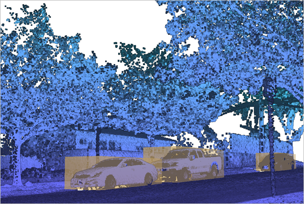
***Image caption:** 3D point cloud depicting the terrain and landscape*. 

```{tip}
[What is a Point Cloud?](https://www.youtube.com/watch?v=2crAfWZOgf0)...
```

### 3D Data Standards

3D geospatial data standards are essential for ensuring interoperability, accuracy, and consistency across different platforms and applications. Organizations like the
[Open Geospatial Consortium (OGC)](https://www.ogc.org/) and [ISO](https://www.iso.org/standards.html) have developed standards to facilitate the exchange and integration of 3D spatial data across industries.

Notable standards include:

- **CityGML –** An XML-based data model designed for representing 3D urban environments.
- **IndoorGML –** Focuses on the modeling of indoor spaces for navigation and spatial analysis.
- **3D Tiles –** A specification developed for efficient streaming and visualization of massive 3D geospatial datasets on the web.
- **KML and COLLADA –** Common formats that support 3D representations in platforms like Google Earth and CAD systems.

These standards are crucial for data sharing, reducing redundancy, and ensuring accuracy in 3D geospatial datasets. They play a key role in applications such as urban planning, environmental monitoring, navigation, and virtual reality experiences.

**3D Tiles:**
 3D Tiles is an open-source format designed to enable the efficient streaming and visualization of large-scale 3D geospatial datasets. This format optimizes rendering performance by breaking down complex 3D models into smaller, manageable chunks, allowing massive datasets to be displayed seamlessly in web-based and mobile applications.

Originally developed by Cesium in 2015 to facilitate streaming heterogeneous 3D geospatial datasets, 3D Tiles was later adopted as a community standard by the [Open Geospatial Consortium (OGC)](https://www.ogc.org/) in 2019.

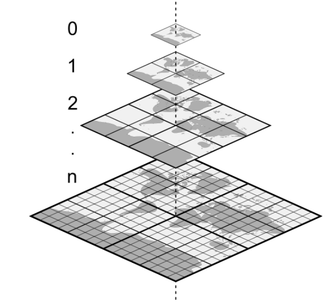

```{admonition} In Focus: Combining 3D Tiles and OSM

Developed by [Cesium](https://cesium.com/), 3D Tiles is an open standard designed for streaming large-scale 3D geospatial data efficiently. It allows complex 3D datasets—such as buildings, terrain, point clouds, and vector data—to be rendered smoothly in web applications.

The hierarchical structure of 3D Tiles enables progressive loading, meaning data is displayed based on the user's view. This system, known as Level of Detail (LOD), ensures optimal performance when visualizing massive datasets.

[OpenStreetMap (OSM)](https://www.openstreetmap.org/) is a collaborative mapping project that provides free, editable geographic data. It includes geospatial information such as road networks, buildings, land use, and points of interest. Because OSM data is open-source, developers can access, modify, and integrate it freely into various applications.

### Steps for Using OSM Data to Generate 3D Tiles:
- **Extract Building Geometry from OSM**: OSM contains building footprints and, in many cases, height attributes. These can be processed to generate 3D building models that are stored in 3D Tiles formats (e.g., B3DM or I3DM). 
- **Use Height Data**: Many cities in OSM include building heights or floor counts, allowing for the creation of extruded 3D models. 
- **Convert Data with Tools**: Software such as [osm2world](https://osm2world.org/), [FME (by Safe Software)](https://www.safe.com/), and [Cesium ion](https://cesium.com/cesium-ion/) can be used to convert OSM data into 3D Tiles. Cesium ion supports direct uploads of OSM data, generating 3D Tiles automatically.
- **Tile Generation for Scalability**: Large cities or extensive datasets can be tiled into smaller sections, ensuring efficient real-time streaming and rendering in platforms like [CesiumJS](https://cesium.com/platform/cesiumjs/).

### 3D Mapping with CesiumJS
[CesiumJS](https://cesium.com/platform/cesiumjs/) is the primary open-source 3D mapping library that supports 3D Tiles and OSM data integration. It provides an API for advanced visualizations, allowing 2D OSM data to be referenced alongside 3D Tiles models for an interactive mapping experience.

### Benefits of Combining 3D Tiles and OSM:
- **Open Data**: OSM provides free, publicly available geographic data, which can be transformed into high-quality 3D representations using 3D Tiles.
- **High Performance**: 3D Tiles are optimized for efficient streaming, making them ideal for real-time web-based rendering.
- **Interactivity**: The integration of OSM with 3D Tiles allows for a more immersive and dynamic mapping experience, enhancing user engagement and data visualization.

### For Further Learning:
- [What is 3D Tiles?](https://cesium.com/learn/3d-tiles/)
- [Cesium OSM Buildings Overview](https://cesium.com/learn/cesium-osm-buildings/)
- [Cesium Blog: OSM in 3D Tiles](https://cesium.com/blog/)
```

Each type of 3D GIS data serves specific purposes and applications, ranging from basic elevation models to highly detailed representations of the built environment. The choice of data type depends on the requirements of the analysis, the level of detail needed, and the available data sources.

## What are the Applications of 3D Data?

### **Urban Planning and Development**

3D technology allows planners, developers, architects, and policymakers to view and analyze cities in three dimensions, offering insights that traditional 2D maps cannot provide. 3D GIS enhances urban visualization, helping stakeholders understand the spatial relationship between buildings, streets, landscapes, and infrastructure in a more realistic and interactive manner.

- **Enhanced Visualization:** 3D models help communicate plans to the public, making complex planning projects more accessible to non-experts. Displaying building heights and density helps assess skyline changes and the impact of new developments on sightlines.

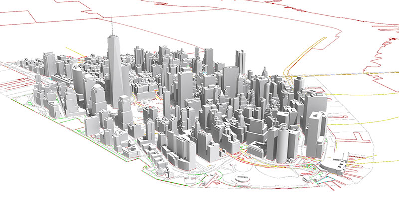
***Citation:** Department of City Planning. (2018). NYC 3D model by community district. NYC.gov. https://www.nyc.gov/site/planning/data-maps/open-data/dwn-nyc-3d-model-download.page*

***Image Caption:** The 3D model includes data of every building in New York City as of 2014, based on an aerial survey conducted by the Department of Information Technology and Telecommunications (DoITT).*

- **Urban Growth and Land Use Planning:**
Planners can model future land use, simulate development impacts, and conduct shadow analysis to assess sunlight blockage and viewshed impacts.

- **Environmental and Sustainability Analysis:**
Planners can assess risk factors and mitigate flooding impacts on city infrastructure by integrating climate and flood data with 3D buildings. 3D models help analyze the effects of green spaces, tree coverage, and green roofs, simulating their contribution to urban cooling and stormwater management. Planners can also use 3D data for solar exposure analysis, optimizing building orientation and roof design to support solar energy installations.  

- **Utilities and Underground Infrastructure:**
3D GIS allows utilities (like water, sewage, electricity) and underground structures to be mapped in 3D, helping avoid conflicts between different infrastructure elements and ensuring maintenance and emergency accessibility.

Read more about how urban planners are leveraging 3D analysis in ArcGIS [here.](https://www.esri.com/en-us/arcgis/products/arcgis-urban/overview)

### Humanitarian and Emergency Management

3D GIS is an essential tool for disaster response, humanitarian aid, and crisis preparedness. It helps emergency responders, aid organizations, and governments make data-driven decisions in critical situations.

- **Disaster Risk Reduction:** 3D models allow for the simulation of natural disasters such as earthquakes, floods, landslides, and wildfire--helping predict high-risk areas and improve evacuation planning. By overlaying data like population density or vulnerable areas, responders can strategically plan evacuation routes and resource allocation.

- **Post-Disaster Damage Assessment:** After disasters, aerial LiDAR and photogrammetry-based 3D models rapid assessments of the extent of damage to buildings and infrastructure, which can aid post-disaster needs analysis and reconstruction efforts.

- **Search and Rescue Operations:** 3D mapping of collapsed buildings and terrain post disaster assists in locating trapped individuals and guiding rescue teams.

- **Refugee Camp and Shelter Planning:** 3D GIS is used to design temporary settlements, ensuring optimal land use, accessibility to resources, and efficient distribution of aid.

### Environmental and Natural Resource Management

3D GIS plays a critical role in monitoring ecosystems, managing resources, and protecting biodiversity.

- **Watershed Management:**
Analyzing drainage patterns and hydrological changes to assess water availability, erosion risks, and flooding potential.  
For example, 3D models can integrate topographic elevation models with hydrology simulations to predict the direction of floodwater during periods of heavy rain.

- **Landslide and Erosion Risk Assessment:**
Identifying unstable terrain and high-risk zones for proactive mitigation measures.

- **Deforestation and Climate Change Monitoring:** Using LiDAR and satellite-based 3D models to assess tree canopy loss, carbon sequestration, and reforestation efforts.

- **Wildlife Conservation:** Mapping habitats in 3D to track species movement, changes in forest density, and encroachments.

### Architecture, Engineering, and Construction

3D GIS supports the entire building lifecycle from design and construction to maintenance. By integrating geographic and architectural data, 3D GIS enables spatially accurate modeling of structures, improving planning, efficiency, and resilience.

- **Building Design and Visualization:** 3D GIS allows architects and engineers to create detailed 3D models of buildings, providing realistic visualizations that enhance design accuracy and collaboration.

- **Structural Integrity and Risk Assessment:** 3D GIS can be used to simulate how buildings and infrastructure respond to environmental hazards such as earthquakes, high winds, and floods, supporting disaster resilience and safer construction planning.

### Navigation and Transportation

3D GIS enhances transportation planning and navigation systems, offering realistic, data-driven models for optimizing road networks, transit systems, and pedestrian pathways.

- **Traffic Analysis:** 3D GIS helps model urban traffic patterns and congestion hotspots, allowing planners to optimize public transit routes, highway interchanges, and traffic flow management. By incorporating sensor data and IoT (Internet of Things) networks—which are interconnected devices such as traffic sensors, cameras, and GPS systems that collect and share real-time data—planners can analyze live traffic updates, improving emergency response times and congestion management.

- **Infrastructure Development:** By integrating elevation and land-use data, 3D GIS assists in designing bridges, tunnels, and rail systems, ensuring efficient alignment with existing landscapes and infrastructure.

### Telecommunications and Network Planning

3D GIS is critical for expanding and optimizing telecommunication networks, ensuring efficient signal coverage, infrastructure placement, and connectivity improvements.

- **Cell Tower Placement:** By analyzing terrain, building heights, and population density, 3D GIS helps optimize cell tower locations, maximizing signal reach and minimizing interference in both urban and rural areas.

- **Signal Propagation Analysis:** 3D GIS allows engineers to simulate and visualize network coverage, improving service reliability in complex environments.

## What Are the Primary Sources of 3D Data?

### 1. LiDAR (Light Detection and Ranging)

LiDAR provides high-resolution elevation data by measuring the distance to the Earth's surface using laser pulses. A LiDAR sensor emits pulses of light, which bounce back after hitting objects or the ground. By calculating the time taken for each pulse to return, LiDAR generates precise distance measurements. When millions of these points are collected, they create a detailed 3D map of the environment, similar to painting with laser dots instead of brush strokes.

```{admonition} 🎥 What Is LiDAR?  
**Video:** [What Is LiDAR and How Does LiDAR Work? – Phoenix LiDAR Systems (2022)](https://www.youtube.com/watch?v=dOvMDbQKpwQ)  

This video explains how LiDAR measures distances and creates accurate 3D maps using laser pulses.

```

### 2. InSAR (Interferometric Synthetic Aperture Radar)

InSAR is a remote sensing technique that uses radar signals to detect ground surface deformations with high precision. By comparing radar images captured at different times, InSAR reveals subtle changes such as land subsidence, tectonic shifts, or volcanic activity, making it invaluable for geophysical monitoring, disaster management, and infrastructure assessment.

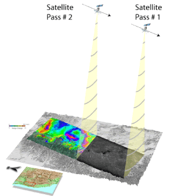
***Image Source:** [U.S. Geological Survey](https://www.usgs.gov/programs/VHP/insar-satellite-based-technique-captures-overall-deformation-picture)*

***Caption:** A satellite collects data during multiple passes over an area, with at least two passes required to generate InSAR images that reveal changes in ground elevation.*


***Image Source:** [NASA Jet Propulsion Laboratory](https://nisar.jpl.nasa.gov/mission/get-to-know-sar/interferometry/)*

***Caption:** InSAR detects surface deformation by comparing the phase difference in radar waves from two satellite passes over the same location. If the ground moves between passes, the phase difference corresponds to the amount of deformation along the line-of-sight direction.*

### 3. Photogrammetry

Photogrammetry is like using a camera to build a 3D puzzle. Photogrammetry uses overlapping images taken from different angles to create a 3D model of the landscape. By analyzing how objects shift between images, computers can measure distances and produce detailed elevation maps—similar to how your mind visualizes a sculpture when viewing photos from all sides.

**Types of Photogrammetry Data Sources:**

- **Aerial:** Photos from planes or helicopters, ideal for regional maps and elevation models.
Satellite: Images from space, suitable for large-scale studies like forests or coastlines, but with less detail.

- **Drone:** Low-altitude photos for high-resolution models of small areas such as construction sites, archaeological digs, or urban planning projects.

```{admonition} Watch here:
:class: note

[Aerial Photogrammetry Explained](https://www.youtube.com/watch?v=Blr3suSQt-Q)  

📌 *This video explains how aerial photogrammetry uses drone photos to create 3D models, detailing the process and techniques involved.*
```

```{admonition} Read here: 
:class: note

[Drone Surveying: A Guide to Point Clouds](https://www.heliguy.com/blogs/posts/drove-surveying-guide-to-point-clouds)  

📌 *Explore how drones are used for point cloud generation, enhancing surveying and mapping accuracy.*
```


### 4. Ground Surveying

Ground surveying uses tools like GPS and total stations to measure and map exact ground elevations and locations, providing the highest accuracy for small-scale areas.

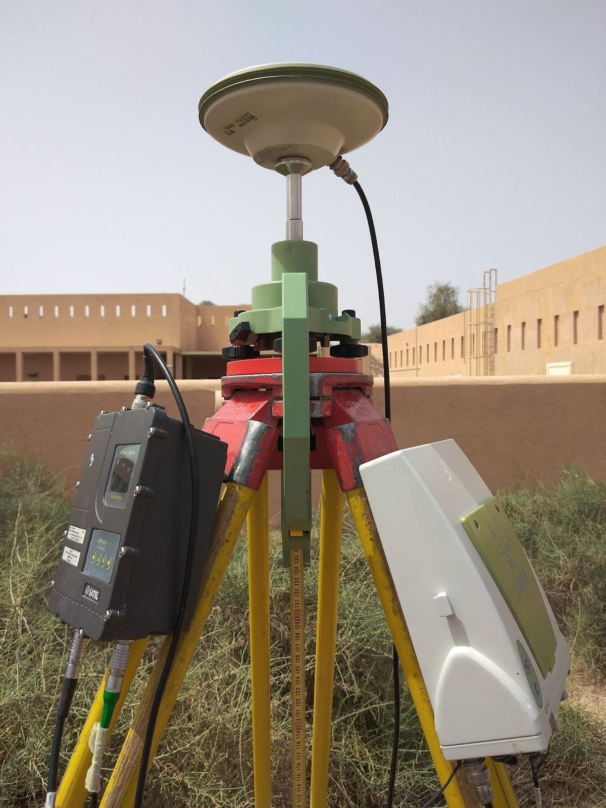
***Image Source:** [Geotech3D](https://geotech3d.com/land-surveying/)*

***Caption:** A precise GPS-based land surveying setup, including a GNSS receiver and tripod, used for accurate geospatial data collection in construction or topographical mapping projects. The equipment captures satellite signals to determine exact ground coordinates.*


#### Techniques and Tools

- **Total Stations:** Measure angles and distances for precise positions, used in construction and engineering projects.
- **GNSS (GPS):** Satellite-based systems for exact ground coordinates, often mounted on tripods for high accuracy.
Leveling Instruments: Measure height differences, essential for topographic mapping and road construction.

#### Applications

- **Construction:** Setting up building foundations and verifying infrastructure placement.
- **Topographic Mapping:** Creating detailed maps of parks, campuses, or small regions.
- **Boundary Surveys:** Accurately marking property lines.

*Image Source: Geotech3D*
Caption: A precise GPS-based land surveying setup, including a GNSS receiver and tripod, used for accurate geospatial data collection in construction or topographical mapping projects. The equipment captures satellite signals to determine exact ground coordinates.

### 5. Simple Field Observations

Field observations involve collecting data directly from the ground using tools like smartphones or GPS devices. Platforms like KoboToolbox make this process scalable and user-friendly.

#### Techniques and Tools

- **GPS/GNSS Devices:** Capture exact point locations, such as trees, infrastructure, or boundaries.

- **Smartphone Apps:**
  - **KoboToolbox:** Custom surveys, geotagged data, photos, and field notes.
    - **Survey123 by Esri:** Integrates field data directly into GIS workflows.

- **Traditional Methods:**
  - **Field Papers:** Print maps, take field notes, and upload them to OpenStreetMap (OSM).
  - **Clipboards and Forms:** Manual data collection in resource-limited settings.

```{admonition} 🚀 In Focus: Using UAVs (Drones) to Generate Point Clouds
:class: note

Unmanned Aerial Vehicles (UAVs) are revolutionizing 3D point cloud generation for geospatial applications. Equipped with cameras or LiDAR sensors, drones capture high-resolution data from the air, producing dense point clouds that represent the surface of objects or terrain.

### How UAVs Generate Point Clouds:
- **Image Capture with Overlap**  
  Drones fly in a grid pattern, capturing overlapping images to ensure each point appears in multiple images for accurate photogrammetry-based point clouds.
- **Photogrammetry Processing**  
  Specialized software (e.g., *Pix4D, Agisoft Metashape*) analyzes the overlapping images to identify common features and calculate their 3D positions using triangulation. The result is a dense point cloud representing the surveyed area.
- **LiDAR Integration**  
  For applications requiring higher accuracy or vegetation penetration, drones can be equipped with LiDAR sensors. LiDAR emits laser pulses and measures their return time to capture precise elevation and surface details, even through tree canopies.
- **Georeferencing**  
  UAVs often integrate GPS/GNSS data to georeference the point cloud, ensuring it aligns with real-world coordinates. Ground control points (*GCPs*) can further enhance accuracy.

### Tools and Software for UAV Point Clouds:
- **Drone Models:** *DJI Phantom, Mavic, or Matrice* series for photogrammetry; *Velodyne* or *RIEGL-equipped drones* for LiDAR.
- **Processing Software:** *Pix4Dmapper, DroneDeploy, Agisoft Metashape* for photogrammetry; *Terrasolid* or *CloudCompare* for LiDAR data processing.
- **Visualization Platforms:** *CesiumJS, QGIS, or CloudCompare* to analyze and display point cloud data.

### Applications of UAV Point Clouds:
- **Construction Monitoring**  
  Regular drone surveys create 3D models of construction sites for accurate measurements and progress tracking.
- **Environmental Management**  
  Analyze terrain, monitor tree canopy heights, and assess forest health.
- **Disaster Response**  
  Rapidly map affected areas, aiding in planning and reconstruction after disasters.

### Benefits of UAVs for Point Cloud Generation:
- **High Resolution:** Drones capture finer details than satellite or aerial methods.
- **Flexibility:** UAVs reach difficult terrain such as forests or mountains.
- **Cost-Effective:** More affordable than manned aircraft for small-scale projects.
- **Efficiency:** Quick deployment and fast data collection for time-sensitive tasks.

### The Future of UAV Point Clouds:
As UAV technology advances, drones are becoming indispensable in fields like urban planning, environmental management, and disaster response, offering high-accuracy, real-time 3D data collection.
```

## 3D and the OSM Data model

To use the OpenStreetMap (OSM) data model for storing 3D data, it is essential to understand and utilize the appropriate tags created to represent three-dimensional attributes of buildings and other structures.

Here is a guide on how to apply the OSM data model for 3D data: [**3D Tagging in OpenStreetMap**](https://wiki.openstreetmap.org/wiki/Key:building:levels)

### Building and Structure Tags

#### Building Type

- - [`building=*`](https://wiki.openstreetmap.org/wiki/Key:building): Indicates the type of building (e.g., residential, commercial, industrial).
  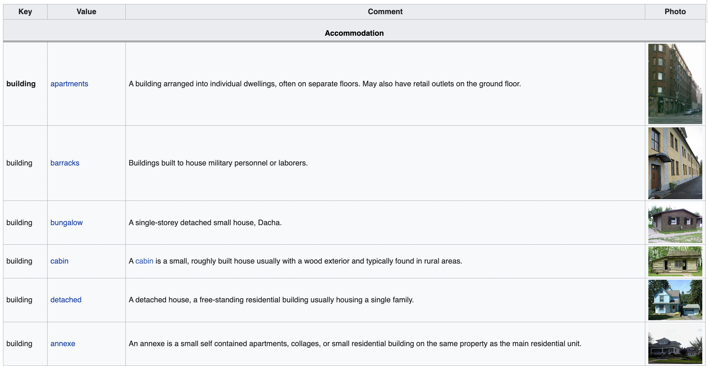

- [`building:part=*`](https://wiki.openstreetmap.org/wiki/Key:building:part): Used for parts of a building with different attributes (e.g., varying heights or roof shapes).
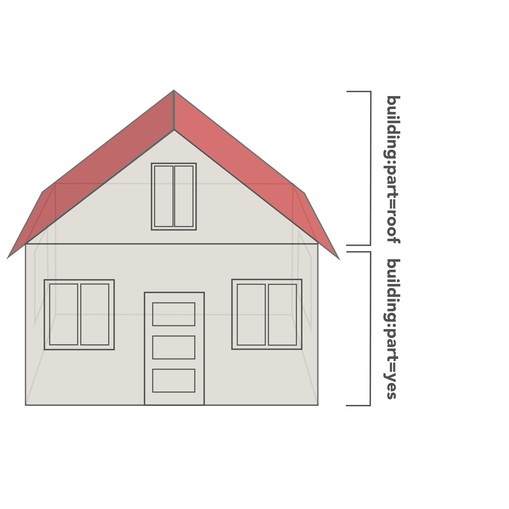

---

#### Height and Levels

- [`height=*`](https://wiki.openstreetmap.org/wiki/Key:height): The absolute height of the building or building part in meters, measured from the terrain to the highest point of the roof (excluding antennas or equipment).  

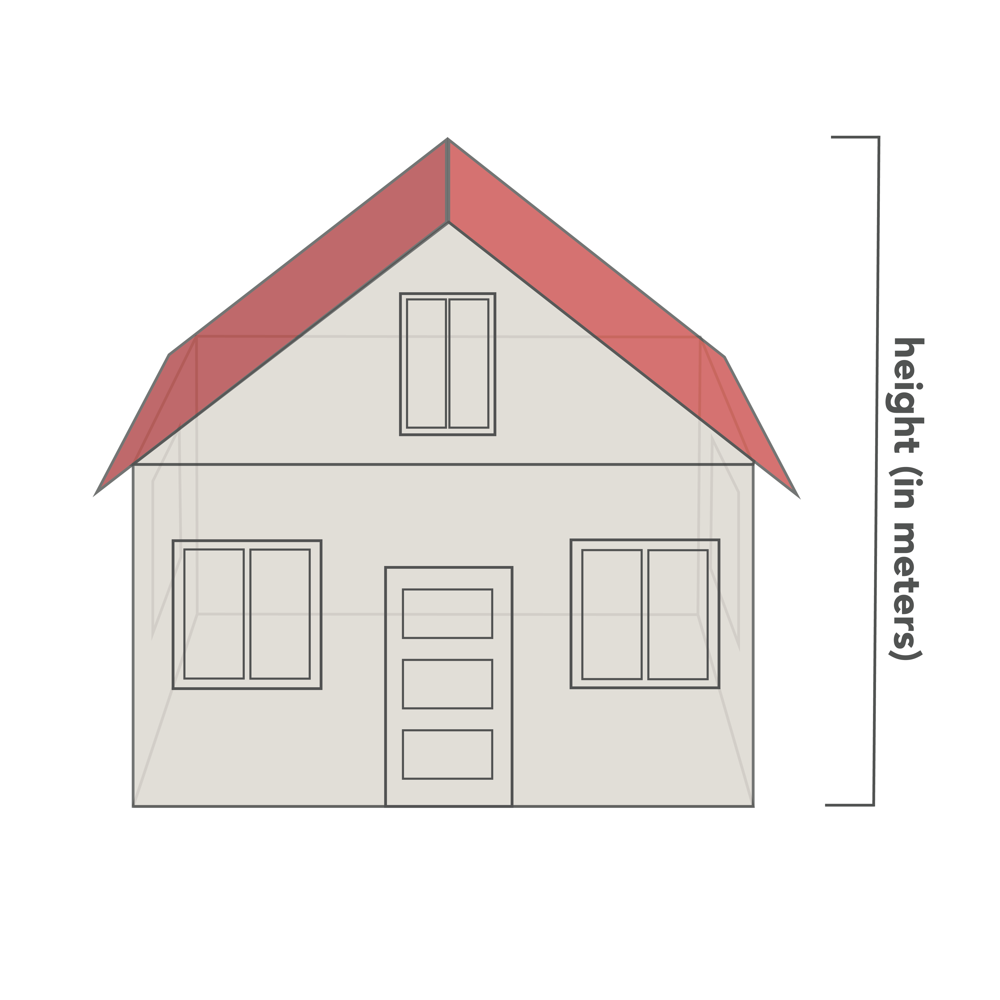

***Image caption:** Image showing the absolute height of a building, measured vertically from ground level to the top edge of the roof.*

- [`building:levels=*`](https://wiki.openstreetmap.org/wiki/Key:building:levels): The number of above-ground floors in the building.  
  
  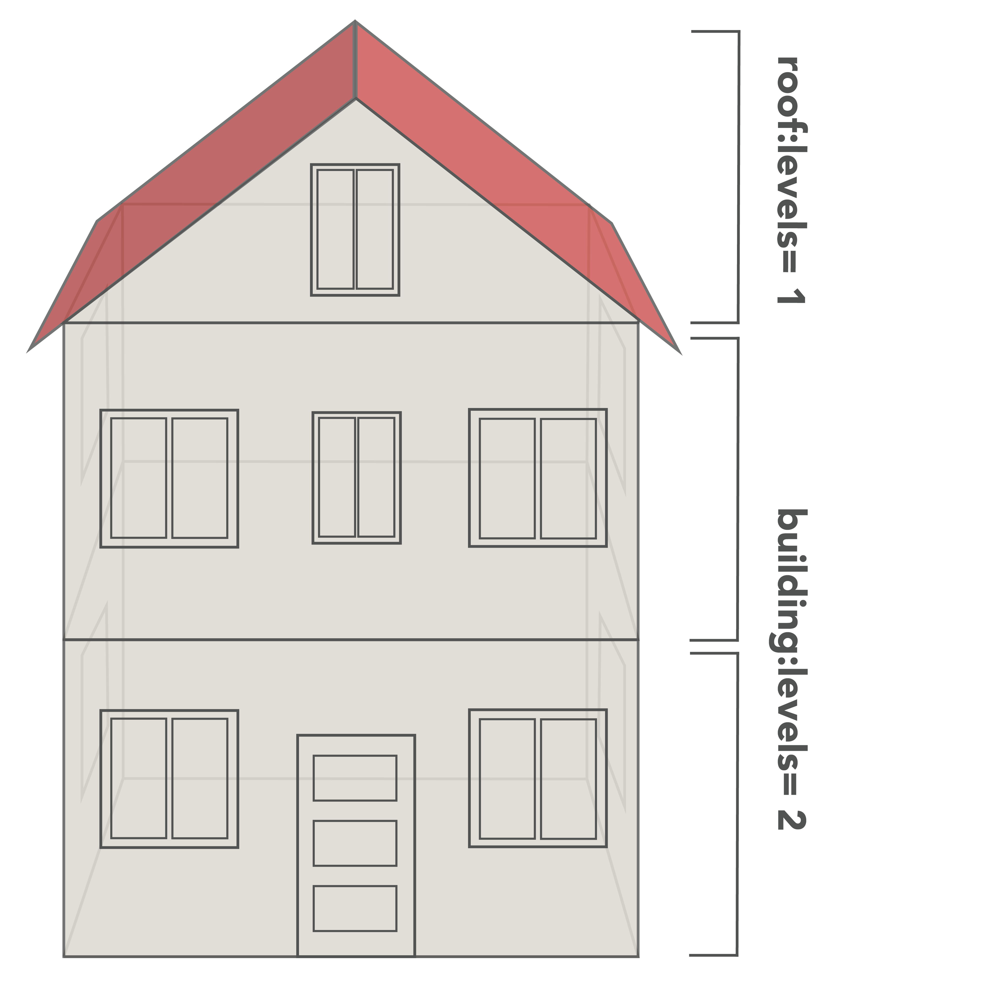
  ***Image Caption:** Illustration of how to tag the number of above-ground levels in a building. Note that underground levels and the roof are tagged separately.*

- [`building:levels:underground=*`](https://wiki.openstreetmap.org/wiki/Key:building:levels:underground): The number of underground floors in the building.

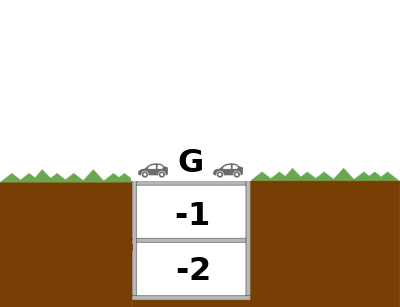
**Source:** OpenStreetMap. *(n.d.). Multi-storey underground carpark. [OSM Wiki](https://wiki.openstreetmap.org/wiki/File:Multi-storey-underground-carpark-20201102.png).*

---

#### Roof Details

- [`roof:shape=*`](https://wiki.openstreetmap.org/wiki/Key:roof:shape): The shape of the roof (e.g., flat, gabled, hipped).  
  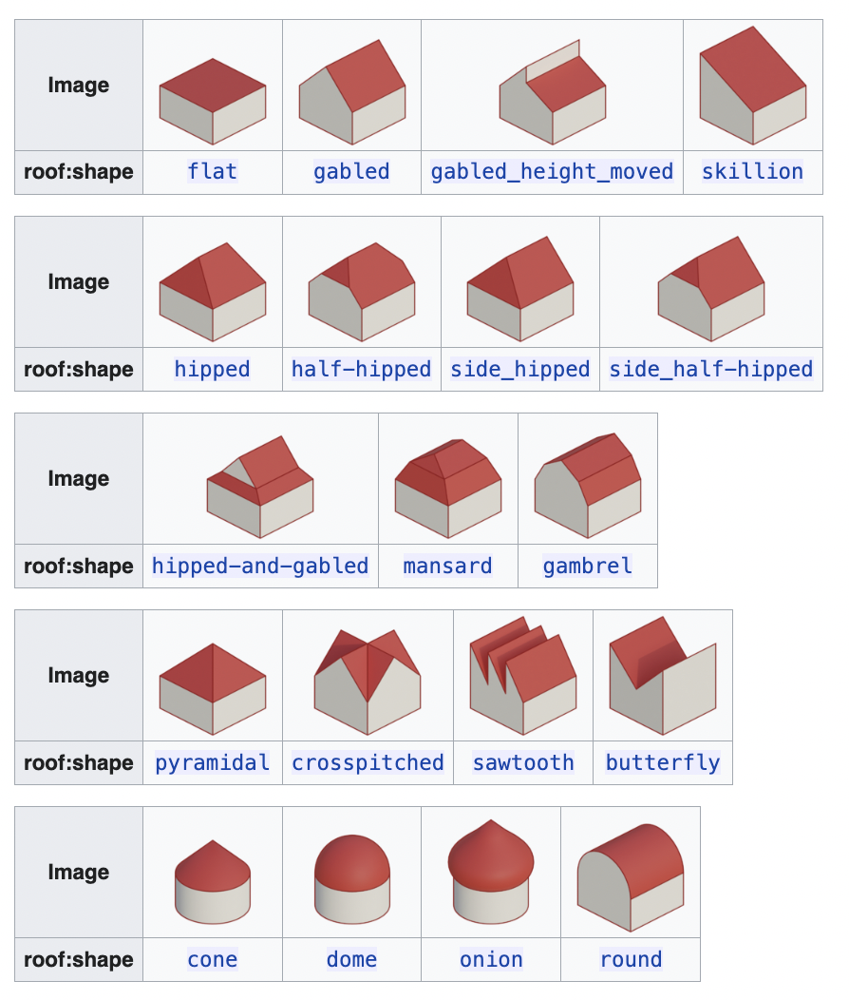  

- [`roof:material=*`](https://wiki.openstreetmap.org/wiki/Key:roof:material): The material of the roof (e.g., tiles, metal).  
  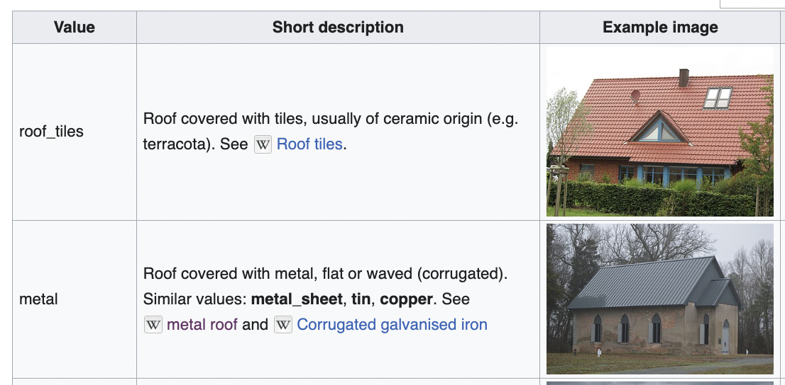  

- [`roof:colour=*`](https://wiki.openstreetmap.org/wiki/Key:roof:colour): The color of the roof, specified in hexadecimal codes (e.g., `#FFFFFF` for white) or basic color names (e.g., white, red).  
  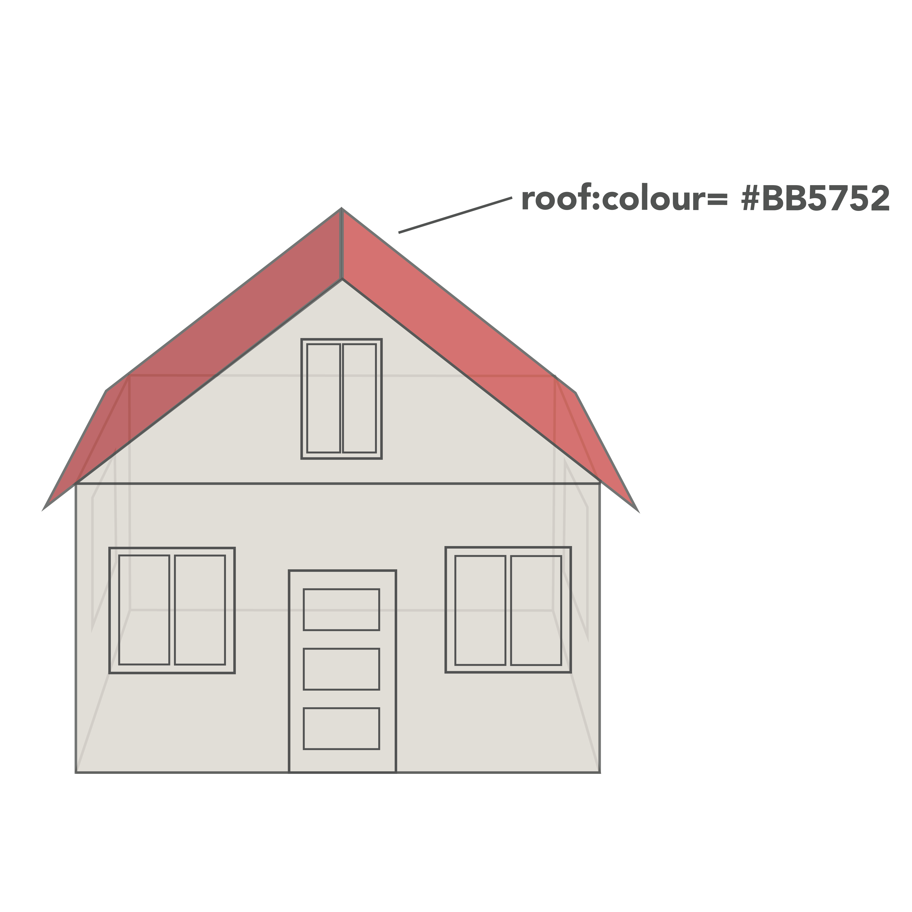

---

#### Material and Color

- [`building:material=*`](https://wiki.openstreetmap.org/wiki/Key:building:material): The primary building material (e.g., brick, concrete, wood).  
  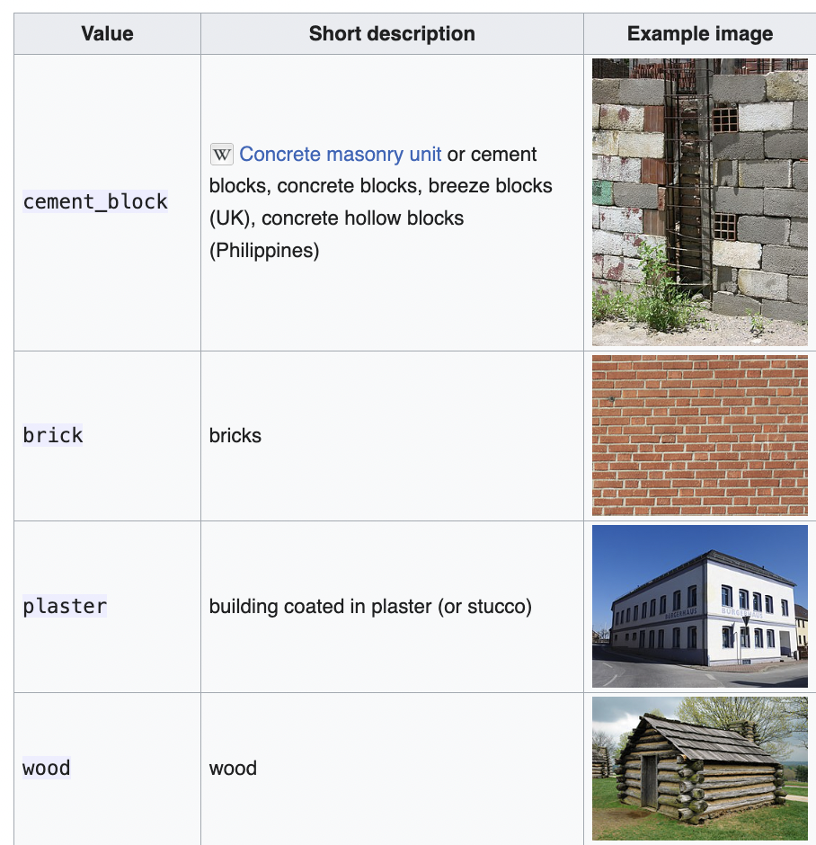

- [`building:colour=*`](https://wiki.openstreetmap.org/wiki/Key:building:colour): The primary color of the building.
 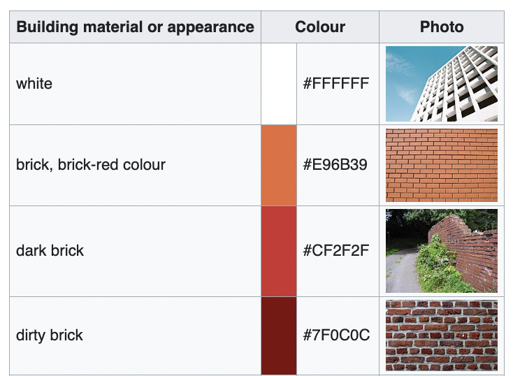
---

#### 3D and 2D Representations

- **3D Image**: Displays a 3D-rendered building with height, levels, roof shape, and materials accurately represented.  
  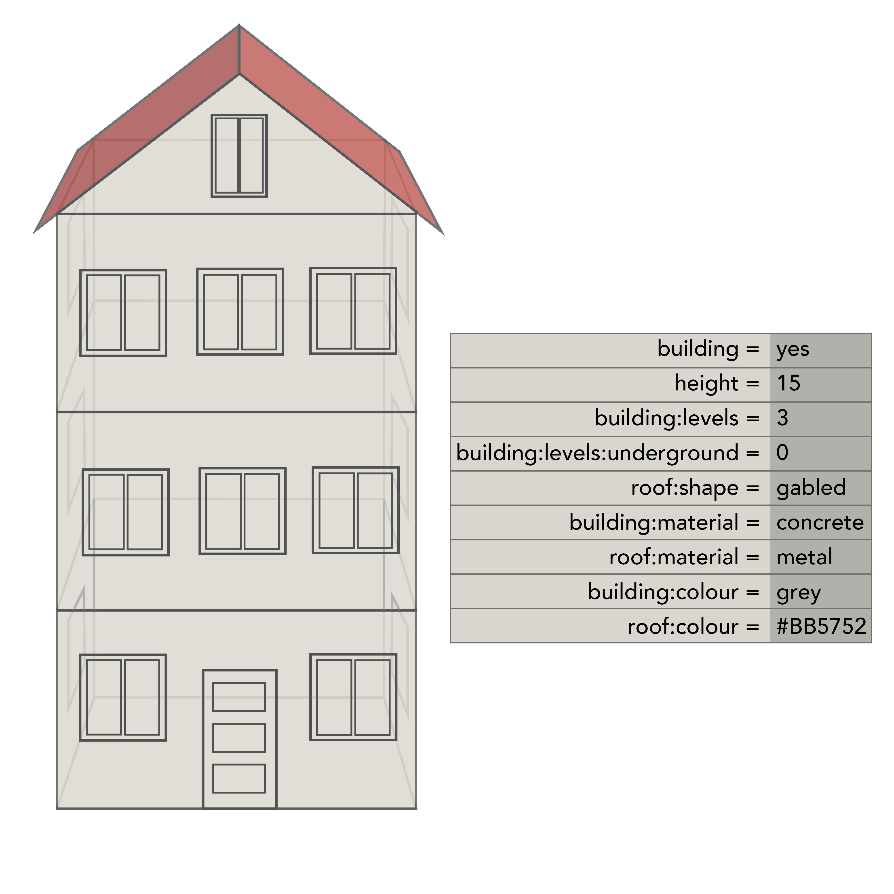


- **2D Image**: Shows a 2D building footprint with the tags `building=yes` and `roof:colour=*` only, as these are the primary attributes visible from satellite imagery.  
  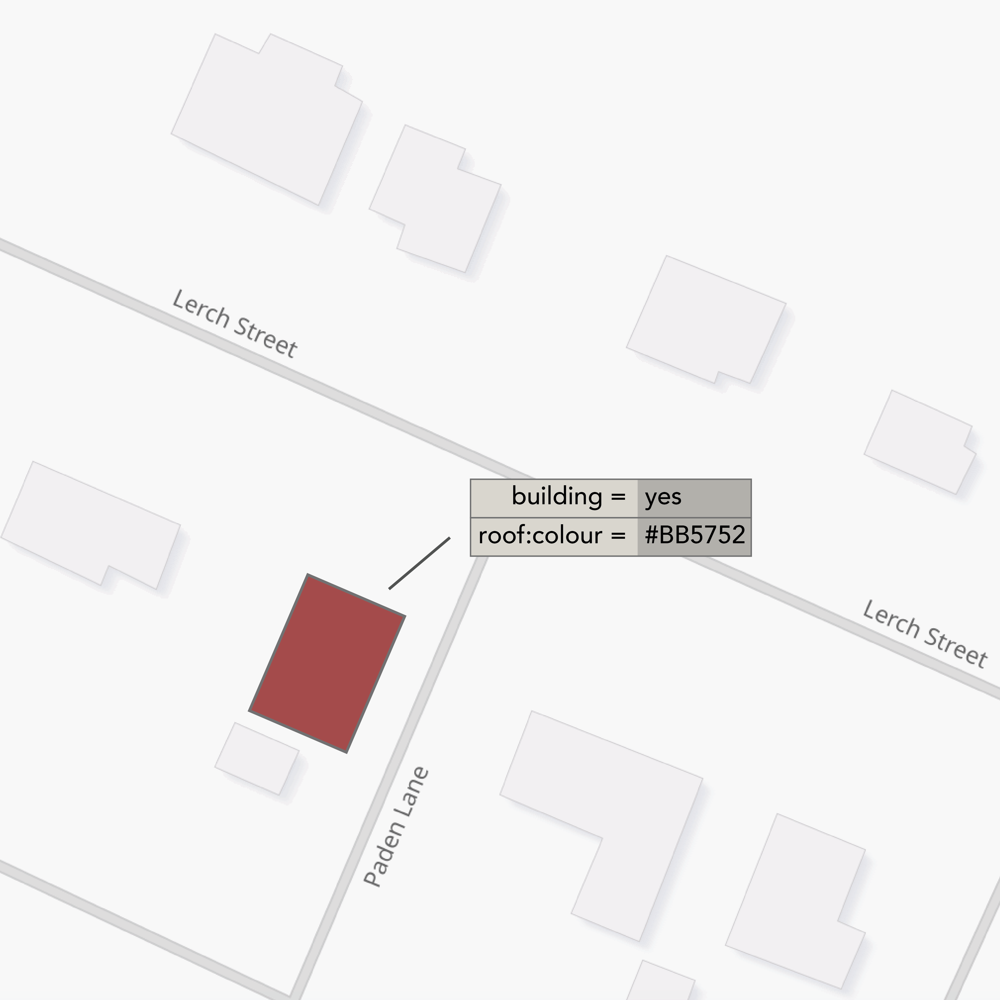

## Collecting Simple 3D Data in the Field

Free, open and easy access tools are a cost-effective way to conduct 3D GIS data collection without the burden of expensive licensing fees. These types of tools also foster collaboration, customization, and transparency by leveraging community-driven development and standardized data models, making it easier to share and integrate data across platforms.

Here's a step-by-step workflow to collect 3D GIS data in the field using the OSM data model and a selection of free/open-source tools:

### Planning and Preparation:

- **Review Existing Data**: Start by examining current OSM data for your area of interest.
- **Determine 3D Attributes**: Familiarize yourself with the OSM tagging schema for 3D data (e.g., `building`, `building:levels`, `height`, `roof:shape`, etc.) so you know which attributes to capture.

## Field Data Collection:

- **Mobile Data Collection Tools**: Use open source mobile apps like **Vespucci**, **OSMAnd**, or **QField** (which integrates with QGIS) to capture georeferenced data on the go. These tools allow you to map building footprints and add 3D attributes on-site.

- **Analog Data Collection Tools**: If a mobile app isn't an option, use an analog approach such as **FieldPapers** to collect your data. You can use the FieldPapers website to create an atlas for your study area, print it out, attach it to a clipboard, and you're ready to go!

- **Collect Geospatial Data**: Walk the survey area either using your mobile editor on a GPS-enabled device, or Field Papers (or both). Capture building outlines (where none exist), note the number of levels or actual heights, and add other relevant tags. You can also record photos and observations to support the attribute data.

### Data Upload and Validation:

- **Sync with OSM**: When you have connectivity, upload your collected data to the OSM database.

- **Review (or update) with a Desktop Editor**: Use **JOSM** (Java OpenStreetMap Editor) to review, clean, and further refine your data (this is a required step, if you plan to use FieldPapers for your data collection). Working with JOSM is especially useful for verifying 3D tags and ensuring consistency, whether you choose the FieldPapers, or exclusively mobile app route.

### Data Processing and Visualization:

- **Import your data and set up 3D Visualization**: Softwares like **QGIS** with 3D plugins, and **Cesium** allow users to import, load and explore 3D data. (**ArcGIS Pro** is also a powerful option, though not open source)

- **Customize Symbology and Analysis**: Adjust styling, lighting, and other visual settings to enhance the 3D display. You can also perform further spatial analyses if needed.

### Sharing and Further Applications:

- **Export and Web Visualization**: Optionally, export your 3D models to formats like **3D Tiles** or **glTF** for use in web-based viewers such as **Cesium**.

- **Engage Stakeholders**: Share interactive visualizations with community members, urban planners, or decision-makers to gather feedback or support planning processes.

---

This workflow leverages the robust OSM data model for capturing 3D attributes and relies on free and/or open-source tools throughout—from field data collection with Vespucci/FieldPapers, to desktop editing with JOSM, and final 3D visualization and analysis in Cesium/QGIS—ensuring a cost-effective and collaborative approach to 3D GIS data collection.

Let’s take a look at the individual elements of the workflow above, starting with **FieldPapers**.

### FieldPapers
FieldPapers is a web-based tool that allows you to create a printable map atlas using OpenStreetMap (OSM) as your basemap. It provides an easy, low-tech solution for collecting data in the field without requiring handheld devices or complex server setups.

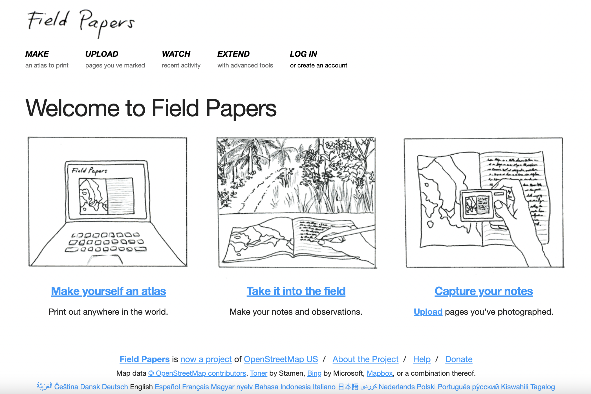

**The FieldPapers workflow is simple:**

- Visit [fieldpapers.org](https://fieldpapers.org), create an account, and click on ‘Make yourself an atlas’. Navigate to, and delineate your study area, choosing the scale and number of pages for your atlas. 

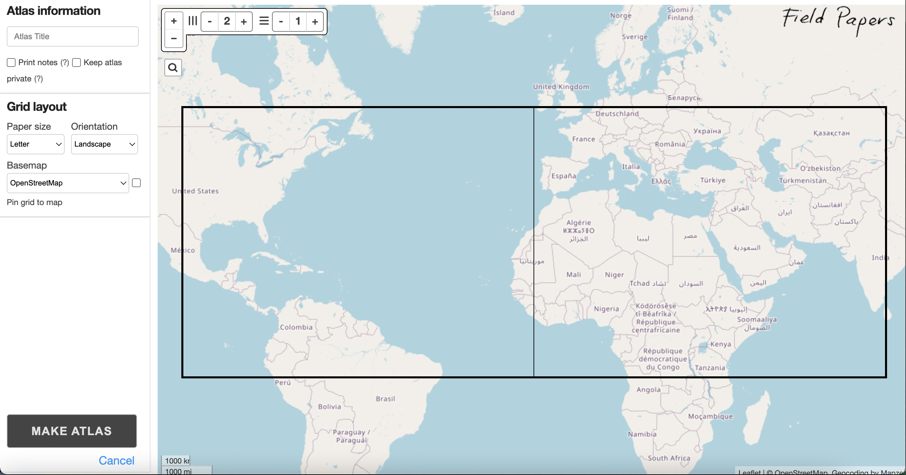


- Print the map.
- Go into the field and sketch observations directly on the printed map (e.g., building heights, roof shapes).


***Image Caption:** Example of a FieldPapers printout used to capture building characteristics in the field for 3D GIS data collection. Key features noted include building height, roof shape, roof material, and the number of building levels. This data is later uploaded to OpenStreetMap (OSM) for 3D modeling and urban analysis.*

- **Back at your workspace, you can:**
  -  Scan or photograph the annotated map and upload it to your machine for use as a georeferenced basemap when editing in OSM tools like iD Editor or JOSM.
  - Or, use the printed map as a visual aid while editing directly in OSM.

**Key points for success:**
- Ensure that buildings in your Area of Interest (AOI) have already been traced in OSM.
- Make an account before you get started - if you would like to be able to return to and reprint your atlas at a later date. 
- Have access to a printer to create hard copies of your atlas.

## Mobile Data Collection 

Today there are a host of different applications you can use to capture, edit and view OSM data using your mobile device. Some are platform dependent such as GoMap! (iOS) or Vespucci (Android) while others will work on almost any device you have like OSMAnd and Every Door.  This is a very short list of the applications available.  For the purposes of this module, we’ll focus on using Vespucci as the primary application to capture, edit and update OSM data. 


### Vespucci (Android)

Vespucci is a free mobile app for Android that supports the full OpenStreetMap (OSM) data model. With Vespucci, you can perform almost all the editing operations available on a desktop directly from your mobile device. This section focuses on using Vespucci for building feature tagging in OSM.

Like other OSM tools, you’ll need to log in with your OSM credentials to upload any edits. On your first upload, you’ll be prompted to grant Vespucci permission to access your OSM account.

Requirements to get started with Vespucci:
- An Android device (or emulator). Vespucci version 20 supports Android 4.1+, and version 20.1 supports Android 5+.
- Vespucci app downloaded from Google Play or GitHub.
- A basic working knowledge of OSM map features.
- An OSM account.

### Key Vespucci Tools


### Vespucci Workflow for Field Mapping
The map you see in this application is taken from the latest version of OSM. Before heading into the field, review your Area of Interest (AoI) in OSM. Determine if you need a preliminary mapathon to add any missing features. With your study area or Area of Interest (AoI) identified and any preliminary mapping complete, it’s time to download the data needed for your field work.  

- Vespucci makes it very easy to get the needed data. **Zoom to your AoI** using Vespucci's zoom tools or gestures.
- **Download OSM data** by selecting the Transfer icon and choosing ‘Download current view.’ This will download the current features from OSM to your device. Downloaded features will be highlighted differently from non-downloaded data.

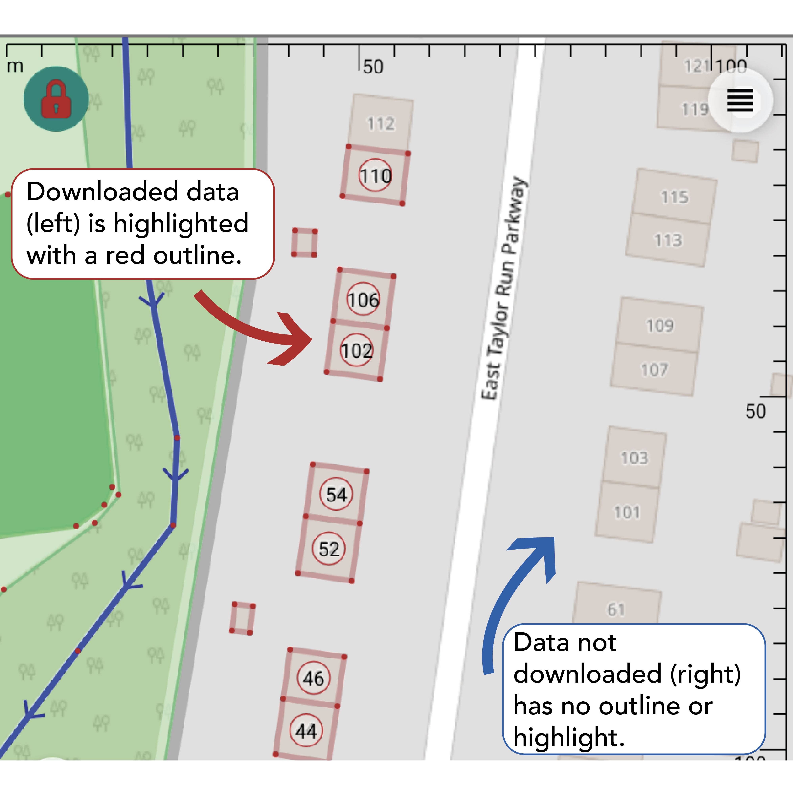

### Editing with the Property Editor

By default, editing is locked when you open Vespucci.  In the upper left corner you’ll see the lock icon.  This Indicates the data is locked and cannot be edited.  Tapping this icon you can toggle between locked and unlocked mode. While in unlocked mode, you can edit the downloaded data. 


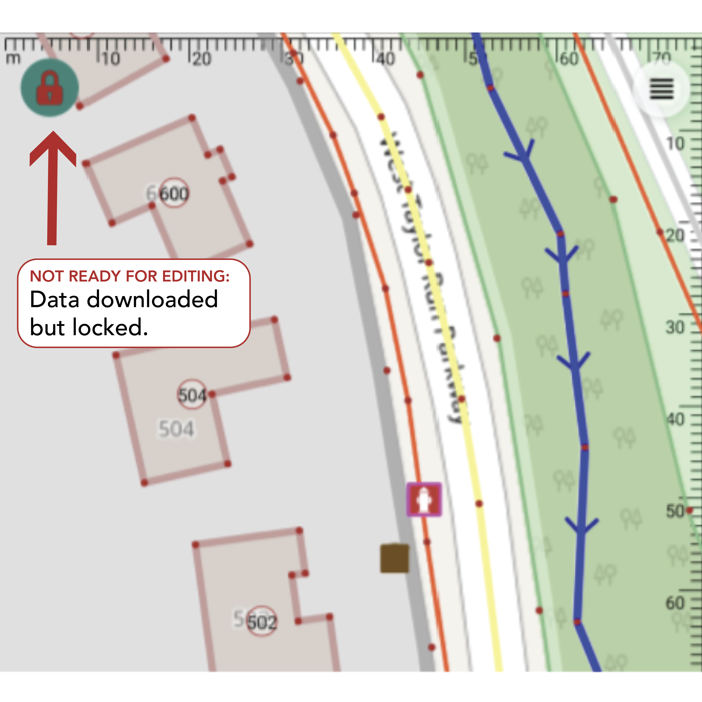

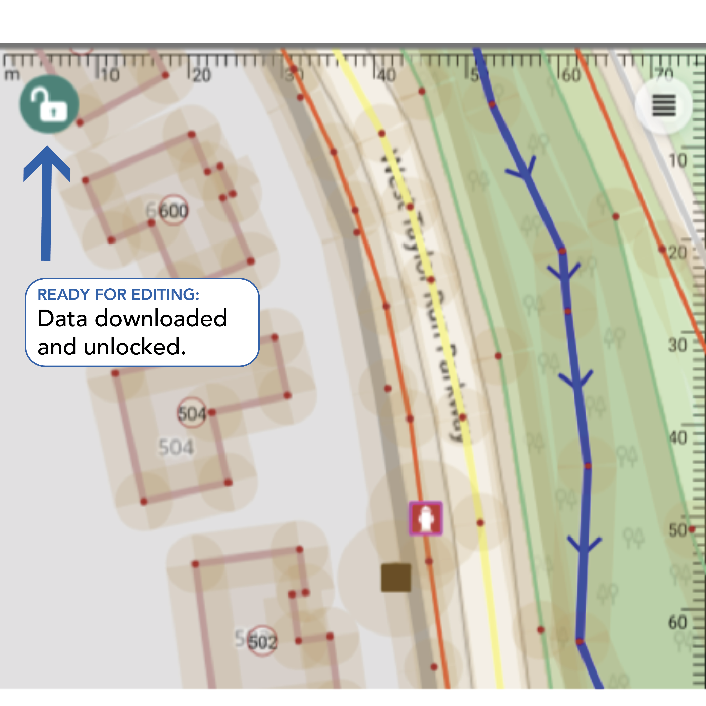

When you have enabled unlock mode, you can now select any downloaded feature by tapping the orange area around it to begin editing.  

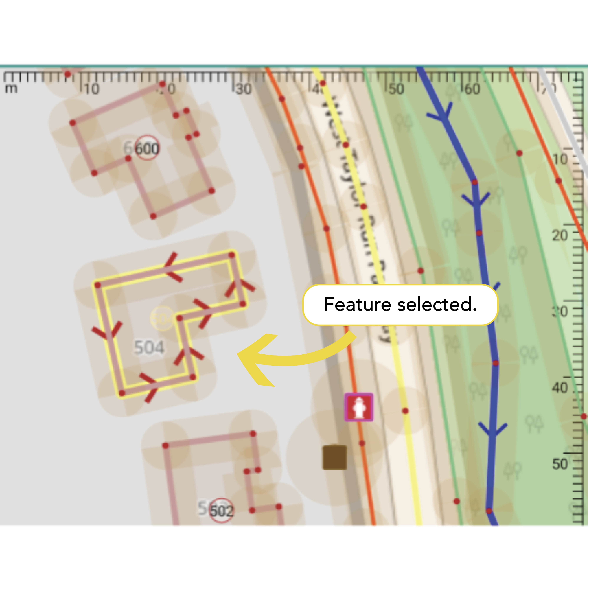

Select a feature by tapping it, then open the Property Editor by selecting the Property Icon,[INSERT ICON] ,  to add or modify tags. To exit the Property Editor tap the check mark icon in the upper left corner.  This will also save any changes you’ve made. (NOTE: at this time any changes are only saved to your phone and not to OSM.)

The editor offers several tabs. You can navigate across the tabs by swiping left or right.

- **Presets Tab:** Displays OSM presets for the selected object. 

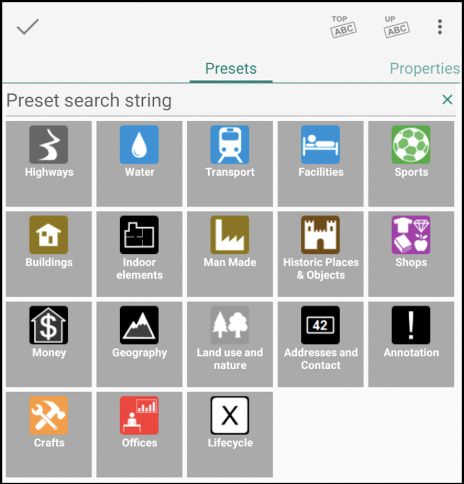

- **Properties Tab (default):** A simplified view showing key-value pairs for the selected feature. This preset driven display shows the description rather than the raw keys.

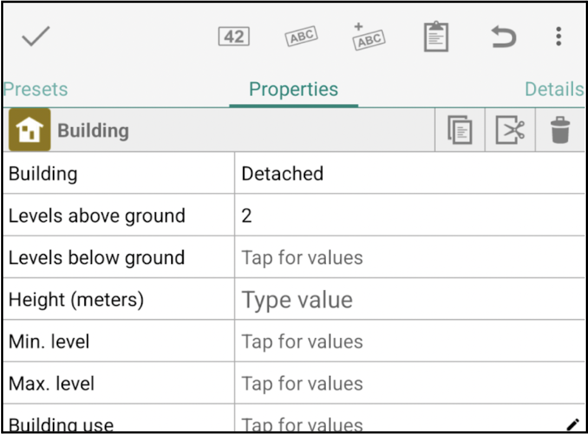

- **Details Tab:** Shows the raw key-value attributes for advanced editing.

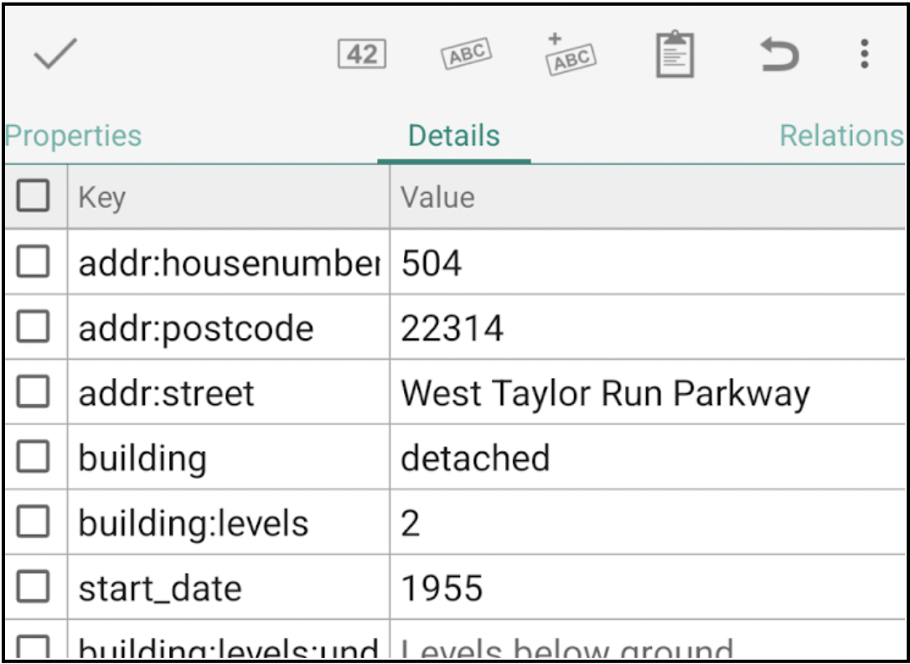

- **Relations Tab:** Displays any relations the selected feature is part of.

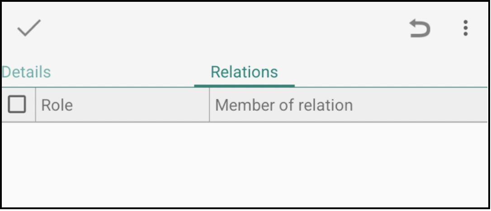

- **Member Tab:** Visible only if the object is part of a relation.

### Uploading Your Edits to OSM
In the Properties tab, you can edit an item (tag) by tapping the ‘Value’ column on the right to enter or modify a value. If predefined values exist for that key, a selection list will appear for you to choose from.

If the tag you need isn’t visible, tap the Apply best preset with optional tags icon to load additional preset options that may better fit the selected object.

Swiping to the Details tab will display a raw list of all available keys. To add a tag, check the box next to the desired key and enter the appropriate value.

Whether you're working in the Properties or Details tab, you can update existing tags or add new ones as needed.

Once your edits are complete, tap the check mark icon in the upper-left corner to exit the Properties window and save your changes.

After making several edits, return to the main screen. You’ll see a number above the transfer icon indicating the total number of edits made. Tap the transfer icon to begin the upload process to OSM.

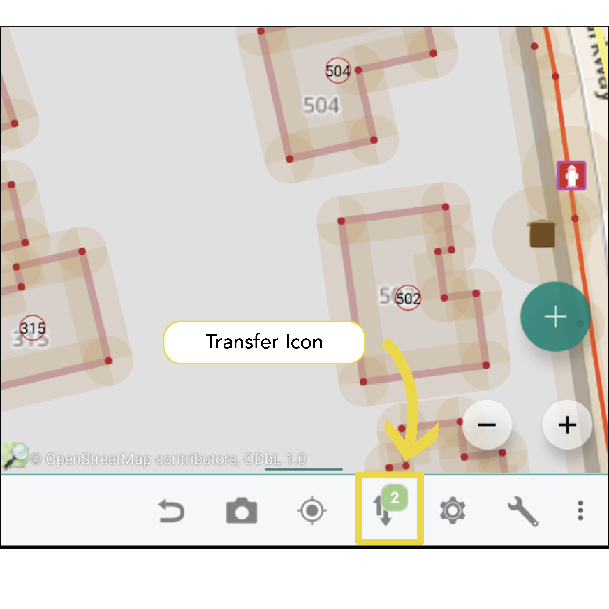

### Uploading Your Edits to OSM

Let’s give this a try.  Before you go into the field you should test it while you have a stable internet connection and in an area you are very familiar with, such as your own neighbourhood.

1. Zoom to an area of interest, one that you are familiar with, such as your neighbourhood.

2. Download data using the transfer icon.

3. Toggle to unlock mode to start an edit session.
Select a building that you know well by tapping on it. 

4. Tap the Properties icon in the bottom left.

5. The Properties tab will appear and show the current tags. It may be as simple as ‘Building = Yes’ or have many more tags including the full address.

7. Try including some or all the following tags, if they are not already assigned and you are confident in their answer:
  - Levels above ground
  - Height (meters)
  - Building use
  - Building colour
  - Building material
  - Roof type

**Remember that you can tap the cell to the right of the key/attribute you are trying to populate to get possible values.*

8. When finished editing the tags, tap the check mark in the upper left corner. This will take you back to the map showing the building you currently have selected.  

9. Let’s try this again but using the ‘Details tab.’  

10. Select another building you are familiar with then tap the Properties icon.

11. When the Properties window appears, swipe to the left to bring up the Details tab.

12. From this screen you’ll add a check mark next to the tag you wish to edit or include.  Tap the box to the left of the tag you wish to edit or add. This will enable the check mark.

13. Review the existing tags and as before, identify and update and/or include a few additional tags for this feature.

14. When finished editing the tags, tap the arrow in the upper left corner and then tap the check mark. This will take you back to the map showing the building you currently have selected.  

15. Now that you have edited a couple of buildings, it’s time to upload those edits to the OSM platform.

16. Tap the arrow in the upper left corner of the screen.  This will take you back to the main page for the app.  You’ll now see the transfer icon with a bubble and number.  This number indicates the total number of edits you have made and are ready to be uploaded to OSM.


17. Tap the Transfer icon to bring up its menu.  

18. Tap ‘Upload data to OSM Server…’ to start the upload process.  In the Upload changes window you have 2 tabs: Changes and Properties
  - **Changes tab:**  review the features you edited/changed.
  - **Properties tab:** this is where you leave your Changeset comment and source information.  In the Comment section leave a short description of your edits, such as ‘updated building level tags’.  Under the Source section leave a comment identifying how you determined these edits such as ‘personal knowledge’ or ‘field survey’.

19. When ready, click ‘Upload’ in the bottom right of the screen to initiate the upload to OSM. NOTE: if this is your first using the Vespucci App, you will now be asked to enter your OSM credentials.

20. As noted at the beginning of this tutorial, you can use the Vespucci mobile app to do almost everything you can from a desktop computer.  To dive deeper on the tools and uses of this app, please review the [Vespucci User's Guide](https://vespucci.io/help/en/Main%20map%20display/).

## How Do I Visualize 3D Data?

The way in which we visualize 3D GIS data can transform complex geospatial information into immersive, interactive and accessible representations of real-world environments, often with remarkable detail. Advanced techniques, such as realistic shading, texturing, and lighting can enhance the depth and realism of these scenes, while dynamic overlays and interactive tools allow users to explore, manipulate, and analyze the data in real time. Softwares like ArcGIS Pro, QGIS with 3D plugins, and Cesium allow users to explore data on the fly, conduct analyses such as sunlight and shadow modeling, and ultimately support more informed decision-making.
