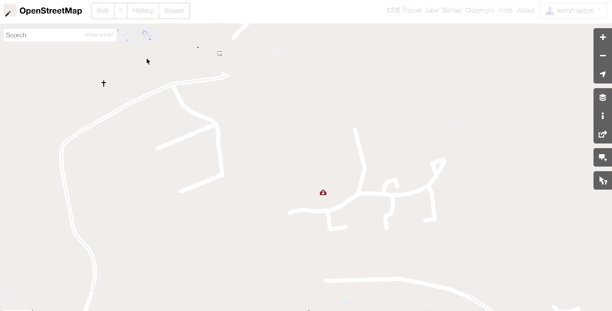
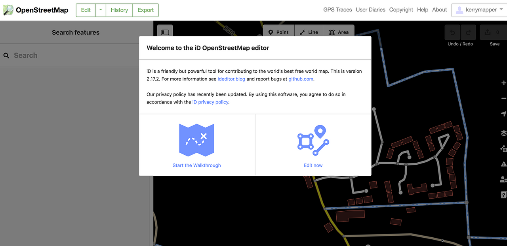
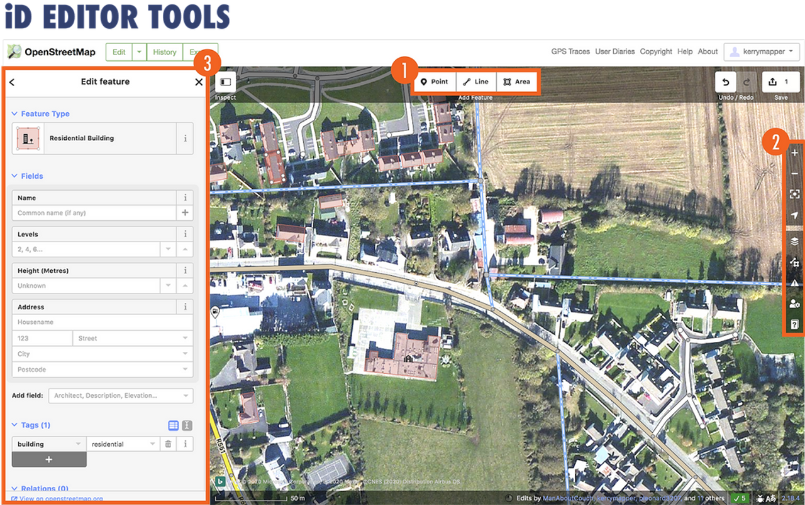
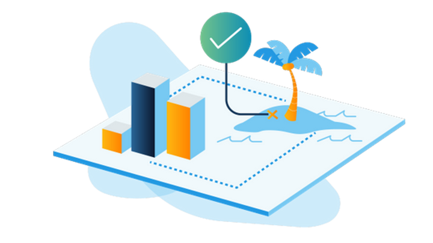
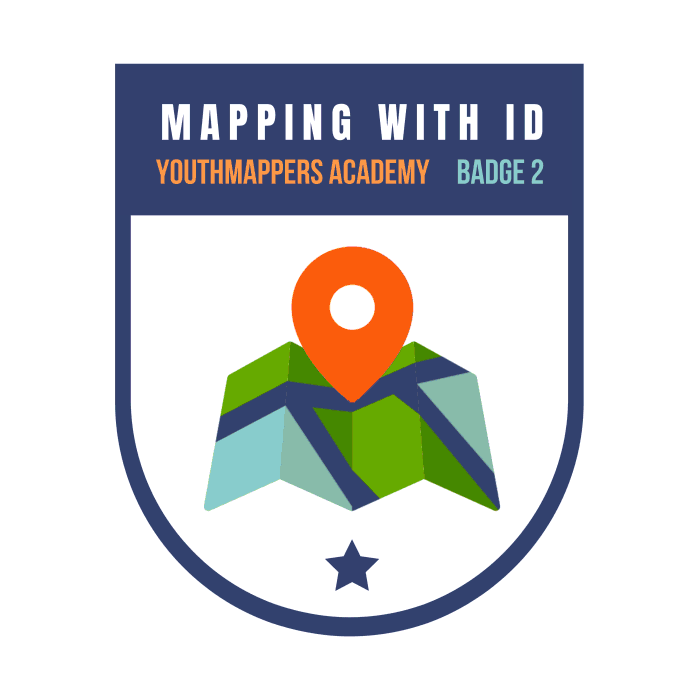

# Mapping with iD Editor

This is the second of six courses that make up the Introduction to Mapping with YouthMappers Learning Track.

## Overview 
In this course, you will learn how to add map features to OpenStreetMap (OSM) using the web-based (online) map editor called iD Editor. Although iD is the most basic map editor for OpenStreetMap, it is still extremely powerful, and it takes time, patience, and lots of practice to become a confident and proficient mapper.

**What you will learn in this course:**
- How to navigate the iD editor
- How to create points, lines, and areas in OSM
- How to edit existing OSM features
- How to save data correctly in OSM, and understand the importance of “Changeset Comments”

## What is iD Editor?

iD Editor is a web-based editor used to create map data on openstreetmap.org. Developed by Mapbox in 2013, this easy-to-use tool is the default option for new mappers wishing to contribute to OSM. Mappers will trace map features from the satellite imagery provided, and tag or label the map features from a set of pre-defined options (points, lines, and areas that define the OSM Data Model). iD requires a stable internet connection, as edits are saved and pushed to OpenStreetMap in real-time.

1. To begin mapping, use your new OSM account credentials to log in at www.openstreetmap.org.

2. Using the Search button in the top left-hand corner of the map, or the map navigation tools to the right (zoom in, zoom out, pan), navigate to the location in which you wish to begin mapping. It is always a good idea to begin mapping in a place that is familiar to you so that you can add your local knowledge as you trace from satellite imagery.  

3. In order to begin the editing session, click on the **Edit** drop-down button in the top left-hand corner of the screen, and choose **Edit with iD (in-browser editor).**



4. The map view will change from the basic vector-based map view (points, lines, areas) to the satellite view, and you should be prompted to take the built-in **Walkthrough**. If this is your first time mapping, it is strongly advised to work through this excellent interactive tutorial. (We will go through the basics of mapping in the next few steps, in any case).



5. Once you have completed the **Walkthrough** (or if you have clicked on the **Edit Now** option), you will see the live editing view within iD. While in the editing view, you will see satellite imagery behind any existing map features, as opposed to the standard map.

6. If the option to complete the Walkthrough is not automatically offered on start-up, you can always find it under the **Help** section in the table of contents (the table of contents is to the right of the map window). The **Help** section is only visible after you have logged on and after you have entered editing mode.

## Navigating the Interface


1. **The Editing Toolbar:** This toolbar contains the three geometry types supported in OSM: point, line, and area.


2. **The Main Toolbar:** This toolbar contains the main navigation tools and settings.

*We will examine the advanced section of the toolbar in more detail as we progress through the module.*

3. **Edit Features Window:** This window shows the tags associated with whichever object is selected on the map (the *selected* object will be highlighted and blinking). When you create a new feature, you will use this window to assign *tags* or identifying information to your map object. You can also edit existing tags using this window.

## Accuracy, Output, and Engagement 

Mapping is not about speed and volume. It’s about thoughtfulness and accuracy. **<u>You should never guess at detailed tags for features that you are unfamiliar with.underlined</u>** It is sufficient to mark something as a simple building or road, and leave the detail to another mapper, either one with direct local knowledge or someone who has had the opportunity to do fieldwork. A simple but correct tag is far superior to an incorrect guess. 



You won’t always encounter a blank slate when mapping in OpenStreetMap, and will often have to navigate around the work of other mappers. Sometimes this work will be of good quality and other times it won’t. It takes experience and confidence to engage with existing map contributions. We want to share an important note from the LearnOSM website about deleting and modifying others work:


*In general, <u>you should avoid deleting other people’s mapping if it just needs improvement.</u> You can delete your own mistakes. You should try to edit other people’s mapped objects if they are incorrect. This preserves the history of the items in the OSM database and is respectful of fellow mappers. If you really feel something should be deleted, consider asking the original mapper or one of the OSM email lists about it first.*

```{tip} 
YouthMappers Blogspot: Whoever You Are, Your Data Fits in OSM

[Whoever You Are, Your Data Fits in OSM](https://www.youthmappers.org/post/2019/10/08/whoever-you-are-your-data-fits-in-osm) By Jim Libby (University of Arizona)

Hear from Jim on the process of discovery, from his first interactions with OpenStreetMap all the way through to his virtual internship position with USAID. Jim discusses how his experiences were the perfect complement to his academic studies in Geography and Urban Planning, allowing him to overlap the theoretical and practical elements of both disciplines.

```
## Want to dig a little deeper?

Refer to the information below to learn more about mapping with iD Editor.

**Drawing Multipolygons:** Consult [this](https://learnosm.org/en/beginner/id-editor/#drawing-multipolygons) short tutorial segment on how to create a multipolygon in iD Editor.

**Changeset Comments:** Please [click here](https://wiki.openstreetmap.org/wiki/Good_changeset_comments) to learn more about best practices for Changeset Comments.

- **HOT Two Minute Tutorials:** In this [video](https://www.youtube.com/watch?v=E1YJV6I_rhY), you will see a demonstration on how to map a building in OSM.

- **HOT Two Minute Tutorials:** In this [video](https://www.youtube.com/watch?v=ZBLwb2nisJQ), you will see a demonstration on how to map a road in OSM.


## Conclusion 

### YouthMappers Academy: Skills, Proficiencies, and Standards

The following competencies derived from both the Geospatial Technology Competency Model and the National Geographic Standards are central to the successful completion of YouthMappers Academy Course: Mapping iD Editor. 

### The Geospatial Technology Competency Model:

1. Interpersonal Skills: Demonstrating the ability to work effectively with others through interaction with peers and course moderators

2. Initiative: Demonstrating gumption at work/school

3. Dependability and Reliability: Displaying responsible behaviors at work/school

4. 5. Lifelong Learning: Displaying a willingness to learn and apply new knowledge and skills

6. Reading: Understanding written sentences and paragraphs in work-related documents 

7. Geography: Understanding the science of place and space; geographic skills

8. Basic Computer Skills: Using a computer and related applications to input and retrieve information; navigation and file management, and internet and email

9. Planning and Organizing: Planning and prioritizing work to manage time effectively and accomplish assigned tasks; planning and organizing; adaptability and flexibility; time management

10. Data Quality: Accuracy, resolution, precision, fitness for use; quality control versus quality assurance; data quality implications of legacy systems

11. Remote sensing and photogrammetry: Basic introduction

12. Geographic Information Systems: Conceptual foundations, including representation and uncertainty

### The National Geographic Standards:

1. The World in Spatial Terms: 
  - How to use maps and other geographic representations, geospatial technologies, and spatial thinking to understand and communicate information
  - How to analyze the spatial organization of people, places, and environments on Earth's surface

2. Places and Regions: The physical and human characteristics of places

3. Human Systems: 
  - The processes, patterns, and functions of human settlement
  - Human Systems: How the forces of cooperation and conflict among people influence the division and control of Earth's surface

4. Environment and Society: 
  - How human actions modify the physical environment
  - How physical systems affect human systems

5. The Uses of Geography: 
- How to apply geography to interpret the past
- How to apply geography to interpret the present and plan for the future

### Congratulations!

Congratulations on completing **Course 2: Mapping with iD Editor**  of the YouthMappers Academy series! 




