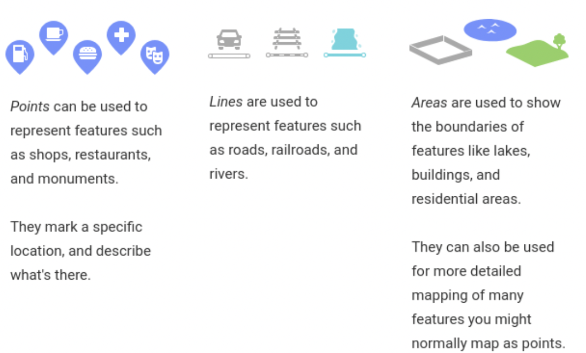

# Module 3: Image Interpretation

## Overview 
Welcome to Module 3 of the YouthMappers Academy. In this module, you will learn about the sources of imagery for tracing in OSM and how to interpret the images you see. Image interpretation is the act of identifying objects within an image and determining their significance. The more familiar you are with the area, generally the easier this is for you to do. This is why we suggest you start by mapping in an area that you know, until you become accustomed to how familiar features look from aerial imagery

### What you will learn in this module:
- You will learn about Natural Color Composite Imagery, the most commonly used imagery type for tracing features in OSM
- You will learn about the different applications of raster and vector data (images vs traced map features)
- You will learn tips and clues on how to recognize features from imagery

## An Introduction to Imagery Interpretation for OSM

### The role of imagery in the OSM workflow
Tracing features from satellite imagery is one of the most common ways in which mappers contribute to OpenStreetMap. Imagery allows remote mappers to contribute to global tasks when a crisis arises, and even allows locally based field mappers to “lay the groundwork” so to speak, before organizing fieldwork campaigns to collect specific, detailed tags. 


### An Introduction to Imagery Interpretation

Most of the imagery available to us in OpenStreetMap is called Natural Color Composite imagery; imagery which corresponds to how we usually see the world; vegetation appears in various shades of green, water can be anything from bright blue to black, and bare earth and impervious surfaces light gray and brown. To create this imagery, sensors capture the amount of sunlight, (typically in the Blue, Green, and Red wavelengths) reflected off the earth’s surface. Because different objects reflect light differently this allows us to identify, or perceive these different objects by their relative “color”

If you are interested in the science behind sensors, and how they capture imagery, please take a closer look here: [NASA - What is Remote Sensing](https://earthdata.nasa.gov/learn/remote-sensing)


*Source: National Ecological Observatory Network (NEON)*

The Images we use are stored in digital format by subdividing the entire image area into small equal-sized and similarly shaped areas, called pixels. Each pixel represents the brightness of each area with a numeric value or digital number. Data stored in this format is called raster data.


Figure: From real-life to a raster depiction 
*Source: NEON (The National Ecological Observatory Network)*

When we zoom back out we can see how individual pixels create features in the image. The key is to study the image for these recognizable features, and turn them into points, lines and areas (polygons) in OSM. This workflow involves identifying, and evaluating individual objects and marking their locations by dropping a point, or drawing along a linear feature to create a line, or, tracing around the perimeter of an object to create an area (or polygon). 

**Why do we trace shapes from imagery, rather than use these wonderfully detailed images already at our disposal?**

Unprocessed satellite imagery has very few practical applications. It is limited by the fact that objects appearing in an image are identifiable by virtue of viewer interpretation. There is very little meaning or context to these objects outside of what the viewer can determine. 

For instance:
- You can’t search satellite images for the nearest pharmacy
- You can’t generate travel directions from satellite images. 

We tend to rather vector (point, line, area data with labels/tags/attributes) over raw imagery for certain types of analysis because:
- Vector data is easier to organize, and query: because it’s labelled/tagged, we can select it by type using real language queries 
- Some analysis techniques need the data to be in point/line/polygon format, as a “pixel” with a “reflectance value” doesn’t mean anything within the context of the analysis
- Our interpretation of imagery is subjective, but powerful - we appreciate the subtle differences in what constitutes a “school” - in the way a computer can’t. 

While we are making strides using Machine Learning to help us scour imagery and detect specific features, it’s still a progressing science, and as yet cannot match the level of contextual detail that human interpretation provides. 


*Source: iD Editor Tutorial*

Looking at the example above, we can see how we represent complex objects, like a parking lot using more simple features, a) an area (polygon shape) representing the full extent of the parking area and b) lines representing the paths along which cars navigate the space.  

Although seemingly simple, there are quite a few nuances, for instance, note that the parking lot lines end by connecting to the road center line, this is so that there is “connectivity” between the road and the parking lot. Without that connection navigation software will not understand that cars can turn into the parking lot from the adjacent road. It’s human interpretation of the image, and the correct recording of that interpretation in the database that allows us the critical information we need to model and analyze using the type of vector data that OSM contains.

## Sources of Imagery for OSM
Imagery used for tracing within OSM is acquired directly overhead; this is called a vertical perspective which provides a top down view of the area of interest. Imagery within OSM can be obtained from numerous sources including satellites, drones, and airborne sensors. We use these data because they can cover large areas very quickly at very high spatial resolutions. Because of the very high spatial resolution, a large number of pixels make up an object which allows you to visually identify individual objects within the image. 

Global high resolution imagery is available from a handful of providers (which generously donate access to OSM). These include Bing, ESRI, Mapbox, and Maxar. In many cases we can take advantage of multiple sets of imagery to help us delineate objects on the ground.  For instance in the example below we can see how Bing and Maxar data can provide meaningful differences that can help us distinguish objects.  One critical factor here is shadow, since these images were taken at different times, we can exploit those differences to help us identify individual buildings. Also, if you look at the second image below, the four cars parked in one of the gaps in the buildings gives one a sense of scale and an idea that roads connect to this area.


*Bing*

*Maxar*

## Recognizing Features or Objects from Imagery
The key to the proper use of imagery in OSM is understanding how to appropriately translate what you are seeing on the image, using the tools provided, to create points, lines, areas, and their related tags. 

Here is some basic advice to help you decide:
 

*Source: iD Editor Tutorial&

In order to identify objects, we need to look for clues in the imagery. We can use the following rules of thumb to help us along:

- **Determine the size/scale of the area**  
  If you’re working within a platform that provides a scale bar (like [OSM](https://www.openstreetmap.org/)), then you’re already at an advantage. You can use this to roughly determine the dimensions of property areas and built infrastructure.

- **Look for patterns, shapes, and textures**  
  Patterns, shapes, and textures provide critical clues. For instance:
  - Roofs will tend to be rectangular, smooth, or wavy (if corrugated).
  - A plot of crops will be an irregular polygon and have complex texture.

- **Define the colors (including tones, and shadows)**  

- **Consider your prior knowledge**  
  Prior knowledge can be extremely helpful in interpreting an image. For instance, identifying a thatch hut can be difficult if you have never seen one. Sometimes it's helpful to take a tour of the area of interest in [Google Street View](https://www.google.com/maps) or [Flickr World Photos](https://www.flickr.com/map) (zoom to an area and press).

- **Association**  
  Notice the relationship between the object you are classifying and recognizable objects or features. For instance, commercial warehouses will tend to be located very close to paved roads.

```{admonition} [YouthMappers Blogspot – *A Silver Lining* by Lila Rodriguez](https://youthmappers.blogspot.com/)
:class: tip

In this blog post, Lila discusses her experiences contributing to a mapping project related to mining in Ghana. Having never travelled to the mapping site, she explained how important contextual cultural knowledge is to one’s ability to interpret aerial imagery, and gain a more holistic understanding of how the landscape is modified by humans.
```

Let’s practice, and pretend that we are trying to find building footprints in OSM

### Critical Clues for Building Detection

- **Look for scale**  
  Is the object too large or too small relative to other easily identifiable objects in the image to be a building?  
  - It’s useful to look at what other mappers have created with the building tag in that same area.

- **Look for patterns, shapes, and textures**  
  Look for straight lines and rectangles, as they are most likely parts of man-made features.

- **Look for color**  
  - Large patches of grey and red are often an indication of shingled, tiled, or tin-roof buildings.  
  - Also look for lines of shadow around the edges of buildings—this indicates an elevated structure and can help distinguish buildings from flat features like concrete parking lots.

### Distinguishing Objects

In many places, our ability to meaningfully distinguish objects from one another is limited—either due to the quality of the image or the complexity of the object on the ground. Let’s take on a few common examples, this time from Addis Ababa, Ethiopia.


We can take advantage of a few things to help us trace our building footprints correctly:

- **Shadows imply that an object is elevated**, so a roof is not a parking lot.
- **Shadows give us a clear edge** along which to trace the outside of a building.
- **Multiple sources of imagery** can help us decide what a specific object is and where its boundaries lie.

Below is a best guess interpretation for two buildings.


Although these buildings are reasonably distinguishable, there are a number of problems:

- Shadows only provide clarity along some building edges (can we use other imagery?).
- Trees hide corners or sometimes even entire objects.
- Sometimes imagery is just too poor (grainy or cloud-ridden) to delineate an object with any degree of confidence.


For instance, the **green arrow** points to an area that could be a building, a parking lot, or a construction site. Moreover, the shadows along its edges appear to come from the adjacent buildings marked with **red** and **blue arrows**. 

Looking at the **red arrow** building:

- We can see a clear line delineating both sides of the tin roof, which is a strong cue that this truly is a building.
- There might even be a small building along the top edge of the property marked with a **yellow arrow**.

In this case:

> I would likely trace the buildings covered by the red and blue arrows and leave the yellow and green objects until either more clear imagery was available or I had the ability to see the site in person.

Looking more closely at the building under the **blue arrow**, we can use shadows to guide us. Below we circled the shadows along the top edges of the building. Notice how these subtle clues can help us delineate buildings even in low quality images.


Unfortunately, tracing can get even harder in areas with **complex arrangements of buildings**. Looking at the buildings below, it is hard to figure out:

- Where one building starts and another ends,
- Or whether it is a building at all.


#### Clues that we are looking at buildings:

- Scale relative to cars and trees  
- Color and orientation of flat roof panels  
- Clear shadows to the north of the roof line  

---

**Ok, it’s a building—but where does it start and end?**  
Complex structures like this are common, and it’s important that everyone knows how to deal with them.

- The general advice is to **treat complex arrangements of buildings as a single building**.
- It is better to map those features we are **99% sure** of, rather than guessing.

> For instance, in the image above we would likely create **one large polygon** for the southernmost structure, as follows:


It is good practice to **check with people experienced mapping in this area**, or with organizations that are likely to use this data.  
Their advice might depend on the **objectives of the project** you are working on.

### Here’s a few tips to help you get accustomed to working from imagery:

- Start by working in an area that you know or have experience with.
- Utilize multiple sources of imagery — it should help clarify what is and what isn’t an object worth mapping.
- In general, human-made objects have sharp edges and corners, while natural objects have more fluid, natural shapes.
- If there is a straight edge and a shadow, it’s likely to be a building.
- When in doubt, talk to someone leading the project, or someone with more experience than yourself!

---

## Want to Dig a Little Deeper?

*Every module has this section — it is essentially useful reading or useful links.*

- **Image Interpretation:** These tips come from the NASA Earth Observatory’s writers and visualizers, who use them to interpret images daily.  
  They will help you get oriented enough to pull valuable information out of satellite images.  
  [https://earthobservatory.nasa.gov/features/ColorImage](https://earthobservatory.nasa.gov/features/ColorImage)

## Competencies 

### The Geospatial Technology Competency Model & National Geographic Standards

The **Geospatial Technology Competency Model** identifies the foundational, industry-wide, and industry sector–specific expertise that distinguishes, and binds together, successful geospatial professionals. It identifies core personal, academic, and workplace competencies, as well as sector-specific geospatial knowledge and abilities — including specialized competencies related to data acquisition, data analysis and modeling, imagery interpretation, and software and application development. 

The **National Geographic Standards** are benchmarks of geographic literacy to determine a comprehensive understanding of the interaction of space and place, and the skills to analyze and critique these dynamics. These standards are measured through knowledge and mastery of three things:

1. Factual knowledge  
2. Mental maps and tools  
3. Ways of thinking  

---

The following competencies, derived from both the *Geospatial Technology Competency Model* and the *National Geographic Standards*, are central to the successful completion of **YouthMappers Academy Badge 03: Imagery Interpretation**.

---

### The Geospatial Technology Competency Model

- **Interpersonal Skills**: Demonstrating the ability to work effectively with others, through interaction with peers and course moderators  
- **Initiative**: Demonstrating gumption at work/school  
- **Dependability and Reliability**: Displaying responsible behaviors at work/school  
- **Lifelong Learning**: Displaying a willingness to learn and apply new knowledge and skills  
- **Reading**: Understanding written sentences and paragraphs in work-related documents  
- **Geography**: Understanding the science of place and space; Geographic Skills  
- **Basic Computer Skills**: Using a computer and related applications to input and retrieve information  
  - Navigation and File Management  
  - Internet and E-mail  
- **Planning and Organizing**: Planning and prioritizing work to manage time effectively and accomplish assigned tasks  
  - Planning and organizing  
  - Adaptability and Flexibility  
  - Time Management  
- **Data Quality**:  
  - Accuracy, resolution, precision, fitness for use  
  - Quality control vs. quality assurance  
  - Data quality implications of legacy systems  
- **Remote Sensing and Photogrammetry**: Basic introduction  
- **Geographic Information Systems**: Conceptual foundations, including representation and uncertainty  

---

### The National Geographic Standards

- **The World in Spatial Terms**:  
  - How to use maps and other geographic representations, geospatial technologies, and spatial thinking to understand and communicate information  
  - How to analyze the spatial organization of people, places, and environments on Earth's surface  

- **Places and Regions**:  
  - The physical and human characteristics of places  

- **Human Systems**:  
  - The processes, patterns, and functions of human settlement  
  - How the forces of cooperation and conflict among people influence the division and control of Earth's surface  

- **Environment and Society**:  
  - How human actions modify the physical environment  
  - How physical systems affect human systems  

- **The Uses of Geography**:  
  - How to apply geography to interpret the past  
  - How to apply geography to interpret the present and plan for the future  
