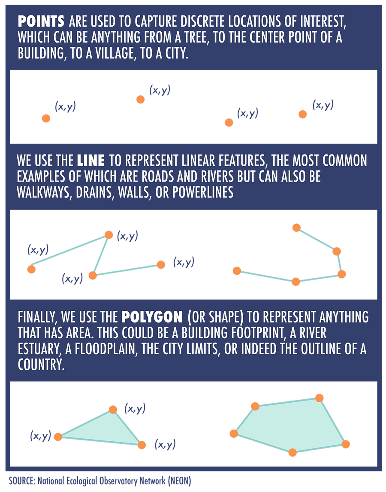
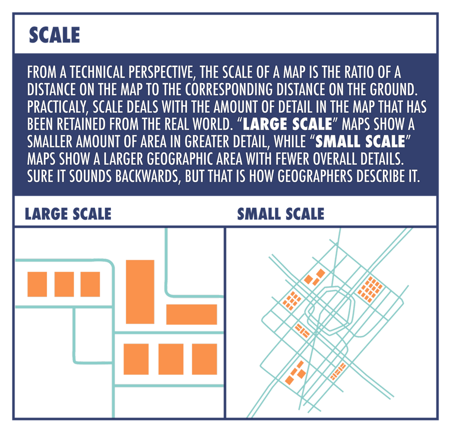
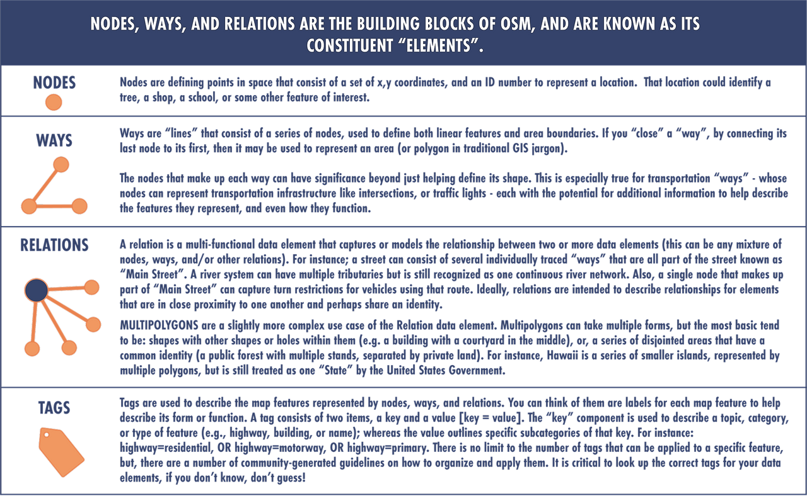
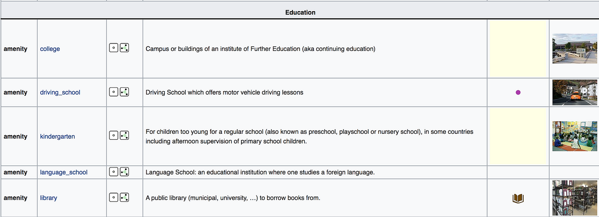

# Module 4: The OpenStreetMap Data Model

This is the fourth of six courses that make up the Introduction to Mapping with YouthMappers Learning Track.

## Overview 
A model is an abstract, simplified representation of reality. From a geographers perspective, a map is a model of the physical world around us. In this module, you will learn about the components of a geospatial data model, and how the OpenStreetMap Data Model differs (and aligns with this). You will learn how we distinguish features in the OSM data model using the tagging system, and how that is employed for symbology and querying. 

**What you will learn in this course:**
- The components of a geospatial data model
- The components of the OSM data model
- How we distinguish features in the OSM data model using the tagging system

## Data Models 

### What is a data model and why does it matter in the world of geography?

A **model** is an abstract, simplified representation of reality. From a geographer's perspective, a map is a model of the physical world around us. It represents the map makers’ interpretation of their surroundings, boiled down to simple symbols and pictorial representations of real-world features. Traditional paper maps are often singular in their theme or purpose. The picture represents the location and extent of the mapped feature, with perhaps changes in color or shading to signify some characteristics or other features. 

When we move toward storing and representing geographic data in a digital environment, we have an increased capacity to capture just about any characteristic of that piece of data. 

Additionally, since thousands of people might be trying to capture the same data, it is critical that each person's contributions conform to some kind of standard. For instance, can a dirt road be a primary road? These are difficult decisions, sometimes without a lot of clear guidance from experts. 

A **data model** (a term that goes beyond the world of geography) is a conceptual representation of a set of objects, with standard rules for how these objects relate to one another, and to the properties of real-world entities that they depict. It enforces consistency in how things are organized; think of it as data housekeeping. This is all incredibly important in global data collection campaigns. 

When it comes to geographic data, we have the meeting of the **what** and the **where**. We need a way to capture both the physical location and the information that describes or measures the many features in our landscape in a uniform and consistent manner. Data models are used in geography to bring a sense of order to this representation. 

### Traditional Geographic Data
In “traditional” geospatial data representation, geographic features are visually represented as points (x, y coordinates), lines (strings of x, y coordinates), and polygons (closed strings of x, y coordinates), the characteristics of which are stored in a table of some sort. More often than not, this is called an “attribute table”. The naming conventions vary a little, depending on the discipline (or software being used), but, the overall idea is basically the same.

### Why would I use one type of geometry or data type over the other?

There are a number of things that dictate how we represent features on a map. The first of these would be scale, the second would be data access/availability. 

Traditionally (and by this, we mean for paper maps), the scale of the map that you will eventually make will dictate whether something will be represented as a point or a way (line or polygon shape). Large scale maps require less detail, due to the restrictions on display. The fact that OSM has multiple zoom levels means that it can capture an incredible amount of detail, therefore, the scale of the map itself isn’t a restricting factor. 

Ultimately, we use the most detailed geometry that we can accurately collect, or depict, from available imagery that meets the needs and time constraints of our project. Simpler geometry isn’t “wrong”, but it can be considered a starting point or placeholder until the mapping community has the time and resources to add more detail to the map. (For instance, Points of Interest (POI’s) in lieu of detailed building footprints, or, a single point to mark the center of a settlement, or “place”.) Convention does override scale in some instances, for example, we almost always use lines for roads, regardless of the map scale.

## Data Architecture 
### What is the data architecture behind OSM?

OSM [organizes geographic data](https://wiki.openstreetmap.org/wiki/Elements) in a slightly different way than traditional GIS programs. The concept of points, lines, and polygons give way to nodes (points) and ways (used for both lines and polygons; a closed “way” is how we represent a polygon in OSM). “Relations” are used to describe the relationships between these features, and, finally, “tags” to capture key pieces of information about each feature, in much the same way as “attributes” in traditional GIS.

## Tagging Hierarchy 

### An Introduction to Tagging 
OpenStreetMap's free tagging system allows us to include an unlimited number of attributes describing each feature. The community agrees on certain key and value combinations for the most commonly used tags, which act as informal standards. However, established users regularly suggest new tags to improve the style of the map; therefore, it is important to keep a close eye on the Wiki, so that you are aware of any additions to the tag library.  

OpenStreetMap has an incredibly detailed Wiki, with subpages devoted to commonly used key and value pairs. These feature short descriptions of key/value pairs that relate to particular topics or interests, with images to help the mapper to distinguish the real world feature. Remember: Most features can be described using only a small number of tags, such as a neighborhood road with a classification tag such as highway=residential, complemented with its name using the tag name=*. 

Every new mapper should visit the [**Map Features Page**](https://wiki.openstreetmap.org/wiki/Map_features) to become familiar with how the system is organized and to identify some of the most commonly used tags. This is an incredibly detailed resource, and somewhat overwhelming at first glanced. 

Don’t be daunted. It takes time and practice to become proficient in tagging!

### Frequently Used Classifications

The **Map Features Page** on the OSM Tagging Wiki has a well organized layout.  

Every entry has a key and value pairing, a detailed description, and image example of the feature in the real world. 

*This image shows a selection of Educational tags associated with the Amenity Key. The Amenity key is used to describe the function of a building or facility. (see more about the Amenity Key below)*

In particular, you should become familiar with the tagging conventions for Highways, Buildings, and Amenities, as these are very frequently-used classifications.

[**Highways**](https://wiki.openstreetmap.org/wiki/Key:highway)

This tag set is used to distinguish between different types of roads, streets, or paths. As road standards and classification systems vary from country to country, this tag set can be difficult to standardize globally. In OSM we tend to categorize (and tag) our roads according to their importance within the network for that particular country. Therefore, what constitutes a primary road in England, will look different to a primary road in Nigeria or Nepal. Common tag pairs include; *highway=primary, highway=residential, and highway=pathway*. It is important to study the road tags used by experienced mappers in your area, to familiarize yourself with the local convention. If you are participating in a team mapping project, the project manager will usually instruct mappers as to the correct identification and tagging to be used for the highway/road network in that area. The wiki also contains a useful table to help mappers understand the [International Equivalent](https://wiki.openstreetmap.org/wiki/International_highway_classification_equivalence) when it comes to highways. 

[**Buildings**](https://wiki.openstreetmap.org/wiki/Map_Features#Building)

This tag set is used for the physical identification of a structure. At the most basic level, we use the pairing *building=yes* - this denotes that we have a building structure of some type, but do not know what it is specifically. Building=yes is the most common tag that remote mappers use when tracing buildings from satellite imagery, as it is often impossible to tell whether a building is a home, commercial, or civic property (or some mixture of all) from an aerial perspective. Other popular building tags are *building=residential* and *building=commercial*. These are hard to determine from aerial imagery and *are not used unless the mapper has personal/local knowledge of an area*. The building tag set has many more detailed sub-options, so please take a look at the wiki and become familiar with them all. 

[**Amenity**](https://wiki.openstreetmap.org/wiki/Map_features#Amenity)

This tag set is used to describe how a particular structure is used by the occupants and is often found in conjunction with one of the *building=** tags. Amenities tags have broad subcategories such as: 

- Sustenance, which contains tags like *amenity=cafe*, or *amenity=restaurant*

- Education, which contains tags like *amenity=school*, or *amenity=college*

- Healthcare, which contains tags like *amenity=hospital*, or *amenity=pharmacy*

## Want to Dig a Little Deeper?

Refer to the information below to learn more about OpenStreetMap Data Model materials. 

[Multipolygons Examples](https://wiki.openstreetmap.org/wiki/Multipolygon_Examples): Multipolygons are an important but sometimes difficult to conceptualize construct in OSM.

[Highway Tags for Africa](https://wiki.openstreetmap.org/wiki/Highway_Tag_Africa): There is a dedicated page on the OSM wiki that covers the Typology of Road Networks in African countries. The road conditions in African countries do not always correspond to their economic and social role. A road typology should be based on the road importance and not on the surface or the visual appearance of a road. In some areas, major roads are unpaved and heavily damaged during the rainy season. It is important for remote mappers from other countries to adapt to this reality.

## Conclusion 

### YouthMappers Academy: Skills, Proficiencies, and Standards

The following competencies derived from both the Geospatial Technology Competency Model and the National Geographic Standards are central to the successful completion of YouthMappers Academy Course: The OpenStreetMap Data Model. 

### The Geospatial Technology Competency Model:

1. Interpersonal Skills: Demonstrating the ability to work effectively with others through interaction with peers and course moderators

2. Initiative: Demonstrating gumption at work/school

3. Dependability and Reliability: Displaying responsible behaviors at work/school

4. Lifelong Learning: Displaying a willingness to learn and apply new knowledge and skills

5. Reading: Understanding written sentences and paragraphs in work-related documents 

6. Geography: Understanding the science of place and space; geographic skills

7. Basic Computer Skills: Using a computer and related applications to input and retrieve information; navigation and file management, and internet and email

8. Planning and Organizing: Planning and prioritizing work to manage time effectively and accomplish assigned tasks; planning and organizing; adaptability and flexibility; time management

9. Data Quality: Accuracy, resolution, precision, fitness for use; quality control versus quality assurance; data quality implications of legacy systems

10. Geographic Information Systems: Conceptual foundations, including representation and uncertainty; compare spatial data models, such as vector, raster, and object

11. Professionalism: Know codes of ethics and rules of conduct; legal, ethical, and business aspects of data sharing

### The National Geographic Standards:

1. The World in Spatial Terms: 
  - How to use maps and other geographic representations, geospatial technologies, and spatial thinking to understand and communicate information
  - How to analyze the spatial organization of people, places, and environments on Earth's surface

2. Places and Regions: The physical and human characteristics of places

3. Human Systems: 
  - The processes, patterns, and functions of human settlement
  - Human Systems: How the forces of cooperation and conflict among people influence the division and control of Earth's surface

4. Environment and Society: 
  - How human actions modify the physical environment
  - How physical systems affect human systems

5. The Uses of Geography: 
- How to apply geography to interpret the past
- How to apply geography to interpret the present and plan for the future

## Congratulations!

Congratulations on completing Course 4: The OpenStreetMap Data Model of the YouthMappers Academy series! 

## What's Next?

The YouthMappers Academy series contains six courses, shown in the image below. 

To read more about the next course in the series, Course 4: The OpenStreetMap Data Model, click [here](https://www.youthmappers.org/academy).

