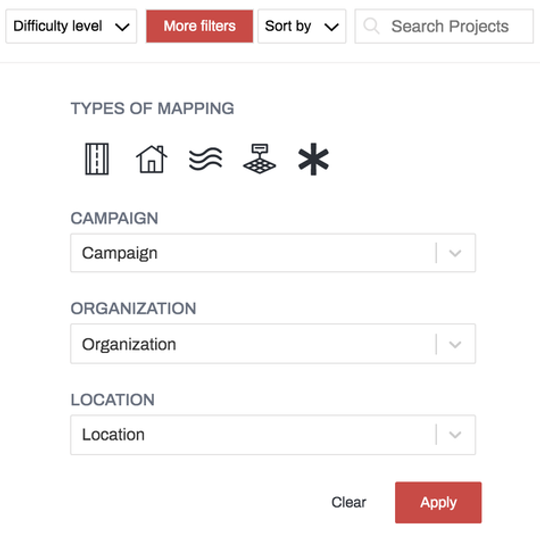
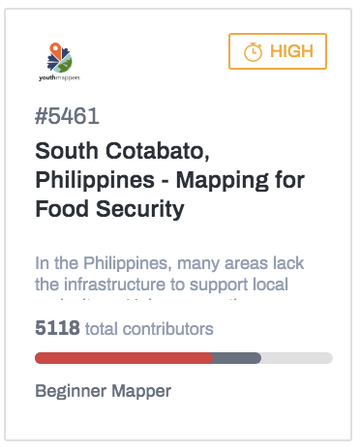
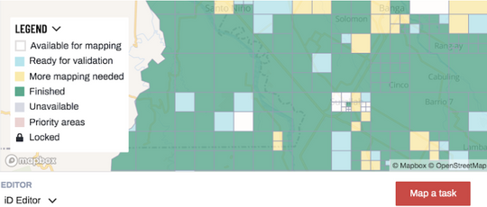
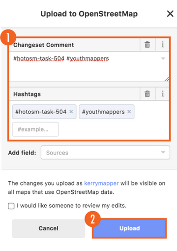
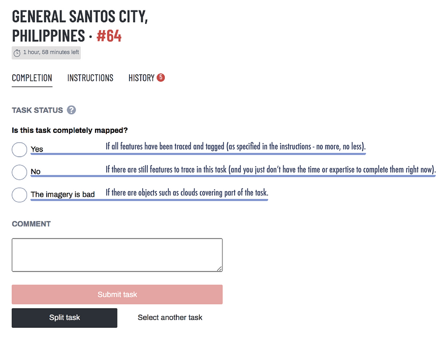
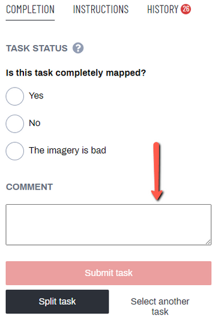
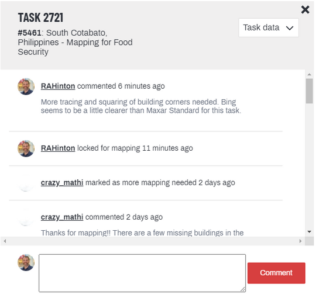
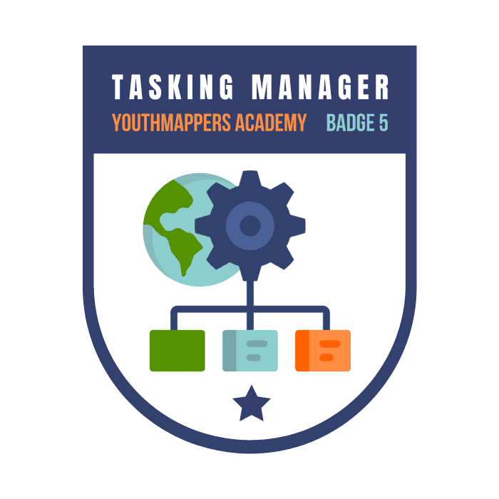

# The Tasking Manager

This is the fifth of six courses that make up the Introduction to Mapping with YouthMappers learning track.

## Overview 
You can edit anywhere at any time in OSM but, when a large group of people are all focused on the same geographical area, you can run into trouble with duplicate edits and overlapping features. To ensure optimal coverage of the study area and minimal overlap, we use a web based platform called the OSM Tasking Manager. In this course you will learn how to find and contribute to relevant OSM tasks; how to lock, edit, and release a particular tile, and how to appropriately comment and tag your contributions.  

**What you will learn in this course:**
- How to find and contribute to relevant OSM tasks
- How to lock, edit, and release a particular tile
- How to coordinate the OSM mapping of a large group
- How to appropriately comment and tag your contributions
- How to ask task-specific questions and provide feedback to the group

## What is the Tasking Manager?

You can edit anywhere at any time in [OSM](https://www.openstreetmap.org/#map=5/42.81/-93.12&layers=N) but, when a large number of people are all focused on the same geographical area, you can run into trouble with duplicate edits and overlapping features. To ensure optimal coverage of the study area and minimal overlap, we use a web-based platform called the [OSM Tasking Manager](https://tasks.hotosm.org/). 

The [OSM Tasking Manager](https://tasks.hotosm.org/) is a platform developed by the [Humanitarian OpenStreetMap Team (HOT)](https://www.hotosm.org/) that features thousands of coordinated mapping projects from all over the world. For each project, the geographic study area is divided into a grid, allowing each mapper to edit a smaller part of a larger area. The individual cells or squares from the master grid are called “tasks”, and each task is color-coded so that mapper knows which ones are already complete, which ones are currently being mapped, and which ones are open and available for mapping. 

This incredibly effective tasking system allows mappers all over the world to coordinate on specific geographical areas in the most efficient way. 

## Navigating the Interface 

### Getting Started 
To begin, go to the [Tasking Manager website](https://tasks.hotosm.org/). Log in using your OSM credentials (the same credentials you used on the iD platform), this way, any edits you make while working through the Tasking Manager platform will be associated with your OSM account.

Once logged on, you can immediately find a project to work on ([EXPLORE PROJECTS](https://tasks.hotosm.org/explore?omitMapResults=1)), or learn more about HOT and the Tasking Manager via the links near the top of the page ([LEARN](https://tasks.hotosm.org/learn/map)).

### Finding Projects

To find a project to work on, click on "[EXPLORE PROJECTS](https://tasks.hotosm.org/explore?omitMapResults=1)" near the top of the page. This will bring up the dashboard which shows the active projects sorted by priority, with the most urgent project tiles listed first. There is also a toggle button in the upper right corner to turn on/off the project map locator if you would like a visual of current projects.


### Filter Tools



To help you find a task you are interested in, several filter tools are available to you. These tools allow you to refine your search for a project based on its level of difficulty, the type of feature to map (a project that focuses on roads or buildings), the campaign, organization, geographical location, and/or specific project number. If you are working on a particular campaign or know the specific project number you can search for those specific items to bring up the project tile immediately.

## Contribute to a Project 
### Reviewing a Project 
1. Once you find the project you wish to contribute to, click the project card on the dashboard (see image to the right). 

*NOTE: The tasks used in this lesson may be complete by the time of publication, but don’t worry, you can pick any task that matches your mapping abilities and interests. The HOT Tasking Manager is constantly updated with new projects and mapping opportunities. Always search by organization for the latest projects by YouthMappers.*

2. This will bring up the overview page of the project which will present additional information, such as who set up the project, why it is important, what features to map or imagery to use, and a detailed description.  



3. As you scroll down the page you’ll also see information on who can map and validate this project (beginner, intermediate mapper, or advanced mapper), a space to post questions and comments, any previous contributors, and the contributions timeline.

*NOTE: Additional components can be found at the bottom of the task description. Notice in the image above the bottom bar includes Overview, Description, Coordination, Teams & Permissions, Questions & Comments, and, Contributions.*


### Mapping a Task
1. To begin mapping, click the *Contribute* button in the bottom right-hand corner of the screen.

2. The page now shows the explicit instructions for this project on the left half of the screen (rather than the overview information from the first window) with the map of the study area and the individual tasks on the right.

3. **It is very important to read the instructions in the left panel very closely, even if you are an experienced mapper.** It will often give justification and context for the mapping project, with details on specific tags to use and information on the most appropriate imagery.

4. To begin mapping, zoom in on the map and click on a specific task square that is *Available for mapping* (the white/transparent squares on the map), then click the *Map selected task button* in the bottom right.



5. Tasks with black locks indicate tasks locked by other mappers. The task you have chosen will display a red lock icon, indicating that it is currently locked by you. 

6.  In the new version of the Tasking Manager, the iD Editor is embedded within the Tasking Manager tool, therefore choosing a task automatically launches iD Editor directly within the Tasking Manager platform. If you decide to use an alternate mapping tool, such as the desktop-based [JOSM (Java OpenStreetMap Editor)](https://josm.openstreetmap.de/), then your edits will happen outside of the Tasking Manager platform. We will look at JOSM in a later module.

## Completing Your Work 

### Release a Task 

1. Tasking Manager tasks remain locked for two hours or until you decide you are finished mapping, if earlier than two hours. When you finish mapping in your task, first you will need to save your edits in iD Editor by clicking on the “Save” button. Just like a regular iD editing session, you will be prompted to add a “Commit Message” before saving. When your iD session is launched from the HOT Tasking Manager, a pre-populated message will appear in the “Commit Message” box. You can add your own comments to this if you wish.

*NOTE: Please make sure to add the #YouthMappers hashtag whenever appropriate.*

2. When the commit message is entered, scroll down and click the blue “Upload” button near the bottom of the left panel to finish the save procedure. You can now trace more features in the same task or finish your mapping session by updating the Task Status in the right pane as described above.

Once you have saved and uploaded your map edits in the embedded version of iD, you need to update the HOT Tasking Manager Task Status.



3. You will update the HOT Tasking Manager **Task Status** by answering the question: **Is this task completely mapped?**



4. You have another opportunity to comment on the work that you have completed. This is in addition to any **Commit Message** that you have already submitted through iD.

5. Once the task has been submitted, it will be unlocked and symbolized according to the correct designation. You are free to select another task to work on.

```{tip} 
YouthMappers Blogspot: A Hot Experience with HOT

[A Hot Experience with HOT](https://www.youthmappers.org/post/a-hot-experience-with-hot) By Akintola Mercy, Olanrewaju Michael, and Ademoyero Victor (Federal University of Technology, Akure, Nigeria) 

In this collaborative blog post, Mercy, Michael, and Victor speak about their participation in the 2020 HOT Data Quality internship program. A virtual network of 70 students from 24 different countries used the HOT Tasking Manager platform (among other open source tools) to train and coordinate on data cleaning (validation) for future disaster response efforts.

```

## Communicating on the Platform

### Communicating on the Tasking Manager Platform 

When working in a collaborative environment, clear and polite communication is key to achieving the project goals (something we have already discussed in the OSM Code of Conduct). The Tasking Manager allows contributors to ask questions, make comments, and provide information as needed.


### Project Communication 
Each project has a “Questions and Comments” section on the main page of the project. Remarks made in this space will be posted on this page and the person who created this project will receive a notification of your post. This is an informative space to see what comments and issues mappers have had in the past along with the posted solutions. 

### Task Communication 



You can also communicate on issues pertaining to a specific task. When you are mapping in a chosen task, below the **Task Status** radio buttons, there is a **Comment** box. 

Please refer to the image on the left for a visual representation of these instructions.

Any comments you have regarding the imagery or tracing specific to this task can be provided here. For example, you might say: *“The imagery was relatively low quality, please take extra time for validation.”*

When you click the **Submit Task** button, immediately below the **Comment** textbox, your remarks will be saved with the task for this project. 

The image below illustrates the screen that follows the submission of a task by clicking the **Submit Task** button.



## Want to Dig a Little Deeper?
Refer to the websites linked below to learn more about the Tasking Manager.

- [LearnOSM](https://learnosm.org/en/coordination/tasking-manager/): Resources and information on the Tasking Manger as well as workflows to contribute to OSM including tools that can be used for editing.

- [HOT Tasking Manager](https://tasks.hotosm.org/learn/map): Humanitarian-based projects and resources on how to map and contribute to OSM.

- [TeachOSM Tasking Manager](https://tasks.teachosm.org/learn/map): For projects that do not have a humanitarian context. This site can host your chapter projects and provides the same functionality of the HOT Tasking Manager.


## Conclusion 
### YouthMappers Academy: Skills, Proficiencies, and Standards

The following competencies derived from both the Geospatial Technology Competency Model and the National Geographic Standards are central to the successful completion of YouthMappers Academy Course: The HOT Tasking Manager. 

### The Geospatial Technology Competency Model:

1. Interpersonal Skills: Demonstrating the ability to work effectively with others, through interaction with peers and course moderators

2. Professionalism: 
  - Demonstrating commitment to the values, standards of conduct, and well being of one's profession  
  - Participate in professional organizations; know codes of ethics and rules of conduct; legal, ethical, and business aspects of data sharing

3. Initiative: Demonstrating gumption at work/school  

4. Dependability and Reliability: Displaying responsible behaviors at work

5. Lifelong Learning: Displaying a willingness to learn and apply new knowledge and skills

6. Reading: Understanding written sentences and paragraphs in work-related documents  

7. Basic Computer Skills: Using a computer and related applications to input and retrieve information; navigation and file management, and internet and email

8. Teamwork: Working cooperatively with others to complete projects

9. Planning and Organizing: Planning and prioritizing work to manage time effectively and accomplish assigned tasks; planning and organizing; adaptability and flexibility; time management

10. Data Quality: Accuracy, resolution, precision, fitness for use; quality control versus quality assurance; data quality implications of legacy systems

11. Software and Application Development: Evaluate open source software

### The National Geographic Standards:

1. The World in Spatial Terms: 
  - How to use maps and other geographic representations, geospatial technologies, and spatial thinking to understand and communicate information
  - How to analyze the spatial organization of people, places, and environments on Earth's surface

2. Places and Regions: 
- The physical and human characteristics of places
- How culture and experience influence people's perceptions of places and regions

3. The Uses of Geography: 
- How to apply geography to interpret the past
- How to apply geography to interpret the present and plan for the future

## Congratulations!

Congratulations on completing Course 5: The Tasking Manager of the YouthMappers Academy series! 



## What's Next?

The YouthMappers Academy series contains six courses, shown in the image below. 

To read more about the next course in the series, Course 6: Chapter Management, click [here](https://www.youthmappers.org/academy).


