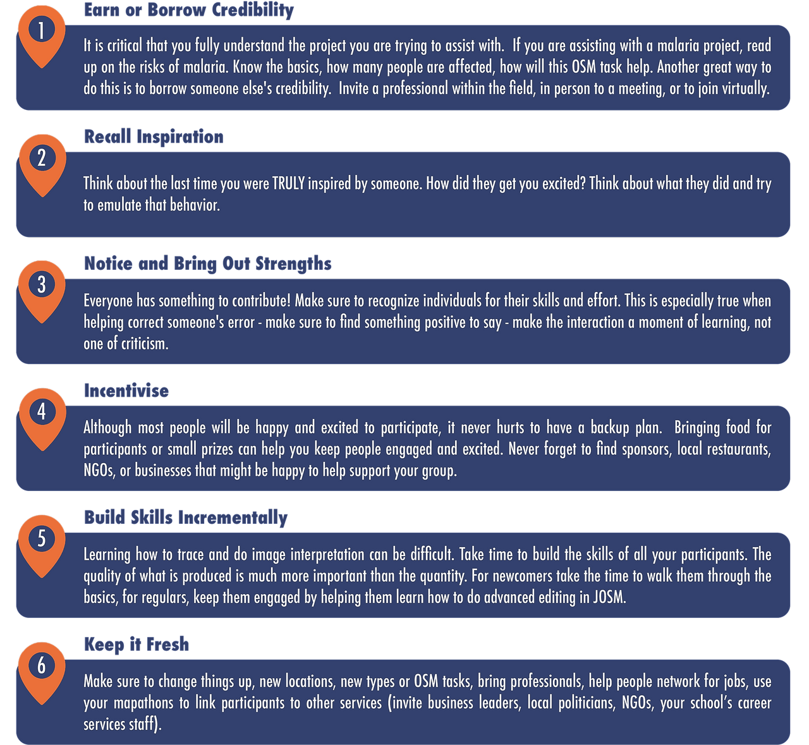
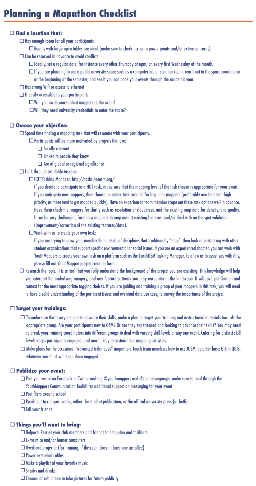
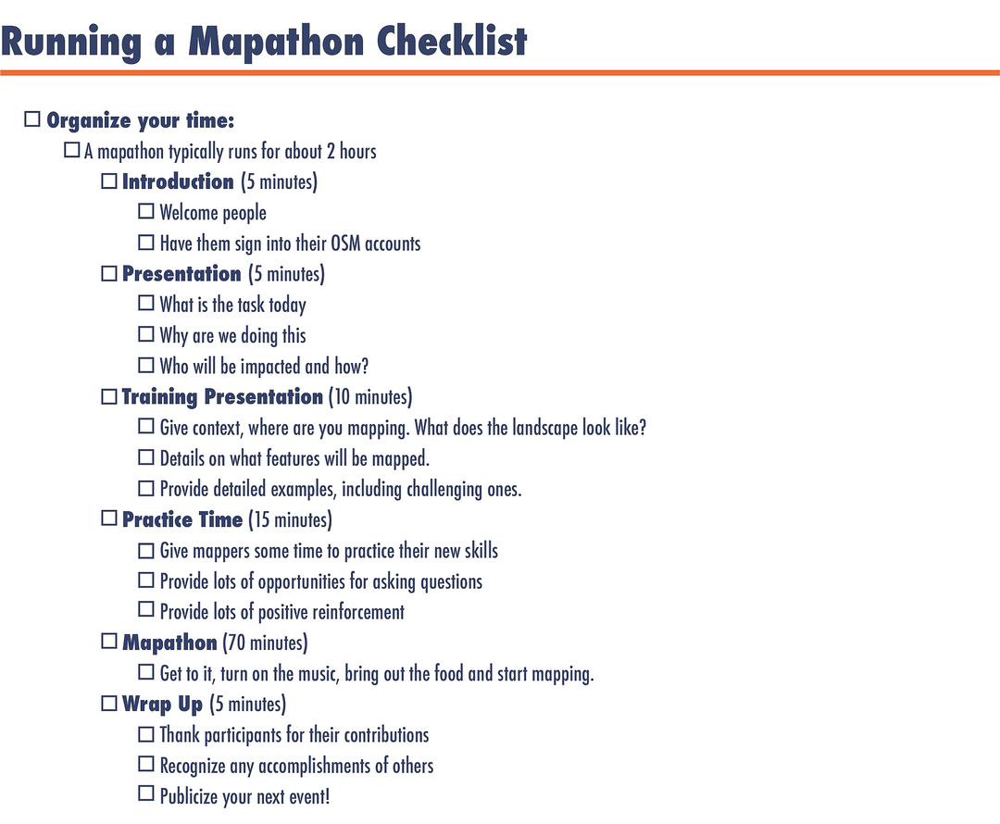
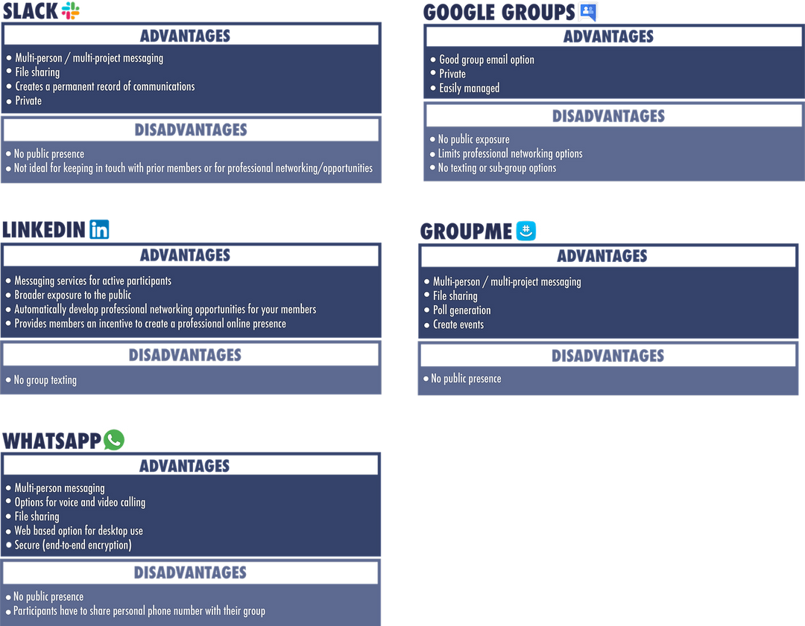
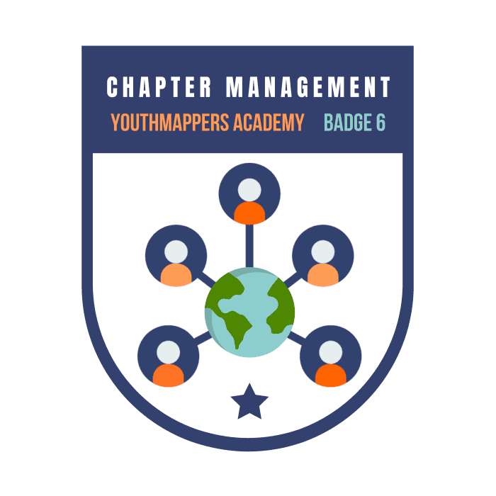

# Chapter Management

This is the final course that make up the Introduction to Mapping with YouthMappers learning track.

## Overview 
In this course you will learn about what it takes to organize and manage a successful YouthMappers Chapter. The “soft skills” (i.e. social, emotional, planning) that will help you get your team up and running and keep them engaged. You will explore how to facilitate meaningful engagement with your projects, and how to keep your peers and collaborators motivated. You will also learn what it takes to organize a successful Mapathon, and explore different communication options to help you keep your team and the community in the loop

**What you will learn in this course:**
- How to facilitate meaningful engagement with your projects
- How to keep your peers and collaborators motivated
- How to plan for a successful Mapathon
- What it takes to organize your Mapathon
- Different communication options to help you keep your team and the community in the loop

## Growing Your Chapter 
### Getting People Involved 
Key parts of chapter management include attracting new chapter members, mentoring members, and keeping them engaged. These aren't easy tasks, as so many things compete for people's attention these days. It is critical to learn how to cut through the noise.

Video: 
[How miscommunication happens (and how to avoid it)](https://www.youtube.com/watch?v=gCfzeONu3Mo) - Katherine Hampsten

```{image} Module6_Static/6.0png
:alt: alt text
:width: 100px

1. **Provide meaningful engagement:** People want to make a difference and make their communities or world better. To help participants find meaning, link your projects to things that are happening in the world, such as addressing a crisis or helping researchers in the field. Make sure you have a clear and powerful message, and keep saying it! Watch the video above to learn more about clear communication.

```{image} Module6_Static/6.01png
:alt: alt text
:width: 100px

2. **Provide value:** Make sure that each event provides something meaningful to your participants. Consider mapping topics that support the interests of other student organizations on campus (such as environmental or social issues), or connect events to local business or community leaders and find ways to leverage these events to provide real value to participants.

```{image} Module6_Static/6.02png
:alt: alt text
:width: 100px

3. **Publicize everything:** You need to be a salesperson for your chapter. Make sure everyone knows about it. Use social media, flyers, and word of mouth to get people involved. Involve chapter members in publicizing things. Various members can hand out flyers or announce the event during class or in another organizational meeting.

For more advice, please see the [YouthMappers Social Media Toolkit](https://sites.google.com/view/youthmapperswiki/chapter-resources/communications-toolkit?authuser=0).

```{image} Module6_Static/6.03png
:alt: alt text
:width: 100px

4. **Use the YouthMappers network:** Your chapter is part of an ever growing international network. Engage with a sister chapter in another country to support their work on a shared topic of interest, or collaborate with multiple chapters to complete large mapping tasks online. If you are a relatively new chapter, it is good to have the support of your peers, in addition to YouthMappers central, when planning a new mapping activity or public event.

```{image} Module6_Static/6.05png
:alt: alt text
:width: 100px

5. **Invite engagement and leadership:** Encourage members to think of ways they can invest in your chapter. Ask them to join in event planning and organization. Trust them with leadership roles and let them start deciding how to run the chapter.

```{image} Module6_Static/6.06png
:alt: alt text
:width: 100px

6. **Share the credit:** Make sure to highlight the accomplishments of your chapter members. Making them feel valued will keep them engaged with you.

```{image} Module6_Static/6.07png
:alt: alt text
:width: 100px

7. **Engage the local OSM community:** YouthMappers is part of a large diverse community of mappers. Unfortunately, many within the community do not engage outside of the editing environment. If you would like to work on a specific mapping topic or task within a specific geographic area, it is important to reach out virtually to those already mapping there. You can start by searching online for local OSM chapters or groups and follow up by scanning the live map for the usernames of regular and trusted contributors. You can reach out to these mappers through the OSM interface to make your introduction.

### Keeping People Motivated
Being a great team leader takes some practice and self-evaluation. Motivation is not a perfect science, but there are some time-tested ways with good rates of success.



```{tip} 
YouthMappers Blogspot: 5 Tips for Creating a Successful YouthMappers Team

[5 Tips for Creating a Successful YouthMappers Team](https://www.youthmappers.org/post/2016/08/25/5-tips-for-creating-a-successful-youthmappers-team) By Randy Peck

Hear from Randy Peck, YouthMappers chapter co-founder from the University of West Virginia, on what it takes to create and sustain a successful YouthMappers Team, from formalizing the chapter with your school to having the right approach to teamwork and organization.

```

## The Logistics
### Planning a Mapathon
Running a mapathon takes some practice and a lot of preparation. Work with your peers to plan and organize your event. If possible, talk to someone who has helped organize one before.Learn what worked and what didn’t. 

To help you get organized, use the following checklist (you can print a .pdf version below). Let’s go through it together now:



Click [here](https://d2jbbv3z6z1uwh.cloudfront.net/youthmappers.course.tc/cohort-1-6/content/uploads/2021/03/09111659/Asset-31.pdf) to download a PDF of the above image.

Click [here](https://docs.google.com/forms/d/e/1FAIpQLScF3fUDzGXOets_Am5sRh93kwFKJKuG5tvqsSf9A_Jbt2F-VQ/viewform) to access the YouthMappers Project Creation form.

Click [here](https://sites.google.com/view/youthmapperswiki/chapter-resources/communications-toolkit?authuser=0) to access the YouthMappers Communications Toolkit. 

```{tip} 
YouthMappers Blogspot: YouthMappers of Dhaka College, Red Crescent Youth Train for Disaster Mapping with OSM

[YouthMappers of Dhaka College, Red Crescent Youth Train for Disaster Mapping with OSM](https://www.youthmappers.org/post/2016/10/26/youthmappers-of-dhaka-college-red-crescent-youth-train-for-disaster-mapping-with-osm) By Sawan Shariar

Hear from Sawan Shariar, a YouthMapper and Bangladesh Red Crescent Society Volunteer, on the two-day training program used to teach members of the Red Crescent Youth, Dhaka College Unit on using OpenStreetMap and various field data tools.

```
### Running a Mapathon
Your primary objective while running your mapathon is to make sure your participants understand what they are doing, know how to do it, and have a good time doing it! Again, planning ahead can help you make sure everything goes smoothly. 

The following video will walk you through the basics of running your mapathon.

Video: [Two Minute Tutorials: How to host an OpenStreetMap mapathon](https://www.youtube.com/watch?v=njxePdKn1pI&feature=youtu.be)

On the day of the mapathon, you can use our [checklist](https://d2jbbv3z6z1uwh.cloudfront.net/youthmappers.course.tc/onboarding/content/uploads/2020/10/22102503/YM_6.2.2_Checklist_v1.pdf) to help you keep organized.



Be sure to check out this [mapathon resource library](https://sites.google.com/view/youthmapperswiki/chapter-resources/mapathons?authuser=0) for more information.

```{tip} 
YouthMappers Blogspot: Mapping a bridge across the Atlantic Ocean

[Mapping a Bridge Across the Atlantic Ocean: How Two University Students Hope to Implement a Sister YouthMappers Community](https://www.youthmappers.org/post/2018/07/13/mapping-a-bridge-across-the-atlantic-ocean-how-two-university-students-hope-to-implemen) By Stella W. Nakacwa and Sonia Torres

Stella W. Nakacwa (Makerere University, Uganda), and Sonia Torres (Rice University, USA), are seeking to increase the engagement of college-aged youth through virtual and real-time open source mapping and validation. In this blog post, they describe how they underwent the planning process to host an inaugural YouthMappers Sister Chapter Data Validation Challenge across two different international universities.

```

## Communication 
### Chapter Representation 
**Branding, Style, and Visual Representation**
We encourage you to promote yourselves and your events by using YouthMappers branding. YouthMappers is a large organization and, as such, it’s important to create consistent standards for logos, naming conventions, and use of color across our communications. This will help your group gain and maintain credibility and grow your active members. 

```{image} Module6_Static/6.11png
:alt: alt text
:width: 60px

To help you apply YouthMappers communications standards, please look through the  [YouthMappers Brand, Name, and Logo Usage Policy](https://docs.google.com/document/d/15CD-5yTIWF0mniuxhZ49i8XQQYjMYauMynGPirQuebk/edit?tab=t.0) and the [Style Tip Sheet](https://docs.google.com/document/d/1r04mPBlqynF3WBJNRCgmioEnT7JiZpb-axmElAFOfWs/edit?tab=t.0#heading=h.gjdgxs). The YouthMappers Brand, Name, and Logo Usage Policy explains logo usage, branding policy, acknowledgements, messaging, and media/press guidance. All chapters should reference this document when starting their chapter and creating official chapter products (e.g., chapter logo, t-shirts, external chapter documents for outreach, and more). The Style Tip Sheet is a quick reference guide for YouthMappers branding policies and it also provides brief social media and writing tips. 

**Media and Press**
For local media inquiries, it is important to identify a specific person from a chapter with clear communication skills to manage positive attention around chapter activities. If the national press makes an inquiry, chapters should be responsive to requests for information or interviews, but also forward them to the program organizers via email at **info@youthmappers.org**. In the rare or unexpected case of negative media attention, we recommend honesty and responsibility and encourage such situations to be brought to the attention of the YouthMappers headquarters immediately. We request that copies of any and all publicity, interviews, photographs, and media coverage in any format be provided to the YouthMappers Steering Committee for our media page and further dissemination.

### Social Media 
**Social Media Communication Tools**
YouthMappers hopes you will stay connected and do outreach via social media. To help you do it more effectively, and to link your efforts (e.g., via hashtags), please refer to our [Communications Toolkit](https://sites.google.com/view/youthmapperswiki/chapter-resources/communications-toolkit?authuser=0). Please tag **@YouthMappers** if you would like a post reshared (e.g., resharing a chapter event) and use **#YouthMappers** when sharing your experience as a YouthMappers member. This guidance applies to Twitter, Facebook, and Instagram.

When posting, keep in mind your security and the perception you will leave with your post (consider the communication guidelines in the OSM Code of Conduct; be considerate, respectful, and inclusive). Limit the amount of personal information you post online (e.g., share a chapter email versus a personal email as a point of contact). For virtual events, when sharing meeting links, avoid sharing the direct link on social media, which will decrease the likelihood of "Zoombombing". Apply security (e.g., a waiting room) to the call or make a registration link instead for the most protection.

### Operational Communication 
- [GroupMe](https://groupme.com/) is a flexible messaging service and includes a number of group-friendly features.

- [WhatsApp](https://www.whatsapp.com/) is a simple, secure, and widespread messaging service that allows for one-on-one and group messaging options.

- [Slack](https://slack.com/) is a popular team communication tool, ideal for coordinating in real-time with a larger team on multiple projects.

- [LinkedIn Groups](https://www.linkedin.com/help/linkedin/answer/a540601/creating-a-linkedin-group?lang=en) is a great option to keep your current and prior chapter members in the loop. You can also link YouthMappers to your LinkedIn profile (see how [here](https://www.youtube.com/watch?v=7yAJKZz8B4A)).

- [Google Groups](https://groups.google.com/my-groups) is a good option for creating an internal group email listserve.
  - The YouthMappers network has a Google Group for chapter officers to collaborate. Sign up for this group by emailing info@youthmappers.org requesting to be added to youthmappers_officers@youthmappers.org and include your chapter name and chapter leadership position.

  Let's look at the advantages and disadvantages of each of these communication platforms below:

  

## Want to Dig a Little Deeper?
Refer to the links below to learn more about chapter management.

- [Manage a Successful Team](https://www.nytimes.com/2018/12/19/smarter-living/attachment-styles-work-life-balance.html): Excellent advice from the New York Times about building and managing an effective team. See how to manage your mapathon with [YouthMappers Mapathon Toolkit](https://sites.google.com/view/youthmapperswiki/chapter-resources/mapathons?authuser=0).
- Missing Maps also shares useful advice and material for planning a mapathon: [How to host a Mapathon](https://www.missingmaps.org/assets/downloads/mapathon-materials/english/How_to_Host_a_Mapathon_EN.pdf)
- Checklists:
  - [Organizing a Mapathon Checklist](https://www.google.com/search?sca_esv=af4d784551d81640&sxsrf=AE3TifORfcwX9Yi4TViKIGAFBeGO82WYYw:1749510600266&q=https%25253A%25252F%25252Fd2jbbv3z6z1uwh.cloudfront.net%25252Fyouthmappers.course.tc%25252f+Cohort-1-6%25252+Content%25252+Uploads%25252F2021%25252F03%25252F30082203%25252FPlanning-a-Mapathon-Checklist.docx%26scope%3Dsession%26scope_id%3D6bf50bf8-489e-4d67-9518-68349480069b%26id%3D626fa72a-632a-4657-8e0b-1d5e5790b344&spell=1&sa=X&ved=2ahUKEwi9h_DuuuWNAxWng4kEHTXsIB0QBSgAegQIEBAB&biw=1440&bih=669&dpr=2)
  - [Day of Mapathon Checklist](https://youthmappers.course.tc/api/v2/links?to=https%253A%252F%252Fd2jbbv3z6z1uwh.cloudfront.net%252Fyouthmappers.course.tc%252Fcohort-1-6%252Fcontent%252Fuploads%252F2021%252F03%252F30082205%252FDay-of-Mapathon-Checklist-.docx&scope=session&scope_id=6bf50bf8-489e-4d67-9518-68349480069b&id=826c5ea5-3e8a-44c8-a282-b67ed315e4f5)

  ```{image} Module6_Static/6.13png
:alt: alt text
:width: 100px

## Conclusion
### Skills, Proficiencies, and Standards 
Each badge awarded as part of the YouthMappers Academy has been aligned to the skills and proficiencies outlined in the U.S. Department of Labor's [Geospatial Technology Competency Model (GTCM)](https://www.careeronestop.org/competencymodel/competency-models/geospatial-technology.aspx) as well as National Geographic’s [National Geography Standards](https://education.nationalgeographic.org/resource/national-geography-standards-index/).

**The Geospatial Technology Competency Model:**

1. **Interpersonal Skills:** Demonstrating the ability to work effectively with others, through interaction with peers and course moderators
2. **Professionalism:** 
  - Demonstrating commitment to the values, standards of conduct, and well being of one's profession  
  - Know codes of ethics and rules of conduct; legal, ethical, and business aspects of data sharing
3. **Initiative:** Demonstrating gumption at work/school
4. **Dependability and Reliability:** Displaying responsible behaviors at work/ school
5. **Lifelong Learning:** Displaying a willingness to learn and apply new knowledge and skills
6. **Reading:** Understanding written sentences and paragraphs in work-related documents  
7. **Geography:** Understanding the science of place and space; geographic perspectives
8. **Basic Computer Skills:** Using a computer and related applications to input and retrieve information; navigation and file management, and internet and email
9. **Teamwork:** Working cooperatively with others to complete projects
10. **Planning and Organizing:** Planning and prioritizing work to manage time effectively and accomplish assigned tasks; planning and organizing; adaptability and flexibility; time management
11. **Data Quality:** Accuracy, resolution, precision, fitness for use; quality control versus quality assurance; data quality implications of legacy system


**The National Geographic Standards:**

1. **The World in Spatial Terms:**
  - How to use maps and other geographic representations, geospatial technologies, and spatial thinking to understand and communicate information
  - How to analyze the spatial organization of people, places, and environments on Earth's surface

2. **Places and Regions:** 
  - The physical and human characteristics of places
  - How culture and experience influence people's perceptions of places and regions

3. **The Uses of Geography:** 
  - How to apply geography to interpret the past
  - How to apply geography to interpret the present and plan for the future

### Congratulations!
Congratulations on completing Course 6: Chapter Management of the YouthMappers Academy series! 


