# Introduction to Mapping with JOSM 
 
## Overview 
Welcome to Course 7 of the Youthmappers Academy. In this module, we will take a look at JOSM, or, the Java OpenStreetMap Editor. JOSM is a desktop editing application for OpenStreetMap, written in Javascript, which provides a whole host of advanced editing 
tools for working with OSM data. JOSM is also the preferred tool for validation in OSM (we’ll talk a little more about validation in the next module). Apart from the advanced editing functionality of JOSM, one of its primary benefits is that it allows you to download and work on OSM data offline, which is incredibly beneficial in low/no bandwidth areas. 

## What is JOSM?
### Overview 
Java OpenStreetMap Editor (JOSM) is an advanced desktop editing application for OpenStreetMap, written in Javascript. It runs on Windows, Mac OS, and Linux operating systems, so is widely accessible. Mappers “check-out” or “download” OSM data to edit offline (which is a huge advantage in low bandwidth areas). When editing is complete, mappers “push” or “upload” their data back to the OSM server. There are built-in checks as part of the re-upload process to check for correct geometry and complete tagging. While JOSM supports the editing and re-upload of existing nodes, ways, tags, and relations that have been downloaded from the OSM database, it also supports the editing of stand-alone GPX tracks and GPX track data, before this data is added to OSM. 

New mappers may find the JOSM interface slightly intimidating, but with practice, most mappers find JOSM to have a much more efficient editing workflow than iD editor, with many great shortcuts to expedite the mapping process.

## JOSM Installation 
### Overview 
If you don’t already have a copy of JOSM on your machine, you will need to visit the following link and install the version of JOSM for your operating system: [JOSM Installation Files](https://josm.openstreetmap.de/). 

There are two main categories of installation available to the user:
- The **josm.jnpl** option, also known as the “web start” option, allows users to start the application software directly from the internet using a web browser. The main benefit of this option is seamless version updating and greater control of memory allocation. 
- The **josm-tested.jar** version is the standard desktop installation (which works across all operating systems), but you can also click on the dedicated install links for certain popular OS (windows/macOS) from the front page. 

#### So Which One Should I Choose?
Every regular JOSM user has a preference for one installation or another. I’ve tried both (.jnpl and dedicated OS install), and both have worked equally well for me. More recently I’ve opted for the .jnpl install, as the automatic updates are a really nice feature. For someone who uses JOSM regularly, it really does cut down on maintenance. 

It is important to note that JOSM requires the most recent version of Java to be installed on your machine in order to function properly. You can either go to [Java Installation](https://www.java.com/en/download/) to check and see that you have the latest version of Java installed, or, wait for the prompt during the JOSM installation, which will also alert you to update your Java (if necessary).

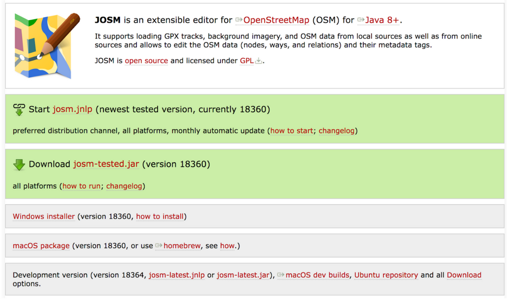

## Navigating the JOSM Interface 
### Launch JOSM
#### Overview 
##### Launch JOSM 
When JOSM is launched and loaded, the main interface will look like this: 

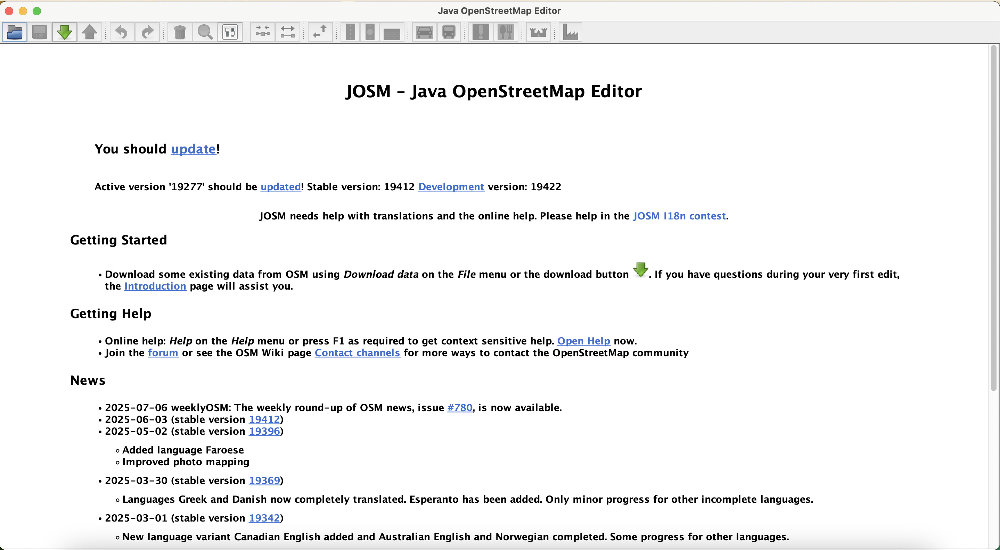

***Note: Depending on whether you have a PC, Mac, or Linux operating system, the “look and feel” of JOSM will be slightly different, as will the location of some of the menus. Where possible, we will provide both Mac and PC screenshots to help you navigate the most popular options.***

##### Accessing Your Preferences 
There are quite an array of menus and toolbars in JOSM, with many functions accessible in more than one location. Let’s take a walk-through to familiarize you with the most important ones⏤then we’ll start mapping.

There are a number of key settings that need to be in place before you begin mapping, so let’s look at those first. These settings are found in the JOSM Preference menu. To access the Preferences menu:
- **PC:** Go to Edit > Preferences
- **MacOS:** Go to JOSM (in the main Mac toolbar) > Preferences(Refer to the image to the right if using a Mac.) 

##### Mac Visual 
```{image} Module7_Static/7.03.png
:alt: alt text
:width: 100px
```

##### The Preferences Menu
The multiple tabs to the left contain detailed settings for everything from display settings to default colors, default language, and data handling. We won’t go through each one in detail, just one or two key settings to get us up and mapping. But, on your own time, navigate through each to see the level of customization possible to create a very personalized editing experience within JOSM.

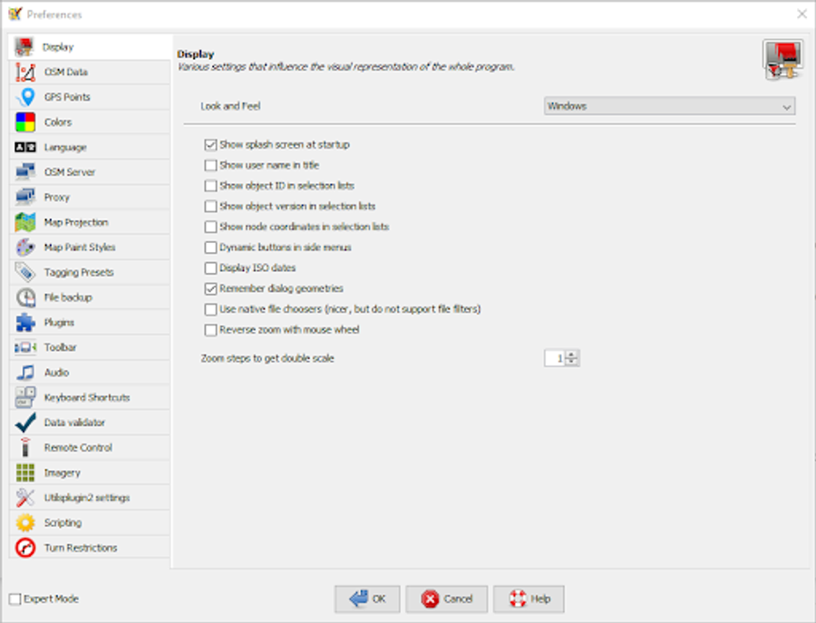

***Note: You may have fewer tabs in your view. Additional tabs are associated with customization through plugins.***

#### Connect to the OSM Server 
The most important setting to specify is your connection to the OSM server, along with your personal OSM credentials. This will ensure that any edits and subsequent uploads that you make to OSM data using JOSM will be attributed to your OSM account. 

To start, click on the OSM Server tab in the Preferences dialog box (this is the sixth tab down on the left-hand side).

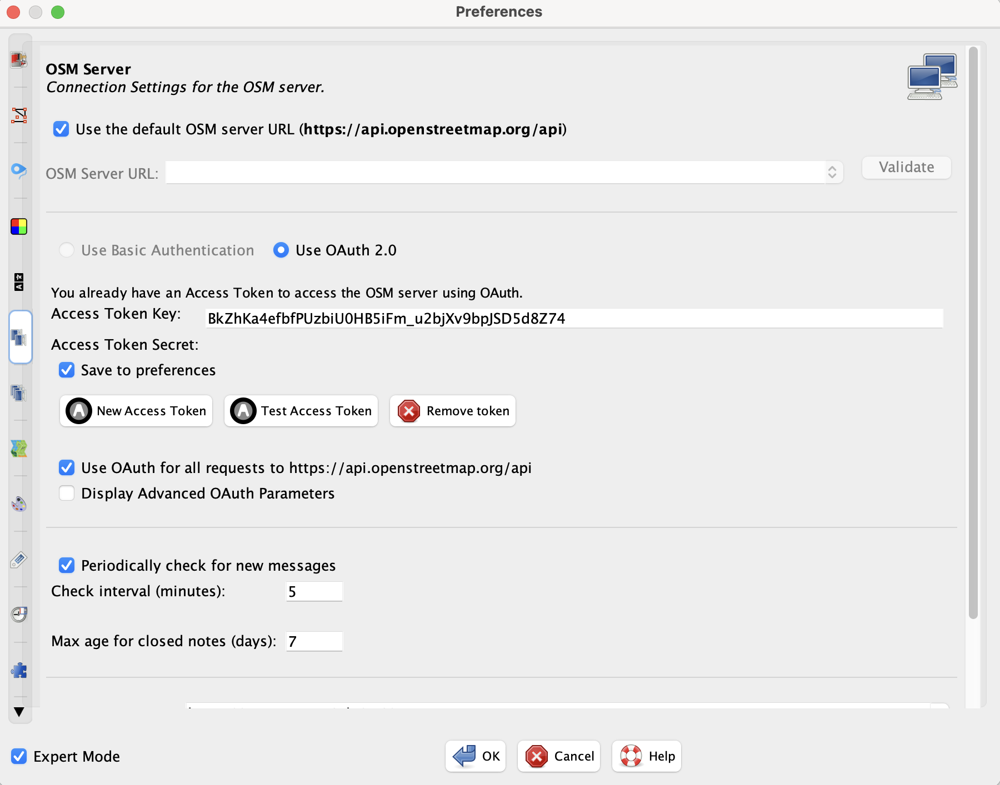

In this tab, you specify your account information so that any of the edits that you perform and re-upload to the OSM server will be attributed to you.

There are two ways to go about this:

- The **Basic Authentication** route (just specify your OSM username and password)
- The **OAuth** option (I would recommend this option if the JOSM installation is on your personal machine)

For now, let’s work with your OSM username and password, and, on your own time, you can set up a more permanent connection through OAuth.

### Customize JOSM 
#### OAuth Steps 
If you choose to go with the OAuth option for account verification, you are granting JOSM the right to automatically upload map data on your behalf for all future download/upload requests. In order to facilitate this, you must receive an “access token” from the OpenStreetMap website. You initiate the process by entering your OSM username and password. 

- Enter your username and password into the dialog boxes
- Click Authorize Now 

You will receive notification that an OAuth Access token has been granted, which you must accept. 
- Click on Accept Access Token This token will be used in subsequent upload requests to access the OSM application user interface (API).

#### Plug-ins 
```{image} Module7_Static/7.06.png
:alt: alt text
:width: 100px
```

##### Plug-ins 
There are many **plug-ins** that you can add to the basic JOSM install to improve functionality and interactions with other platforms. Plug-ins are add-ons or extensions that enhance the capabilities of a software platform, without the need to alter the existing software install. 

In JOSM we have many plug-ins to choose from, including one dedicated to drawing pre-tagged, geometrically accurate buildings, and another that allows us to work with Field Papers more efficiently. 

We will look at plug-ins in more detail in the next module.

#### Remote Control 
The last setting we’re going to set up is **remote control**. This is a particularly important feature if you want your JOSM installation to work with certain websites, like the various OSM Tasking Managers. It will allow your JOSM instance to do things like download data with specific geographic extents, like the extent of a grid cell from the tasking manager. 

- Click on the Remote Control tab from the side menu
- Choose the settings from the image below:
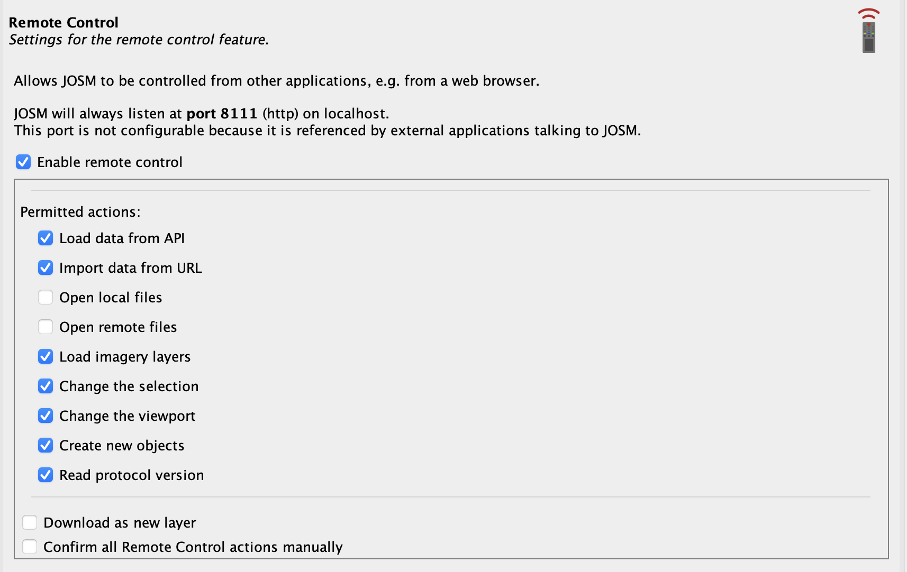
- Click OK to save the changes to Preferences

***Note: Depending on the changes you have made, you may be prompted to restart JOSM.***

## Tour the Interface 
### Map View 
Before we download or edit any live data, let’s tour the JOSM interface and practice drawing some simple features. 

- Go to File > New Layer. You will see the following screen:
7.08

**MacOS View:**

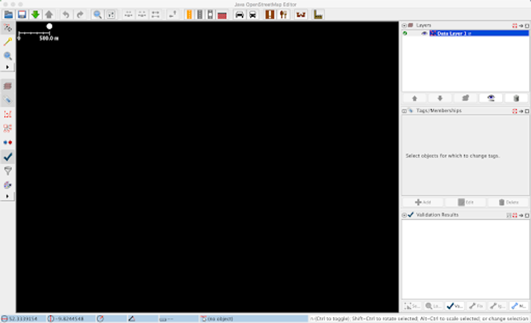

**PC View:**

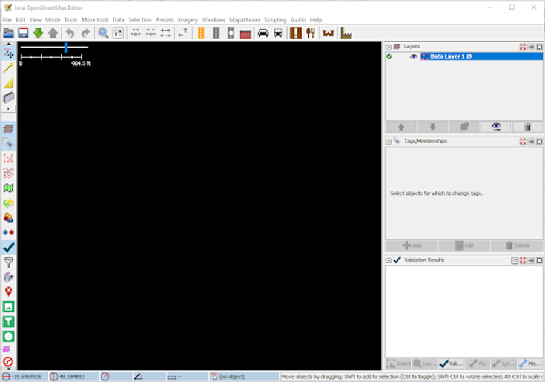

The main window or panel within the interface (the part which is currently black) is called the Map View. This is where the data is displayed and where the editing takes place.

Surrounding the Map View panel, you will see various toolbars and menus. These toolbars and menus are customizable depending on which plugins you have installed. Therefore, your view may differ slightly from the screenshots.

### Toolbars 

These are the main **drawing tools:**
- Select (S) ***(top)***
- Draw Nodes (A) ***(bottom)***

```{image} Module7_Static/7.10.png
:alt: alt text
:width: 100px
```

These are the tools to **open, save, download, and upload** your data:

```{image} Module7_Static/7.11.png
:alt: alt text
:width: 100px
```

These are the **preset tagging tools**, for popular road/street, transport, and facility tags: 

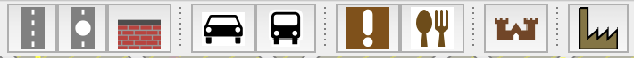

### Information Panels 
The Information Panels to the right of the Map Frame show information about the data in JOSM, the different layers in the view, the imagery being used, how objects are tagged, and who the last mapper to edit a feature was.

```{image} Module7_Static/7.13.png
:alt: alt text
:width: 160px
```

You can customize which panels you’d like to feature in this bar on the right-hand side of the map view. The options are available under the “Windows” drop-down menu at the top of the screen.

```{image} Module7_Static/7.14.png
:alt: alt text
:width: 160px
```

***Note: The options you see in your Windows drop-down list will depend on the plug-ins that you have installed on your machine.***

### Status Bar 
Finally, at the bottom of the JOSM window, the Status Bar gives coordinates and measurements for features, as well as a hint of the current tools.

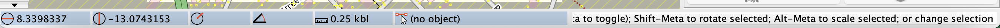

## Drawing Features in JOSM 
### JOSM: Drawing Basic Features 
#### Overview 
Remember, we first covered OSM data types in Course 2 when we learned how to draw our first features with iD editor, and also in Course 4, when we learned about the OSM data model. 

Here is a quick reminder:
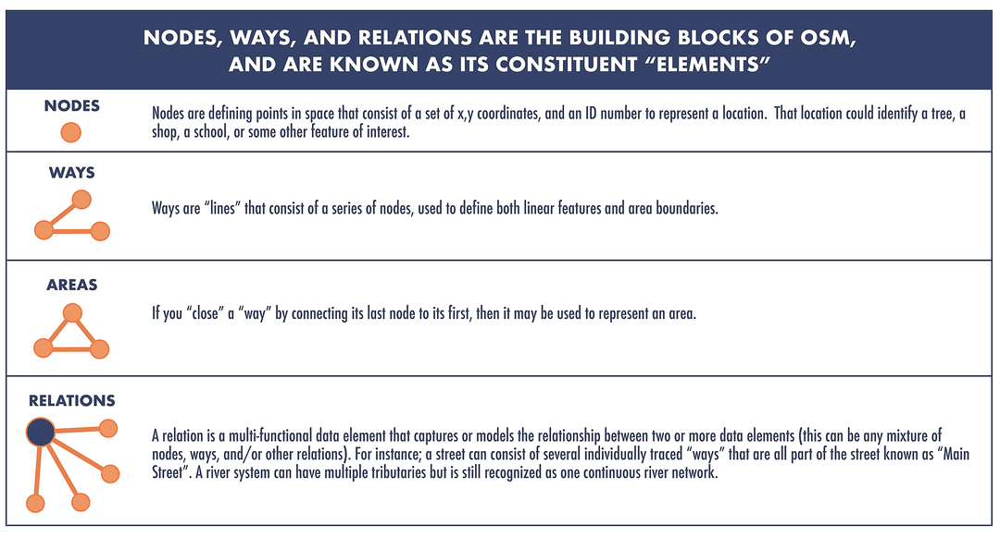

#### JOSM Basic Editing Tools
- **Select:** For selecting elements, viewing/editing their tags, and moving them (Keyboard shortcut: S for PC and MacOS). Just click on the “Select” tool and use the left mouse button to select and/or move your object.
- **Draw:** For adding elements such as standalone nodes, adding new nodes to create a new way, or extending an existing way (Keyboard shortcut: A for PC and MacOS).
- Delete: Delete is for deleting elements. You simply select a feature (using the select tool) and then use the delete button on your keyboard (PC) or Fn+delete (MacOS). Alternatively, you can enter into Delete Mode which will delete every feature you left-click on with your mouse. You can enter into Delete mode by:
  - Shortcut Key (Keyboard shortcut: Ctrl+Delete (PC), Fn+delete (MacOS)
  - Mode Menu (Which will add an icon to your edit toolbar).
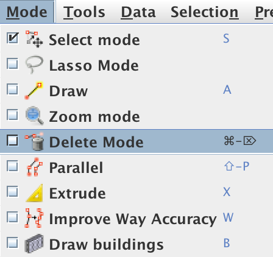
  - Once you've activated Delete Mode, click on nodes, way segments, and ways to delete them. 

#### JOSM Basic Navigation 
```{image} Module7_Static/7.18.png
:alt: alt text
:width: 100px
```

Moving about can be a little different in JOSM than in other mapping software or platforms, but you’ll soon get the hang of it.
- Drag the map: Hold down the right mouse button
- Zoom in/out: Use your scroll wheel

```{tip} 
YouthMappers Blogspot:  A YouthMappers Introduction to Java OpenStreetMap (JOSM)

[ A YouthMappers Introduction to Java OpenStreetMap (JOSM)](https://www.youthmappers.org/post/a-youthmappers-introduction-to-java-openstreetmap-josm) By Alysa Chen, Vassar College (USA)

Hear from Alysa as she talks us through learning JOSM as a non-technical student, and how it helped to increase her mapping productivity and efficiency.

```

#### Drawing a Node 
To draw a standalone node:

- Click on the Draw/Add tool (keyboard shortcut: A). When you move your mouse over the Map View, you will see a little crosshairs icon.

- Double-click quickly on the left mouse button to create a single node.
***Note: If you don’t double-click quickly enough, your draw tool may stay activated, and attempt to draw a line. If this happens, hit escape on your keyboard, and your drawing will revert to a single node.***

#### Drawing a Way 
To draw a way:

- Click on the Draw/Add tool (***keyboard shortcut: A***). 

- Click once on the map canvas to draw the first node of your way.

- Click again on the map canvas and another node will appear, joined by the first segment of a way.

- Keep clicking to continue to draw a way with several nodes and segments on it.

- To finish the way, either double click, click on the Select tool (***keyboard shortcut: S***), or hit the Escape button on your keyboard.

#### Drawing an Area 
Drawing an area in JOSM is much the same as drawing a way⏤the only difference is that you have to close or complete the area by deliberately returning to the first node you drew and double-clicking. This is essentially “closing” the way.

- Once again, click on the Draw/Add tool (***keyboard shortcut: A***). 

- Click once on the map canvas to draw the first node of your area.

- Keep clicking to continue to draw an area with several additional nodes. 

- When you have defined the shape of your area, double-click once more on the starting node to complete it.
***Note: You might have to check to make sure that you are “snapping” to the right node before you commit to your last double-click.***

#### Tagging 
We learned about tagging in both courses  2 and 4, but as a quick refresher:
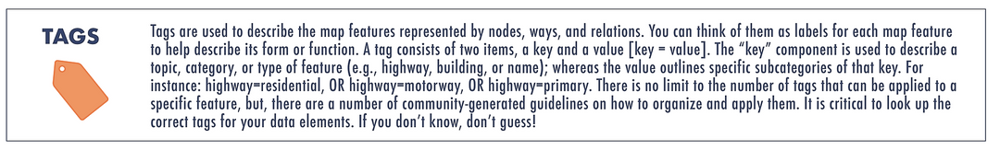

In order to tag something in JOSM, you must first select the feature you want to tag.

As a rule of thumb, if a feature is grayed out, then it is not selected. If it is highlighted in red, then it is actively selected and ready for re-editing (and/or tagging).

- Click the Select tool

- Using the left mouse button, select the feature you wish to tag

- Go to the Tagging menu in the Information Panel, and click Add

- In this instance, I want to tag the selected area as a simple building. So, in the Key drop-down menu, I select “building”.
***Note: You can either scroll to this alphabetically or start to type it and the menu will navigate to it.***

- In the Value drop-down menu, choose Yes

- Click OK

- You will notice that the new building now has a light pink fill. The building tag has already helped to define the symbology for this feature. 

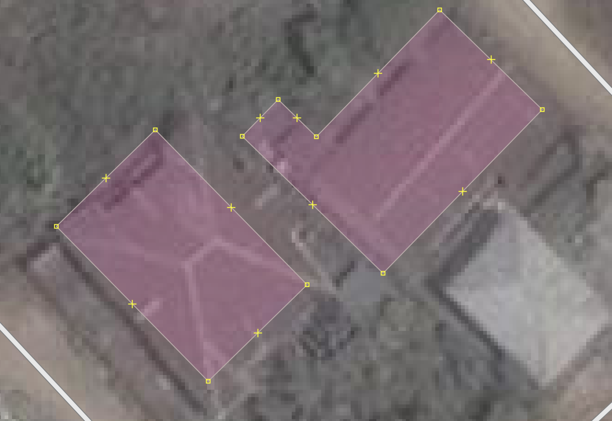

- If you wish to tag several features with the same tag simultaneously, you can select multiple features using the Select tool, then using the Add button from the Tagging panel. 

Another nice feature of the JOSM tagging tool is that it remembers the last tagging pair used. You will notice in the last .gif that the tagging pair of ***building + yes*** was already populated. In fact, the tagging feature recalls the last five tagging pairs used. This is particularly handy when you are working with several recurring map features within a given area.

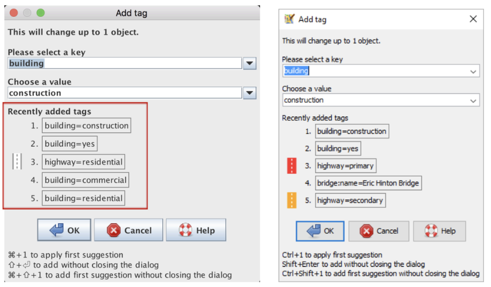
Add Tag Dialog Box: PC and MacOSM View

You will have to develop a certain familiarity with the OSM data model in order to get comfortable with and make full use of the tagging system within JOSM. It would be a good idea to revisit the Map Features page on the OSM Wiki to get a refresher on some of the most commonly used tags. This is an incredibly detailed resource, and there is always something new to learn. 

[Click here](https://wiki.openstreetmap.org/wiki/Map_features) to navigate to the Map Features OSM main page.

#### Using the Preset Tagging Menu 
Another way to approach tagging is to use JOSM’s preset tagging menus, as they have a nicely organized hierarchy of tags. There are two ways to access the preset tagging: either through the drop-down menu or the toolbar. 

First, let's look at the drop-down menu:

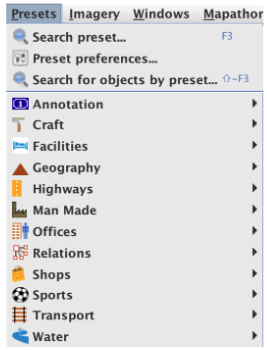

The tagging drop-down menu is a highly comprehensive menu of tagging choices, arranged neatly into thematic categories. This is incredibly helpful if you are still rather new to the OSM data model, though it will still take time to learn where all your favorites reside. 

##### Tagging a (Fictional) Restaurant
Let’s take a look at the process of tagging a (fictional) restaurant. 

- Draw a node in the map view
***Note: Remember, we need a feature to attach the tag to, and that feature needs to be highlighted/active for us to tag it.***

- Click on Presets > Facilities > Food + Drinks > Restaurant

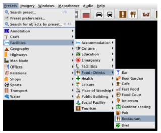

- You will be presented with the following detailed tagging interface:

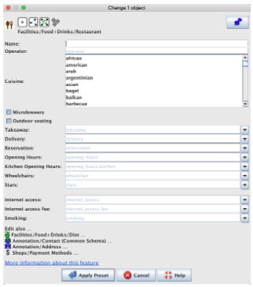

This is an incredibly detailed list of potential tags for this one feature (a restaurant), many of which would be impossible to populate unless you had personal knowledge of the premises or if you had conducted fieldwork to facilitate the tagging process. It is important to know that you **DO NOT** have to populate all of these boxes/drop-downs. They are merely a guide to help you consider all the possible tagging options for a premise (like a restaurant) and a very useful and structured way of exploring the OSM data model for when you are deciding on your own field-work data model/questionnaire. ***Keep this in mind for our later modules on field work and survey design!***

- Let’s assume that all we know about our fictitious restaurant is that it is called the “Daisy Cafe” and that the cuisine type is “coffee_shop”. 

- Populate both of these options, and click on “Apply Preset”

- You will notice that the tag information in the Layers menu on the right has populated with the new information and that our feature now has three tags associated with it:
  - amenity=restaurant
  - name=Daisy Cafe
  - cuisine=coffee_shop

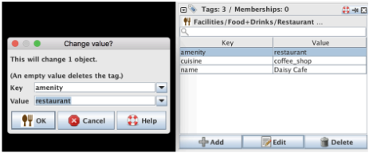

You may edit any of these individual tags at any time by clicking on the Edit option, though this will only let you edit each of the three individual tags associated with the restaurant one at a time. If you want to return to the more comprehensive menu of tags, you will need to highlight your restaurant feature and return to the preset menu.


The tagging toolbar presents a slightly more restricted selection of tag choices but does feature several of the more frequently used tags. The detailed tagging interface you will encounter is exactly the same as that found under the Preset drop-down, so it’s really just personal preference as to which of these handy tagging tools you may use. You will not need any of the features that you have created or tagged up to this point, so there is no need to save your work unless you want to.

### Shortcuts in JOSM 
One of my favorite aspects of working in JOSM is the many keyboard shortcuts you can use to streamline your mapping workflow. Instead of having to locate a specific tool from a toolbar (or buried several levels deep in an editing menu), you can activate that same tool using a single keyboard shortcut. This may not seem like a timesaver right now (especially when you will have to learn what shortcut goes with what tool), but when you become familiar with them you will see a noticeable difference in the speed and efficiency with which you map!

Once again, these shortcuts might vary depending on your operating system, but they are mostly consistent. See here: https://josm.openstreetmap.de/wiki/Shortcuts 

There is also this handy visual, one that I have printed out and have hanging over my desk! 

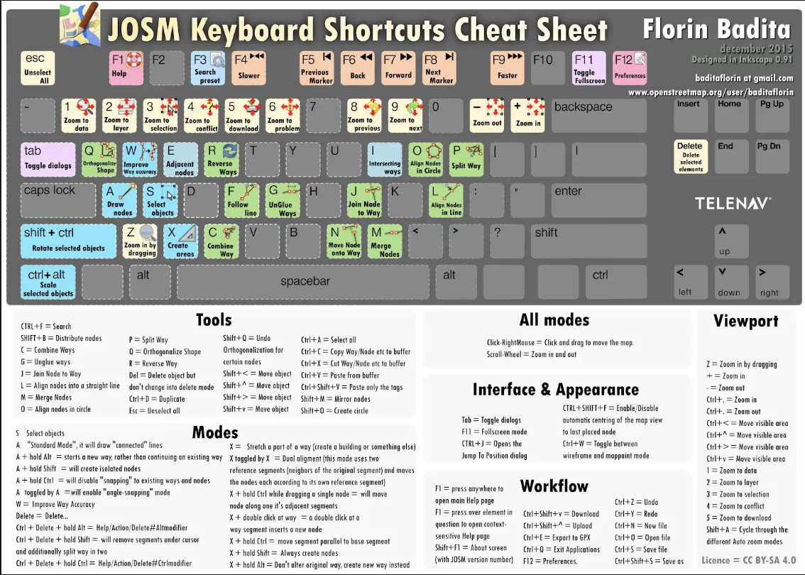
***Image Source: JOSM Keyboard Shortcuts, Wikimedia Commons***

[Click here to download your own copy of this handy visual!](https://drive.google.com/file/d/1EKyGYivWHoK3YYqRqcdFC6mkn-AbUIfQ/view)

## Working with Real OSM Data in JOSM 
### Adding and Downloading OSM Data
#### Overview
One of the main benefits of working with JOSM is that you create and update data offline, so data usage is limited. This is particularly handy when working with low or inconsistent bandwidth. There are several different ways to download data locally to JOSM. 

- To explore these, go to **File > Download data** or click on the Download data button (green downward arrow)

```{image} Module7_Static/7.27.png
:alt: alt text
:width: 60px
```

- In the Download from OSM dialog box, you will see five tabs that indicate the five different ways you can download data for editing

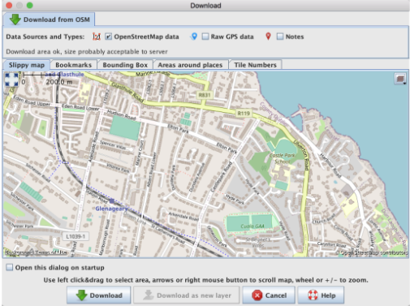

**Different ways you can download data for editing:** 
- **Slippy Map:** Using your mouse, or the +/- buttons on your keyboard, pan and zoom around the map to find the area you would like to edit. When you’ve identified it, simply draw a box around the extent you wish to download and click on the Download button.
- **Bookmarks:** In this tab, you can save the coordinates of geographic extents that you visit/edit on a regular basis. This is particularly useful if you are working on a recurring project, or, you like to keep an eye on the changes in your local neighborhood.
- **Bounding Box:** If you know the bounding coordinates of the area that you would like to download, then you can either enter them here manually, or (and this is how most mappers use this tab) you can visit www.openstreetmap.org, search for the area you wish to map, copy/paste the URL into the text box in the Bounding Box tab, and click on the Download button.
- **Areas Around Places:** In this tab, you can do a regular word search of OSM to find place names or features that are near a particular place.
- **Tile Numbers:** In this tab, you can specify a specific tile address to locate and download.

My favorite way to locate the area I wish to map is to find it on www.openstreetmap.org, copy the url, and then use the Bounding Box tab to jump immediately to that area. Take a look here: 
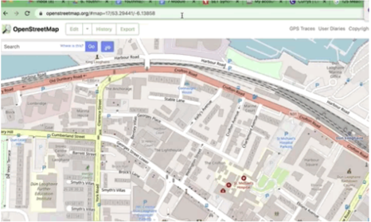

What I also like about this option is that you can check the area you wish to download BEFORE you click on that Download button, by hopping back to the Slippy Map tab after you’ve pasted the URL from www.openstreetmap.com. 
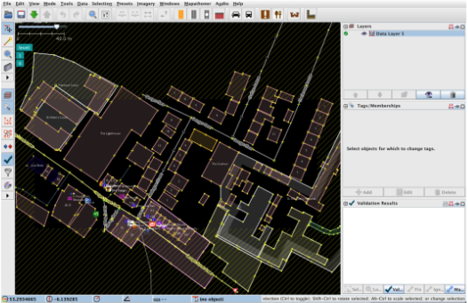

The editing interface and the appearance of the downloaded OSM data are quite different to what we are used to in iD editor. 
- Click on any of the existing features to see how the attributes are displayed in the Tags/Memberships window:
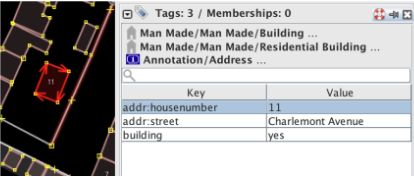

Notice that the bounding box that you specified in the Download dialog is indicated by a clear black background. JOSM downloads all data that **intersects** with the bounding box that you specify, hence the additional data trailing beyond this bounding box. 

If your bounding box is set by a tasking service such as the HOT Tasking Manager, or the TeachOSM Tasking Manager, you should only edit the data that falls within the black box, and refrain from editing any features that fall within the striped/crosshatched area, as those features fall within the task area of another mapper. 
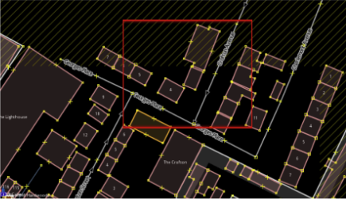

#### Adding Imagery to the Editing Window 
Unless you are working with a Tasking Manager, such as the HOT Tasking Manager, or the TeachOSM Tasking Manager, imagery does not automatically appear behind your downloaded data. 
- To add imagery to the window, go to the Imagery drop-down menu at the top of the screen. Notice you have many of the same imagery options that you are familiar with in iD.

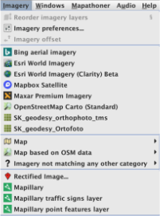

I’m choosing Bing imagery for my editing session as I have edited in this area before and I know that it has the best resolution and is the most current.

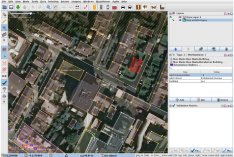

You can add several different imagery sources to your JOSM editing session, and you can switch between them quickly and easily to assist your editing decisions. You can turn the imagery layer on and off and also adjust the opacity, contrast, and sharpness of the image.  

#### Managing and Deleting Data Layers in JOSM 
If your initial data download was for a particularly busy or previously well-mapped area, then you may want to consider removing that layer and re-downloading a smaller, more manageable area to map.

- To delete the first layer that you created, click on the little waste bin icon in the bottom right-hand corner of the layers window, or simply turn it off by clicking on the little eye icon beside the layer name. 

You can then add an additional data layer to the map window by downloading a new geographic extent.

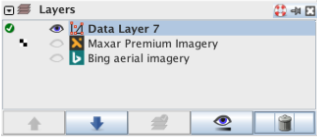

If you have not made any changes to a layer that you have downloaded, deleting it simply removes the downloaded layer from your device⏤it doesn’t delete it from OSM (remember, it’s just a localized copy). If you have made any changes to the layer since you’ve downloaded it, JOSM will always give you a warning to check if you really wish to delete the layer or to review and upload your edits.

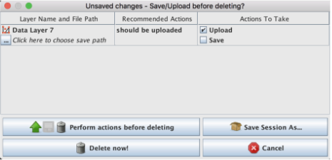

### Editing and Uploading OSM Data
#### Overview 
Now that you’ve downloaded some real OSM data, let’s revisit the editing process in JOSM and walk through the process of saving and re-uploading to OSM. 

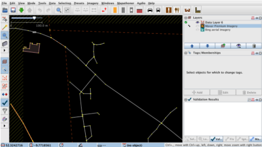

This is a download of a much simpler area, one that has new development (and recently updated imagery). I’m going to trace several new houses and upload them to OSM. Simply follow along for now. Then, you can replicate the steps in an area of your own choosing. 

Note that it is important to check several imagery sources before you begin mapping, both to identify the most current imagery and for any potential offset issues. 

These side by side images show the same area (with main road highlighted for reference), and you will see that the new construction is missing from the image on the left (Bing imagery). 

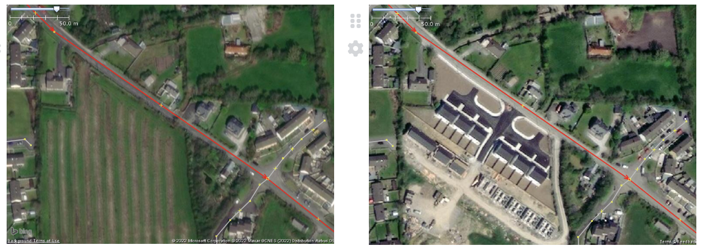

#### Drawing a Building 
- Remember, to add a new feature, click on the Draw/Add tool (you will see a little crosshairs icon as you move over the map window)

- Click once on the map canvas to draw the first node of your building

- Keep clicking to continue to draw your building, using several additional nodes (depending on the shape of the structure) 

- When you have defined the shape of your building, double-click once more on the starting node to complete it. (Again, you might have to check to make sure that you are “snapping” to the right node before you commit to your last double-click.)

- To square your building, make sure that the building is still highlighted, then click the “Q” key on your keyboard. (“Q” stands for orthogonalize, which is a little obscure, but remember the shortcut “S” has already been taken for “Select”.)

- To tag your building, click on the Edit button in the Tags/Membership window, and select “Building” and “Yes”
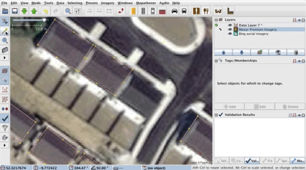

#### Saving and Uploading Data to OSM
If you have a reliable connection, it's good practice to save regularly. (Remember, this was a practice we spoke about when mapping with iD editor. It’s the best way to prevent conflicts if there are other active mappers in your area.) 

- Go to File > Upload Data or simply click on the Upload Data button (green up arrow)
- You will see the following interface: 

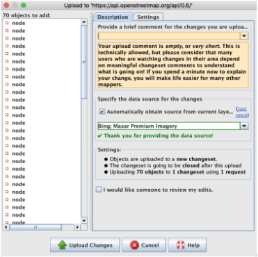
- Add a changeset comment (remember this from iD, it’s a brief description of the work that you have completed in this editing session)

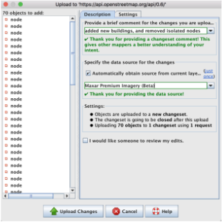

When you are happy with your changeset comment, click Upload Changes 

If there aren’t any errors with your drawings or tags, then your data will upload successfully and you will receive verification from JOSM

```{tip} 
YouthMappers Blogspot: Tech Tips for Better Mapping

[Tech Tips for Better Mapping](https://www.youthmappers.org/post/2016/07/22/tech-tips-for-better-mapping) By Leigh Seitz, College of William & Mary (USA)

Hear from Leigh as she shares her experiences in switching from iD Editor to JOSM during her time as an intern at the USAID Geocenter.

```

### Dealing with Errors During Upload
#### Overview
We will look at the Validation workflow in more detail in the next course, but every new mapper has to learn to deal with errors and fixes to the data they create in order to successfully upload their edits to OSM.

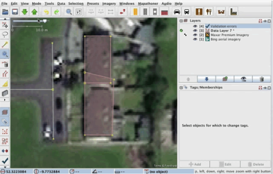

In the image above you can see an attempt to upload two (deliberately incorrect) buildings to OSM. JOSM picks up on the incorrect geometry, the fact that the buildings are overlapping, and that one or more of their nodes are connected or “glued”.

Once the JOSM uploader detects the errors, it automatically adds the “Validation Results” window to the right-hand panel. Using this panel, you can navigate/zoom directly to the offending geometry to fix it, which is particularly useful when you have a lot of data. We will look at this panel in more detail in the next course.

#### Fixing Overlapping Buildings 
In the previous example, we had two overlapping buildings rejected for upload. Let’s fix them quickly, and push the corrected geometries to OSM. Again, this is an illustrative example, just follow along.

- First, zoom in on the features you wish to fix so that you can clearly see the error and any nodes that need to be selected and moved.

- Select your nodes one by one, and place them in the correct position.

- Depending on the drawing tool/method used, you may encounter nodes that are joined or “glued” together and when you attempt to reposition them, the walls of both buildings start to move with you.

- Select the joined/glued node.

- Go to Tools > Unglue Ways (keyboard shortcut: G).

- You will see that the two nodes are now separated. You can move them independently of one another to more appropriate locations. 

- Always make sure to select and square and buildings that you have edited (using the “Q” button on your keyboard).

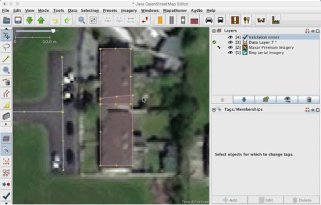

You will notice that there are many different geometry editing options available under the **Tools** menu. We won’t go through each of the options one by one, but you should explore these on your own time to become familiar with their function. You will probably recognize quite a few from your time editing in iD editor. 

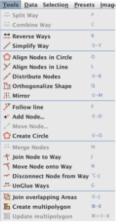

When you are happy with your building edits, you can attempt to re-upload the data to OSM. This time, you should have no issues with the upload process.

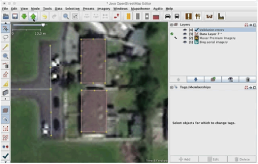

## Dig Deeper 
### Want to Dig a Little Deeper?
- **LearnOSM:** [Getting Started with JOSM](https://learnosm.org/en/josm/start-josm/)
  - LearnOSM is an online resource with step-by-step instructions (in multiple languages) on the many tools and platforms that can be used to generate or add data to OpenStreetMap. It features a section on iDEditor, JOSM, and editing using smartphones.

- **OSM Wiki:** [JOSM Homepage](https://wiki.openstreetmap.org/wiki/JOSM)
  - This includes detailed installation instructions and a user guide.

- **OSM Wiki:** [JOSM Shortcuts Cheat Sheet](https://wiki.openstreetmap.org/wiki/File:JOSM_Keyboard_shortcuts_cheat_sheet.png)
  - This is an excellent visual to help you remember the many keyboard shortcuts to expedite your editing in JOSM.

- There are also many excellent video resources on YouTube about how to map in OSM, created by the growing OSM community. Here are some of our favorites:
  - **HOT Channel:** [How to Map Buildings in JOSM](https://www.youtube.com/watch?v=DcKewl94jR4)
  - **HOT Community Webinar Recording:** [Introduction to JOSM](https://www.youtube.com/watch?v=tF3MIHoPzoI)
  - **[JOSM for iD Users Playlist (nine videos)](https://www.youtube.com/watch?v=2-duP9ljCng&list=PL54o5PaKgnbKU-vXe11cSmmsxIYnL5oDU)**

## Assignment 
### JOSM 1: Introduction to Mapping With JOSM Assignment
For the following assignment, you will demonstrate your ability to use basic mapping functions in JOSM. You will be asked to add tagged buildings, roads, and points of interest to the .osm file provided. **You will not upload this data to OSM.** You will resave the edits you have made and submit the file to the YouthMappers team for review and grading. 

### Instructions
1. Download the following file: [JOSM_YM_Demo.osm](https://youthmappers.course.tc/api/v2/links?to=https%253A%252F%252Fds8h8s59z0bwt.cloudfront.net%252Fyouthmappers%252Ftrack_2%252Fcourse7%252FJOSM_YM_DEMO.osm&scope=session&scope_id=c0367dad-433e-4511-b2a3-2b11a6ada5cb&id=5ebfff64-bb96-4dc5-9697-a9d2850f2474)
2. Launch JOSM, and open the file
3. Go to the Imagery drop-down, and turn on the Bing imagery source (there is one building contained in this demo file, and it is sufficient to navigate you to the correct location on the imagery)
4. Trace and tag the following features:
  a. Four simple buildings (tagged with building = yes)
  b. Three examples of Road tracing (tagged with suitable highway tags, such as secondary, tertiary, or residential)
  c. Three additional features with detailed tagging (see the screenshot below to locate these features). Please apply the following tags:
    i. School
      1. Amenity = School
      2. Name: Red School
    ii. Shop
      1. Name: Red Shop
      2. Opening Hours = 7-11
      3. Wheelchair accessible = yes
    iii. Soccer Field
      1. Leisure = Soccer pitch (or pitch)
      2. Sport = Soccer
      3. Name: Green Fields
      4. Surface = Artificial Turf
5. Save your edits to the data layer (using the following format “JOSM_YM_yourname”). 
6. Remember: Do **NOT** upload the contents of your edited file to OSM. This file is for demonstration and grading purposes only. 

Not everyone’s attempt for this assignment will look exactly the same, but your submission should look close to the example below. REMEMBER:
  - Buildings should be squared
  - ALL features should be tagged (even if it’s just building = yes)
  - Road features should NOT be angular and messy, but should honorably follow the centerline of the road on the imagery provided

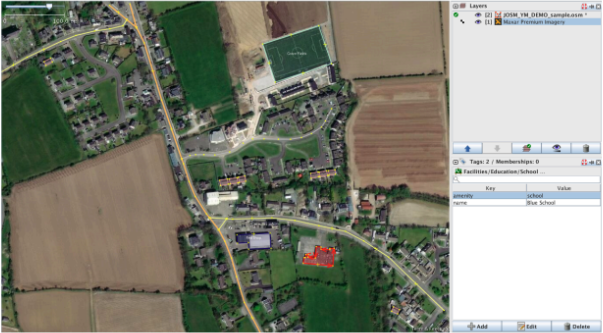

**Example of a fully edited submission with imagery**
***Note: The field, school, and shop should be the same, the roads and basic buildings can be of your own choosing.***

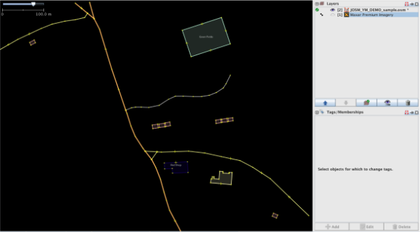

**Example of a fully edited submission without imagery**
***Note: The field, school, and shop should be the same, the roads and basic buildings can be of your own choosing.***

To save the edits to your layer file, right-click on the layer in the Layer menu and select Save As. Save your changes to a file with the following naming convention: JOSM_YM_”your name”.osm (e.g: JOSM_YM_JaneSmyth.osm)

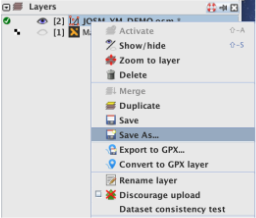

***Tip: Save your version of the file after you make your very first edit. Continue to right-click and save regularly while editing.***

## Conclusion 
#### Skills, Proficiencies, and Standards 
Each badge awarded as part of the YouthMappers Academy has been aligned to the skills and proficiencies outlined in the U.S. Department of Labor’s Geospatial Technology Competency Model (GTCM), as well as National Geographic’s National Geography Standards.

The Geospatial Technology Competency Model identifies the foundational, industry-wide, and industry sector-specific expertise that distinguishes, and binds together, successful geospatial professionals. It identifies core personal, academic, and workplace competencies, as well as sector-specific geospatial knowledge and abilities, including specialized competencies related to data acquisition, data analysis and modeling, imagery interpretation, and software and application development. 

The National Geography Standards are benchmarks of geographic literacy to determine a comprehensive understanding of the interaction of space and place, and the skills to analyze and critique these dynamics. These standards are measured through knowledge and mastery of three things: (1) factual knowledge; (2) mental maps and tools; (3) and ways of thinking.

**The Geospatial Technology Competency Model**

1. Interpersonal Skills: Demonstrating the ability to work effectively with others, through interaction with peers and course moderators
2. Professionalism: 
  a. Demonstrating commitment to the values, standards of conduct, and well-being of one's profession  
  b. Know codes of ethics and rules of conduct; legal, ethical, and business aspects of data sharing
3. Initiative: Demonstrating gumption at work/school
4. Dependability and Reliability: Displaying responsible behaviors at work/school
5. Lifelong Learning: Displaying a willingness to learn and apply new knowledge and skills
6. Reading: Understanding written sentences and paragraphs in work-related documents  
7. Geography: Understanding the science of place and space; geographic skills
8. Science and Engineering: Knowing and applying the principles, rules, and methods of science and engineering to solve problems; subject-specific scientific knowledge
9. Basic Computer Skills: Using a computer and related applications to input and retrieve information; navigation and file management and internet and e-mail
10. Planning and Organizing: Planning and prioritizing work to manage time effectively and accomplish assigned tasks; planning and organizing; adaptability and flexibility; time management
11. Data Quality: Accuracy, resolution, precision, fitness for use; quality control versus quality assurance; data quality implications of legacy systems
12. Geographic Information Systems: Conceptual foundations, including representation and uncertainty; digitize and georeference paper map or plate; acquire and integrate various data types in GIS database 
13. Software and Application Development: Evaluate open source software
14. Working with Tools and Technology: Selecting, using, and maintaining tools and technology to facilitate work activity

**The National Geography Standards:**

1. The World in Spatial Terms: 
  a. How to use maps and other geographic representations, geospatial technologies, and spatial thinking to understand and communicate information
  b. How to analyze the spatial organization of people, places, and environments on Earth's surface
2. Places and Regions: The physical and human characteristics of places
3. Environment and Society: 
  a. How human actions modify the physical environment;
  b. How physical systems affect human systems
4. The Uses of Geography: 
  a. How to apply geography to interpret the past
  b. How to apply geography to interpret the present and plan for the future


<div style="background-color:#91ccca;padding: 15px 30px;border-radius: 8px;">
<h3>Knowledge Checks</h3>
<p>To test your knowledge, complete the following test:</p>
<p><a href="https://forms.gle/qm438wUP4bAEdMAR9" style="background-color: #e74c3c; color: white; padding: 10px 10px; text-decoration: none; border-radius: 8px; font-weight: bold; display: inline-block; box-shadow: 0 4px 8px rgba(0,0,0,0.1);">🎯 Start Intro to JOSM Quiz </a></p>
<p>If you receive a score of 80% or higher, you will receive an email with a certificate for this module.</p>
</div>

<!-- 
### Congratulations 
Congratulations on completing Course 7: JOSM 1 - Introduction to Mapping with JOSM of the YouthMappers Academy series!

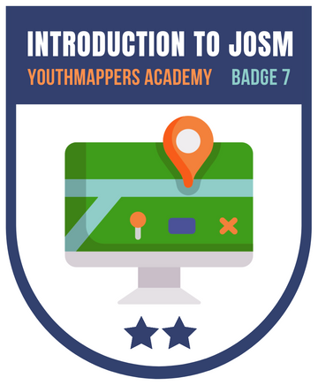 -->
