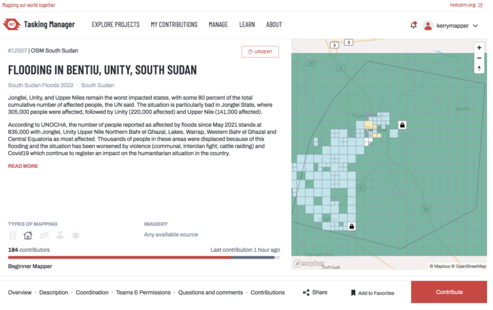

# Introduction to Mapping with JOSM 
 
## Overview 
Data quality is an important consideration when working in OSM. Map Validation is the process of reviewing completed work (both your own, and of other mappers), to make sure that the feature geometry is captured accurately, and that the tags applied are appropriate. Mapping experience is critical when performing validation activities, coupled with the best tools to perform this task most effectively and efficiently. Good command of JOSM is also important to a validator, and in this course, you will learn about several specific techniques and tools to assist in the validation workflow. You will also learn about validation from a more holistic project management perspective, and the various approaches you can use to manage and facilitate team validation for your projects. 

## Map Validation in OSM 
### The Role of the Validator 
Validators are typically experienced mappers who review the work of others either during the course of their own mapping, or systematically as part of a coordinated project effort. 

According to the Missing Maps, it is up to the validators to check that OSM standards are met to ensure that the data is accurate, complete, and consistent, and to grow the mapping community by providing support and positive, constructive feedback to new mappers. 

### Different Approaches to Validation 
Mappers can approach validation in a number of ways. At the most basic level, there is the idea of fixing individual pieces of geometry (and their associated tags) as you encounter them on your mapping journey. You don’t set out to specifically “fix” certain issues with the map, you simply incorporate improvements as you simultaneously add new tags and features to your area of interest. In many ways, every mapper is (and indeed should be) thinking like a validator. 


You can also approach validation at the project level, which usually means participating in a coordinated effort, focused on validating an entire project area according to a certain set of specifications (usually within a certain time frame). Projects on this scale are usually coordinated using platforms like the HOT or TeachOSM Tasking Managers. Validators usually need to have a minimum threshold of mapping experience to be part of these efforts. 

We will approach our validation journey incrementally:
1. **Validation Skills and Workflows:** First, we will look at the advanced tools and mapping techniques in JOSM that will expand our skills and improve our overall efficiency. Then, we will look at several systematic approaches to validation (mini-workflows), including some simple decision tools and batch processes that will help us develop a consistent approach to scanning and fixing the map.
2. **Validation as Part of a Team:** We will look at the role of the validator on a public-facing team project, such as the HOT tasking manager. The skills and approaches we cover in steps 1 and 2 will help us become valuable team members in these efforts. 

```{tip} 
YouthMappers Blogspot:  My Experience Joining the YouthMapper’s Validation Hub 

[My Experience Joining the YouthMapper’s Validation Hub ](https://www.youthmappers.org/post/2019/08/14/my-experience-joining-the-youthmapper-s-validation-hub) By Grace Donovan, The George Washington University

Hear what Grace has to share about her experiences working as a training coordinator for the YouthMappers Validation Hub.

```

## Plug-ins for Advanced Mapping and Validation
### Overview 
#### Validation Skills and Workflows 
The preferred editor for validation in OpenStreetMap is JOSM. The wealth of geometry and tagging tools coupled with JOSM’s built-in validation tools makes it the ideal application for this type of work. 


In order to harness the power of JOSM for both mapping and validation, you will need to expand your repertoire of tools and plug-ins. For the purposes of this course, we will focus on a number of select tools and plug-ins that will increase your mapping efficiency and form a comprehensive toolkit for validation activities.

### Plug-ins for Advanced Mapping and Validation 
Before we delve into new skills, let’s take a look at some of the plug-ins that are available that will help us advance our mapping and become more effective validators. Some of the popular plug-ins for validators are as follows:

**1. Buildings:** The Buildings tool allows mapers to draw perfectly squared buildings quickly and
accurately.
**2. Mapathoner:** The Mapathoner is another useful plugin that will appear as a new menu item at the top of your screen. This tool allows you to both create buildings and find editing issues. It has tools to help you create multiple circular, orthogonal or L-shaped buildings in a batch process. It can also select duplicate buildings or non-orthogonal buildings within your data layer.
**3. Mapillary Plugin:** The Mapillary plugin allows you to view and modify images from Mapillary as you
map, as well as upload new images to the website.
**4. Markseen:** This plugin is handy for managing your edits. It will provide an overview map of your study area and identify where you have already viewed. As you zoom in and out while reviewing the data, it can be easy to forget where you have or have not investigated. This tool will track this for you so you can visually see where you
have not looked for issues in your study area.
**5. Scripting Plugin:**This tool will show up as a new menu item at the top of your screen. If you can code your own tool you can bring those skills to work with this tool. However you can also import existing scripts - no coding experience necessary. Two scripts that are useful for validation include the SelectDuplicateBuilding and SelectNonOrthogonalBuilding scripts.
**6. ToDo Plugin:** This is a handy tool that helps you create a ToDo list of features to inspect. As you select features, individually or using the search function, you can add them to the list. When ready, you can work through the list one at a time to address any issue it has. Once resolved, it will then automatically take you to the next item in the list.

### Installing JOSM Plug-ins
- Start JOSM
- Click on the Preferences button


- Choose the Plug-ins option from the menu on the left


- To begin, search for Buildings. You will find a plug-in called ‘buildings_tools’. Click on the check box beside it.


- It is possible to install multiple plug-ins simultaneously, so search for and check off any additional plug-ins you would like to install, then click OK at the bottom of the screen.
- The plug-ins you have selected will download. You will need to restart JOSM to finalize the download and install of the plug-ins.

## Introduction to Validation in JOSM 
### Overview 
There is no ultimate guide or checklist when it comes to validation. Very broadly, what we are trying to detect is whether objects are spatially accurate, located in the right place, well-drawn, and correctly tagged. 

Some of the most common issues encountered are shared below. This list is adapted from the Missing Maps Validation Guide. 

**1. Poorly Drawn Geometries:** Buildings and other artificial structures are generally going to be rectangular or circular - or made of a combination of those shapes e.g. L-shaped. If you see a feature that is poorly drawn, correct the geometry. Most often, this involves squaring the corners of rectangular buildings, or perhaps resizing building traces that are either slightly too small, or too large.
**2. Overlapping Features:** Some features, such as buildings, never overlap in reality. This should also be
true on a map. If features overlap or have nodes that are irregularly glued (e.g. one corner only), this should be fixed.
**3. Incorrect Tagging:** Occasionally, mappers will add incorrect tags to features; such as name=house,
rather than something more typical for a remote mapper, such as building=yes. This should be corrected where possible. Do keep in mind that although uncommon, there may be unusual but completely correct tags from local
mappers that seem strange to those from outside the community.
**4. Geometry Misaligned to Imagery:** As new imagery is periodically introduced to the OpenStreetMap platform,
alignment issues (between new and old images, AND, between old tracings and new imagery) may become apparent. Less experienced mappers may choose what they perceive the “best” imagery to be, and begin to add new features, without taking into account overall alignment to existing features (created on older imagery). In instances such as these, newly added features may need to be selected and re-aligned to the majority of existing features in the area.

### Step 1: Run the JOSM Validator 
- Open JOSM
- Navigate to your area of interest. This may be via a bookmark for an area that you are already familiar with, or it may be through Tasking Manager if you are participating in an organized validation project. We will talk a little more about this later on. 
- Once your data has loaded, check to see if you have the Validation Window open in your right-hand panel.
- If your Validation Window doesn’t automatically open, go to the Windows drop-down and click on Validation Results to launch it. 


- Click on the Validate Tool button in the Validation Window. The tool will run a check for a standard set of errors for the downloaded data. 


- A list of warnings or errors will be displayed (depending on the mapping errors in your area, the warnings will vary).


- Let’s look through these warnings/errors one by one. To navigate directly to a warning/error, right-click on it in the table of contents and select Zoom to Problem.


- In this instance, the road has been overdrawn and is glued to the corner node of a building.

**To fix this error, the user must:**
- Unglue the nodes and adjust the road to it’s proper position, reconnecting
it to the small residential access road.


**Let’s fix another problem. **
- Let’s zoom to the overlapping buildings. In this
instance, we will move the nodes to remove the overlap, and reflect the correct building footprint


- Once the overlap has been corrected, make sure to re-square the building that you have edited and run the validation tool again to make sure that the warning/error has indeed been fixed.
- Let’s tackle the untagged way next. Untagged ways are simply lines on the map. Without a proper tag, we have no indication as to whether this is a boundary, a river, a road, or something else entirely. 
- In this instance, it’s obvious from the imagery that the way is a residential road, so let’s retag it as such and re-run the validation tool to make sure this is an acceptable edit. 


#### Important Considerations when Using the Built-in JOSM Validation Tool:
- You will notice that the initial validation check for this area flagged more than 19 unnamed ways in the project area. Note that this is a validation warning, rather than an error. Ideally, all roads should have a name associated with them, but in many remote mapping scenarios, this information isn’t known to the mapper, and therefore can’t be improved upon at this time. It is OK to ignore ‘unnamed ways’ in most instances, unless you have local knowledge of an area. 
- You should always correct validation results that are flagged as Error, but you may not be able to fix all the results flagged as Warnings. 
- Once you fix an error, run the validation tool again and the error will disappear from the list. However, sometimes a fix can cause other problems, which is why it’s important to run the validation tool several times during your edit session.
- Remember to re-upload your data once you have fixed as many warnings/errors as possible.
- Some warnings, such as “Crossing waterway/highway,” are not necessarily mistakes. This shows that the validation tool is good at finding possible mistakes but it requires someone to go and see whether the warning is important or not.

### Step 2: Visual Scan of the Study Area 
#### Overview 
**Visual Scan of the Study Area**
While the validation tool is excellent at finding untagged features and specific errors in geometry, there are certain errors that are a little trickier to identify. Once you have successfully run the validation tool, you will have to revert to a manual scan of your downloaded area to identify errors associated with imagery interpretation and alignment.  

The most effective way to do this is to zoom in and systematically pan through your downloaded data to visually identify issues. These include (but are not limited to) things that are missing or in the wrong place (including misalignment to imagery) and things that are tagged incorrectly.

Starting in one corner, zoom in pretty close so you can see the details and begin to pan through your area of interest. 


Typical issues identified during a manual/visual scan are:

- Missing buildings
- Missing roads/waterways
- Features that no longer exist (require deletion)
- Unsquared buildings
- Misaligned features (imagery misalignment)

We already covered how to draw (and delete) new features in Course 7: Introduction to JOSM. In Course 7 we also learned how to square (or orthogonalize) new buildings, but having to potentially do this building-by-building for pre-existing structures can be quite time-consuming. Next, we’ll look at a simple query function to help identify and fix un-squared buildings.

#### Using JOSM Search to Identify and Fix Unsquared Buildings 
***This incredibly handy sequence of steps is modified from the Missing Maps Validation Guide.***
Searching in JOSM is a powerful way of reviewing data. It allows you to provide search terms, also known as queries, to select only the features that you want.

- To access the search, go to Edit > Search or press CTRL+F on your keyboard or click the magnifying glass icon on the top of the JOSM window.

There are many types of queries you can search here, and you can see details and search string examples in the search box itself.

- To square buildings, we must first select them. To find everything that is a building in your current view that has four or more nodes or corners, click Ctrl+F and enter this text string: 
  - Building in view nodes: 4-
- Buildings that fit these search criteria will be highlighted in red on your screen. 
- To ‘square’ these buildings, click the ‘Q’ key on your keyboard and that will square all of their corners.


**WARNING!** If there are buildings that should not be square, following this process will make them square anyway. To make sure you haven’t inadvertently squared a round or unusually shaped building, hit undo and redo a few times to see if any distinctive buildings were changed by mistake. If so, then it is advisable to deselect these buildings after running the query, so that they aren’t squared by mistake. 

***Note: JOSM will only run the search query (and subsequent squaring) for features that are visible in the map window. Therefore, it is probably best to run this two-step fix for a portion of your study area at a time.*** 

#### Misaligned Features 
As new imagery is periodically introduced to the OpenStreetMap, alignment issues (between new and old images, AND, between old tracings and new imagery) become apparent. Less experienced mappers don’t always adopt a holistic approach to data creation, and may simply add features from the newest imagery without taking into account how their new additions will align with existing features (created on older imagery). In instances such as these, newly added features may need to be selected and re-aligned to the majority of existing features in the area. 

In this example, on a visual scan, the validator spies three buildings that appear to be misaligned with the rest of the features in the map view. 

- Using the Select Tool (***keyboard shortcut: S***), select each of the three buildings (to select more than one building at a time, hold down the Shift key while selecting S)
- Move the three selected buildings to their appropriate location
- Save your data


#### Aligning Imagery 
Encountering misaligned features is often a hint that new (and potentially misaligned imagery) is being used for tracing. It is quite possible that the new imagery is in fact better referenced (geographically) than the original imagery, but, as a significant amount of mapping may have already occurred in the area, it is more appropriate to align the new imagery to the existing map features, rather than move ALL the map features to map the new imagery. Moving multiple continuously connected features such as roads, boundaries, or waterways en masse is incredibly disruptive to the map, and can often cause wide-ranging and significant errors. 

- To re-align an imagery source with existing map features, right-click on the appropriate image source in the layer list, and select New Offset.
- In the map window, use your left mouse button to click and grab the underlying image, and move it to the desired location (a location which is a best fit’with the existing map features).


In this section, we looked at various tools, tricks, plug-ins, and presets to enhance our mapping skills and overall productivity, but tools and tricks alone do not result in comprehensive validation. These approaches need to be used by thoughtful mappers with attention to detail and in a systematic way to assess and improve the quality of the contributions in OpenStreetMap. 

If you wish to practice validation on a wide variety of simulated errors using a sample dataset, there is an excellent tutorial on the HOT Toolbox website, under [Section 5.1: Validation with JOSM (Practice Validation)](https://toolbox.hotosm.org/pages/5_data_quality_assurance/5.2._validating_with_josm/).

## Validation as Part of a Team 
### Overview
When working as a remote validator, especially on a Tasking Manager project, the needs and requirements of that particular task/project need to be taken into consideration. These validation requests quite often focus on what’s missing from the map, in addition to fixing what’s already there. This typically includes:

- Missing Buildings: Add any missing buildings to the task area
  - This also includes fixing, squaring, and appropriately tagging any existing building features you encounter in the task area

- Missing Roads: Add any missing roads to the task area
  - This also includes fixing, squaring, and appropriately tagging any existing road features you encounter in the task area

- Improper Tagging: In the case of tagging, it is important to refer to specific task instructions for proper tagging requirements, as these may stem directly from coordination with local OSM chapters and local mapping on the ground. Often project managers request that buildings are tagged with the generic building=yes as opposed to building=house, but do not correct it if the information is from the local mapper.


Working on a validation project through the HOT Tasking Manager may be your first time participating in remote mapping in another location. The Missing Maps team have some advice to follow:
- Recognize the different architectures and tagging protocols of various countries.
- Until you are comfortable mapping in a certain country, you should not feel comfortable validating in that country.
- Always know how to improve the data efficiently without losing local information.

### Validation on the HOT Tasking Manager 
**1. Finding a Task**
- To participate in a validation project on the HOT Tasking Manager, go to https://tasks.hotosm.org/ 
- Log on using your OSM credentials, and click on Start Mapping
- Under the Any Project drop-down menu, chose Projects to Validate
- If this is the first time that you have worked as a validator, be sure to select a project that is earmarked for Beginner Validators


- Choose a task based on your level of experience
- Read through the task instructions carefully. If the task manager explicitly requests that roads are the focus of the task, then you should focus on adding and/or fixing any roads that you encounter. You should not spend time on buildings or any other features. Also make sure that you follow any tagging conventions specifically mentioned in the task instructions.


**2. Selecting a Square**



Click on Contribute to move to the next informational window. As with most Tasking Manager projects, the more detailed, explicit instructions are found after you click on Contribute.


You will notice the manager of this task has highlighted issues with imagery alignment and has given explicit instructions to address this⏤there are also specific instructions regarding buildings and their interactions with roads in the area. 

***Note: Tasks on the HOT Tasking Manager change regularly, so you will most likely encounter a different task, with different instructions to those above.***

Squares cells that are ready for validation are highlighted in blue. To start validating you can either:
- Select a blue square from the map
- Toggle to the Tasks tab and select any that are Ready for Validation

3. Starting to Validate
Once you have selected the square that you wish to validate, click on the Validate Selected Task button. Make sure that:

- You set the editor to JOSM at the bottom of the window (as it defaults to iD)
- You have JOSM open on your computers


- Select the square you wish to validate and launch to JOSM. Data from the square you have selected should automatically open in JOSM.

Using the tools and simple workflow steps covered in the previous section, check for any errors in geometry and tagging in accordance with the instructions from the project manager. Finalize your validation session by running the JOSM Validator tool. Make sure to save and upload your edits to OSM, as you would in a typical mapping session. 


Once you have finished working on your map square in JOSM, you will need to return to the Tasking Manager and submit your findings to the project. As part of this submission, you will need to let the manager of the task know if the square is well mapped or not, with some comments to explain your submission. You will have three options:

**- Yes:** The task was well mapped already, and you are simply verifying this to be the case.
**- Yes, with edit comments:** You had to perform some additional editing to promote the task to be well mapped. General details of your input can be shared in the comments box.
**- No:** The task is so poorly mapped that you do not have the time or the expertise to fix it. Select No and add comments on the issues you encountered.


If for any other reason you cannot complete validation on the square, simply click on Stop Validation to exit out of your chosen cell. The square will return to the queue for another mapper.

### When to Fix It and When to Pass It Back 
Sometimes the degree of time, effort, and expertise required to finish or fix the work of another mapper is excessive. The threshold for this is unique to each participant. The team at Missing Maps has a nice decision tool to help new validators decide on when to persevere with a validation square, or when to kick it back to the original mapper (or someone more experienced).


***Validation Decision Tree reproduced from the Missing Maps Validation Guide***

Typically, if the task is time-sensitive (like in the case of a disaster response), then most validators will persist with their self-assigned squares and make all the improvements necessary to progress the overall task to fully complete.

If the task is part of a slow-burning or less urgent project, and you can determine that the original mapper of that square is still active, then it’s worth reaching out to them (politely and constructively) in the comments section (or indeed through direct messages on the platform) to ask them to fix their issues.

Participation in OSM is a continual learning process, and many mappers will appreciate the opportunity to learn new skills while resolving an issue they may not have interpreted correctly or encountered previously.

If you need to connect with the mappers that worked on the task ahead of you:
- Click on the History tab on the task submission page
- Scan the names of the mappers that have worked on that mapping square, and in particular the mapper that marked the square as done
- Click on their name to see their profile on the HOT Tasking Manager (their stats will give you a good idea of their mapping experience and level of activity)
- If you wish to reach out to them one-on-one (rather than sending a public note in the comments section), click on the link to their OSM profile and send them a message


#### Validation for Project Management 
Eventually, you may need to think about managing data quality from the perspective of a project manager. This is less about the management of individual pieces of geometry, and more about a holistic (but also strategic) approach to monitoring your project area, while potentially managing a team of remote mapping volunteers. The skills we’ve covered in this course, coupled with the project design and management techniques we will cover in Course 11: Planning a Field Project, will set you up for success in this endeavor.

## The YouthMappers Validation Hub 
### What is the Validation Hub?
The collaborative mapping platform OpenStreetMap (OSM) is a great platform for users to create and disseminate geospatial data, but data quality is always a concern. The YouthMappers network is committed to data quality. We show this commitment with the establishment of the YouthMappers Validation Hub, a group of experienced OSM student mappers whose purpose is to validate the work of other OSM contributors. More specifically, the Hub works to ensure that all Tasking Manager projects affiliated with YouthMappers have the highest quality data (both on the [HOT Tasking Manager](https://tasks.hotosm.org/) and the [TeachOSM Tasking Manager](https://tasks.teachosm.org/)). YouthMappers is also interested in the behavior of new and current mappers, and understands that the only way to enhance contributions is to improve the technique, habits, and conduct of mappers.

The Hub members approach validation in two main ways:

**1. Traditional Task Validation**


This is the systematic validation of “complete” cells in the Tasking Manager, which involves the checking and fixing of geometry and tags within those cells (and marking them as validated for the purpose of task completion). This can also potentially involve authoring both congratulatory and improvement notes to mappers within the Tasking Manager interface (although, the validator will typically fix the work in order to expedite task completion). This is the most traditional interpretation of the concept of “validation” within the Validation Hub, and we typically perform this type of validation for older “idle” (but not archived) tasks. Typically, an “idle” task would be two or more months old, but this is determined on a case-by-case basis.

**2. Interactive Validation**


This type of validation is aimed at changing and/or improving mapping behavior and practices amongst mappers. As part of this role, the Hub validators act in a monitoring role during a time-bounded (active) task. The Hub will work in close coordination with the Project Manager (the person managing the mappers and/or project). Hub validators will regularly check the mapper’s work and provide feedback and pointers (through both the OSM and the TM platforms) during the active mapping period, without actually editing the geometry/tags themselves. Once the time period for active mapping has ended, the Project Manager can/will take time to evaluate the mapper's work, THEN, the Hub validators will be assigned the task for a traditional more passive validation session.

The purpose of interacting with mappers in (near) real-time is to help them foster good practices and community, which are YouthMappers Validation Hub goals. It has been shown that giving feedback, both positive and corrective, has yielded higher quality edits and mappers.

In this context, the role of the validator is not to fix problematic edits, but to use their experience to review recently made edits and provide constructive (and polite) feedback. The Hub team uses tools such as [OSMCha](https://osmcha.org/) to help monitor and track changesets in areas of interest, and to identify mappers who may be struggling and need help (You will learn more about OSMCha in Course 9: Data Management in OSM).

### Communication is Key!
#### Overview


It is of vital importance to be constructive and courteous to other mappers, especially when dealing with the delicate issue of their mapping quality. The team at the YouthMappers Validation Hub has plenty of experience with this and has developed extensive training, complete with a playbook, to make sure new members adopt a consistent approach to outreach and assistance.  

#### General Messages to Express Gratitude or Support 
In many cases, our mappers do a good job, and we don’t need to change much (if anything) in their submissions. It’s still important for this work to be recognized and appreciated. Sending a short simple message to a mapper lets them know we appreciate what they’re doing, and the effort can really encourage participation and retention. (Make sure to include @theirusername so that the message is flagged for their attention.)


Example messages include:
- Hi @username! Thank you for mapping! Keep up the good work!
- Thanks for mapping! @username Great work!
- Great mapping @username!
- Thank you @username for taking the time to map!

More often than not, the edits we ask mappers to revisit are very minor. It’s important to communicate appreciation to mappers for work well done, while following on with constructive advice about how to fix their errors. If you plan to spend significant time as a validator, it’s probably a good idea to develop a playbook of your own, with some “go-to” message strings that can be edited and/or repurposed on a case-by-case basis.

```{tip} 
YouthMappers Blogspot: Meet the YouthMappers Validation Hub Members!

[Meet the YouthMappers Validation Hub Members!](https://www.youthmappers.org/post/meet-the-youthmappers-validation-hub-members) By Noelle Dwyer, Kate O'Byrne, Natalie O'Dell, Benjamin Heidloff, and Amy Mackinnon, The George Washington University, USA

The YouthMappers Validation Hub is formed of experienced student mappers whose goal is to ensure a high standard of data quality on OpenStreetMap (OSM). Established in May 2019, faculty and students at The George Washington University in Washington, D.C. facilitate and run the Validation Hub.

```

#### Messages for Small Corrections 
Some typical messages for rather minor corrections would go as follows:

**Square Buildings**
- Hi @username, thank you for mapping. Just a reminder to make sure you square your buildings either by using the ‘Q’ key after you tag it, or by right-clicking on the building and clicking the square button. This will ensure that all buildings are uniformed and more accurate.
- Thanks for mapping! @username Make sure to always square your buildings using the ‘q’ key. Great work!

**Mark as Complete**
- Thanks for mapping! @username make sure to only select “Mark as completely mapped” if all of the features stated in the instructions have been traced. If not, select “Stop Mapping”. Hope to see you mapping again soon!
- Hi @username! Thank you for mapping! If you are unsure about marking a task as complete or not, be sure to go back through the instructions and check that all the requests were completed in your task. If not, select “Stop Mapping” so you or another user can continue mapping at another time.

**Tag Features**
- Thanks for mapping! @username Make sure to tag all your features with all the appropriate tags stated in the instructions. Great work!
- Hi @username! Just a reminder to tag every feature you map with the appropriate label outlined in the instructions. For example (buildings=yes, highway=primary).

**Mapping Non-buildings as Buildings**
- Hi there @username! Thank you for mapping! We’ve noticed that you’ve been marking trees found in the task as buildings. We understand that satellite images can be confusing and unclear to navigate. In order to avoid confusion, we recommend looking for hard shadow edges (attached picture for example) in order to tell the difference from a tree or a building.

#### Messages for Big Concerns 
Occasionally the mistakes are a little more serious, which will necessitate more detailed instructions and technique-specific feedback.

**Square Buildings**
- Hi @username! Thanks for mapping! I noticed in this task that a majority of your buildings weren’t squared. Having every building mapped squared ensures a more cohesive and accurate mapping of the area. If you could take the time to go through this task and square the buildings that would be great! You can do so either by pressing ‘Q’ after you click or tag a building, or by right-clicking on the building and clicking the square button. If you need help squaring buildings let me know and I’d be happy to lend a hand!

**Mark as Complete**
- Thanks for mapping @username! While validating this task, I noticed a lot of features haven’t been mapped yet. Please make sure that all visible features in your task are accounted for before marking it as complete. If you are unsure, click “Stop Mapping” and another mapper can take a look at it at another time. 

**Tag Features**
- Hi @username! Thank you for taking the time to map! When going through this task there were many features that haven’t been tagged. Make sure that every feature you map has the appropriate tag in order to ensure the highest quality results for the final product.

**General**
- Thank you for taking the time to map @username! I noticed that there were some oversights made in the task that you mapped. Make sure to read and follow the instructions outlined in the task thoroughly. If you’re having trouble remembering how to properly map a feature, the OSM Tutorial can be found when mapping any task by clicking the “Help” button on the right-hand toolbar, and then the walkthrough button (see image below). We want to ensure that you can be a mapper that provides the utmost quality of mapping to the OSM Community. Thank you again!

## Dig Deeper 
Refer to the information below to learn more about JOSM 2.

**Readings:**
**- Missing Maps:**
  - [Validating for Missing Maps using JOSM by Andrew Wiseman](https://www.missingmaps.org/assets/downloads/Validating_Data_EN.pdf)
    - This is an excellent tutorial that features both an introduction to JOSM as well as an introduction to the concept of data validation in OSM.
  - [Learn to Validate](https://www.missingmaps.org/validate/)
  - [Missing Maps Validation FAQs](https://www.missingmaps.org/assets/downloads/MissingMaps_validation_faq_en.pdf)

**- LearnOSM:** LearnOSM is an online resource with step-by-step instructions (in multiple languages) on the many tools and platforms that can be used to generate or add data to OpenStreetMap. It features a section on iDeditor, JOSM, and editing using smartphones.
  - [JOSM: Detailed Editing](https://learnosm.org/en/josm/)
**- OSM Wiki:** [OSM Tasking Manager and Validating Data](https://wiki.openstreetmap.org/wiki/Tasking_Manager/Validating_data)
**- Mapbox:** [Validating OpenStreetMap](https://blog.mapbox.com/validating-and-protecting-openstreetmap-893487ed05db)
**- YouthMappers:** [Validator Training Document](https://docs.google.com/document/d/1wR-hBN8aTe9KPvU8_F25ydrY3z-Ij02z3ov5aX6aHFE/edit?tab=t.0)

**Videos**
There are many excellent video resources on YouTube, created by the growing OSM community, about how to map in OSM. Here are some of our favorites including some on the more nuanced process of validation:
**- HOT Channel:** [How to Validate in OSM (iD editor)](https://www.youtube.com/watch?v=2h12CKnvK38&t=1s)
**- HOT Channel:** [YouthMapper Validation Training](https://www.youtube.com/watch?v=SDHg0oXlgtU) by Andrew Wiseman ***(this video is created by the originating author of Validating for Missing Maps using JOSM)***

## Assignment 
For the following assignment, you will demonstrate your ability to scan for issues and validate data using JOSM. You will be asked to identify and fix issues with both the geometry and tagging in the .osm file provided. You WILL NOT UPLOAD this data to OSM.

### Instructions
1. Download the following file: [JOSM Validate_YM_Demo.osm](https://youthmappers.course.tc/api/v2/links?to=https%253A%252F%252Fds8h8s59z0bwt.cloudfront.net%252Fyouthmappers%252Ftrack_2%252Fcourse8%252FJOSM_Validate_YM_DEMO.osm&scope=session&scope_id=d7f6f526-a20b-4b12-a83c-cccf5af69841&id=d9dd205a-e172-4bca-ad05-07d438a6ceaa)
2. Launch JOSM, and open the file
3. Go to the Imagery dropdown, and turn on the **Maxar Premium** imagery source
4. Scan through the map features included in the downloaded file and fix the geometry and tagging issues you encounter (you may need to use more than one approach)
  - Note: You are not required to add any missing map features, just fix any mistakes
  - There are 10 issues total (you will need to catch at least six of these to pass this assignment)
5. Save your edits to the data layer (using the following format “JOSM_Validate_YM_yourname”).
6. Remember: DO NOT UPLOAD the contents of your edited file to OSM. This file is for demonstration purposes only.


To save the edits to your layer file, right-click on the layer in the Layer menu and select Save As. Save your changes to a file with the following naming convention: JOSM_Validate_YM_”your name”.osm (e.g., JOSM_Validate_YM_JaneSmyth.osm).

***Tip: Save your version of the file after you make your very first edit, then continue to right-click and save regularly during the editing process.***

## Conclusion
### Skills, Proficiencies, and Standards 
Each badge awarded as part of the YouthMappers Academy has been aligned to the skills and proficiencies outlined in the U.S. Department of Labor's Geospatial Technology Competency Model (GTCM), as well as National Geographic’s National Geography Standards.

The Geospatial Technology Competency Model identifies the foundational, industry-wide, and industry sector-specific expertise that distinguishes, and binds together, successful geospatial professionals. It identifies core personal, academic, and workplace competencies, as well as sector-specific geospatial knowledge and abilities, including specialized competencies related to data acquisition, data analysis and modeling, imagery interpretation, and software and application development.

The National Geography Standards are benchmarks of geographic literacy to determine a comprehensive understanding of the interaction of space and place, and the skills to analyze and critique these dynamics. These standards are measured through knowledge and mastery of three things: (1) factual knowledge; (2) mental maps and tools; (3) and ways of thinking.

The following competencies derived from both the Geospatial Technology Competency Model and the National Geography Standards are central to the successful completion of YouthMappers Academy Badge 08: JOSM 2 - Advanced JOSM (Validation techniques).

**The Geospatial Technology Competency Model**
1. Interpersonal Skills: Demonstrating the ability to work effectively with others through interaction with peers and course moderators
2. Professionalism:
  - Demonstrating commitment to the values, standards of conduct, and well being of one's profession 
  - Know codes of ethics and rules of conduct; legal, ethical, and business aspects of data sharing
3. Initiative: Demonstrating gumption at work/school
4. Dependability and Reliability: Displaying responsible behaviors at work/school
5. Lifelong Learning: Displaying a willingness to learn and apply new knowledge and skills
6. Reading: Understanding written sentences and paragraphs in work-related documents 
7. Geography: Understanding the science of place and space; geographic skills
8. Science and Engineering: Knowing and applying the principles, rules, and methods of science and engineering to solve problems; subject-specific scientific knowledge
9. Basic Computer Skills: Using a computer and related applications to input and retrieve information; navigation and file management and internet and e-mail
10. Planning and Organizing: Planning and prioritizing work to manage time effectively and accomplish assigned tasks; planning and organizing; adaptability and flexibility; time management
11. Data Quality: Accuracy, resolution, precision, fitness for use; quality control versus quality assurance; data quality implications of legacy systems
12. Geographic Information Systems: Conceptual foundations, including representation and uncertainty; digitize and georeference paper map or plate; acquire and integrate various data types in GIS database
13. Software and Application Development: Evaluate open source software
14. Working with Tools and Technology: Selecting, using, and maintaining tools and technology to facilitate work activity

**The National Geographic Standards:**
1. The World in Spatial Terms:
  - How to use maps and other geographic representations, geospatial technologies, and spatial thinking to understand and communicate information
  - How to analyze the spatial organization of people, places, and environments on Earth's surface
2. Places and Regions: The physical and human characteristics of places
3. Environment and Society:
  - How human actions modify the physical environment
  - How physical systems affect human systems
4. The Uses of Geography:
  - How to apply geography to interpret the past
  - How to apply geography to interpret the present and plan for the future

### Congratulations 
Congratulations on completing Course 8: JOSM 2 - Advanced JOSM of the YouthMappers Academy series!

