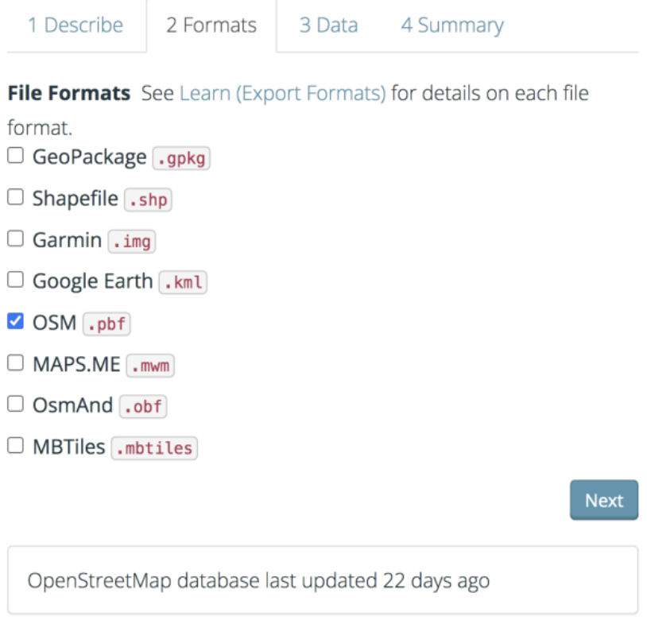
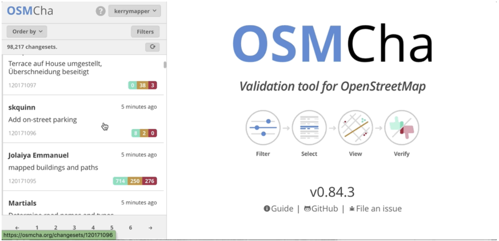
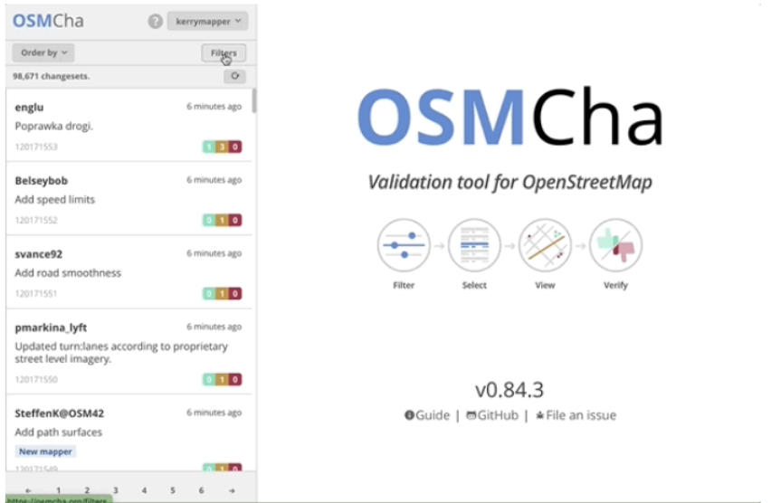

# OSM Data Management & Export

Welcome to Course 9 of the Youthmappers Academy. 

## Overview 
Most of our early interactions with OSM involve contributing directly to the map, either through remote mapping campaigns or providing edits for areas that are familiar to us.  In instances where we wish to conduct geospatial analysis, or, where we want to produce more refined cartographic products, we will need to extract more nuanced, specific data layers from OSM. In this course, we will learn how to filter and extract data from OSM for our own research purposes. We will also look at various tools that will help us to assess data quality and coverage. 

**In this course, you will:**
- Learn how to filter and extract OSM data for your own research purposes using several different tools
- Learn how to assess the quality of OSM data for a given geographic extent or project using a variety of tools and platforms beyond the JOSM Validator
- sExplore new platforms to share and download supplemental data for your research project

## Exporting Data from OSM 
### Overview 
Many of us use OSM as our default basemap, opting for its tiled map service to provide context to our cartographic research products. In instances where we wish to conduct our own geospatial analysis, or where we want to produce more refined cartographic products, we will need to extract specific data layers from OSM.

Any time we plan to use OSM data for analysis we have to consider the quality of the data. This brings up the important topic of validation, which we covered in the previous course.

### What is Validation?
Map validation is the process of reviewing completed work (both your own and of other mappers) to make sure that the feature geometry is captured accurately, and that the tags applied are appropriate. 

In this course we will look at several of the most popular tools available to filter and extract data from OpenStreetMap:

#### Popular Tools to Filter and Extract Data from OpenStreetMap 
1. **OpenStreetMap Interface:** Access and download small areas of interest to .osm format. 
2. **HOT Export Tool:** An open service that creates customized extracts of up-to-date OSM data in various file formats.
3. **OverPassTurbo:** OverPass Turbo is a web-based data mining tool that allows you to download data from a mirror of the OpenStreetMap database.
4. **Geofabrik:** Regularly-updated extracts of continents, countries, and selected cities.
5. **QuickOSM QGIS Plug-in:** QuickOSM is a QGIS plugin to download data from Overpass server.

### OpenStreetMap Interface 
You can download data directly from the OpenStreetMap website by navigating to your area of interest and using the Export button found at the top of the page.

To prevent extraordinarily large downloads, the Export button will not be enabled until OSM determines you are at a sufficient zoom level to process the data fully. 

When you click the Export tool, all of the features visible in the OSM window will be available for download as a .OSM file.  This file will contain all of the nodes, ways, and relations for that selected geographic area.

The .OSM file can now be opened and utilized in the JOSM editor or added as a vector layer to various GIS systems like QGIS.

### HOT Export Tool 

This tool (created and maintained by the Humanitarian OpenStreetMap team) allows users to download up-to-date OSM data by specifying tags, area of interest, and file types. 

Getting data from OSM can be done using the following steps:
- Log on using your OSM credentials
  - Click on the red Log-In button on the top right-hand corner of the screen and log into the service using your OSM credentials
  - The site may anticipate your OSM credentials if you are already logged into OSM on the same browser

- Click on the Start Exploring button, and you will be taken to the tool interface. It’s best to start by defining your area of interest.

You can define your area of interest in a number of ways (and indeed you can mix and match the search tools to hone in on your study area). Your options are:
- Conducting a text-based place name search
- Input the minimum and maximum X and Y coordinate pairs defining your study area
- Draw a bounding box on the map using the current map view
- Draw a freehand polygon
- Upload an existing polygon area in GeoJSON format

***Note: The study area chosen cannot contain more than 10,000,000 OSM nodes. If the total number of nodes exceeds that threshold, the export will fail.***

- **Name and describe your export.** 
  - Use this space to add context to the dataset. Information such as its location and features downloaded would be helpful to any that wishes to use these data. If the export is part of a larger project or campaign, that information should also be included. Click Next to choose your file format.

- **Choose file format.**
  - You have the option to download the data in a number of different formats: Esri shapefiles, Geopackage, Garmin.IMG, Google.KMZ, OSM, OSM.PBF, and others.

- **Choose map features.**
  - This is where you decide on what feature(s) or types of features you’d like to download from OSM. There are many options by category that you can choose from. You can select an entire category such as buildings or sub-selections like building names and geometries or addresses.

- **Download the data.** 
  - Once you choose to export your data, you’ll be redirected to the Export Detail Page. This page will show you a brief summary of your request and you’ll see the status of your request near the top of the page. Your status will be one of Submitted, Processing, or Completed. Once the status has changed to Completed, you’ll see a link to a ZIP archive that you can download by clicking on it.

- You will see a status window with the details and status of your download. 

### OverPass Turbo 

OverPass Turbo is a web-based data mining tool that allows you to download data from a mirror of the OpenStreetMap database. OverPass Turbo uses something called an Overpass API query to search the OpenStreetMap database and displays the findings on the accompanying map interface. The data can then be downloaded. OverPass Turbo can be a little complicated for new users, but if you stick to the wizard tool and use simple queries (focusing on one feature type at a time), you should be able to use it quite effectively.

- First, locate your study area using the map on the right of the OverPass Turbo interface. You can use a combination of place name searches, panning tools, and bounding boxes to isolate your study area.

***Note: You will notice that when you run a place name search on OverPass Turbo, it zooms right into the center of your specified location (rather than zooming to its full geographic extent as most other map search functions would). You will need to zoom out to orient yourself and select your study area correctly.***

- Next, click on the Wizard button. You can use the Wizard interface to run simple queries based on OSM tags. The example below is a simple string to return all the roads in the map window.

- When you click ‘build and run query’, OverPass Turbo will process your request and return the results in the map window. It should look something like this:

- To download this data, click on the Export button. You will get the option for four different download types:
  - GeoJSON
  - GPX
  - KML
  - Raw OSM data

If your attempts at query building are successful, and if you anticipate that you will reuse these queries in the future (to either pull newer versions of the same data for this study area or to pull the same types of features for a different study area), then you should copy your query strings to a notebook or save them as a query text file (as shown in the example above).

Working with OverPass Turbo will require familiarity with the important Key/Value pairs from OSM’s tagging system. This can take some time to perfect, and the (OverPass Turbo Wizard Wiki)[https://wiki.openstreetmap.org/wiki/Overpass_turbo/Wizard] is incredibly helpful when constructing these queries for the first time.

### Geofabrik 

Geofabrik provides pre-packaged data extracts for all areas of the world. Updated almost every day, you can pick your continent/region and then the Sub Region (country) you wish to download. 

Certain Sub Regions have Special Sub Regions available which groups together geographies that are often referenced together. Examples of these include the Alps, Britain, and Ireland and South Africa including Lesotho. Some small island nations are not available for download but the majority of countries are represented. 

***For example, if you click on the African Region, it will take you to the Sub Regions, which in this case are the countries.***

***Clicking on Algeria, you will see the data specific to this country. For this specific country example, there are no special Sub Regions.***

Available formats include Esri shapefiles and OSM.PBF, among others. The data download includes layers such as buildings, transportation features, water features, points of interest, and natural features such as beaches. Unlike the HOT Export Tool, you do not get to select which features you wish to download.

#### Handling .PBF files
Vector data like that on OSM is extremely large. As such, .pbf files are a highly compressed binary file format, optimized to make storage of this data fast. These files can be thought of as a database containing five tables: points, lines, multipolygons, multilinestrings (routes), other_relations (osm relations). 

Likely the easiest way to handle .pbf files is to look at, subset, and export from QGIS. Remember, however, that .shp files can only store a maximum of a few GB of data. Consider exporting to a geopackage format instead. Another option is doing your subsetting and conversion from the command line using [OSMConvert](https://wiki.openstreetmap.org/wiki/Osmconvert). 

### QuickOSM QGIS Plug-in
One of the most intuitive ways to access OSM data is through the QGIS plug-in QuickOSM. It allows the user to quickly generate and execute queries that are sent to overpass in the background. You will need to have a copy of QGIS installed on your machine to use this plug-in.

These steps are adapted from this [excellent tutorial from the HOT Toolbox](https://toolbox.hotosm.org/pages/7_data_use_and_data_analysis/7_1_introduction_to_qgis/).

- Open QGIS, go to the Plug-ins menu, and, in the search box, search for OSM.

- Select and install the QuickOSM plug-in
- Before you run a query, you need to focus your map window on your area of interest. You can use something like QuickMapServices (which is another plug-in that can be used to stream OSM tiles into QGIS). Or, you can display and zoom to a shapefile/geojson layer for your area of interest.
- Once you have isolated your area of interest, go to Vector > QuickOSM

- Use the drop-down menus to build a query. You will need to provide a Key/Value pair. The example above is for all primary roads that fall within the extent of the Freetown_Districts. When you are happy with your selection, click Run Query (you may need to scroll down to do this).
- Once the query has run, the features will add to the map frame (see below)

- The HOT Toolbox segment on [Installing QGIS Plugins](https://toolbox.hotosm.org/pages/7_data_use_and_data_analysis/7_1_introduction_to_qgis/) has the following tips for using the Quick OSM plug-in.

#### Tips for Using QuickOSM Plug-in
**1. Resources:** For resources on the best Key/Value pairings to use, see [OSM Tagging and Data Models](https://wiki.openstreetmap.org/wiki/Map_features). 
**2. Values:** Multiple values can be strung together by separating with a comma (for example, amenity=school, hospital). To download all possible values of a key (i.e. amenity=*), leave the value field blank.
**3. Error:** If your query is not working: 
- Did you use capital letters in your keys and values? Make sure keys and values are in lowercase. For example: key=amenity value=school NOT key=Amenity and value=SCHOOL
- Did you use the correct spelling in your keys and values? Make sure keys and values are spelled EXACTLY as they are in OSM guides. Otherwise, QuickOSM will be looking for the wrong tag. For example: key=amenity NOT key=amenities
- Trying to download too large an area can overload the API or will overwhelm a slow internet connection. If you are having difficulty downloading data, try reducing the area, or limiting the data download by changing your tags. For example, downloading all the buildings in a country (or even a city) can be too large for QuickOSM. Instead, try downloading a smaller area or restricting your tags thematically.

## Assessing Data Quality in OSM 
### Overview 
In Course 8, we were introduced to validation and focused on JOSM as our primary tool for data validation. JOSM is excellent at drilling down on errors and omissions for feature and tag level issues, but sometimes, we need a broader assessment of OSM coverage and quality, especially when we are preparing to launch a remote mapping campaign or embark on a field work program. There are several excellent tools to help us with determining the geographic scope, completeness, and quality of OSM data:

**Name: [JOSM Validator](https://wiki.openstreetmap.org/wiki/JOSM/Validator)**
**Description:** JOSM Validator is a core feature of the JOSM software, which fixes multiple error types from broken, invalid geometry to missing or incorrect tags.

**Name: [Osmose](https://osmose.openstreetmap.fr/en/map/#loc=16/46.97/2.75)**
**Description:** Easy visual interface which gives an overview of data quality with color-coded pins (based on error severity).

**Name: [OSMCha](https://osmcha.org/)**
**Description:** View and validate specific changesets on a user-by-user basis.

**Name: [Map Campaigner](https://www.hotosm.org/tools/map-campaigner.html)**
**Description:** Great tool for organizing and monitoring the progress of OSM campaigns. Includes tools tracking completeness and tracking quality of member changesets.

In the context of this module:

**Geographic Scope:** this relates to the area or region that the data covers

**Data Completeness:** this refers to how comprehensive or whole the data is for a given area. In the context of OSM, this could relate to complete geometry or complete tagging. Are all the visible buildings, roads, or waterways traced? Do the features that are mapped contain key minimum tags for identification and symbolization?

**Data Quality:** data quality in OSM refers to how accurately the data in the map reflects reality. Are the features spatially accurate, with well-drawn geometries? Is the tagging information accurate and up to date?

In a couple of words, brainstorm your answer to the following below:
***Share three of the most frequently occurring feature or tag level issues you have encountered in OSM.***

### Osmose 

Osmose is a tool that monitors multiple quality control issues in OSM. These include issues with feature geometry (such as overlapping buildings/nodes, incomplete features, and duplications) and common tagging issues (such as missing, unsuitable, or poorly formatted tags). More information about Osmose can be found at the [Osmose OSM Wiki Page](https://wiki.openstreetmap.org/wiki/Osmose).

- Go to http://osmose.openstreetmap.fr/ in your internet browser (Osmose works best with the Google Chrome internet browser. Firefox, Opera, Safari, and other browsers may not display the information correctly.)

- Login using your OSM credentials (this isn’t required for most functions, but if you would like the option of fixing tag errors within the platform, you will need to login).

- Use the zoom, pan, and search functions in the main map toolbar to navigate to your area of interest.

- The panel on the left will automatically load all listed issues for your area of interest.

- The issues appear on the map as pins matching the icons from the issues panel. Click on each pin to learn more about the object and associated issue(s).

- The number of issues for any given area can be quite overwhelming, so use the tick boxes or “all/nothing” options to turn thematic issue layers on and off.

- You can click on individual issues in the map to investigate and edit them. You have the option of opening the issue in JOSM, iD, or in the case of tag issues, you can also edit them directly in the Osmose interface. In the example below, we will examine a duplicate way of using iD Editor.

- When the issue has been addressed, return to the Osmose interface and mark it as resolved. 

- If you wish to address issues in a batch fashion, rather than one-by-one, you can download the raw data or open it directly in JOSM for further editing.

- To load the data directly into JOSM, click on Export > JOSM (JOSM will need to be open, and the remote control setting activated). When the issues have been reviewed and edited, you can upload your changes in JOSM as per normal.

- You can also download the issue files as KML, GPX, GeoJSON, or several other data formats. 

### OSMCha

 OpenStreetMap Changeset Analyzer is a tool designed to review uploads and changes to OSM data, largely to prevent vandalism and bad edits made to map data. This tool allows users to filter by username, location, dates of upload, and other metadata features. OSMCha is useful for monitoring the progress of data cleaning and upload teams.

- Navigate to OSMCha in your internet browser (Google Chrome preferred).

- You will need to sign in with your OpenStreetMap account and grant permission.

- Once logged in, a left-hand panel will appear with changesets (remember, a changeset is a group of edits to the database by a single user over a short period of time).  Each changeset shows:
  - OSM username
  - Time of upload
  - Changeset comment
  - Changeset ID
  - Flags (if any), such as “Possible Import”
  - Number of ways added (highlighted in green), ways modified (highlighted in yellow), and ways deleted (highlighted in red)

- With OSMCha, you can create customized filters to monitor specific contributions to OSM. This could be for your personal edits, your project team, or, for all mappers in your area of interest.

- Click on Filters in the left-hand panel to open the Filters menu.

- In this menu, unique filters can be applied such as OSM username, date range, and locations.osmcha_filters.

- In the following example, filters have been set for a date range and location, but you can see that there are many more filter options available.

- Click apply when you are happy with your filter selection.

- Click on any of the changesets that appear on the left-hand panel. Do any changesets have flags or warnings?

- Select the changeset you want to investigate, or edit further, and click on the Open With drop-down menu. This gives you the option of opening the changeset in JOSM, iD, and a number of other editors.

- If you would like to save a specific combination of filters for later use, click on Filters in the left-hand panel, then in the upper-right, click Save to save your filter under a dedicated name.

- You can access your saved filters using the URL or in the My Saved Filters option once you have logged into OSMCha.

### Map Campaigner 

MapCampaigner is a tool developed by HOT to monitor attribute completeness for predefined areas of interest (AOI). Based on the data model you submit, the tool checks and highlights any map features that are missing pre-defined tags within your AOI, and allows team validators to download and fix those features. 

Map Campaigner is a great tool for
organizing and monitoring the progress of coordinated OSM projects. 

Let’s create a simple project for illustration:
- Navigate to https://campaigns.hotosm.org
  -***Note: Map Campaigner works best in the Google Chrome or Mozilla Firefox internet browsers.***

- Click on Create in the top right corner of your screen.

- Specify the name, date range, and a description for your project (be thoughtful when selecting the date range, as Map Campaigner will only check attribution completion for data tags added within this window). Click Next.

- To identify your area of interest, you can either upload a boundary file or navigate there through the pan/zoom functions and draw a bounding box to indicate your AOI. Click Next.

- Next, you will indicate which map features you wish to track the tagging completeness for. Click on Add a Feature. 

- If you haven’t yet decided on your data mode, there are several different templates available for you to choose from:

- You can add multiple different templates to each project, as you may wish to check for residential buildings, shops, and/or medical facilities, all within the same project. 

- If you have already designed a specific data model, then use the Custom Form option to select your preferred tags.

- For this demonstration, I have chosen the simple tag set for buildings from the template provided. Click Next.

- You will get the option to select additional project managers, who are mappers that are allowed to View the campaign, as well as mappers whose contributions you wish to watch. Enter these OSM usernames in the boxes provided.

 
- Click Submit and you will be taken to a preliminary Project Overview for your Map Campaign.

- On the map, features are colored by the percent of attributes completed. Select individual features on the map to view the existing tags and missing attributes. If data editing work has yet to start for your area of interest, then you will see something like the project below, where buildings are 0% Complete for the tags specified. 

- These metrics will change as edits are made to the live map. You will have to refresh your campaign in Map Campaigner, as most edits will not update instantaneously (it typically takes a couple of hours). 

## Data Sharing and Data Hosting 
### Overview 
#### Data Sharing & Data Hosting 
Some data we create or use doesn’t match the OSM data model. In this case, we have to look to other repositories to help find and share data that might be of interest. 

**Name: [The Humanitarian Data Exchange](https://data.humdata.org/)**
**Description:** Online searchable repository of spatial data and non-spatial data related to humanitarian campaigns

**Name: [OpenAerialMap](https://openaerialmap.org/)**
**Description:** An open service to provide access to a commons of openly licensed drone imagery and map layer services

### The Humanitarian Data Exchange 

The [Humanitarian Data Exchange (HDX](https://data.humdata.org/) is an open platform for sharing data across crises and organizations. Launched in July 2014, the goal of HDX is to make humanitarian data easy to find and use for analysis. HDX is managed by OCHA's Center for Humanitarian Data, which is located in The Hague. OCHA is part of the United Nations Secretariat and is responsible for bringing together humanitarian actors to ensure a coherent response to emergencies.

All the datasets hosted by HDX can be filtered by organization, data type, or location, with a specific filter for geodata. Datasets are accompanied by detailed metadata, and most can be downloaded directly from the site.  

You can create an account on the platform to stay alerted to data uploads from specific organizations, and for specific locations of interest⏤but⏤in order to be allowed to share data, you must be an employee of one of the registered organizations, or you have to become an approved organization (there is an application process to facilitate this). 

### OpenAerialMap 

OpenAerialMap (OAM) is a set of tools for searching, sharing, and using openly licensed satellite and unmanned aerial vehicle (UAV) imagery. All imagery on the platform is publicly licensed and made available through the Humanitarian OpenStreetMap team's Open Imagery Network (OIN) node. All imagery contained in OIN is licensed CC-BY 4.0, with attribution as contributors of Open Imagery Network, and is available to be traced in OpenStreetMap.

- Click on Start Exploring and use the map to pan and zoom to search available imagery in your area of interest. 

- Grid cells highlighted in blue contain imagery, while blank/clear grid cells do not. If you hover over a specific grid cell, you will see how many images are available for that given cell, and when you click on it, thumbnails for these images will populate in the panel on the left.

- Imagery can be downloaded or previewed using the tools in the sidebar.

- You can also launch JOSM or iD directly from the OAM interface. 

- You do not need to log in to browse, download, or open the imagery in the various OpenStreetMap editors, but you will need to create an account if you wish to share imagery to the platform. 

- If you would like to learn more about hosting and sharing data on the site, please visit the [OpenAerialMaps Docs](https://docs.openaerialmap.org/browser/user-guide/).

### Data Sources 
There are many excellent online resources to supplement your exports from OSM. A few of our favorites are listed below.

**1. Boundary Files**
- [IPUMS International](https://international.ipums.org/international/gis.shtml): IPUMS International is an effort to inventory, preserve, harmonize, and disseminate census microdata from around the world. The project has collected the world's largest archive of publicly available census samples. The data are coded and documented consistently across countries and over time to facilitate comparative research. IPUMS-International makes these data available to qualified researchers free of charge through a web dissemination system.

- [GADM](https://gadm.org/): GADM is a spatial database of the location of the world's administrative areas (or administrative boundaries) for use in GIS and similar software. Administrative areas in this database are countries and lower-level subdivisions.

- [DIVA GIS](https://diva-gis.org/): DIVA GIS is a spatial data catalog, pointing to multiple reputable data layers, from administrative boundaries to elevation data, and collated by country (it features many of the layers above and below this entry, but everything is nicely organized by country, using handy drop-down menus). 

**2. Elevation Data** 
- [USGS Elevation Products:](https://www.usgs.gov/centers/eros#/Find_Data/Products_and_Data_Available/Elevation_Products) USGS data covers not just the U.S., but the world. Includes the 1 km resolution GTOPO30, the 30-, 15-, and 7.5-arc-second GMTED2010, and 3-arc-second SRTM.

**3. Population Data**
- [WorldPop:](https://www.worldpop.org/) WorldPop provides high resolution, open, and contemporary data on human population distributions, allowing accurate measurement of local population distributions, compositions, characteristics, growth, and dynamics, across national and regional scales. WorldPop datasets include estimates of the numbers of people residing in each 100 x 100 m grid cell and their age/sex structures for every low and middle-income country.

- [World Settlement Footprint (WSF)](https://geoservice.dlr.de/web/maps/eoc:wsf2019): The World Settlement Footprint suite consists of several different products, including The World Settlement Footprint 2019 (WSF 2019) and the World Settlement Footprint Evolution (WSF Evolution). WSF 2019 provides information on global human settlements with unprecedented detail and precision, and features data from the Copernicus Sentinel-1 and Sentinel-2 missions, while the WSF Evolution has been generated by processing seven million images from the US Landsat satellite collected between 1985 and 2015 and illustrates the worldwide growth of human settlements on a year-by-year basis.

- [The Global Human Settlement Layer (GHSL)](https://human-settlement.emergency.copernicus.eu/ghs_pop2019.php): This spatial raster dataset depicts the distribution of population, expressed as the number of people per cell. Residential population estimates for target years 1975, 1990, 2000, and 2015 provided by CIESIN GPWv4.10 were disaggregated from census or administrative units to grid cells, informed by the distribution and density of built-up areas.

**4. Socioeconomic Data** 
- [CIESIN SEDAC (Socioeconomic Data and Applications Center) - Small Area Estimates of Poverty and Inequality:](https://www.earthdata.nasa.gov/data/catalog/esdis-ciesin-sedac-pmp-saepi-1.0) The Small Area Estimates of Poverty and Inequality dataset consists of consumption-based poverty, inequality, and related measures for subnational administrative units in approximately 20 countries throughout Africa, Asia, Europe, North America, and South America. These measures are derived on a country-level basis from a combination of census and survey data using small area estimates techniques. This service is hosted for NASA by the CIESIN Center at Columbia University New York.

**5. Events** 
- [ACLED](https://acleddata.com/#/dashboard): The Armed Conflict Location & Event Data Project (ACLED) is a disaggregated data collection, analysis, and crisis mapping project. ACLED collects the dates, actors, locations, fatalities, and types of all reported political violence and protest events around the world. Georeferenced data is available to download as shapefiles.

- [Maxar Open Data Program](https://www.maxar.com/open-data): Maxar releases high-resolution open imagery for select sudden onset major crisis events from 2010 to 2022.

## Dig Deeper
## Want to Dig a Little Deeper?
- The [OverPass Turbo Wiki](https://wiki.openstreetmap.org/wiki/Overpass_turbo) gives a nice overview of the tool and its uses for both mappers and developers. The [OverPass Turbo Wizard Wiki](https://wiki.openstreetmap.org/wiki/Overpass_turbo/Wizard) is very handy if you want to learn some go-to query combinations. 

- The [University of Pennsylvania Library](https://guides.library.upenn.edu/c.php?g=475518&p=3254770) curates an amazingly exhaustive list of geospatial files at the global and regional level, covering everything from boundary to natural biomes. It is cultivated by librarian Lauris Olsen.

- To learn more about how OSMCha is used to clean and validate, watch the following video: [Taking Ownership of Mapathon Data Quality: Using OSMCha to Review Work Live and Deliver Feedback](https://www.youtube.com/watch?v=-sgqxAeKoCw) presented by Melaine Chabot from Canadian Red Cross/Missing Maps.

## Conclusion 
### Skills, Proficiencies, and Standards 
Each badge awarded as part of the YouthMappers Academy has been aligned to the skills and proficiencies outlined in the U.S. Department of Labor’s [Geospatial Technology Competency Model (GTCM)](https://www.careeronestop.org/competencymodel/competency-models/geospatial-technology.aspx), as well as National Geographic’s [National Geography Standards](https://education.nationalgeographic.org/resource/national-geography-standards-index/).

The Geospatial Technology Competency Model identifies the foundational, industry-wide, and industry sector–specific expertise that distinguishes, and binds together, successful geospatial professionals. It identifies core personal, academic, and workplace competencies, as well as sector specific geospatial knowledge and abilities, including specialized competencies related to data acquisition, data analysis and modeling, imagery interpretation, and software and application development. 

The National Geography Standards are benchmarks of geographic literacy to determine a comprehensive understanding of the interaction of space and place, and the skills to analyze and critique these dynamics. These standards are measured through knowledge and mastery of three things: (1) factual knowledge; (2) mental maps and tools; (3) and ways of thinking.

The following competencies derived from both the Geospatial Technology Competency Model and the National Geography Standards are central to the successful completion of YouthMappers Academy Course: Data Management and Export.

The Geospatial Technology Competency Model

1. Interpersonal Skills: Demonstrating the ability to work effectively with others through interaction with peers and course moderators
2. Professionalism: 
  - Demonstrating commitment to the values, standards of conduct, and well-being of one's profession  
  - Know codes of ethics and rules of conduct; legal, ethical, and business aspects of data sharing
3. Initiative: Demonstrating gumption at work/school
4. Dependability and Reliability: Displaying responsible behaviors at work/school
5. Lifelong Learning: Displaying a willingness to learn and apply new knowledge and skills
6. Reading: Understanding written sentences and paragraphs in work-related documents  
7. Geography: Understanding the science of place and space; geographic skills
8. Science and Engineering: Knowing and applying the principles, rules, and methods of science and engineering to solve problems; subject-specific scientific knowledge
9. Basic Computer Skills: Using a computer and related applications to input and retrieve information; navigation and file management and internet and e-mail
10. Planning and Organizing: Planning and prioritizing work to manage time effectively and accomplish assigned tasks; planning and organizing; adaptability and flexibility; time management
11. Data Quality: Accuracy, resolution, precision, fitness for use; quality control versus quality assurance; data quality implications of legacy systems
12. Geographic Information Systems: Conceptual foundations, including representation and uncertainty; digitize and georeference paper map or plate; acquire and integrate various data types in the GIS database 
13. Software and Application Development: Evaluate open source software
14. Working with Tools and Technology: Selecting, using, and maintaining tools and technology to facilitate work activity

The National Geography Standards:

1. The World in Spatial Terms: 
  - How to use maps and other geographic representations, geospatial technologies, and spatial thinking to understand and communicate information
  - How to analyze the spatial organization of people, places, and environments on Earth's surface
2. Places and Regions: The physical and human characteristics of places
3. Environment and Society: 
  - How human actions modify the physical environment
  - How physical systems affect human systems
4. The Uses of Geography: 
  - How to apply geography to interpret the past
  - How to apply geography to interpret the present and plan for the future

## Congratulations! 
Congratulations on completing Course 9: Data Management of the YouthMappers Academy series!

