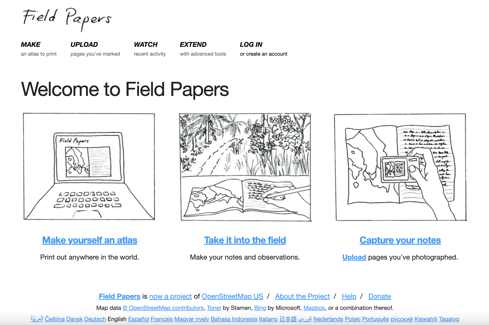
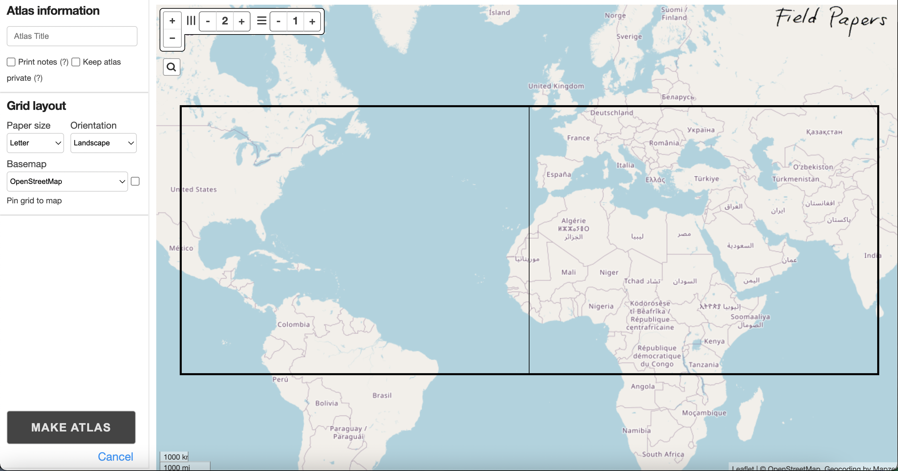
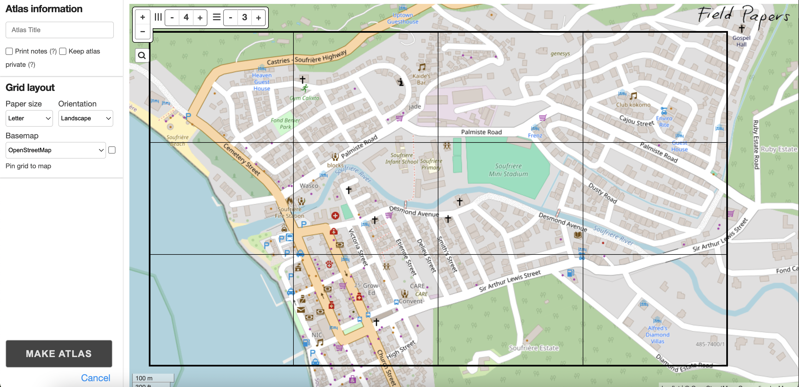
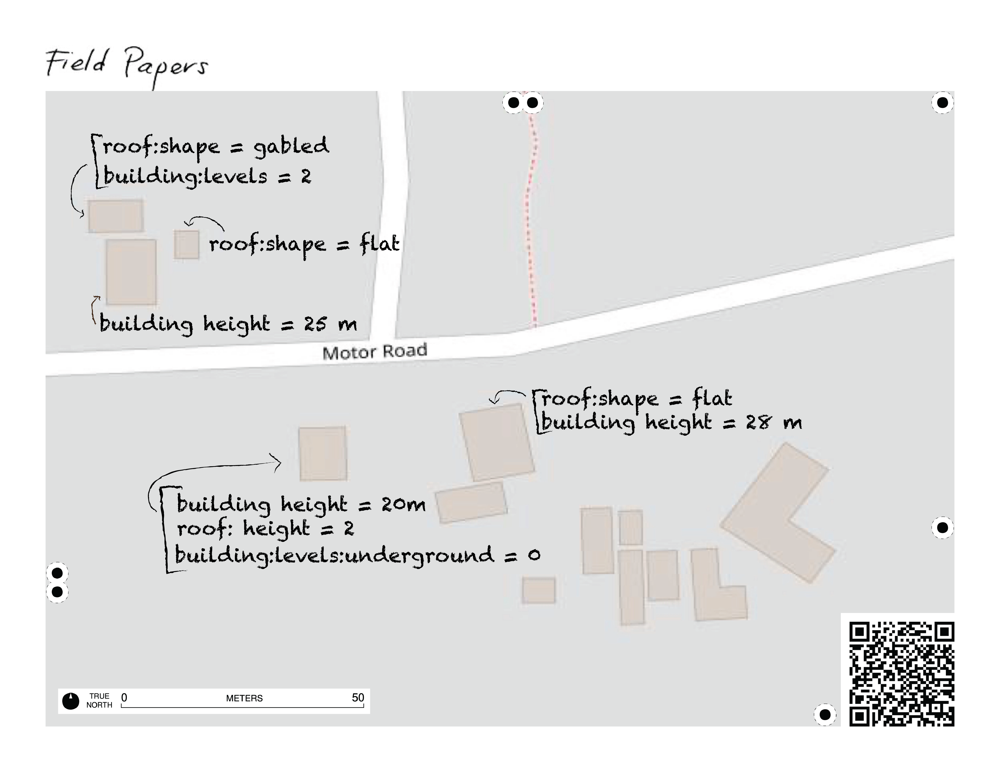
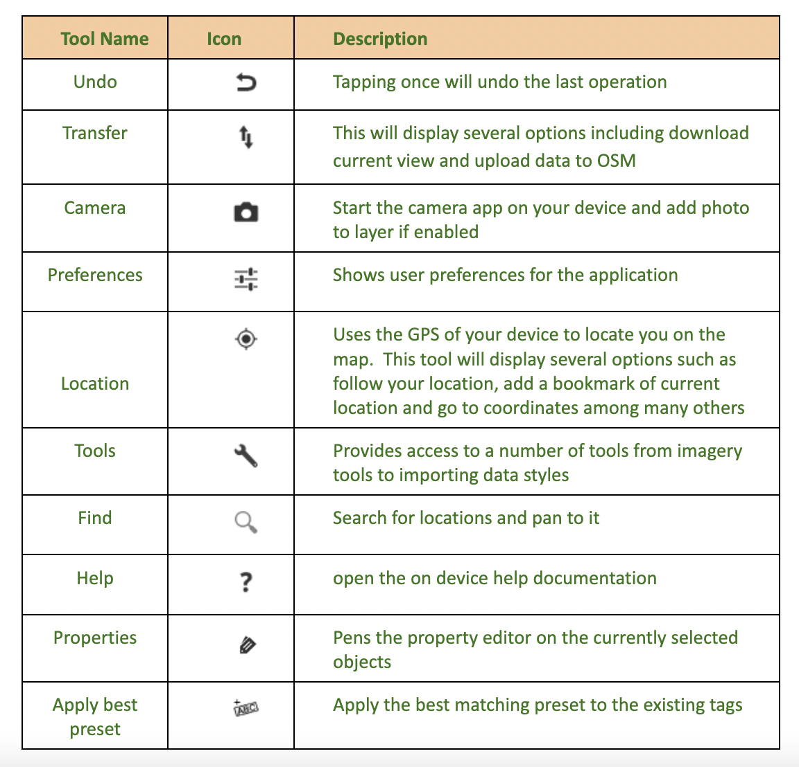

# Collecting Simple 3D Data in the Field

Free, open and easy access tools are a cost-effective way to conduct 3D GIS data collection without the burden of expensive licensing fees. These types of tools also foster collaboration, customization, and transparency by leveraging community-driven development and standardized data models, making it easier to share and integrate data across platforms.

Here's a step-by-step workflow to collect 3D GIS data in the field using the OSM data model and a selection of free/open-source tools:

## Planning and Preparation:

- **Review Existing Data**: Start by examining current OSM data for your area of interest.
- **Determine 3D Attributes**: Familiarize yourself with the OSM tagging schema for 3D data (e.g., `building`, `building:levels`, `height`, `roof:shape`, etc.) so you know which attributes to capture.

## Field Data Collection:

- **Mobile Data Collection Tools**: Use open source mobile apps like **Vespucci**, **OSMAnd**, or **QField** (which integrates with QGIS) to capture georeferenced data on the go. These tools allow you to map building footprints and add 3D attributes on-site.

- **Analog Data Collection Tools**: If a mobile app isn't an option, use an analog approach such as **FieldPapers** to collect your data. You can use the FieldPapers website to create an atlas for your study area, print it out, attach it to a clipboard, and you're ready to go!

- **Collect Geospatial Data**: Walk the survey area either using your mobile editor on a GPS-enabled device, or Field Papers (or both). Capture building outlines (where none exist), note the number of levels or actual heights, and add other relevant tags. You can also record photos and observations to support the attribute data.

## Data Upload and Validation:

- **Sync with OSM**: When you have connectivity, upload your collected data to the OSM database.

- **Review (or update) with a Desktop Editor**: Use **JOSM** (Java OpenStreetMap Editor) to review, clean, and further refine your data (this is a required step, if you plan to use FieldPapers for your data collection). Working with JOSM is especially useful for verifying 3D tags and ensuring consistency, whether you choose the FieldPapers, or exclusively mobile app route.

## Data Processing and Visualization:

- **Import your data and set up 3D Visualization**: Softwares like **QGIS** with 3D plugins, and **Cesium** allow users to import, load and explore 3D data. (**ArcGIS Pro** is also a powerful option, though not open source)

- **Customize Symbology and Analysis**: Adjust styling, lighting, and other visual settings to enhance the 3D display. You can also perform further spatial analyses if needed.

## Sharing and Further Applications:

- **Export and Web Visualization**: Optionally, export your 3D models to formats like **3D Tiles** or **glTF** for use in web-based viewers such as **Cesium**.

- **Engage Stakeholders**: Share interactive visualizations with community members, urban planners, or decision-makers to gather feedback or support planning processes.

---

This workflow leverages the robust OSM data model for capturing 3D attributes and relies on free and/or open-source tools throughout—from field data collection with Vespucci/FieldPapers, to desktop editing with JOSM, and final 3D visualization and analysis in Cesium/QGIS—ensuring a cost-effective and collaborative approach to 3D GIS data collection.

Let’s take a look at the individual elements of the workflow above, starting with **FieldPapers**.

## FieldPapers
FieldPapers is a web-based tool that allows you to create a printable map atlas using OpenStreetMap (OSM) as your basemap. It provides an easy, low-tech solution for collecting data in the field without requiring handheld devices or complex server setups.



**The FieldPapers workflow is simple:**

- Visit [fieldpapers.org](https://fieldpapers.org), create an account, and click on ‘Make yourself an atlas’. Navigate to, and delineate your study area, choosing the scale and number of pages for your atlas. 





- Print the map.
- Go into the field and sketch observations directly on the printed map (e.g., building heights, roof shapes).


***Image Caption:** Example of a FieldPapers printout used to capture building characteristics in the field for 3D GIS data collection. Key features noted include building height, roof shape, roof material, and the number of building levels. This data is later uploaded to OpenStreetMap (OSM) for 3D modeling and urban analysis.*

- **Back at your workspace, you can:**
  -  Scan or photograph the annotated map and upload it to your machine for use as a georeferenced basemap when editing in OSM tools like iD Editor or JOSM.
  - Or, use the printed map as a visual aid while editing directly in OSM.

**Key points for success:**
- Ensure that buildings in your Area of Interest (AOI) have already been traced in OSM.
- Make an account before you get started - if you would like to be able to return to and reprint your atlas at a later date. 
- Have access to a printer to create hard copies of your atlas.

## Mobile Data Collection 

Today there are a host of different applications you can use to capture, edit and view OSM data using your mobile device. Some are platform dependent such as GoMap! (iOS) or Vespucci (Android) while others will work on almost any device you have like OSMAnd and Every Door.  This is a very short list of the applications available.  For the purposes of this module, we’ll focus on using Vespucci as the primary application to capture, edit and update OSM data. 


### Vespucci (Android)

Vespucci is a free mobile app for Android that supports the full OpenStreetMap (OSM) data model. With Vespucci, you can perform almost all the editing operations available on a desktop directly from your mobile device. This section focuses on using Vespucci for building feature tagging in OSM.

Like other OSM tools, you’ll need to log in with your OSM credentials to upload any edits. On your first upload, you’ll be prompted to grant Vespucci permission to access your OSM account.

Requirements to get started with Vespucci:
- An Android device (or emulator). Vespucci version 20 supports Android 4.1+, and version 20.1 supports Android 5+.
- Vespucci app downloaded from Google Play or GitHub.
- A basic working knowledge of OSM map features.
- An OSM account.

### Key Vespucci Tools


### Vespucci Workflow for Field Mapping
The map you see in this application is taken from the latest version of OSM. Before heading into the field, review your Area of Interest (AoI) in OSM. Determine if you need a preliminary mapathon to add any missing features. With your study area or Area of Interest (AoI) identified and any preliminary mapping complete, it’s time to download the data needed for your field work.  

- Vespucci makes it very easy to get the needed data. **Zoom to your AoI** using Vespucci's zoom tools or gestures.
- **Download OSM data** by selecting the Transfer icon and choosing ‘Download current view.’ This will download the current features from OSM to your device. Downloaded features will be highlighted differently from non-downloaded data.

```{figure} static/v1.png
---
label: Downloaded data is highlighted red
width: 60%
align: center
---
```
### Editing with the Property Editor

By default, editing is locked when you open Vespucci.  In the upper left corner you’ll see the lock icon.  This Indicates the data is locked and cannot be edited.  Tapping this icon you can toggle between locked and unlocked mode. While in unlocked mode, you can edit the downloaded data. 

```{figure} static/v2.png
---
label: Downloaded but locked
width: 60%
align: center
---
```
 
```{figure} static/v4.png
---
label: Downloaded now unlocked
width: 60%
align: center
---
```
When you have enabled unlock mode, you can now select any downloaded feature by tapping the orange area around it to begin editing.  

```{figure} static/v5.png
---
label: Feature selected
width: 60%
align: center
---
```

Select a feature by tapping it, then open the Property Editor by selecting the Property Icon,[INSERT ICON] ,  to add or modify tags. To exit the Property Editor tap the check mark icon in the upper left corner.  This will also save any changes you’ve made. (NOTE: at this time any changes are only saved to your phone and not to OSM.)

The editor offers several tabs. You can navigate across the tabs by swiping left or right.

- **Presets Tab:** Displays OSM presets for the selected object. 

```{figure} static/preset.png
---
label: Present types for selected objects
width: 40%
align: center
---
```
- **Properties Tab (default):** A simplified view showing key-value pairs for the selected feature. This preset driven display shows the description rather than the raw keys.

```{figure} static/properties.png
---
label: Properties table
width: 40%
align: center
---
```
- **Details Tab:** Shows the raw key-value attributes for advanced editing.

```{figure} static/details.png
---
label: Details table
width: 40%
align: center
---
```
- **Relations Tab:** Displays any relations the selected feature is part of.

```{figure} static/relations.png
---
label: Relations table
width: 40%
align: center
---
```
- **Member Tab:** Visible only if the object is part of a relation.

### Uploading Your Edits to OSM
In the Properties tab, you can edit an item (tag) by tapping the ‘Value’ column on the right to enter or modify a value. If predefined values exist for that key, a selection list will appear for you to choose from.

If the tag you need isn’t visible, tap the Apply best preset with optional tags icon to load additional preset options that may better fit the selected object.

Swiping to the Details tab will display a raw list of all available keys. To add a tag, check the box next to the desired key and enter the appropriate value.

Whether you're working in the Properties or Details tab, you can update existing tags or add new ones as needed.

Once your edits are complete, tap the check mark icon in the upper-left corner to exit the Properties window and save your changes.

After making several edits, return to the main screen. You’ll see a number above the transfer icon indicating the total number of edits made. Tap the transfer icon to begin the upload process to OSM.

```{figure} static/v0.png
---
label: Transfer icon
width: 60%
align: center
---
```

### Uploading Your Edits to OSM

Let’s give this a try.  Before you go into the field you should test it while you have a stable internet connection and in an area you are very familiar with, such as your own neighbourhood.

1. Zoom to an area of interest, one that you are familiar with, such as your neighbourhood.

2. Download data using the transfer icon.

3. Toggle to unlock mode to start an edit session.
Select a building that you know well by tapping on it. 

4. Tap the Properties icon in the bottom left.

5. The Properties tab will appear and show the current tags. It may be as simple as ‘Building = Yes’ or have many more tags including the full address.

7. Try including some or all the following tags, if they are not already assigned and you are confident in their answer:
  - Levels above ground
  - Height (meters)
  - Building use
  - Building colour
  - Building material
  - Roof type

**Remember that you can tap the cell to the right of the key/attribute you are trying to populate to get possible values.*

8. When finished editing the tags, tap the check mark in the upper left corner. This will take you back to the map showing the building you currently have selected.  

9. Let’s try this again but using the ‘Details tab.’  

10. Select another building you are familiar with then tap the Properties icon.

11. When the Properties window appears, swipe to the left to bring up the Details tab.

12. From this screen you’ll add a check mark next to the tag you wish to edit or include.  Tap the box to the left of the tag you wish to edit or add. This will enable the check mark.

13. Review the existing tags and as before, identify and update and/or include a few additional tags for this feature.

14. When finished editing the tags, tap the arrow in the upper left corner and then tap the check mark. This will take you back to the map showing the building you currently have selected.  

15. Now that you have edited a couple of buildings, it’s time to upload those edits to the OSM platform.

16. Tap the arrow in the upper left corner of the screen.  This will take you back to the main page for the app.  You’ll now see the transfer icon with a bubble and number.  This number indicates the total number of edits you have made and are ready to be uploaded to OSM.

 
```{figure} static/v0.png
---
label: Transfer icon
width: 60%
align: center
---
```
17. Tap the Transfer icon to bring up its menu.  

18. Tap ‘Upload data to OSM Server…’ to start the upload process.  In the Upload changes window you have 2 tabs: Changes and Properties
  - **Changes tab:**  review the features you edited/changed.
  - **Properties tab:** this is where you leave your Changeset comment and source information.  In the Comment section leave a short description of your edits, such as ‘updated building level tags’.  Under the Source section leave a comment identifying how you determined these edits such as ‘personal knowledge’ or ‘field survey’.

19. When ready, click ‘Upload’ in the bottom right of the screen to initiate the upload to OSM. NOTE: if this is your first using the Vespucci App, you will now be asked to enter your OSM credentials.

20. As noted at the beginning of this tutorial, you can use the Vespucci mobile app to do almost everything you can from a desktop computer.  To dive deeper on the tools and uses of this app, please review the [Vespucci User's Guide](https://vespucci.io/help/en/Main%20map%20display/).

## How Do I Visualize 3D Data?

The way in which we visualize 3D GIS data can transform complex geospatial information into immersive, interactive and accessible representations of real-world environments, often with remarkable detail. Advanced techniques, such as realistic shading, texturing, and lighting can enhance the depth and realism of these scenes, while dynamic overlays and interactive tools allow users to explore, manipulate, and analyze the data in real time. Softwares like ArcGIS Pro, QGIS with 3D plugins, and Cesium allow users to explore data on the fly, conduct analyses such as sunlight and shadow modeling, and ultimately support more informed decision-making.
